# Function Dependency Graph

This document provides visual diagrams showing the function call relationships and dependencies for the stub replacement implementations.

## Overall Architecture

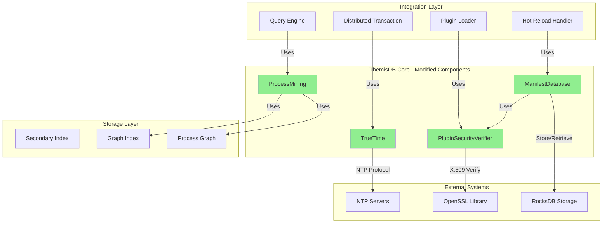

## Plugin Security Verifier - Function Graph

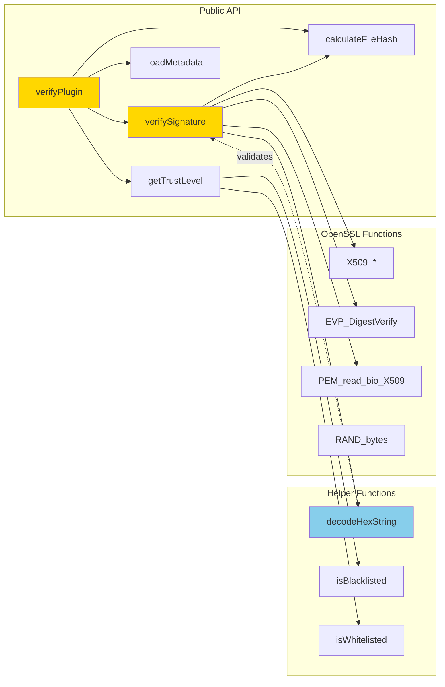

### verifySignature() Call Flow

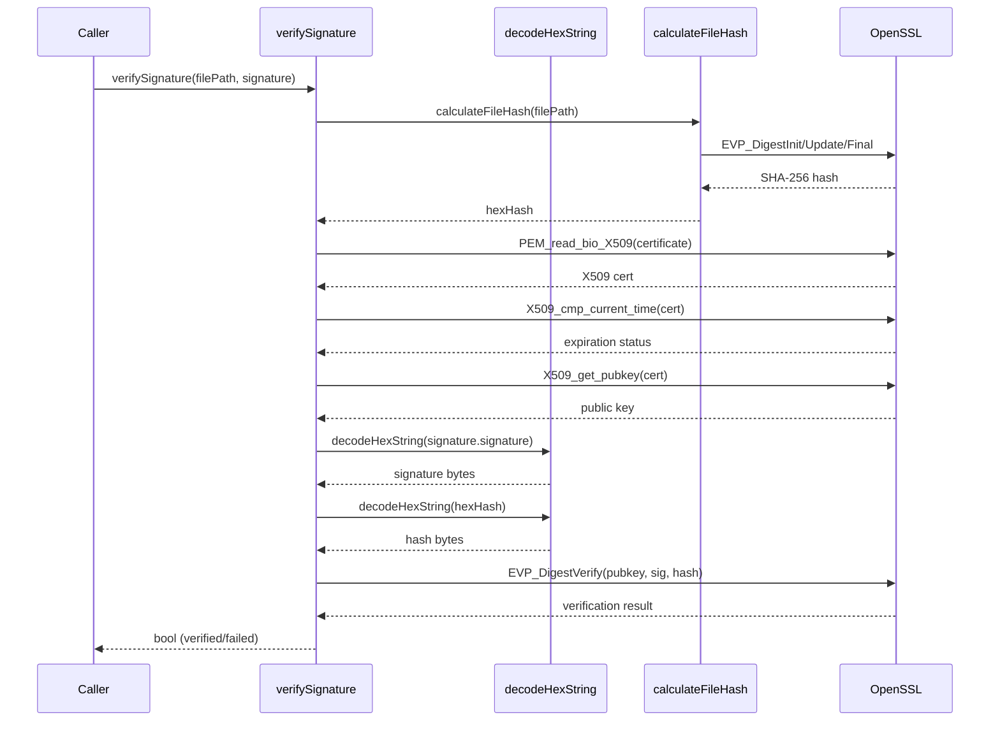

## Manifest Database - Function Graph

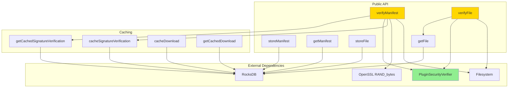

### verifyManifest() Call Flow

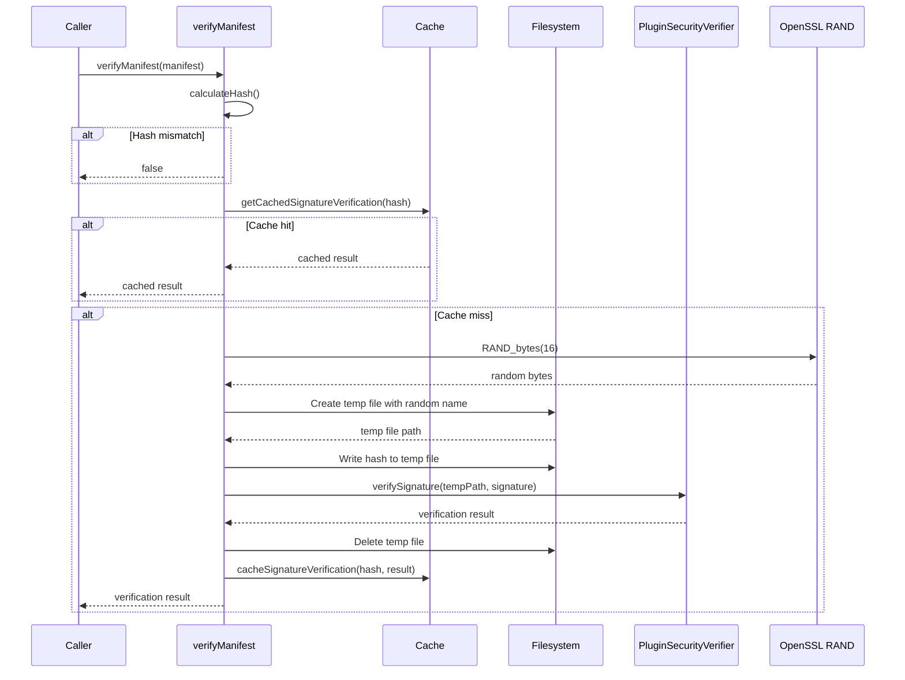

## TrueTime - Function Graph

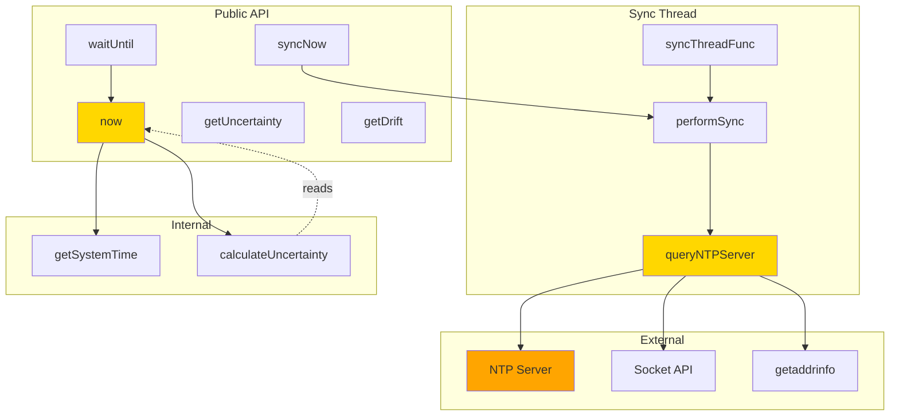

### queryNTPServer() Call Flow

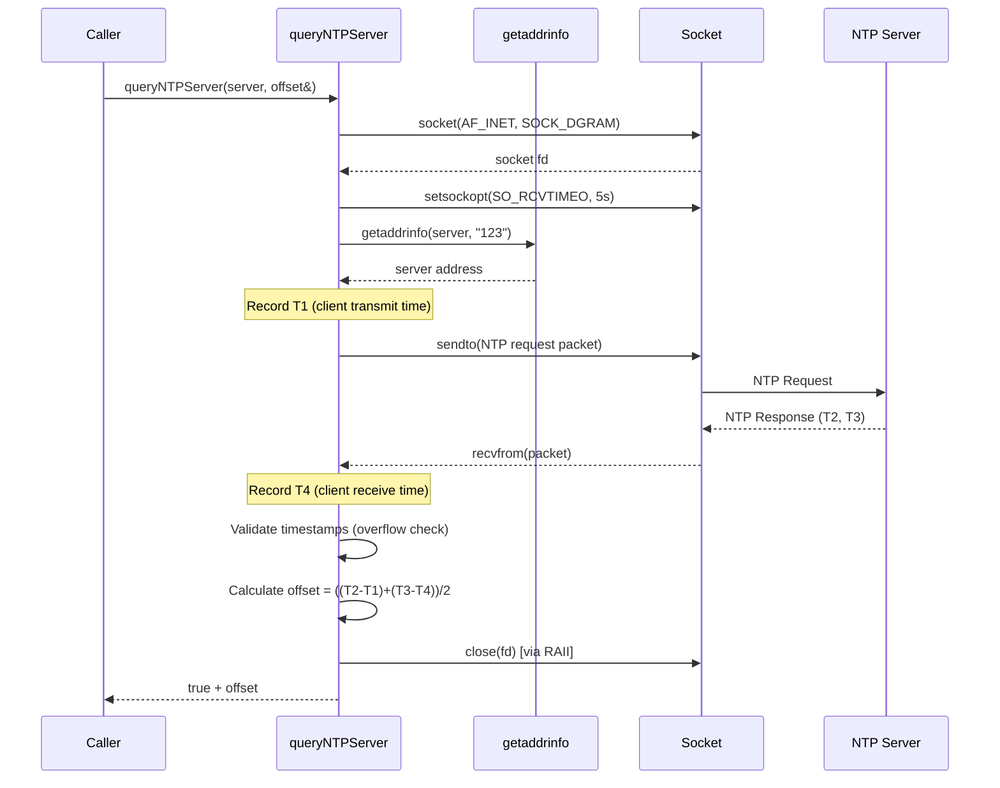

## Process Mining - Function Graph

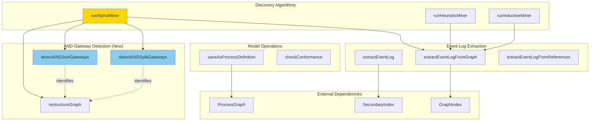

### runAlphaMiner() with AND Gateway Detection

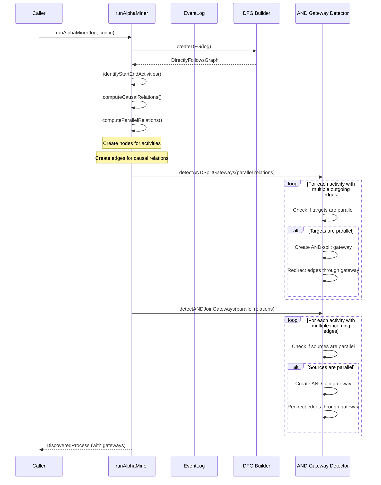

## Cross-Component Integration

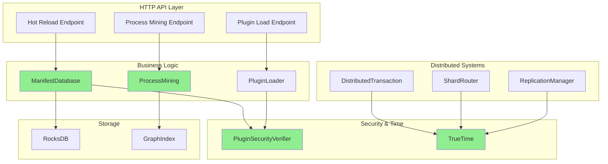

## Data Flow Diagram

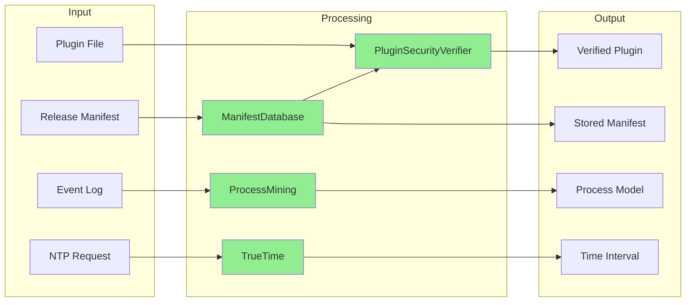

## Call Frequency & Performance

```mermaid
graph TB
    subgraph "Hot Path (Frequent Calls)"
        TT_now[TrueTime::now]
        PS_cache[Signature Cache Lookup]
        PM_query[Process Mining Queries]
    end
    
    subgraph "Warm Path (Periodic Calls)"
        TT_sync[TrueTime::syncNow]
        MD_verify[ManifestDatabase::verifyManifest]
    end
    
    subgraph "Cold Path (Rare Calls)"
        PS_verify[PluginSecurityVerifier::verifySignature]
        PM_discover[ProcessMining::runAlphaMiner]
    end
    
    TT_now -.->|O(1)| A[Atomic reads]
    PS_cache -.->|O(1)| B[HashMap lookup]
    PM_query -.->|O(log n)| C[Index scan]
    
    TT_sync -.->|O(s)| D[s = servers]
    MD_verify -.->|O(n+c)| E[n = size, c = cache]
    
    PS_verify -.->|O(n)| F[n = file size]
    PM_discover -.->|O(e+a²)| G[e = events, a = activities]
    
    style TT_now fill:#90EE90
    style PS_cache fill:#90EE90
    style PM_query fill:#FFD700
```

---

**Legend:**
- 🟢 Green boxes: Modified components in this PR
- 🟡 Yellow boxes: Key functions with implementations
- 🔵 Blue boxes: Helper functions
- 🟠 Orange boxes: External systems
- Solid arrows: Direct function calls
- Dashed arrows: Data flow or usage
