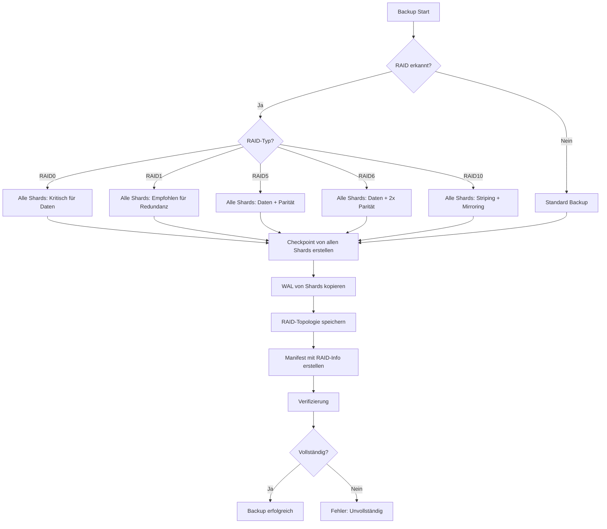

# RAID Backup-Strategien und Vollständigkeit

## Übersicht

Dieses Dokument beschreibt, wie das Backup-System von ThemisDB mit allen RAID-Konfigurationen (RAID 0, 1, 5, 6, 10) umgeht, um die Vollständigkeit und Wiederherstellbarkeit von Backups zu gewährleisten.

## Problem: RAID und Backup-Vollständigkeit

### Die Frage
> "Wir haben ein backup-system in der Themis um regelmäßig backups der DB zu machen. Jetzt ist die Frage wie sich die backups verhalten bei RAID 5, da hier paritätsinformationen vorliegen. Ist das Backup trotzdem vollständig? Oder müssen wir Anpassungen vornehmen, dass ein Primärbackup immer ein Voll-Backup sein muss und jedes weitere nur noch Paritätsinformationen enthält?"

### Die Antwort

**Nein, die zweite Option (nur Paritätsinformationen in nachfolgenden Backups) ist nicht korrekt.**

**Die Backup-Strategie hängt vom RAID-Typ ab:**

| RAID-Typ | Backup-Anforderung | Begründung |
|----------|-------------------|------------|
| **RAID 0** | ALLE Shards erforderlich | Daten sind gestriped, kein Shard ist optional |
| **RAID 1** | Ein Shard ausreichend, alle empfohlen | Vollständige Spiegelung, aber Redundanz wichtig |
| **RAID 5** | ALLE Shards (Daten + Parität) | Daten gestriped + Parität für Wiederherstellung |
| **RAID 6** | ALLE Shards (Daten + Doppel-Parität) | Daten gestriped + 2 Paritäten für Wiederherstellung |
| **RAID 10** | ALLE Shards erforderlich | Striping + Mirroring kombiniert |

## RAID-Typen im Detail

### RAID 0 (Striping)

**Funktionsweise:**
- Daten werden über alle N Shards verteilt (gestriped)
- Keine Redundanz, maximale Performance
- Kapazität = N × Shard-Größe

**Beispiel mit 3 Shards:**
```
Shard 1: Blöcke A1, A4, A7, ...
Shard 2: Blöcke A2, A5, A8, ...
Shard 3: Blöcke A3, A6, A9, ...
```

**Backup-Strategie:**
- ✅ **ALLE Shards** müssen gesichert werden
- ❌ Fehlt ein Shard → Datenverlust
- Primärbackup: Vollständiger Checkpoint aller Shards
- Inkrementell: Änderungen von allen Shards

**Kritisch:** Ein einzelner ausgefallener Shard führt zu totalem Datenverlust!

---

### RAID 1 (Mirroring)

**Funktionsweise:**
- Vollständige Spiegelung der Daten über N Shards
- Hohe Redundanz, reduzierte Kapazität
- Kapazität = 1 × Shard-Größe

**Beispiel mit 2 Shards:**
```
Shard 1: A1, A2, A3, A4, A5, ...
Shard 2: A1, A2, A3, A4, A5, ... (identisch)
```

**Backup-Strategie:**
- ✅ **Ein Shard** enthält vollständige Daten
- ✅ **Alle Shards** sollten für Redundanz gesichert werden
- Primärbackup: Checkpoint eines Shards (oder aller für Redundanz)
- Inkrementell: Änderungen von einem Shard (oder allen)

**Besonderheit:** Bei RAID 1 ist ein Backup eines einzelnen Shards technisch vollständig, aber das Sichern aller Shards bietet zusätzliche Sicherheit gegen Backup-Korruption.

---

### RAID 5 (Striping + Parität)

**Funktionsweise:**
- Daten über N-1 Shards gestriped
- 1 Shard enthält Paritätsinformationen (XOR)
- Toleriert Ausfall eines Shards
- Kapazität = (N-1) × Shard-Größe

**Beispiel mit 3 Shards:**
```
Shard 1: Daten A1, A4, A7, ...
Shard 2: Daten A2, A5, A8, ...
Shard 3: Parität P1, P2, P3, ... (P1 = A1 XOR A2)
```

**Backup-Strategie:**
- ✅ **ALLE Shards** (Daten + Parität) erforderlich
- ❌ Nur Daten-Shards → Keine Fehlertoleranz
- ❌ Nur Parität-Shard → Keine Daten
- Primärbackup: Checkpoint aller Shards
- Inkrementell: Änderungen von allen Shards

**Kritisch:** Ohne Parität kann ein ausgefallener Shard nicht rekonstruiert werden!

---

### RAID 6 (Striping + Doppel-Parität)

**Funktionsweise:**
- Daten über N-2 Shards gestriped
- 2 Shards enthalten Paritätsinformationen
- Toleriert Ausfall von zwei Shards
- Kapazität = (N-2) × Shard-Größe

**Beispiel mit 4 Shards:**
```
Shard 1: Daten A1, A5, ...
Shard 2: Daten A2, A6, ...
Shard 3: Parität P P1, P2, ...
Shard 4: Parität Q Q1, Q2, ...
```

**Backup-Strategie:**
- ✅ **ALLE Shards** (Daten + beide Paritäten) erforderlich
- ❌ Nur Daten-Shards → Keine Fehlertoleranz
- ❌ Ohne beide Paritäten → Keine doppelte Absicherung
- Primärbackup: Checkpoint aller Shards
- Inkrementell: Änderungen von allen Shards

**Vorteil:** Höhere Ausfallsicherheit als RAID 5, benötigt aber mehr Speicher.

---

### RAID 10 (Striping + Mirroring)

**Funktionsweise:**
- Kombination von RAID 0 und RAID 1
- Daten werden gestriped und jeder Stripe wird gespiegelt
- Hohe Performance und Redundanz
- Kapazität = (N/2) × Shard-Größe

**Beispiel mit 4 Shards:**
```
Shard 1: A1, A3, A5, ... (Stripe 1)
Shard 2: A1, A3, A5, ... (Mirror von Shard 1)
Shard 3: A2, A4, A6, ... (Stripe 2)
Shard 4: A2, A4, A6, ... (Mirror von Shard 3)
```

**Backup-Strategie:**
- ✅ **ALLE Shards** empfohlen für vollständige Redundanz
- ✅ Technisch: Je ein Shard pro Mirror-Paar ausreichend
- Primärbackup: Checkpoint aller Shards
- Inkrementell: Änderungen von allen Shards

**Besonderheit:** RAID 10 bietet sowohl Performance (Striping) als auch Redundanz (Mirroring).

---

## Backup-Anforderungen Zusammenfassung

| RAID | Min. Shards | Backup-Kritisch | Begründung |
|------|-------------|-----------------|------------|
| **0** | Alle | ✅ JA | Daten gestriped, jeder Shard essentiell |
| **1** | 1 | ⚠️ Empfohlen alle | Ein Shard = vollständig, aber Redundanz wichtig |
| **5** | Alle | ✅ JA | Daten + Parität für Wiederherstellung |
| **6** | Alle | ✅ JA | Daten + 2× Parität für doppelte Sicherheit |
| **10** | Alle | ✅ JA | Striping erfordert alle Daten |

## Implementierung in ThemisDB

### BackupManager Erweiterungen

Der `BackupManager` wurde erweitert um:

1. **RAID-Erkennung**: Automatische Erkennung der RAID-Konfiguration aus Umgebungsvariablen
   ```cpp
   RAIDConfig detectRAIDConfiguration();
   ```

2. **Manifest mit RAID-Informationen**: Backup-Manifeste enthalten jetzt:
   ```json
   {
     "type": "full",
     "timestamp": "20260104_195000",
     "raid": {
       "mode": "RAID5",
       "raid_group": "raid5",
       "data_shards": 2,
       "parity_shards": 1,
       "total_shards": 3,
       "shards": [
         {"shard_id": "shard1", "shard_index": 0, "is_parity": false},
         {"shard_id": "shard2", "shard_index": 1, "is_parity": false},
         {"shard_id": "shard3", "shard_index": 2, "is_parity": true}
       ],
       "backup_note": "For RAID5/6: This backup MUST include ALL shards..."
     }
   }
   ```

3. **Verifizierung**: Prüfung, dass alle erforderlichen Shards im Backup vorhanden sind
   ```cpp
   bool verifyRAIDShardsInBackup(const std::string& backup_dir, 
                                 const RAIDConfig& raid_config,
                                 std::error_code& ec);
   ```

### Umgebungsvariablen

Der BackupManager liest folgende Umgebungsvariablen:

- `THEMIS_RAID_GROUP`: RAID-Modus (z.B., "raid5")
- `THEMIS_SHARD_ID`: Aktuelle Shard-ID
- `THEMIS_SHARDS`: Komma-separierte Liste aller Shards in der Gruppe

### Backup-Ablauf für alle RAID-Typen



## Restore-Prozess für alle RAID-Typen

### Vollständige Wiederherstellung

1. **Manifest prüfen**: RAID-Konfiguration und Typ aus Manifest lesen
2. **Alle Shards wiederherstellen**: Jeden Shard aus seinem Checkpoint wiederherstellen
3. **RAID-spezifische Verifikation**:
   - **RAID0**: Alle Shards erforderlich, keine Redundanz
   - **RAID1**: Ein Shard ausreichend, aber alle empfohlen
   - **RAID5**: Parität verifizieren, kann einen fehlenden Shard rekonstruieren
   - **RAID6**: Doppel-Parität verifizieren, kann zwei fehlende Shards rekonstruieren
   - **RAID10**: Mirror-Paare prüfen
4. **RAID-Gruppe neu aufbauen**: Alle Shards in die RAID-Gruppe integrieren

### Bei fehlendem Shard

| RAID-Typ | Fehlender Shard | Wiederherstellung möglich? |
|----------|----------------|----------------------------|
| **RAID0** | Beliebig | ❌ NEIN - Totalverlust |
| **RAID1** | Einer | ✅ JA - Andere Kopie verwenden |
| **RAID5** | Einer | ✅ JA - Aus Parität rekonstruieren |
| **RAID6** | Einer/Zwei | ✅ JA - Aus Paritäten rekonstruieren |
| **RAID10** | Einer pro Mirror | ✅ JA - Aus Mirror rekonstruieren |

## Best Practices

### 1. Koordiniertes Backup

Für alle RAID-Typen mit Striping (0, 5, 6, 10) sollten alle Shards **zur selben Zeit** gesichert werden:

```bash
# Beispiel für RAID0
for shard in raid0-shard1 raid0-shard2 raid0-shard3; do
    themisdb-backup --shard $shard --type full --output /backups/raid0/ &
done
wait

# Beispiel für RAID5
for shard in raid5-shard1 raid5-shard2 raid5-shard3; do
    themisdb-backup --shard $shard --type full --output /backups/raid5/ &
done
wait

# Beispiel für RAID10
for shard in raid10-shard{1..4}; do
    themisdb-backup --shard $shard --type full --output /backups/raid10/ &
done
wait
```

### 2. Regelmäßige Verifikation
```bash
# Für jeden RAID-Typ
themisdb-backup --verify /backups/raid0/full_20260104_195000
themisdb-backup --verify /backups/raid1/full_20260104_195000
themisdb-backup --verify /backups/raid5/full_20260104_195000
themisdb-backup --verify /backups/raid6/full_20260104_195000
themisdb-backup --verify /backups/raid10/full_20260104_195000
```

### 3. Backup-Retention

Empfohlene Retention-Strategie für alle RAID-Typen:
- **Full Backups**: Wöchentlich
- **Incremental Backups**: Täglich
- **Retention**: Mindestens 30 Tage
- **Kritische Systeme (RAID0)**: Täglich Vollbackup empfohlen

### 4. Monitoring

RAID-spezifische Metriken überwachen:
- ✅ **Alle RAID-Typen**: Backup-Vollständigkeit (alle Shards vorhanden?)
- ✅ **Alle RAID-Typen**: Backup-Größe (unerwartete Änderungen?)
- ✅ **Alle RAID-Typen**: Restore-Tests (funktioniert die Wiederherstellung?)
- ✅ **RAID0**: Besonders kritisch - kein Ausfall toleriert!
- ✅ **RAID1**: Mirror-Synchronität prüfen
- ✅ **RAID5/6**: Parität-Integrität validieren

## Konfigurationsbeispiele

### RAID 0 (Striping)
```yaml
services:
  themis-raid0-shard1:
    environment:
      THEMIS_RAID_GROUP: "raid0"
      THEMIS_SHARD_ID: "raid0-1"
      THEMIS_SHARDS: "themis-raid0-shard1:18765,themis-raid0-shard2:18765,themis-raid0-shard3:18765"
  
  themis-raid0-shard2:
    environment:
      THEMIS_RAID_GROUP: "raid0"
      THEMIS_SHARD_ID: "raid0-2"
      THEMIS_SHARDS: "themis-raid0-shard1:18765,themis-raid0-shard2:18765,themis-raid0-shard3:18765"
  
  themis-raid0-shard3:
    environment:
      THEMIS_RAID_GROUP: "raid0"
      THEMIS_SHARD_ID: "raid0-3"
      THEMIS_SHARDS: "themis-raid0-shard1:18765,themis-raid0-shard2:18765,themis-raid0-shard3:18765"
```

### RAID 1 (Mirroring)
```yaml
services:
  themis-raid1-primary:
    environment:
      THEMIS_RAID_GROUP: "raid1"
      THEMIS_SHARD_ID: "raid1-primary"
      THEMIS_SHARDS: "themis-raid1-primary:18765,themis-raid1-secondary:18765"
  
  themis-raid1-secondary:
    environment:
      THEMIS_RAID_GROUP: "raid1"
      THEMIS_SHARD_ID: "raid1-secondary"
      THEMIS_SHARDS: "themis-raid1-primary:18765,themis-raid1-secondary:18765"
```

### RAID 5 (Striping + Parität)
```yaml
services:
  themis-raid5-shard1:
    environment:
      THEMIS_RAID_GROUP: "raid5"
      THEMIS_SHARD_ID: "raid5-1"
      THEMIS_SHARDS: "themis-raid5-shard1:18765,themis-raid5-shard2:18765,themis-raid5-shard3:18765"
  
  themis-raid5-shard2:
    environment:
      THEMIS_RAID_GROUP: "raid5"
      THEMIS_SHARD_ID: "raid5-2"
      THEMIS_SHARDS: "themis-raid5-shard1:18765,themis-raid5-shard2:18765,themis-raid5-shard3:18765"
  
  themis-raid5-shard3:
    environment:
      THEMIS_RAID_GROUP: "raid5"
      THEMIS_SHARD_ID: "raid5-3"
      THEMIS_SHARDS: "themis-raid5-shard1:18765,themis-raid5-shard2:18765,themis-raid5-shard3:18765"
```

### RAID 10 (Striping + Mirroring)
```yaml
services:
  themis-raid10-shard1:
    environment:
      THEMIS_RAID_GROUP: "raid10"
      THEMIS_SHARD_ID: "raid10-1"
      THEMIS_SHARDS: "themis-raid10-shard1:18765,themis-raid10-shard2:18765,themis-raid10-shard3:18765,themis-raid10-shard4:18765"
  
  # ... weitere Shards analog
```

## Zusammenfassung

| RAID-Typ | Backup-Anforderung | Kritikalität |
|----------|-------------------|--------------|
| **RAID 0** | ALLE Shards (Striping) | ⚠️ HÖCHSTE - Kein Ausfall toleriert |
| **RAID 1** | Alle empfohlen (Mirroring) | ✅ Mittel - Ein Shard reicht technisch |
| **RAID 5** | ALLE Shards (Daten + Parität) | ⚠️ HOCH - Parität essentiell |
| **RAID 6** | ALLE Shards (Daten + 2× Parität) | ⚠️ HOCH - Beide Paritäten essentiell |
| **RAID 10** | ALLE Shards (Striping + Mirror) | ⚠️ HOCH - Vollständigkeit wichtig |

**Generelle Regeln:**
- **Primärbackup**: Vollständiges Backup aller Shards (für alle RAID-Typen)
- **Inkrementell**: Änderungen von allen relevanten Shards
- **Wiederherstellung**: Abhängig vom RAID-Typ (siehe Tabelle oben)
- **Verifizierung**: Prüft Vorhandensein aller erforderlichen Shards

## Wichtige Warnungen

### ⚠️ RAID 0 (Striping)
**KRITISCH**: ALLE Shards sind essentiell!
- ❌ Ein fehlender Shard = Totalverlust aller Daten
- ❌ Keine Redundanz vorhanden
- ✅ Täglich Vollbackups empfohlen
- ✅ Backup-Verifizierung nach jedem Backup durchführen

### ⚠️ RAID 1 (Mirroring)
**EMPFOHLEN**: Alle Shards sichern für Redundanz
- ✅ Ein Shard enthält vollständige Daten
- ✅ Mehrere Shards bieten Backup-Redundanz
- ⚠️ Nicht nur auf einen Mirror verlassen

### ⚠️ RAID 5/6 (Striping + Parität)
**KRITISCH**: ALLE Shards (Daten + Parität) erforderlich!
- ❌ Ohne Parität: Keine Wiederherstellung bei Shard-Ausfall
- ❌ Nur Parität: Keine Daten
- ✅ Parität ermöglicht Rekonstruktion fehlender Shards
- ✅ RAID 6: Doppelte Parität für höhere Sicherheit

### ⚠️ RAID 10 (Striping + Mirroring)
**HOCH**: Alle Shards für vollständige Redundanz
- ⚠️ Striping erfordert alle Stripe-Daten
- ✅ Mirroring bietet Redundanz pro Stripe
- ✅ Backup aller Shards empfohlen

## Weitere Informationen

- [BackupManager API-Dokumentation](../../include/storage/backup_manager.h)
- [RAID Architektur (alle Typen)](../SHARDING_RAID_MODES_CONFIGURATION_v1.4.md)
- [Backup & Recovery](../../../compendium/chapter_20_backup.md)
