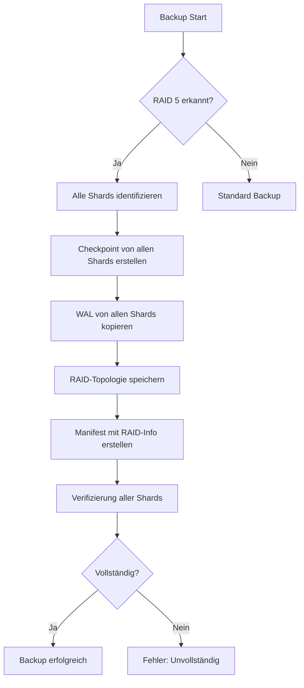

# RAID 5 Backup-Strategie und Vollständigkeit

## Übersicht

Dieses Dokument beschreibt, wie das Backup-System von ThemisDB mit RAID 5 (und RAID 6) Konfigurationen umgeht, um die Vollständigkeit und Wiederherstellbarkeit von Backups zu gewährleisten.

## Problem: RAID 5 und Backup-Vollständigkeit

### Die Frage
> "Wir haben ein backup-system in der Themis um regelmäßig backups der DB zu machen. Jetzt ist die Frage wie sich die backups verhalten bei RAID 5, da hier paritätsinformationen vorliegen. Ist das Backup trotzdem vollständig? Oder müssen wir Anpassungen vornehmen, dass ein Primärbackup immer ein Voll-Backup sein muss und jedes weitere nur noch Paritätsinformationen enthält?"

### Die Antwort

**Nein, die zweite Option (nur Paritätsinformationen in nachfolgenden Backups) ist nicht korrekt.**

**Ja, Backups sind vollständig, wenn ALLE Shards (Daten + Parität) gesichert werden.**

## RAID 5 Grundlagen

Bei RAID 5:
- Daten werden über N-1 Shards **gestriped** (verteilt)
- 1 Shard enthält **Paritätsinformationen** (XOR der Daten-Shards)
- Die Parität erlaubt das Wiederherstellen eines ausgefallenen Shards

### Beispiel mit 3 Shards
```
Shard 1: Daten-Blöcke A1, A4, A7, ...
Shard 2: Daten-Blöcke A2, A5, A8, ...
Shard 3: Parität    P1, P2, P3, ... (P1 = A1 XOR A2)
```

## Backup-Strategie für RAID 5

### Wichtiger Grundsatz

**Für RAID 5/6: Ein vollständiges Backup MUSS IMMER alle Shards enthalten (Daten + Parität).**

### Warum?

1. **Datenverteilung**: Die eigentlichen Daten sind über mehrere Shards gestriped
2. **Parität ist essentiell**: Ohne Parität können ausgefallene Shards nicht rekonstruiert werden
3. **Kein Shard ist optional**: Jeder Shard enthält einen Teil der Gesamtdaten

### Backup-Typen

#### 1. Primärbackup (Full Backup)
Ein Primärbackup für RAID 5 beinhaltet:
- ✅ Checkpoint von **allen Daten-Shards**
- ✅ Checkpoint von **allen Parität-Shards**
- ✅ WAL-Dateien von allen Shards
- ✅ RAID-Topologie-Informationen

**Nicht ausreichend:**
- ❌ Nur die Daten-Shards ohne Parität
- ❌ Nur die Parität ohne Daten

#### 2. Inkrementelles Backup
Ein inkrementelles Backup für RAID 5 beinhaltet:
- ✅ WAL-Änderungen von **allen Shards** seit dem letzten Backup
- ✅ Inklusive Parität-Shard Änderungen

## Implementierung in ThemisDB

### BackupManager Erweiterungen

Der `BackupManager` wurde erweitert um:

1. **RAID-Erkennung**: Automatische Erkennung der RAID-Konfiguration aus Umgebungsvariablen
   ```cpp
   RAIDConfig detectRAIDConfiguration();
   ```

2. **Manifest mit RAID-Informationen**: Backup-Manifeste enthalten jetzt:
   ```json
   {
     "type": "full",
     "timestamp": "20260104_195000",
     "raid": {
       "mode": "RAID5",
       "raid_group": "raid5",
       "data_shards": 2,
       "parity_shards": 1,
       "total_shards": 3,
       "shards": [
         {"shard_id": "shard1", "shard_index": 0, "is_parity": false},
         {"shard_id": "shard2", "shard_index": 1, "is_parity": false},
         {"shard_id": "shard3", "shard_index": 2, "is_parity": true}
       ],
       "backup_note": "For RAID5/6: This backup MUST include ALL shards..."
     }
   }
   ```

3. **Verifizierung**: Prüfung, dass alle erforderlichen Shards im Backup vorhanden sind
   ```cpp
   bool verifyRAIDShardsInBackup(const std::string& backup_dir, 
                                 const RAIDConfig& raid_config,
                                 std::error_code& ec);
   ```

### Umgebungsvariablen

Der BackupManager liest folgende Umgebungsvariablen:

- `THEMIS_RAID_GROUP`: RAID-Modus (z.B., "raid5")
- `THEMIS_SHARD_ID`: Aktuelle Shard-ID
- `THEMIS_SHARDS`: Komma-separierte Liste aller Shards in der Gruppe

### Backup-Ablauf für RAID 5



## Restore-Prozess für RAID 5

### Vollständige Wiederherstellung

1. **Manifest prüfen**: RAID-Konfiguration aus Manifest lesen
2. **Alle Shards wiederherstellen**: Jeden Shard aus seinem Checkpoint wiederherstellen
3. **Parität verifizieren**: Paritätsinformationen prüfen
4. **RAID-Gruppe neu aufbauen**: Alle Shards in die RAID-Gruppe integrieren

### Bei fehlendem Shard

Wenn ein Shard im Backup fehlt:
- **Mit Parität**: Fehlender Daten-Shard kann aus anderen Daten + Parität rekonstruiert werden
- **Ohne Parität**: Datenverlust! Wiederherstellung nicht vollständig möglich

## Best Practices

### 1. Koordiniertes Backup
Für RAID 5 sollten alle Shards **zur selben Zeit** gesichert werden:
```bash
# Alle Shards gleichzeitig sichern
for shard in raid5-shard1 raid5-shard2 raid5-shard3; do
    themisdb-backup --shard $shard --type full --output /backups/raid5/ &
done
wait
```

### 2. Regelmäßige Verifikation
```bash
themisdb-backup --verify /backups/raid5/full_20260104_195000
```

### 3. Backup-Retention
Für RAID 5:
- **Full Backups**: Wöchentlich
- **Incremental Backups**: Täglich
- **Retention**: Mindestens 30 Tage

### 4. Monitoring
Überwachen Sie:
- ✅ Backup-Vollständigkeit (alle Shards vorhanden?)
- ✅ Backup-Größe (unerwartete Änderungen?)
- ✅ Restore-Tests (funktioniert die Wiederherstellung?)

## Konfigurationsbeispiel

### docker-compose.yml
```yaml
services:
  themis-raid5-shard1:
    environment:
      THEMIS_RAID_GROUP: "raid5"
      THEMIS_SHARD_ID: "raid5-1"
      THEMIS_SHARDS: "themis-raid5-shard1:18765,themis-raid5-shard2:18765,themis-raid5-shard3:18765"
  
  themis-raid5-shard2:
    environment:
      THEMIS_RAID_GROUP: "raid5"
      THEMIS_SHARD_ID: "raid5-2"
      THEMIS_SHARDS: "themis-raid5-shard1:18765,themis-raid5-shard2:18765,themis-raid5-shard3:18765"
  
  themis-raid5-shard3:
    environment:
      THEMIS_RAID_GROUP: "raid5"
      THEMIS_SHARD_ID: "raid5-3"
      THEMIS_SHARDS: "themis-raid5-shard1:18765,themis-raid5-shard2:18765,themis-raid5-shard3:18765"
```

## Zusammenfassung

| Aspekt | RAID 5 Backup |
|--------|---------------|
| **Was wird gesichert?** | ALLE Shards (Daten + Parität) |
| **Primärbackup** | Vollständiges Backup aller Shards |
| **Inkrementell** | Änderungen von allen Shards |
| **Wiederherstellung** | Benötigt alle Shards oder kann einen fehlenden Shard rekonstruieren |
| **Verifizierung** | Prüft Vorhandensein aller Shards |

## Wichtige Warnung

⚠️ **Für RAID 5/6 ist es KRITISCH, dass ALLE Shards (Daten + Parität) in Backups enthalten sind.**

Ein Backup ohne Parität-Shards:
- ❌ Ist NICHT vollständig
- ❌ Kann bei Ausfall eines Shards NICHT vollständig wiederhergestellt werden
- ❌ Bietet NICHT die Fehlertoleranz von RAID 5

## Weitere Informationen

- [BackupManager API-Dokumentation](../../include/storage/backup_manager.h)
- [RAID 5 Architektur](../SHARDING_RAID_MODES_CONFIGURATION_v1.4.md)
- [Backup & Recovery](../../../compendium/chapter_20_backup.md)
