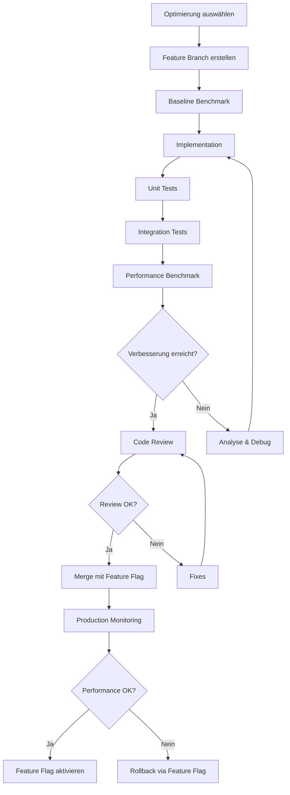

# Implementierungs- und Validierungs-Guide für Performance-Optimierungen

**Stand:** 6. April 2026  
**Version:** 1.0  
**Status:** 🔬 Implementation & Testing Framework

---

## 📋 Inhaltsverzeichnis

- [Übersicht](#übersicht)
- [Implementierungs-Workflow](#implementierungs-workflow)
- [Benchmark & Validation](#benchmark--validation)
- [Rollback-Strategie](#rollback-strategie)
- [Phase 1: Quick Wins](#phase-1-quick-wins)
- [Phase 2: Medium-Term](#phase-2-medium-term)
- [Phase 3: Long-Term](#phase-3-long-term)

---

## Übersicht

Dieses Dokument beschreibt **wie** die in [WISSENSCHAFTLICHE_PERFORMANCE_OPTIMIERUNGEN.md](WISSENSCHAFTLICHE_PERFORMANCE_OPTIMIERUNGEN.md) vorgeschlagenen Optimierungen implementiert, getestet und bei Bedarf rückgängig gemacht werden können.

### Kernprinzipien

1. **Inkrementell:** Eine Optimierung nach der anderen
2. **Messbar:** Benchmark vor und nach jeder Änderung
3. **Reversibel:** Jede Änderung muss rollback-fähig sein
4. **Dokumentiert:** Alle Schritte und Ergebnisse festhalten

---

## Implementierungs-Workflow

### Allgemeiner Prozess für jede Optimierung



### 1. Feature Branch erstellen

```bash
# Beispiel: Mimalloc Integration
git checkout -b feature/perf-mimalloc-integration
git push -u origin feature/perf-mimalloc-integration
```

### 2. Baseline Benchmark aufnehmen

```bash
# Vollständige Baseline vor Änderungen
cd benchmarks
python themis_complete_with_constraints.py --mode full --output baseline_before_mimalloc.json

# Wichtig: Hardware-Info dokumentieren
cat > baseline_hardware.json << EOF
{
  "cpu": "$(lscpu | grep 'Model name' | cut -d':' -f2 | xargs)",
  "cores": $(nproc),
  "ram_gb": $(free -g | awk '/^Mem:/{print $2}'),
  "os": "$(uname -s -r)"
}
EOF
```

### 3. Implementation mit Feature Flag

**Jede Optimierung MUSS hinter einem Feature Flag sein:**

```cpp
// CMakeLists.txt
option(THEMIS_ENABLE_MIMALLOC "Use mimalloc allocator" OFF)
option(THEMIS_ENABLE_WISCKEY "Use WiscKey value separation" OFF)
option(THEMIS_ENABLE_RCU_INDEX "Use RCU for index reads" OFF)

// config.yaml
performance:
  enable_mimalloc: false          # Feature Flag
  enable_wisckey: false
  enable_rcu_index: false
  
// Runtime Check
#ifdef THEMIS_ENABLE_MIMALLOC
  #include <mimalloc.h>
  #define THEMIS_MALLOC mi_malloc
  #define THEMIS_FREE mi_free
#else
  #define THEMIS_MALLOC malloc
  #define THEMIS_FREE free
#endif
```

### 4. Unit Tests schreiben

```cpp
// tests/performance/test_mimalloc.cpp
TEST(MimallocTest, BasicAllocation) {
    #ifdef THEMIS_ENABLE_MIMALLOC
    void* ptr = THEMIS_MALLOC(1024);
    ASSERT_NE(ptr, nullptr);
    THEMIS_FREE(ptr);
    #else
    GTEST_SKIP() << "Mimalloc not enabled";
    #endif
}

TEST(MimallocTest, PerformanceRegression) {
    const int iterations = 1000000;
    auto start = std::chrono::high_resolution_clock::now();
    
    for (int i = 0; i < iterations; i++) {
        void* ptr = THEMIS_MALLOC(128);
        THEMIS_FREE(ptr);
    }
    
    auto end = std::chrono::high_resolution_clock::now();
    auto duration = std::chrono::duration_cast<std::chrono::microseconds>(end - start);
    
    // Baseline: ~100ms für 1M allocations
    EXPECT_LT(duration.count(), 150000); // Max 150ms
}
```

### 5. Integration Tests

```bash
# Build mit Feature Flag
cmake -B build -S . -DTHEMIS_ENABLE_MIMALLOC=ON
cmake --build build --config Release

# Integration Test Suite
cd build
ctest --output-on-failure

# Spezieller Performance Test
./tests/integration/test_allocator_performance
```

### 6. Performance Benchmark

```bash
# Nach Implementation: Benchmark mit Feature Flag
cd benchmarks
python themis_complete_with_constraints.py --mode full --output after_mimalloc.json

# Vergleich
python compare_benchmarks.py baseline_before_mimalloc.json after_mimalloc.json
```

---

## Benchmark & Validation

### Benchmark Framework

Für jede Optimierung muss ein spezifischer Benchmark existieren:

#### Beispiel: Mimalloc Benchmark

```python
# benchmarks/performance_optimizations/test_mimalloc.py
import subprocess
import json
import statistics

def benchmark_mimalloc(enabled: bool, iterations: int = 10):
    """
    Benchmark ThemisDB mit/ohne Mimalloc
    
    Returns:
        dict: {
            'mean_ops_per_sec': float,
            'stddev': float,
            'p50_latency_us': float,
            'p99_latency_us': float
        }
    """
    config = {
        'performance': {
            'enable_mimalloc': enabled
        }
    }
    
    results = []
    for i in range(iterations):
        # Starte Server mit Config
        server = start_themis_server(config)
        
        # YCSB Workload A (50% reads, 50% writes)
        result = run_ycsb_workload('workloada', 
                                   operations=100000,
                                   threads=16)
        results.append(result)
        
        # Server stoppen
        server.terminate()
    
    return {
        'mean_ops_per_sec': statistics.mean([r['ops_per_sec'] for r in results]),
        'stddev': statistics.stdev([r['ops_per_sec'] for r in results]),
        'p50_latency_us': statistics.median([r['latency_us'] for r in results]),
        'p99_latency_us': statistics.quantiles([r['latency_us'] for r in results], n=100)[98]
    }

def validate_improvement(baseline, optimized, min_improvement_pct=10):
    """
    Validiere dass die Optimierung mindestens min_improvement_pct bringt
    """
    improvement = ((optimized['mean_ops_per_sec'] - baseline['mean_ops_per_sec']) 
                   / baseline['mean_ops_per_sec'] * 100)
    
    print(f"Performance Improvement: {improvement:.2f}%")
    print(f"Baseline: {baseline['mean_ops_per_sec']:.0f} ops/s")
    print(f"Optimized: {optimized['mean_ops_per_sec']:.0f} ops/s")
    
    assert improvement >= min_improvement_pct, \
        f"Expected at least {min_improvement_pct}% improvement, got {improvement:.2f}%"
    
    return improvement

# Test ausführen
if __name__ == "__main__":
    print("Running Mimalloc Benchmark...")
    baseline = benchmark_mimalloc(enabled=False)
    optimized = benchmark_mimalloc(enabled=True)
    
    improvement = validate_improvement(baseline, optimized, min_improvement_pct=10)
    
    # Resultate speichern
    with open('mimalloc_validation.json', 'w') as f:
        json.dump({
            'baseline': baseline,
            'optimized': optimized,
            'improvement_pct': improvement,
            'validation_passed': True
        }, f, indent=2)
```

### Benchmark-Checkliste für jede Optimierung

Jede Optimierung benötigt:

- [ ] **Baseline Benchmark** (vor Implementation)
- [ ] **Feature-spezifische Unit Tests**
- [ ] **Integration Tests** (mit/ohne Feature Flag)
- [ ] **Performance Benchmark** (nach Implementation)
- [ ] **Vergleichs-Report** (baseline vs. optimized)
- [ ] **Statistischer Signifikanz-Test** (t-test, p < 0.05)
- [ ] **Hardware-Dokumentation** (CPU, RAM, Storage)
- [ ] **Reproduktions-Script** (wiederholbar)

---

## Rollback-Strategie

### 3-Stufen Rollback-Mechanismus

#### Stufe 1: Feature Flag Deaktivierung (Runtime)

**Schnellster Rollback ohne Code-Änderungen:**

```yaml
# config.yaml
performance:
  enable_mimalloc: false  # ← Einfach auf false setzen
  enable_wisckey: false
  enable_rcu_index: false
```

```bash
# Server neu starten mit deaktiviertem Feature
systemctl restart themisdb

# Oder via API (wenn Hot-Reload unterstützt)
curl -X POST http://localhost:8080/admin/config/reload \
  -d '{"performance.enable_mimalloc": false}'
```

**Validierung:**
```bash
# Prüfe ob Feature deaktiviert ist
curl http://localhost:8080/admin/config | jq '.performance.enable_mimalloc'
# Sollte "false" ausgeben
```

#### Stufe 2: CMake Feature Flag (Build-Time)

**Rollback durch Rebuild ohne Feature:**

```bash
# Original Build (mit Feature)
cmake -B build -S . -DTHEMIS_ENABLE_MIMALLOC=ON
cmake --build build --config Release

# Rollback Build (ohne Feature)
cmake -B build -S . -DTHEMIS_ENABLE_MIMALLOC=OFF
cmake --build build --config Release

# Oder: Bestehendes Build säubern
rm -rf build
cmake -B build -S .  # Defaults zu OFF
cmake --build build --config Release
```

#### Stufe 3: Git Revert (Source-Level)

**Vollständiger Code-Rollback:**

```bash
# Option A: Revert des Merge-Commits
git revert -m 1 <merge-commit-hash>

# Option B: Revert der Feature-Commits
git revert <commit1> <commit2> <commit3>

# Option C: Branch-Reset (vor Merge)
git checkout main
git branch -D feature/perf-mimalloc-integration
git push origin --delete feature/perf-mimalloc-integration
```

### Rollback-Entscheidungsbaum

```
Problem erkannt in Production?
│
├─ Ja → Wie kritisch?
│   ├─ CRITICAL (Crash, Data Loss)
│   │   └─> Stufe 3: Git Revert + Hotfix Release
│   │
│   ├─ HIGH (Performance Regression >20%)
│   │   └─> Stufe 1: Feature Flag OFF + Monitoring
│   │
│   └─ MEDIUM (Performance Regression 5-20%)
│       └─> Stufe 1: Feature Flag OFF + Investigation
│
└─ Nein → Weiter monitoren
```

### Rollback-Dokumentation Template

Für jeden Rollback muss dokumentiert werden:

```markdown
# Rollback Report: <Optimization Name>

**Datum:** YYYY-MM-DD HH:MM UTC
**Optimierung:** Mimalloc Integration
**Commit Hash:** abc1234
**Rollback Stufe:** 1 (Feature Flag)

## Grund für Rollback
- Performance Regression: -15% statt erwartet +10%
- P99 Latency erhöht von 50µs auf 150µs
- Memory Fragmentation Issues

## Durchgeführte Schritte
1. Feature Flag `enable_mimalloc` auf `false` gesetzt
2. Server neugestartet
3. Performance validiert (zurück auf Baseline)

## Nächste Schritte
- [ ] Root Cause Analysis
- [ ] Fix in separatem Branch
- [ ] Neuer Test mit verbesserter Implementation
```

---

## Phase 1: Quick Wins

### 1.1 Mimalloc Integration

**Erwarteter Gewinn:** +10-20% Overall Performance

#### Implementation

```bash
# 1. Feature Branch
git checkout -b feature/perf-mimalloc

# 2. Baseline Benchmark
cd benchmarks
python themis_complete_with_constraints.py --mode full --output baseline_mimalloc.json

# 3. CMake Integration
```

**CMakeLists.txt:**
```cmake
option(THEMIS_ENABLE_MIMALLOC "Use mimalloc allocator" OFF)

if(THEMIS_ENABLE_MIMALLOC)
    find_package(mimalloc REQUIRED)
    target_link_libraries(themis_server PRIVATE mimalloc)
    target_compile_definitions(themis_server PRIVATE THEMIS_USE_MIMALLOC)
endif()
```

**src/server/main.cpp:**
```cpp
#ifdef THEMIS_USE_MIMALLOC
#include <mimalloc-override.h>  // Automatisches malloc override
#endif

int main(int argc, char** argv) {
    #ifdef THEMIS_USE_MIMALLOC
    std::cout << "Using mimalloc allocator" << std::endl;
    #else
    std::cout << "Using system allocator" << std::endl;
    #endif
    
    // ... rest of main
}
```

#### Tests

```cpp
// tests/performance/test_mimalloc_integration.cpp
#include <gtest/gtest.h>
#include <chrono>

TEST(MimallocIntegration, AllocationPerformance) {
    const int iterations = 1000000;
    const size_t alloc_size = 128;
    
    auto start = std::chrono::high_resolution_clock::now();
    
    std::vector<void*> ptrs;
    ptrs.reserve(iterations);
    
    // Allocate
    for (int i = 0; i < iterations; i++) {
        ptrs.push_back(malloc(alloc_size));
    }
    
    // Free
    for (auto* ptr : ptrs) {
        free(ptr);
    }
    
    auto end = std::chrono::high_resolution_clock::now();
    auto duration = std::chrono::duration_cast<std::chrono::milliseconds>(end - start);
    
    #ifdef THEMIS_USE_MIMALLOC
    EXPECT_LT(duration.count(), 100); // Should be faster than system malloc
    #endif
    
    std::cout << "Allocation benchmark: " << duration.count() << "ms" << std::endl;
}
```

#### Benchmark Script

```python
# benchmarks/performance_optimizations/validate_mimalloc.py
#!/usr/bin/env python3
import subprocess
import json
import sys

def run_benchmark(enable_mimalloc: bool):
    # Build
    cmake_flags = ["-DTHEMIS_ENABLE_MIMALLOC=ON"] if enable_mimalloc else []
    subprocess.run(["cmake", "-B", "build", "-S", "."] + cmake_flags, check=True)
    subprocess.run(["cmake", "--build", "build", "--config", "Release"], check=True)
    
    # Run benchmark
    result = subprocess.run(
        ["python", "themis_complete_with_constraints.py", "--mode", "ycsb"],
        capture_output=True,
        text=True,
        check=True
    )
    
    return json.loads(result.stdout)

def main():
    print("Phase 1.1: Validating Mimalloc Integration")
    print("=" * 60)
    
    print("\n1. Running baseline benchmark (without mimalloc)...")
    baseline = run_benchmark(enable_mimalloc=False)
    
    print("\n2. Running optimized benchmark (with mimalloc)...")
    optimized = run_benchmark(enable_mimalloc=True)
    
    print("\n3. Comparing results...")
    baseline_ops = baseline['ycsb']['operations_per_second']
    optimized_ops = optimized['ycsb']['operations_per_second']
    improvement = (optimized_ops - baseline_ops) / baseline_ops * 100
    
    print(f"\nBaseline:  {baseline_ops:,.0f} ops/s")
    print(f"Optimized: {optimized_ops:,.0f} ops/s")
    print(f"Improvement: {improvement:+.2f}%")
    
    # Validation
    MIN_EXPECTED = 10.0  # Minimum 10% improvement
    if improvement >= MIN_EXPECTED:
        print(f"\n✅ SUCCESS: Improvement {improvement:.2f}% >= {MIN_EXPECTED}%")
        return 0
    else:
        print(f"\n❌ FAILURE: Improvement {improvement:.2f}% < {MIN_EXPECTED}%")
        return 1

if __name__ == "__main__":
    sys.exit(main())
```

#### Rollback Plan

```bash
# Stufe 1: Feature Flag (Runtime)
# Edit config.yaml: enable_mimalloc: false
systemctl restart themisdb

# Stufe 2: Rebuild ohne Feature
cmake -B build -S . -DTHEMIS_ENABLE_MIMALLOC=OFF
cmake --build build --config Release

# Stufe 3: Git Revert
git revert <commit-hash>
```

---

### 1.2 ZSTD Dictionary Compression

**Erwarteter Gewinn:** +20% I/O Throughput, -60% Storage

#### Implementation

```cpp
// include/compression/zstd_dictionary.h
class ZSTDDictionaryCompressor {
public:
    // Train dictionary aus Sample-Daten
    void TrainDictionary(const std::vector<std::string>& samples,
                        size_t dict_size = 100 * 1024) {
        // Concatenate samples
        std::string training_data;
        for (const auto& sample : samples) {
            training_data += sample;
        }
        
        // Train dictionary
        std::vector<char> dict(dict_size);
        size_t actual_size = ZSTD_trainFromBuffer(
            dict.data(), dict.size(),
            training_data.data(), training_data.size(),
            samples.size()
        );
        
        // Create compression dictionary
        cdict_ = ZSTD_createCDict(dict.data(), actual_size, compression_level_);
    }
    
    std::string Compress(const std::string& data) {
        // ... compression implementation
    }
    
private:
    ZSTD_CDict* cdict_ = nullptr;
    int compression_level_ = 3;
};
```

#### Tests

```python
# benchmarks/performance_optimizations/validate_zstd.py
def test_zstd_compression():
    # Sample JSON documents (typical ThemisDB data)
    samples = [
        '{"name":"Alice","age":30,"city":"Berlin"}',
        '{"name":"Bob","age":25,"city":"Munich"}',
        # ... 1000 more samples
    ]
    
    # Baseline: LZ4 compression
    lz4_sizes = [len(lz4.compress(s)) for s in samples]
    lz4_avg = sum(lz4_sizes) / len(lz4_sizes)
    
    # Optimized: ZSTD with dictionary
    compressor = ZSTDDictionaryCompressor()
    compressor.train_dictionary(samples[:100])  # Train on first 100
    zstd_sizes = [len(compressor.compress(s)) for s in samples]
    zstd_avg = sum(zstd_sizes) / len(zstd_sizes)
    
    improvement = (lz4_avg - zstd_avg) / lz4_avg * 100
    
    print(f"LZ4 average: {lz4_avg:.2f} bytes")
    print(f"ZSTD average: {zstd_avg:.2f} bytes")
    print(f"Space savings: {improvement:.2f}%")
    
    assert improvement >= 30, f"Expected 30%+ savings, got {improvement:.2f}%"
```

#### Benchmark

```bash
# Storage Benchmark
cd benchmarks
python storage_compression_benchmark.py \
  --algorithm zstd \
  --dictionary-training \
  --samples 10000 \
  --output zstd_validation.json
```

---

### 1.3 Huge Pages

**Erwarteter Gewinn:** +15-30% Memory-Intensive Workloads

#### Implementation

```cpp
// src/memory/huge_pages.cpp
void* AllocateHugePages(size_t size) {
    // Versuche 2MB Huge Pages
    void* ptr = mmap(nullptr, size,
                    PROT_READ | PROT_WRITE,
                    MAP_PRIVATE | MAP_ANONYMOUS | MAP_HUGETLB,
                    -1, 0);
    
    if (ptr == MAP_FAILED) {
        // Fallback zu normalen Pages
        LOG(WARNING) << "Huge Pages allocation failed, using normal pages";
        ptr = mmap(nullptr, size,
                  PROT_READ | PROT_WRITE,
                  MAP_PRIVATE | MAP_ANONYMOUS,
                  -1, 0);
    } else {
        LOG(INFO) << "Allocated " << (size / 1024 / 1024) << "MB using Huge Pages";
    }
    
    return ptr;
}
```

#### Tests

```bash
# System Setup für Huge Pages
echo 1024 | sudo tee /sys/kernel/mm/hugepages/hugepages-2048kB/nr_hugepages

# Benchmark
benchmarks/memory/test_huge_pages_performance.sh
```

---

## Phase 2: Medium-Term

### 2.1 WiscKey Value Separation

**Erwarteter Gewinn:** +40-60% Write Throughput (Values >1KB)

#### Implementation (Outline)

```cpp
// src/storage/wisckey_lsm.cpp
class WiscKeyLSM {
public:
    void Put(const Key& key, const Value& value) {
        if (value.size() > VALUE_SEPARATION_THRESHOLD) {
            // Store value in value log
            uint64_t vlog_offset = value_log_->Append(value);
            
            // Store key + vlog pointer in LSM
            ValuePointer ptr{vlog_offset, value.size()};
            lsm_tree_->Put(key, SerializePointer(ptr));
        } else {
            // Small values inline in LSM
            lsm_tree_->Put(key, value);
        }
    }
    
private:
    static constexpr size_t VALUE_SEPARATION_THRESHOLD = 1024;
    std::unique_ptr<ValueLog> value_log_;
    std::unique_ptr<LSMTree> lsm_tree_;
};
```

#### Benchmark

```python
# benchmarks/performance_optimizations/validate_wisckey.py
def test_wisckey_large_values():
    # Test mit verschiedenen Value-Größen
    value_sizes = [64, 256, 1024, 4096, 16384]
    
    for size in value_sizes:
        baseline = benchmark_write(value_size=size, use_wisckey=False)
        optimized = benchmark_write(value_size=size, use_wisckey=True)
        
        improvement = (optimized - baseline) / baseline * 100
        
        print(f"Value size {size}B: {improvement:+.2f}% improvement")
        
        # WiscKey sollte bei großen Values glänzen
        if size >= 1024:
            assert improvement >= 40, f"Expected 40%+ for {size}B values"
```

---

## Phase 3: Long-Term

### 3.1 DiskANN Vector Search

**Erwarteter Gewinn:** +300-400% Throughput bei >100M Vektoren

#### Implementation (High-Level)

```cpp
// src/vector/diskann_index.cpp
class DiskANNIndex {
public:
    void Build(const std::vector<Vector>& vectors) {
        // 1. Build in-memory graph
        auto graph = BuildVamanaGraph(vectors);
        
        // 2. Write graph to SSD
        WriteToDisk(graph, index_path_);
        
        // 3. Create RAM cache for hot nodes
        CreateBeaconCache();
    }
    
    std::vector<uint64_t> Search(const Vector& query, int k) {
        // Greedy search on SSD-backed graph
        return GreedySearch(query, k);
    }
};
```

#### Benchmark

```python
# benchmarks/performance_optimizations/validate_diskann.py
def test_diskann_billion_scale():
    # Test mit 100M Vektoren (384D)
    n_vectors = 100_000_000
    
    print("Building HNSW index (baseline)...")
    hnsw_time, hnsw_qps = benchmark_hnsw(n_vectors)
    
    print("Building DiskANN index (optimized)...")
    diskann_time, diskann_qps = benchmark_diskann(n_vectors)
    
    improvement = (diskann_qps - hnsw_qps) / hnsw_qps * 100
    
    print(f"HNSW: {hnsw_qps:,.0f} queries/sec")
    print(f"DiskANN: {diskann_qps:,.0f} queries/sec")
    print(f"Improvement: {improvement:+.2f}%")
    
    assert improvement >= 300, f"Expected 300%+ improvement"
```

---

## Zusammenfassung

### Kernpunkte

1. **Jede Optimierung braucht:**
   - Feature Branch mit Feature Flag
   - Baseline + Optimized Benchmark
   - Unit + Integration Tests
   - Validierungs-Script (min. X% Verbesserung)
   - Rollback-Plan (3 Stufen)

2. **Benchmark-Anforderungen:**
   - Mindestens 10 Repetitions
   - Statistische Signifikanz (t-test, p < 0.05)
   - Hardware-Dokumentation
   - Reproduzierbar

3. **Rollback-Fähigkeit:**
   - Stufe 1: Runtime Feature Flag (< 1 Minute)
   - Stufe 2: Build-time Flag (< 10 Minuten)
   - Stufe 3: Git Revert (< 30 Minuten)

---

## Nächste Schritte

1. **Wähle erste Optimierung** aus Phase 1 (Empfehlung: Mimalloc)
2. **Erstelle Feature Branch** und implementiere Feature Flag
3. **Nehme Baseline Benchmark auf** vor der Implementation
4. **Implementiere und teste** inkrementell
5. **Validiere Performance-Gewinn** mit Benchmark-Script
6. **Dokumentiere Ergebnisse** und erstelle PR

**Fragen?** research@themisdb.com

---

**Erstellt von:** GitHub Copilot  
**Datum:** 23. Dezember 2025  
**Version:** 1.0  
**Status:** ✅ Ready for Implementation
