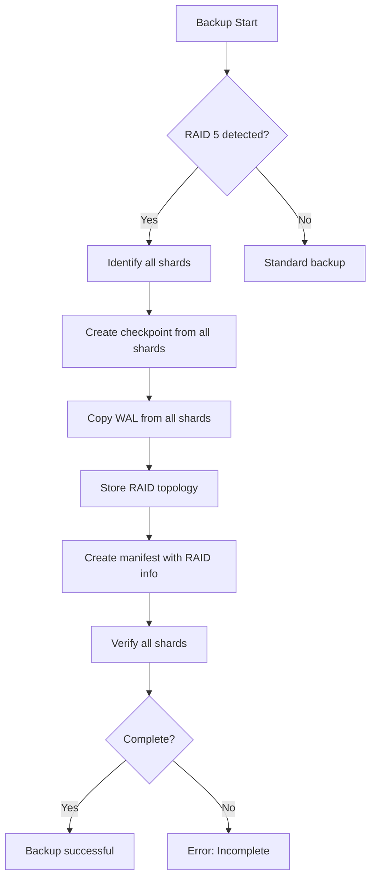

# RAID 5 Backup Strategy and Completeness

## Overview

This document describes how ThemisDB's backup system handles RAID 5 (and RAID 6) configurations to ensure backup completeness and recoverability.

## Problem: RAID 5 and Backup Completeness

### The Question
> "We have a backup system in ThemisDB to regularly make DB backups. Now the question is how backups behave with RAID 5, since parity information exists here. Is the backup still complete? Or do we need to make adjustments so that a primary backup must always be a full backup and each subsequent backup only contains parity information?"

### The Answer

**No, the second option (only parity information in subsequent backups) is not correct.**

**Yes, backups are complete when ALL shards (data + parity) are backed up.**

## RAID 5 Fundamentals

In RAID 5:
- Data is **striped** (distributed) across N-1 shards
- 1 shard contains **parity information** (XOR of data shards)
- Parity allows recovery of a failed shard

### Example with 3 Shards
```
Shard 1: Data blocks A1, A4, A7, ...
Shard 2: Data blocks A2, A5, A8, ...
Shard 3: Parity     P1, P2, P3, ... (P1 = A1 XOR A2)
```

## Backup Strategy for RAID 5

### Important Principle

**For RAID 5/6: A complete backup MUST ALWAYS include all shards (data + parity).**

### Why?

1. **Data Distribution**: The actual data is striped across multiple shards
2. **Parity is Essential**: Without parity, failed shards cannot be reconstructed
3. **No Shard is Optional**: Each shard contains part of the total data

### Backup Types

#### 1. Primary Backup (Full Backup)
A primary backup for RAID 5 includes:
- ✅ Checkpoint of **all data shards**
- ✅ Checkpoint of **all parity shards**
- ✅ WAL files from all shards
- ✅ RAID topology information

**Not Sufficient:**
- ❌ Only data shards without parity
- ❌ Only parity without data

#### 2. Incremental Backup
An incremental backup for RAID 5 includes:
- ✅ WAL changes from **all shards** since last backup
- ✅ Including parity shard changes

## Implementation in ThemisDB

### BackupManager Extensions

The `BackupManager` has been extended with:

1. **RAID Detection**: Automatic detection of RAID configuration from environment variables
   ```cpp
   RAIDConfig detectRAIDConfiguration();
   ```

2. **Manifest with RAID Information**: Backup manifests now contain:
   ```json
   {
     "type": "full",
     "timestamp": "20260104_195000",
     "raid": {
       "mode": "RAID5",
       "raid_group": "raid5",
       "data_shards": 2,
       "parity_shards": 1,
       "total_shards": 3,
       "shards": [
         {"shard_id": "shard1", "shard_index": 0, "is_parity": false},
         {"shard_id": "shard2", "shard_index": 1, "is_parity": false},
         {"shard_id": "shard3", "shard_index": 2, "is_parity": true}
       ],
       "backup_note": "For RAID5/6: This backup MUST include ALL shards..."
     }
   }
   ```

3. **Verification**: Checks that all required shards are present in backup
   ```cpp
   bool verifyRAIDShardsInBackup(const std::string& backup_dir, 
                                 const RAIDConfig& raid_config,
                                 std::error_code& ec);
   ```

### Environment Variables

The BackupManager reads these environment variables:

- `THEMIS_RAID_GROUP`: RAID mode (e.g., "raid5")
- `THEMIS_SHARD_ID`: Current shard ID
- `THEMIS_SHARDS`: Comma-separated list of all shards in the group

### Backup Flow for RAID 5



## Restore Process for RAID 5

### Full Recovery

1. **Check Manifest**: Read RAID configuration from manifest
2. **Restore All Shards**: Restore each shard from its checkpoint
3. **Verify Parity**: Check parity information
4. **Rebuild RAID Group**: Integrate all shards into RAID group

### With Missing Shard

When a shard is missing from backup:
- **With Parity**: Missing data shard can be reconstructed from other data + parity
- **Without Parity**: Data loss! Recovery not fully possible

## Best Practices

### 1. Coordinated Backup
For RAID 5, all shards should be backed up **at the same time**:
```bash
# Back up all shards simultaneously
for shard in raid5-shard1 raid5-shard2 raid5-shard3; do
    themisdb-backup --shard $shard --type full --output /backups/raid5/ &
done
wait
```

### 2. Regular Verification
```bash
themisdb-backup --verify /backups/raid5/full_20260104_195000
```

### 3. Backup Retention
For RAID 5:
- **Full Backups**: Weekly
- **Incremental Backups**: Daily
- **Retention**: At least 30 days

### 4. Monitoring
Monitor:
- ✅ Backup completeness (all shards present?)
- ✅ Backup size (unexpected changes?)
- ✅ Restore tests (does recovery work?)

## Configuration Example

### docker-compose.yml
```yaml
services:
  themis-raid5-shard1:
    environment:
      THEMIS_RAID_GROUP: "raid5"
      THEMIS_SHARD_ID: "raid5-1"
      THEMIS_SHARDS: "themis-raid5-shard1:18765,themis-raid5-shard2:18765,themis-raid5-shard3:18765"
  
  themis-raid5-shard2:
    environment:
      THEMIS_RAID_GROUP: "raid5"
      THEMIS_SHARD_ID: "raid5-2"
      THEMIS_SHARDS: "themis-raid5-shard1:18765,themis-raid5-shard2:18765,themis-raid5-shard3:18765"
  
  themis-raid5-shard3:
    environment:
      THEMIS_RAID_GROUP: "raid5"
      THEMIS_SHARD_ID: "raid5-3"
      THEMIS_SHARDS: "themis-raid5-shard1:18765,themis-raid5-shard2:18765,themis-raid5-shard3:18765"
```

## Summary

| Aspect | RAID 5 Backup |
|--------|---------------|
| **What is backed up?** | ALL shards (data + parity) |
| **Primary backup** | Full backup of all shards |
| **Incremental** | Changes from all shards |
| **Recovery** | Requires all shards or can reconstruct one missing shard |
| **Verification** | Checks presence of all shards |

## Important Warning

⚠️ **For RAID 5/6, it is CRITICAL that ALL shards (data + parity) are included in backups.**

A backup without parity shards:
- ❌ Is NOT complete
- ❌ Cannot be fully recovered in case of shard failure
- ❌ Does NOT provide RAID 5 fault tolerance

## Further Information

- [BackupManager API Documentation](../../include/storage/backup_manager.h)
- [RAID 5 Architecture](../SHARDING_RAID_MODES_CONFIGURATION_v1.4.md)
- [Backup & Recovery](../../../compendium/chapter_20_backup.md)
- [German Version](../../de/features/features_raid5_backup.md)
