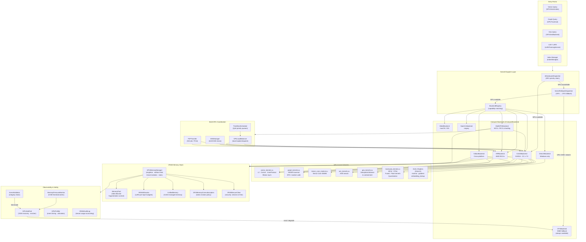
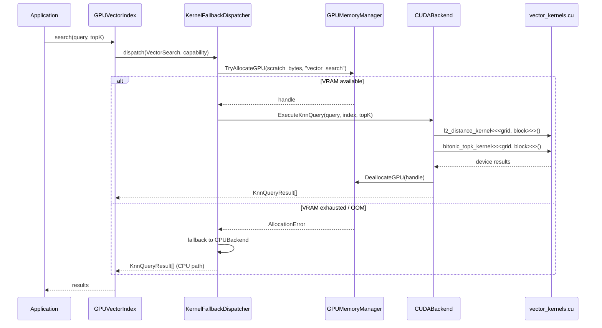

# GPU/VRAM Orchestration Architecture

**Issue:** [#5383 — GPU/VRAM Architekturdiagramm und Refactoring-Konzept dokumentieren](https://github.com/makr-code/ThemisDB/issues/5383)  
**Status:** Current as of v2.4 (Multi-GPU phase)  
**Last Updated:** 2026-06-30  
**Scope:** Full GPU/VRAM stack — backend selection, memory management, kernel dispatch, and multi-GPU coordination

---

## Overview

ThemisDB provides a multi-backend GPU acceleration layer that spans vector indexing, graph traversal, geospatial operations, LLM inference, and LoRA fine-tuning.  
All GPU resources are managed through a unified VRAM orchestration stack that enforces edition limits, tenant isolation, memory pressure thresholds, and graceful CPU fallback.

---

## System Architecture Diagram



---

## Layer Descriptions

### Entry Points

| Caller | Primary Operation | GPU Backend Used |
|--------|------------------|-----------------|
| `GPUVectorIndex` | ANN / k-NN vector search | CUDA, Vulkan, HIP, CPU |
| `GPUTraversal` | HNSW / BFS graph traversal | CUDA (graph_kernels) |
| `GPUGeoBackend` | Geospatial distance & containment | CUDA (geo_kernels) |
| `LoRATrainingService` | Fine-tuning weight updates | CUDA (lora kernels) |
| `IndexManager` | Index build / rebuild under memory pressure | CUDA + oversubscription |

### Dispatch Layer

| Component | Responsibility |
|-----------|---------------|
| `AiHardwareDispatcher` | Tries NPU (Apple Neural Engine, Intel NPU, Qualcomm QNN, ARM Ethos) first; falls back to GPU chain |
| `KernelFallbackDispatcher` | GPU→CPU degradation on OOM or device absence |
| `BackendRegistry` | Matches `CapabilityRequirements` (GEMM, ANN, graph, geo) to registered backends |

### Compute Backends

All backends implement `IComputeBackend` (contract version 1.0).  
Binary compatibility is verified via `BACKEND_CONTRACT_VERSION` at runtime.

| Backend | Platform | Compute Capability |
|---------|----------|--------------------|
| `CUDABackend` | NVIDIA (CC ≥ 7.0) | Tensor Cores, CUDA Graphs, cuBLAS |
| `VulkanBackend` | Cross-platform | Compute shaders, SPIR-V |
| `HIPBackend` | AMD (ROCm) | RCCL, rocBLAS |
| `DirectXBackend` | Windows | HLSL Compute Shaders (CS 5.1 / 6.0) |
| `MetalBackend` | macOS / iOS | Metal Performance Shaders |
| `OpenCLBackend` | Legacy | OpenCL 2.x |
| `MultiGPUBackend` | Multi-device | NCCL / RCCL all-reduce |
| `CPUBackend` | Always | AVX-512, AVX2, NEON (SIMD) |

### VRAM Memory Stack

```
┌─────────────────────────────────────────────────────────────┐
│  GPUMemoryManager (singleton)                               │
│  ├── Edition VRAM limit (compile-time, -DTHEMIS_EDITION)    │
│  ├── Per-tenant quota registry (SetTenantQuota)             │
│  ├── Allocation ledger (AllocationRecord per tag)           │
│  └── Stats: allocated / peak / count / dealloc count        │
│                                                             │
│  MemoryPool (slab-based)                                    │
│  ├── Size-class buckets (power-of-two slabs)                │
│  └── Fragmentation monitoring                               │
│                                                             │
│  VRAMAllocator (LoRA-specific)                              │
│  └── Per-layer weight budgets for fine-tuning               │
│                                                             │
│  UnifiedMemory (CUDA managed)                               │
│  └── Automatic host↔device migration                       │
│                                                             │
│  GPUMemoryOversubscription (index eviction)                 │
│  └── Eviction policy: LRU / priority                        │
│                                                             │
│  VRAMSecureClear                                            │
│  └── Zero-fill on dealloc (security hardening)             │
└─────────────────────────────────────────────────────────────┘
```

### Observability & Safety

| Component | Function |
|-----------|----------|
| `KernelValidator` | Validates kernel integrity before execution; fail-closed on mismatch |
| `MemoryPressureMonitor` | Monitors VRAM usage against configurable OOM thresholds |
| `GPUSafeFail` | Executes eviction and graceful CPU degradation on OOM |
| `GPUProfiler` | Records kernel execution time, SM occupancy, memory bandwidth |
| `VRAMAuditLog` | Tracks per-tenant VRAM accounting for billing/compliance |

### Multi-GPU Coordination

| Component | Function |
|-----------|----------|
| `MIGManager` | Manages NVIDIA A100 MIG slices for hard tenant isolation |
| `P2PTransfer` | Peer-to-peer device memory copies via NVLink or PCIe |
| `TimeSliceScheduler` | Priority-queue based GPU time-slice scheduling (QoS) |
| `GPULoadBalancer` | Routes queries to least-loaded GPU device |

---

## Data Flow: Vector Query Path



---

## Edition VRAM Limits

| Edition | Max VRAM | Tenant Isolation | MIG Support |
|---------|----------|-----------------|-------------|
| Minimal | 4 GB | No | No |
| Community | 16 GB | Soft quotas | No |
| Enterprise | 80 GB | Hard quotas | Yes (A100) |
| Hyperscaler | Unlimited | Per-MIG-slice | Yes (full) |
| Military | Configurable | Air-gap enforced | Yes |

---

## Related Documentation

- [GPU_MASTER_TRACKING.md](GPU_MASTER_TRACKING.md) — Implementation status across all GPU backends
- [GPU_VECTOR_INDEXING_ARCHITECTURE.md](GPU_VECTOR_INDEXING_ARCHITECTURE.md) — Detailed vector indexing design
- [GPU_VRAM_REFACTORING_DESIGN.md](GPU_VRAM_REFACTORING_DESIGN.md) — Planned refactoring: Memory Manager consolidation, Kernel/Shader unification, OOP/SoC improvements
- [MULTI_GPU_IMPLEMENTATION_SUMMARY_V2.md](MULTI_GPU_IMPLEMENTATION_SUMMARY_V2.md) — Multi-GPU coordination details
- [../../architecture/GPU_ARCHITECTURE_REVIEW_TEMPLATE.md](../../architecture/GPU_ARCHITECTURE_REVIEW_TEMPLATE.md) — Architecture review template
- **Main Issue:** [#5383](https://github.com/makr-code/ThemisDB/issues/5383)
