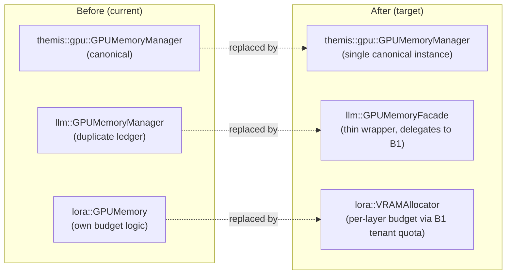
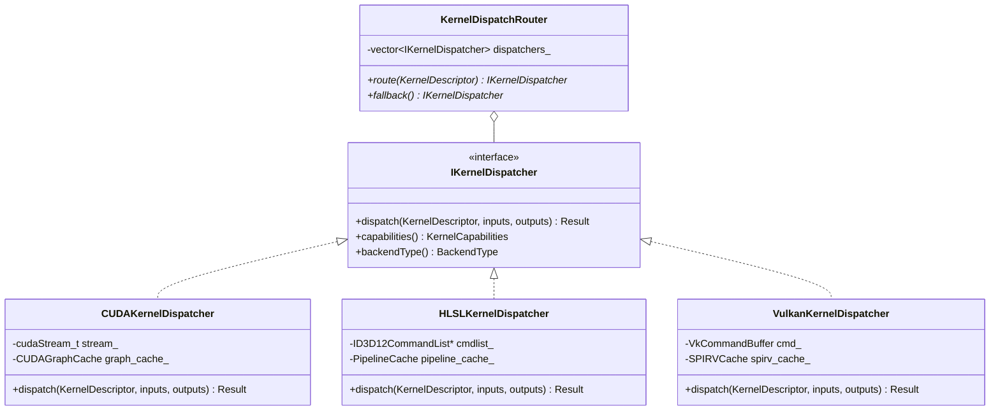
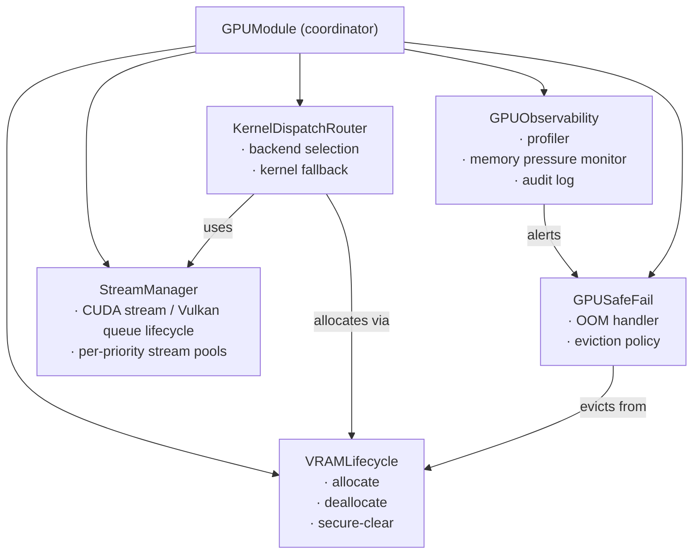

# GPU/VRAM Refactoring Design Document

**Issue:** [#5383 — GPU/VRAM Architekturdiagramm und Refactoring-Konzept dokumentieren](https://github.com/makr-code/ThemisDB/issues/5383)  
**Status:** DRAFT — pending human review and approval  
**Author:** Copilot Coding Agent  
**Last Updated:** 2026-06-30  
**Target Branch:** `develop`

---

## 1. Executive Summary

The current GPU/VRAM stack has grown organically across multiple development phases, resulting in three partially-overlapping memory manager implementations, kernel/shader code split across CUDA and HLSL without a unified abstraction, and GPU modules that mix resource management concerns with business logic.

This document defines the target architecture, migration strategy, and task breakdown for a phased refactoring that:

1. **Consolidates** the three memory manager implementations into a single canonical `GPUMemoryManager`.
2. **Unifies** CUDA kernel and HLSL shader dispatch behind a common `IKernelDispatcher` interface.
3. **Strengthens** OOP boundaries by separating VRAM lifecycle, compute dispatch, and observability concerns (SoC).

> **Governance note:** No legacy compatibility paths, stubs, or simulation code will be introduced as part of this refactoring without explicit human approval per the [Legacy-Code Governance](../../../.github/copilot-instructions.md#11-legacy-code-governance-mandatory) rules.

---

## 2. Problem Statement

### 2.1 Multiple Overlapping Memory Managers

| File | Purpose | Problem |
|------|---------|---------|
| `include/themis/gpu/memory_manager.h` | Edition-aware singleton with tenant isolation | Canonical; others diverge from it |
| `include/llm/gpu_memory_manager.h` | LLM-specific memory management | Duplicates allocation ledger logic |
| `include/llm/lora_framework/gpu_memory.h` | LoRA per-layer VRAM budgets | Implements own budget enforcement outside the canonical manager |

**Risk:** VRAM limit enforcement is not guaranteed across all callers. A tenant exhausting `llm::gpu_memory_manager` quotas may still allocate through `lora::gpu_memory` without hitting the edition limit enforced by the canonical manager.

### 2.2 Fragmented Kernel/Shader Dispatch

CUDA kernels (`.cu`) and HLSL compute shaders (`.hlsl`) are invoked through separate, ad-hoc paths:
- CUDA: `CUDABackend::ExecuteKnnQuery()` calls kernels directly via `cudaLaunchKernel` / `<<<>>>`
- DirectX: `DirectXBackend` loads compiled HLSL blobs and dispatches via D3D12 command lists
- No shared abstraction for kernel versioning, capability gating, or fallback

**Risk:** Adding a new compute primitive requires parallel changes in every backend, increasing maintenance surface and divergence probability.

### 2.3 Mixed Responsibilities in GPU Modules

Several GPU module files (`src/gpu/gpu_module.cpp`, `src/gpu/stream_manager.cpp`) interleave:
- VRAM allocation
- Stream/command-queue lifecycle
- Metric emission
- OOM recovery logic

This violates SoC and makes unit testing difficult — a test exercising stream scheduling also triggers VRAM allocation and metric side-effects.

---

## 3. Target Architecture

### 3.1 Memory Manager Consolidation

**Rules after consolidation:**
- All VRAM allocation flows through `themis::gpu::GPUMemoryManager::TryAllocateGPU()`.
- LLM and LoRA subsystems use `SetTenantQuota()` to register per-subsystem limits; they do not maintain their own tracking.
- `VRAMAllocator` becomes a thin scheduling layer that maps LoRA layer IDs to tenant quota calls.

### 3.2 Unified Kernel/Shader Dispatcher

**`KernelDescriptor`** encodes:
- Kernel type (e.g., `KernelType::L2Distance`, `KernelType::TopKBitonic`, `KernelType::MatMul`)
- Precision (`FP32`, `FP16`, `BF16`, `INT8`)
- Tensor shapes
- Required hardware capability flags (Tensor Cores, NVLink, etc.)

`KernelDispatchRouter` selects the best available `IKernelDispatcher` and delegates to `KernelFallbackDispatcher` on failure.

### 3.3 SoC — Separated Responsibilities

Each subsystem exposes a narrow interface and has no direct dependency on the others (only the coordinator `GPUModule` wires them together via constructor injection).

---

## 4. Implementation Phases

### Phase 1 — Design & API Contract (Target: Q3 2026)

- [ ] Finalize `IKernelDispatcher` interface and `KernelDescriptor` type in `include/acceleration/kernel_dispatcher.h`
- [ ] Define `GPUMemoryManager` extension points: `RegisterSubsystem()`, `SubsystemAllocate()`, `SubsystemDeallocate()`
- [ ] Write ADR (Architecture Decision Record) for memory manager consolidation
- [ ] Human review and approval of API contract before implementation begins

### Phase 2 — Memory Manager Consolidation (Target: Q3 2026)

- [ ] Introduce `llm::GPUMemoryFacade` that delegates all allocation to `themis::gpu::GPUMemoryManager`
- [ ] Remove duplicate allocation ledger in `include/llm/gpu_memory_manager.h`
- [ ] Migrate `lora::GPUMemory` budget enforcement to use `SetTenantQuota("lora:<layer_id>", bytes)`
- [ ] Update all `llm/` and `lora_framework/` callers to use the new facade/allocator
- [ ] Add unit tests verifying edition limits are enforced across all subsystems

### Phase 3 — Kernel/Shader Dispatcher Unification (Target: Q4 2026)

- [ ] Implement `CUDAKernelDispatcher` wrapping current `CUDABackend` kernel launch paths
- [ ] Implement `HLSLKernelDispatcher` wrapping current `DirectXBackend` shader dispatch
- [ ] Implement `VulkanKernelDispatcher` wrapping current `VulkanBackend` compute dispatch
- [ ] Implement `KernelDispatchRouter` with capability matching and fallback chain
- [ ] Wire `KernelDispatchRouter` into `BackendRegistry` — retire per-backend ad-hoc launch calls
- [ ] Validate kernel parity: CPU vs GPU results within numerical tolerance thresholds

### Phase 4 — SoC Refactoring of GPU Modules (Target: Q4 2026)

- [ ] Extract `VRAMLifecycle` from `gpu_module.cpp` into a dedicated class
- [ ] Extract `GPUObservability` (profiler + memory pressure + audit) from mixed GPU files
- [ ] Refactor `gpu_module.cpp` to be a pure coordinator using constructor-injected sub-services
- [ ] Remove all direct `cudaFree` / `vkFreeMemory` calls outside `VRAMLifecycle`
- [ ] Update `GPUSafeFail` to call eviction hooks via `VRAMLifecycle` interface

### Phase 5 — Testing & Hardening (Target: Q1 2027)

- [ ] Unit tests for `IKernelDispatcher` implementations (mock backend, verify dispatch path)
- [ ] Integration tests: edition VRAM limits enforced under concurrent LLM + vector workloads
- [ ] Property-based tests: OOM injection triggers CPU fallback without data corruption
- [ ] Benchmark: refactored dispatch overhead ≤ 2% vs pre-refactoring baseline on RTX-class GPU
- [ ] Security: verify `VRAMSecureClear` is always invoked on dealloc (no regressions)

### Phase 6 — Documentation & Acceptance (Target: Q1 2027)

- [ ] Update [GPU_VRAM_ORCHESTRATION_ARCHITECTURE.md](GPU_VRAM_ORCHESTRATION_ARCHITECTURE.md) to reflect post-refactoring state
- [ ] Update Doxygen for all modified public APIs
- [ ] Human acceptance review against this design document
- [ ] Close issue [#5383](https://github.com/makr-code/ThemisDB/issues/5383) after acceptance

---

## 5. Migration Strategy

### Approach: Strangler-Fig

Refactoring proceeds file-by-file within each phase. Existing callers are migrated one at a time rather than in a single large-bang change. Each migration step:

1. Introduces the new interface alongside the old one.
2. Migrates one call site at a time.
3. Deletes the old implementation only when all call sites are migrated.
4. Runs the existing test suite after each deletion to detect regressions.

### No Compatibility Aliases

Per [Legacy-Code Governance](../../../.github/copilot-instructions.md#11-legacy-code-governance-mandatory), no `using OldName = NewName;` aliases will be introduced. Callers must be updated to use the new API directly.

### Rollback Boundary

Each phase is independently revertable via `git revert`. Phase boundaries are aligned with release tag boundaries so that a partial refactoring can be shipped or rolled back without blocking other features.

---

## 6. Separation of Concerns — Responsibility Matrix

| Concern | Owner Class | Module | Notes |
|---------|------------|--------|-------|
| VRAM allocation / deallocation | `GPUMemoryManager` | `themis/gpu` | Singleton; all subsystems delegate here |
| Per-tenant quota enforcement | `GPUMemoryManager::SetTenantQuota` | `themis/gpu` | LLM + LoRA register quotas at startup |
| Memory pool (slab allocation) | `MemoryPool` | `themis/gpu` | Used internally by `GPUMemoryManager` |
| VRAM secure zeroise | `VRAMSecureClear` | `security` | Called by `GPUMemoryManager::DeallocateGPU` |
| Kernel / shader selection | `KernelDispatchRouter` | `acceleration` | Capability-matched; fallback to CPU |
| CUDA kernel launch | `CUDAKernelDispatcher` | `acceleration` | Owns CUDA stream + graph cache |
| HLSL shader dispatch | `HLSLKernelDispatcher` | `acceleration/directx` | Owns D3D12 command list |
| Vulkan shader dispatch | `VulkanKernelDispatcher` | `acceleration/vulkan` | Owns VkCommandBuffer |
| Stream / queue lifecycle | `StreamManager` | `gpu` | Priority pools; no allocation logic |
| OOM recovery & eviction | `GPUSafeFail` | `gpu` | Triggered by pressure monitor alerts |
| Memory pressure monitoring | `MemoryPressureMonitor` | `performance` | Threshold-based; alerts `GPUSafeFail` |
| Execution profiling | `GPUProfiler` | `gpu` | Event-based; no allocation side effects |
| Tenant usage accounting | `VRAMAuditLog` | `gpu` | Compliance; read from `GPUMemoryManager::Stats` |
| Multi-GPU load balancing | `GPULoadBalancer` | `gpu` | Routes to least-loaded device |
| MIG slice management | `MIGManager` | `gpu` | A100 hard tenant isolation |
| NPU priority dispatch | `AiHardwareDispatcher` | `acceleration` | Tries NPU before GPU; fails to `KernelFallbackDispatcher` |

---

## 7. Known Risks and Mitigations

| Risk | Likelihood | Impact | Mitigation |
|------|-----------|--------|-----------|
| VRAM limit regression after consolidation | Medium | High | Phase 2 adds cross-subsystem unit tests before deleting old code |
| Kernel dispatch latency increase from new router layer | Low | Medium | Phase 5 benchmark gate: ≤ 2% overhead |
| DirectX / HLSL shader cache invalidation after dispatcher change | Medium | Medium | Maintain existing pipeline cache; only routing layer changes |
| LoRA training disruption from VRAMAllocator migration | Medium | High | Migrate LoRA last within Phase 2; run full LoRA training integration tests |
| Merge conflicts with parallel GPU feature work | High | Low | Use feature flags to isolate refactoring branches |

---

## 8. Acceptance Criteria

- [ ] A single `TryAllocateGPU` call path handles all VRAM requests from vector, LLM, and LoRA subsystems.
- [ ] Edition VRAM limits are enforced even when LLM and vector subsystems allocate concurrently.
- [ ] A new kernel type (e.g., sparse attention) requires changes in only one dispatcher class, not in every backend.
- [ ] `gpu_module.cpp` does not call `cudaMalloc` / `vkAllocateMemory` directly.
- [ ] All existing GPU unit and integration tests pass without modification.
- [ ] Profiling benchmark confirms dispatch overhead ≤ 2% regression vs baseline.

---

## 9. Related Documents

- [GPU_VRAM_ORCHESTRATION_ARCHITECTURE.md](GPU_VRAM_ORCHESTRATION_ARCHITECTURE.md) — Current architecture diagram
- [GPU_MASTER_TRACKING.md](GPU_MASTER_TRACKING.md) — GPU implementation status
- [GPU_VECTOR_INDEXING_ARCHITECTURE.md](GPU_VECTOR_INDEXING_ARCHITECTURE.md) — Vector indexing details
- [../../architecture/GPU_ARCHITECTURE_REVIEW_TEMPLATE.md](../../architecture/GPU_ARCHITECTURE_REVIEW_TEMPLATE.md) — Architecture review template
- **Main Issue:** [#5383](https://github.com/makr-code/ThemisDB/issues/5383)
