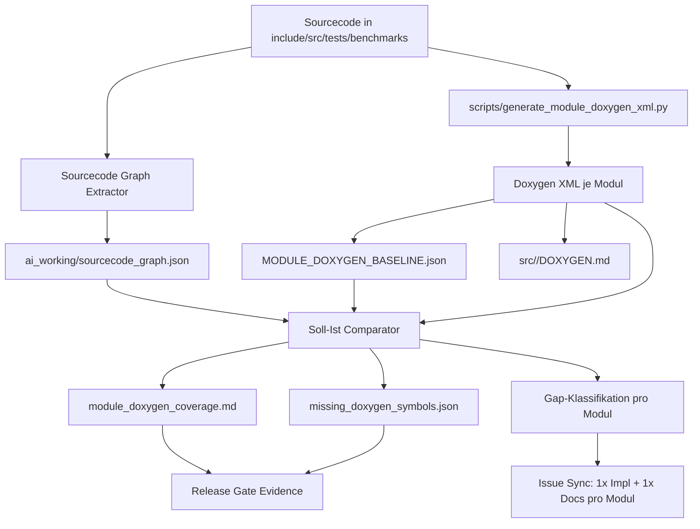
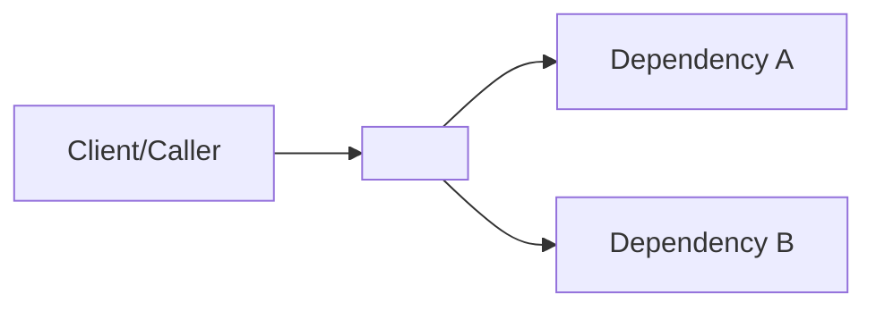
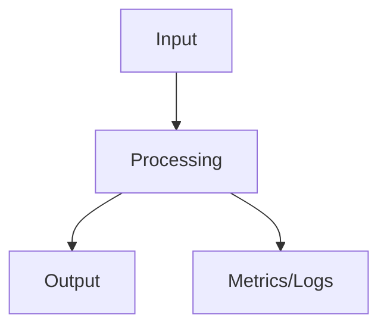
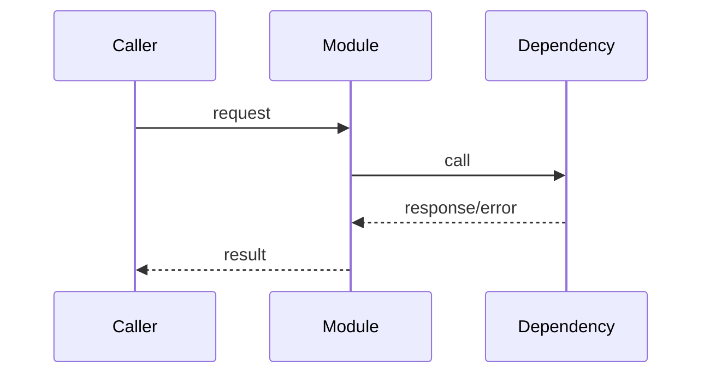

# SRC Module Documentation Compliance (Soll-Ist)

Author: ThemisDB Contributors
Created: 2026-09-20
Last Updated: 2026-09-20
Status: active

## Scope
- Scope: src/*/*.md (nur direkte Modul-Docs, keine tieferen Unterordner)
- Module: 72
- Markdown files: 868
- Soll-Core-Set pro Modul: 10 Dokumenttypen

## Strukturprinzipien nach Ebene

- Primaerebene (Core-Dokumente): maximal strukturiert, stabiler Abschnittsaufbau, AI- und User-lesbar, klare Querverweise.
- Sekundaerebene (Betriebs-/Qualitaetsdokumente): strukturiert, aber mit modulbezogenen Erweiterungen.
- Terziaerebene (PHASE/WAVE/REPORT/SUMMARY/EVIDENCE): frei gestaltbar, solange Ziel, Evidenz und Ergebnis klar erkennbar sind.

## Soll je Dokumenttyp (Grundaufbau, Pflichtabschnitte, Lebenszeit, Visualisierung)

| Typ | Pflichtabschnitte (Minimum) | Lebenszeit | Update-Takt | Mermaid/Diagramme | Hygiene-Regel |
|---|---|---|---|---|---|
| README.md | Zweck, Scope, Build/Run Einstieg, API/CLI Einstieg, Known Limitations, Verweise | dauerhaft | bei Verhaltensaenderung sofort, sonst monatlich | ja (empfohlen): System-Kontext, Quick-Flow, Integrationsueberblick | darf nicht geloescht werden |
| ROADMAP.md | Current Status, In Progress/Planned, Implementation Phases 1-6, Production Readiness Checklist, Known Issues, Breaking Changes | dauerhaft | woechentlich + bei Statuswechsel <=48h | optional: Milestone-/Abhaengigkeitsgraph nur bei Mehrwert | darf nicht geloescht werden |
| ARCHITECTURE.md | Kontext, Komponenten, Datenfluss, Schnittstellen, Fehlerpfade, Nicht-Ziele | dauerhaft | bei Architektur-Aenderung im selben PR, sonst monatlich | ja (stark empfohlen): Component, Sequence, Data-Flow, State | darf nicht geloescht werden |
| CHANGELOG.md | Added/Changed/Fixed/Removed, Version/Datum, Referenzen | dauerhaft | pro Merge/Release <=24h | nein: tabellarisch/textlich besser diffbar | darf nicht geloescht werden |
| FUTURE_ENHANCEMENTS.md | Scope, Design Constraints, Required Interfaces, Implementation Notes, Test Strategy, Performance Targets, Security/Reliability | dauerhaft | zweiwoechentlich oder pro Planning-Zyklus | optional: Dependency-Map/Phasenfluss | darf nicht geloescht werden |
| AUDIT.md | Audit Scope, Kontrollpunkte, Evidenzpfade, offene Findings | dauerhaft (produktive Module) | monatlich, vor Release-Gate | optional: Kontrollfluss/Traceability-Diagramm | darf nicht geloescht werden (wenn Modul produktiv) |
| SECURITY.md | Threat Model, Sicherheitskontrollen, Fail-Closed-Verhalten, Incident/Runbook-Verweise | dauerhaft (produktive Module) | bei Security-Aenderung sofort, sonst monatlich | ja (empfohlen): Trust-Boundary, Datenpfad, Policy-Flow | darf nicht geloescht werden (wenn Modul produktiv) |
| PERFORMANCE_EXPECTATIONS.md | SLO/SLA Ziele (p50/p95/p99), Lastprofil, Messgrenzen, Regression-Schwellen | dauerhaft (produktive Module) | nach Benchmark-Lauf, mindestens monatlich | optional: Lastpfad/Engpassfluss; keine dekorativen Diagramme | darf nicht geloescht werden (wenn Modul produktiv) |
| PRODUCTION_REQUIREMENTS.md | Betriebs-Gates, Monitoring, Backup/Recovery, Rollback, Abnahme-Kriterien | dauerhaft (produktive Module) | vor jedem Release-Gate + monatlich | optional: Betriebsablauf/Incident-Runflow | darf nicht geloescht werden (wenn Modul produktiv) |
| MODULE_GAPS.md | offene Gaps, Ursache, Owner, Zieltermin, Exit-Kriterium | dauerhaft solange Modul aktiv | woechentlich | nein: priorisierte Listen/Tabellen bevorzugen | nach Vollstaendigkeit nach docs/ARCHIVED verschieben und neue Datei fuer neue Wave starten |
| PHASE_*/WAVE_*/REPORT/SUMMARY/CHECKLIST/EVIDENCE | Ziel, Scope, Evidenz, Exit-Kriterien, Restpunkte | temporaer | waehrend aktiver Phase | frei: nur wenn es Evidenz/Kausalitaet klarer macht | nach Abschluss: archivieren; Loeschen nur wenn redundant und in Archiv vorhanden |

## Visualisierungsleitplanken

- Diagramme sind Mittel zum Zweck, keine Pflichtgrafik.
- Maximal 1-3 Mermaid-Diagramme pro Dokumentseite der Primaerebene.
- Jedes Diagramm braucht direkt darunter eine kurze Textauswertung (2-5 Saetze).
- Bevorzugte Mermaid-Typen:
	- ARCHITECTURE: flowchart, sequenceDiagram, stateDiagram-v2
	- README: flowchart, sequenceDiagram
	- SECURITY: flowchart (Trust Boundaries), sequenceDiagram (Auth/Policy)
- Vermeiden: rein dekorative Diagramme ohne Entscheidungs- oder Betriebsnutzen.

## Doxygen XML als Modul-Artefakt (verbindlich)

- Ziel: Pro Modul ein pruefbares XML-Artefakt als Nachweis fuer internen Aufbau und Abhaengigkeiten.
- Doxygen erzeugt kein natives Markdown-Outputformat fuer diese Anforderung. Markdown wird aus XML abgeleitet.
- Input-Scope pro Modul (verbindlich, Vollbild fuer Release-Gates):
	- `include/<module>/**`
	- `src/<module>/**`
	- `tests/<module>/**`
	- `benchmarks/<module>/**`
	- optionaler Fallback `include/**` nur wenn `include/<module>` nicht existiert und Fallback explizit aktiviert ist.
- Mindestnachweis pro geaendertem Modul:
	- `xml/index.xml`
	- `doxygen-warnings.log`
	- `src/<module>/DOXYGEN.md` (abgeleitetes Modul-Artefakt)
	- Modul-Eintrag im Manifest (`module`, `status`, `compound_total`, `class_struct_total`, `namespace_total`)
- CI-Quelle:
	- Workflow: `.github/workflows/gate-pr-module-doxygen-xml.yml`
	- Generator: `scripts/generate_module_doxygen_xml.py`
	- Drift-Comparator: `scripts/compare_module_doxygen_manifests.py`
	- Betriebsmodi:
		- PR-Delta: nur geaenderte Module
		- Vollscan: alle `src/<module>` (nightly/schedule oder `workflow_dispatch` mit `sweep_all_modules=true`)
		- Parallel/Batches: `workers`, `batch_count`, `batch_index` fuer verteilte Vollscans
		- Vollscan mit Baseline-Drift: nur wenn `ai_context/developer_llm_wiki/MODULE_DOXYGEN_BASELINE.json` vorhanden ist
- Artifact-Layout in CI:
	- `/tmp/module-doxygen/manifest.json`
	- `/tmp/module-doxygen/summary.md`
	- `/tmp/module-doxygen/drift-report.json` (optional, nur mit Baseline)
	- `/tmp/module-doxygen/drift-summary.md` (optional, nur mit Baseline)
	- `/tmp/module-doxygen/artifacts/<module>/xml/index.xml`
	- `/tmp/module-doxygen/artifacts/<module>/doxygen-warnings.log`
	- `src/<module>/DOXYGEN.md` (im Workspace erzeugt)

### Lokaler Verifizierungsstand (2026-09-20)

- Smoke-Test fuer Modul `retrieval` mit erweitertem Scope war PASS.
- Manifest-Evidenz: `ai_context/developer_llm_wiki/MODULE_DOXYGEN_SMOKE.json`
	- `cpp_file_count=8`
	- `compound_total=42`
	- `class_struct_total=15`
	- `namespace_total=8`
- Vollscan-Baseline (4 Batches, workers=2) ist lokal erzeugt.
- Baseline-Evidenz: `ai_context/developer_llm_wiki/MODULE_DOXYGEN_BASELINE.json`
- Baseline-Summary: `ai_context/developer_llm_wiki/MODULE_DOXYGEN_BASELINE_SUMMARY.md`
	- `requested=72`
	- `pass=71`
	- `skip=1` (`ai_working`, keine C/C++ Dateien im Scope)
	- `fail=0`

### Interpretationsregel fuer Architektur-Nachweis

- `compound_total` + `class_struct_total` zeigen Strukturumfang des Moduls.
- `namespace_total` und File-Compounds dienen als Indikator fuer interne Schichtung.
- Veraenderungen in diesen Kennzahlen muessen in `ARCHITECTURE.md` bzw. `README.md` bei signifikanten Umbauten nachvollziehbar erklaert werden.

### Operative Empfehlungen fuer lange Vollscans

- Vollscan lokal/CI bevorzugt parallelisiert fahren (`workers >= 2`).
- Bei sehr grossen Repositories Vollscan in Batches teilen (`batch_count > 1`, `batch_index` 0-basiert).
- Beispiel (4 Batches):
	- Batch 0: `--all-modules --workers 2 --batch-count 4 --batch-index 0`
	- Batch 1: `--all-modules --workers 2 --batch-count 4 --batch-index 1`
	- Batch 2: `--all-modules --workers 2 --batch-count 4 --batch-index 2`
	- Batch 3: `--all-modules --workers 2 --batch-count 4 --batch-index 3`
- Moduldoku wird dabei automatisch als `src/<module>/DOXYGEN.md` aus XML abgeleitet geschrieben (`--write-module-markdown`).

## Abgleich Entwickler-Dokumentation vs. Sourcecode-Evidenz

- Machbarkeit: ja. Ein automatischer Soll-Ist-Abgleich zwischen Sourcecode-Graph und Doxygen-Artefakten ist umsetzbar und fuer Release-Gates geeignet.
- Ziel: fehlende oder unvollstaendige Doxygen-Dokumentation fuer Klassen/Funktionen/Methoden je Modul reproduzierbar erkennen.

### Vergleichsquellen und Mittel

- Sourcecode-Evidenz:
	- `ai_working/sourcecode_graph.json` (Graph-Extrakt mit Symbolen und Kanten: `class`, `struct`, `function`, `method`, `calls`, `inherits`, `uses`)
	- optional modulweise Rohartefakte in `ai_working/sourcecode_graph/<module>/*.json`
	- Falls der Graph lokal nicht vorhanden ist, wird fuer den Abgleich auf direkte Doxygen-Marker im Quelltext (`/**`, `///`) als Fallback gewechselt.
- Doxygen-Evidenz:
	- `ai_context/developer_llm_wiki/MODULE_DOXYGEN_BASELINE.json`
	- `ai_context/developer_llm_wiki/module_doxygen_artifacts_batches/<batch>/<module>/xml/index.xml`
	- `src/<module>/DOXYGEN.md`
- Abgleichswerkzeuge:
	- `scripts/generate_module_doxygen_xml.py` (Erzeugung)
	- Graph-Extractor in `ai_working` Pipeline (Erzeugung)
	- Soll-Ist-Comparator (naechster Schritt) fuer Symbol-Matching und Coverage-Delta

### Mermaid: End-to-End Abgleichspfad



Kurzinterpretation:
- Der Graph liefert die tatsaechlich vorhandenen Symbole und Abhaengigkeiten im Code.
- Doxygen liefert den dokumentierten Symbolraum.
- Der Comparator bildet die Differenzmenge (im Code vorhanden, in Doxygen fehlend oder ohne ausreichende Beschreibung wie `brief/param/return`).
- Die Delta-Artefakte werden als Gate-Evidenz gespeichert und in modulgebuendelte Issues ueberfuehrt.

### Soll-Ist-Regeln fuer "fehlenden Doxygen im Sourcecode"

- Regel S1 (Existenz): Symbol im Sourcecode-Graph vorhanden, aber nicht in Doxygen-XML indexiert -> `missing_symbol`.
- Regel S2 (Pflichttext): Symbol in Doxygen vorhanden, aber ohne `briefdescription` -> `missing_brief`.
- Regel S3 (Parameter): Funktion mit Parametern, aber ohne dokumentierte Parameterliste -> `missing_param_docs`.
- Regel S4 (Return): Funktion mit Rueckgabewert, aber ohne Return-Beschreibung -> `missing_return_docs`.
- Regel S5 (Gate-Relevanz): Befunde aus `src/`, `tests/`, `benchmarks` getrennt markieren, damit Release-Gates gezielt auf Test-/Benchmark-Luecken reagieren koennen.

### Zielartefakte fuer Gates (naechster Umsetzungsschritt)

- `ai_context/developer_llm_wiki/MISSING_DOXYGEN_SYMBOLS.json`
- `ai_context/developer_llm_wiki/MODULE_DOXYGEN_COVERAGE_SUMMARY.md`
- modulgebuendelte Issue-Updates via `scripts/sync_soll_ist_gaps.py`

## Verfeinerung des Frameworks: Copilot-optimiert, aber menschenlesbar

### Leitprinzipien

- Der primäre Nutzerpfad bleibt menschenlesbar: README, ARCHITECTURE, ROADMAP und modulnahe Release-Evidenz.
- Rohdaten bleiben als Evidence-Artefakte, aber nicht als Hauptnarrativ in der primären Doku.
- Copilot soll mit einem klaren, stabilen Paket arbeiten koennen: Kontext -> Herkunft -> Wirkung -> Akzeptanzkriterien.
- Jede Modul-Aktualisierung muss in drei Ebenen abbildbar sein: `human summary`, `evidence ledger`, `action packet`.

### Drei-Ebenen-Modell

1. Human Summary
   - Lesbar in Markdown/README/ROADMAP/ARCHITECTURE.
   - Enthält Zweck, Scope, Status, Risiken, Abhaengigkeiten, Gate-Status.
   - Keine rohen Dumps oder lange JSON-Blobs.

2. Evidence Ledger
   - Machine-readable Nachweisdateien mit stabilen Namen und kurzen Inhaltsmustern.
   - Beispiel:
     - `ai_context/developer_llm_wiki/modules/<module>/module_summary.json`
     - `ai_context/developer_llm_wiki/modules/<module>/doxygen_evidence.json`
     - `ai_context/developer_llm_wiki/modules/<module>/gap_report.json`
   - Jede Datei enthält nur die Informationen, die fuer Entscheidung und Traceability gebraucht werden.

3. Action Packet
   - Jedes Issue oder Copilot-Task bekommt eine kompakte, wiederverwendbare Struktur:
     - Scope
     - Source Evidence
     - Related Files
     - Generated Artifacts
     - Repro/Check Commands
     - Acceptance Criteria
     - Risk Notes
   - Das macht die artefaktbasierte Arbeit fuer Menschen und Agenten gleichermassen nutzbar.

### Stabiler Artefaktstil

- Ein Modul hat pro Zyklus ein max. 3-5 Artefakte, nicht Dutzende Roh-Outputs.
- Das bevorzugte Muster ist:
  - `module_summary.md` (Menschen lesbar)
  - `module_evidence.json` (Evidenz, praezise, kurz)
  - `module_gap_report.md` (Zusammenfassung + offene Findings)
  - `module_issue_bundle.json` (Issue-Input, wenn automatisch synchronisiert)
- Rohdaten aus Batch-Scans, XML-Generierung, Graphen oder Testlogs werden nur als Referenz in der Evidence-Datei verlinkt, nicht in der Haupt-Statik.

### Human-readable Issue-Contract

Jedes modulgebundene Issue sollte die folgende Struktur haben:

```markdown
## Scope
- Module: <module>
- Files: <path list>
- Status: <status>

## Source Evidence
- Source graph: <path or file>
- Doxygen artifact: <path or file>
- Docs compliance: <path or file>

## What needs to be done
- <clear implementation task>
- <clear documentation task, if relevant>

## Validation
- Repro command: <command>
- Gate check: <command>
- Success condition: <condition>

## Acceptance criteria
- [ ] <criterion>
- [ ] <criterion>
- [ ] <criterion>
```

Diese Form ist kurz, agentenfreundlich und bleibt fuer Menschen lesbar, weil sie die Informationen in den logischen Ablauf sortiert statt als unstrukturierten Dump zu liefern.

### Reduktionsregel fuer "schwer lesbare" Artefakte

- Roh-JSON nur in Evidence-Pools, nie als primärer Einstiegspunkt.
- Lange Totals oder Batch-Logs nur in einer `summary.md` zusammenfassen.
- Jeden Artefaktblock mit einer kurzen 2-5-Satz-Interpretation versehen.
- Keine Doxygen-XML/Graph-JSON-Ergebnisse direkt im Modul-README referenzieren, sondern nur im Evidence-Ordner.

### Copilot-Workflow-Pattern

Der Agent soll in diesem Muster arbeiten:

1. Lesbare Moduleinheit lesen (`README`, `ARCHITECTURE`, `ROADMAP`).
2. Evidence-Ledger abrufen (`module_summary.json`, `module_evidence.json`).
3. Priorisierte Gap-Liste lesen.
4. Repro-/Validation-Befehle aus dem Issue-Contract nutzen.
5. Ergebnis in Dokumentation + Evidence aktualisieren.

Das verhindert, dass Copilot mit 10.000 Zeilen JSON oder XML beginnt und stattdessen mit dem handhabbaren, strukturierten Minimum arbeitet.

### Entscheidungsvorschrift

- Wenn ein Artefakt keine Entscheidung traegt, kein Gastauftritt im Human Summary.
- Wenn ein Artefakt nur zur Verifikation dient, in Evidence Ledger verschieben.
- Wenn ein Artefakt ein aktives Handlungsobjekt ist, zum Issue- oder Task-Paket machen.

### Praktische Empfehlung fuer dieses Repo

- Beibehalten: `README`, `ARCHITECTURE`, `ROADMAP`, `FUTURE_ENHANCEMENTS`, `MODULE_GAPS`, `SOLL_IST_GAP_REPORT.json`.
- Standardisieren: `ai_context/developer_llm_wiki/modules/<module>/...` als evidence layer.
- Entlasten: die primäre Doku nicht mit rohen Scanner-Ausgaben, XML-Statistiken oder langen Diff-Logs überladen.

Damit bleibt das System fuer Menschen verständlich, aber Copilot bekommt genau die Evidence-Struktur, mit der es in kleinen, praxistauglichen Schritten arbeiten kann.

### Pilot-Test: direkte Doxygen-Identifikation im Modul

- Durchgefuehrt fuer Modul `retrieval` mit `scripts/check_module_direct_doxygen.py`.
- Eingangsquellen: `include/retrieval`, `src/retrieval`, `tests/retrieval`, `benchmarks/retrieval`.
- Ergebnis (lokal verifiziert):
	- `source_files=8`
	- `source_direct_doxygen_decls=70`
	- `doxygen_members_total=129`
	- `source_symbol_names=25`
	- `doxygen_symbol_names=81`
	- `source_not_in_doxygen=4`
	- `doxygen_not_in_source=60`
- Evidenzartefakte:
	- `ai_context/developer_llm_wiki/RETRIEVAL_DIRECT_DOXYGEN_CHECK.json`
	- `ai_context/developer_llm_wiki/RETRIEVAL_DIRECT_DOXYGEN_CHECK.md`

Interpretation:
- Direkte Doxygen-Marker im Modulcode sind automatisiert identifizierbar.
- Der rohe Differenzraum enthaelt erwartbare Rauschenstreffer (z. B. Benchmark-Makros wie `BENCHMARK`); fuer Gate-Haerte sind Makro-/Testhelper-Filter als naechster Schritt vorgesehen.

## Primärvorlagen (wiederverwendbar)

### Vorlage fuer src/<module>/README.md

~~~markdown
# <MODULE> README

Author: <team/owner>
Created: <YYYY-MM-DD>
Last Updated: <YYYY-MM-DD>
Status: active

## Zweck
- Was das Modul leistet.
- Welche Probleme es loest.

## Scope
- Enthalten: <features>
- Nicht enthalten: <out-of-scope>

## Quickstart (Build/Run)
- Build: <command>
- Run/Test: <command>

## API/CLI Einstieg
- Wichtigste Einstiegspunkte.
- Typische Aufruffolge.

## Integrationsueberblick

Kurzinterpretation (2-5 Saetze):
- Welche Kante kritisch ist.
- Welche Abhaengigkeit optional ist.

## Known Limitations
- Limitierung 1
- Limitierung 2

## Verweise
- ARCHITECTURE.md
- ROADMAP.md
- SECURITY.md
~~~

### Vorlage fuer src/<module>/ARCHITECTURE.md

~~~markdown
# <MODULE> ARCHITECTURE

Author: <team/owner>
Created: <YYYY-MM-DD>
Last Updated: <YYYY-MM-DD>
Status: active

## Kontext
- Rolle des Moduls im Gesamtsystem.
- Vorbedingungen und Annahmen.

## Komponenten
- Komponente A: Verantwortung
- Komponente B: Verantwortung

## Schnittstellen
- Eingehende Schnittstellen
- Ausgehende Schnittstellen
- Datenvertraege

## Datenfluss

Kurzinterpretation (2-5 Saetze):
- Hot Path
- Fehlerkritische Uebergaenge

## Sequenz (kritischer Ablauf)

Kurzinterpretation (2-5 Saetze):
- Timeout/Retry-Verhalten
- Fail-Closed/Fallback-Punkt

## Fehlerpfade und Resilienz
- Fehlerklasse -> Reaktion
- Retry-/Circuit-Breaker-Regeln

## Nicht-Ziele
- Bewusst nicht implementierte Bereiche

## Verweise
- README.md
- ROADMAP.md
- PRODUCTION_REQUIREMENTS.md
~~~

### Formatvorgaben fuer Primaerdokumente

- Abschnittsreihenfolge beibehalten (nur additive Modulerweiterungen).
- Mermaid nur dort einsetzen, wo Entscheidungen, Datenfluss oder Betriebsverhalten klarer werden.
- Pro Diagramm immer eine Kurzinterpretation direkt darunter dokumentieren.

## Automatisierte Pruefliste (Lint-Regelset)

- Regelprofil: .github/primary-doc-structure-gate.json
- Validator: scripts/validate_primary_doc_structure.py
- CI-Gate: .github/workflows/gate-pr-primary-doc-structure.yml

Geprueft werden fuer geaenderte Dateien in src/*/README.md und src/*/ARCHITECTURE.md:

1. Pflichtabschnitte pro Dokumenttyp vorhanden.
2. Mindestens ein Mermaid-Block vorhanden.
3. Maximal drei Mermaid-Bloecke (mehr -> Warnung).
4. Nach jedem Mermaid-Block eine Kurzinterpretation (Marker: Kurzinterpretation oder Interpretation).

Lokaler Schnelllauf:

~~~bash
python scripts/validate_primary_doc_structure.py \
	--repo-root . \
	--config .github/primary-doc-structure-gate.json \
	--base-ref develop
~~~

## Ist-Zusammenfassung
- OK (10/10 Soll-Core vorhanden): 63
- PARTIAL (7-9/10): 2
- LOW (<7/10): 7

## Soll-Ist-Compliance je Modul (src/)
Legende: Y=vorhanden, N=fehlt. Score = Erfuellung des 10er Soll-Core-Sets in Prozent.

| Modul | README | ROADMAP | ARCH | AUDIT | CHANGELOG | FUTURE | GAPS | PERF | PROD | SEC | Score | Status |
|---|---|---|---|---|---|---|---|---|---|---|---:|---|
| acceleration | Y | Y | Y | Y | Y | Y | Y | Y | Y | Y | 100% | OK |
| access_model | Y | Y | Y | N | N | N | N | N | N | N | 30% | LOW |
| ai | Y | Y | Y | Y | Y | Y | Y | Y | Y | Y | 100% | OK |
| ai_working | N | N | N | N | N | N | Y | N | N | N | 10% | LOW |
| analytics | Y | Y | Y | Y | Y | Y | Y | Y | Y | Y | 100% | OK |
| api | Y | Y | Y | Y | Y | Y | Y | Y | Y | Y | 100% | OK |
| aql | Y | Y | Y | Y | Y | Y | Y | Y | Y | Y | 100% | OK |
| auth | Y | Y | Y | Y | Y | Y | Y | Y | Y | Y | 100% | OK |
| base | Y | Y | Y | Y | Y | Y | Y | Y | Y | Y | 100% | OK |
| cache | Y | Y | Y | Y | Y | Y | Y | Y | Y | Y | 100% | OK |
| cdc | Y | Y | Y | Y | Y | Y | Y | Y | Y | Y | 100% | OK |
| chaos | Y | Y | Y | Y | Y | Y | Y | Y | Y | Y | 100% | OK |
| chimera | Y | Y | Y | Y | Y | Y | Y | Y | Y | Y | 100% | OK |
| config | Y | Y | Y | Y | Y | Y | Y | Y | Y | Y | 100% | OK |
| content | Y | Y | Y | Y | Y | Y | Y | Y | Y | Y | 100% | OK |
| core | Y | Y | Y | Y | Y | Y | Y | Y | Y | Y | 100% | OK |
| distributed_knowledge | Y | Y | Y | Y | Y | Y | Y | Y | Y | Y | 100% | OK |
| distributed_tensor | Y | Y | Y | Y | Y | Y | Y | Y | Y | Y | 100% | OK |
| document | Y | Y | Y | Y | Y | Y | Y | Y | Y | Y | 100% | OK |
| ethics_ai | Y | Y | Y | Y | Y | Y | Y | Y | Y | Y | 100% | OK |
| evaluation | Y | Y | Y | Y | Y | Y | Y | Y | Y | Y | 100% | OK |
| execution | Y | Y | Y | N | N | N | N | N | N | N | 30% | LOW |
| exporters | Y | Y | Y | Y | Y | Y | Y | Y | Y | Y | 100% | OK |
| failover | Y | Y | Y | Y | Y | Y | Y | Y | Y | Y | 100% | OK |
| geo | Y | Y | Y | Y | Y | Y | Y | Y | Y | Y | 100% | OK |
| governance | Y | Y | Y | Y | Y | Y | Y | Y | Y | Y | 100% | OK |
| gpu | Y | Y | Y | Y | Y | Y | Y | Y | Y | Y | 100% | OK |
| graph | Y | Y | Y | Y | Y | Y | Y | Y | Y | Y | 100% | OK |
| image_analysis | Y | Y | Y | N | N | N | N | N | N | N | 30% | LOW |
| importers | Y | Y | Y | Y | Y | Y | Y | Y | Y | Y | 100% | OK |
| index | Y | Y | Y | Y | Y | Y | Y | Y | Y | Y | 100% | OK |
| ingestion | Y | Y | Y | Y | Y | Y | Y | Y | Y | Y | 100% | OK |
| llama_cpp | Y | Y | Y | Y | Y | Y | Y | Y | N | Y | 90% | PARTIAL |
| llm | Y | Y | Y | Y | Y | Y | Y | Y | Y | Y | 100% | OK |
| llm_streaming | Y | Y | Y | N | N | N | N | N | N | N | 30% | LOW |
| llm_wiki | Y | Y | Y | N | N | Y | N | N | N | N | 40% | LOW |
| maintenance | Y | Y | Y | Y | Y | Y | Y | Y | Y | Y | 100% | OK |
| metadata | Y | Y | Y | Y | Y | Y | Y | Y | Y | Y | 100% | OK |
| network | Y | Y | Y | Y | Y | Y | Y | Y | Y | Y | 100% | OK |
| observability | Y | Y | Y | Y | Y | Y | Y | Y | Y | Y | 100% | OK |
| onnx_clip | Y | Y | Y | Y | Y | Y | Y | Y | N | Y | 90% | PARTIAL |
| performance | Y | Y | Y | Y | Y | Y | Y | Y | Y | Y | 100% | OK |
| plugins | Y | Y | Y | Y | Y | Y | Y | Y | Y | Y | 100% | OK |
| process | Y | Y | Y | Y | Y | Y | Y | Y | Y | Y | 100% | OK |
| projects | Y | Y | Y | Y | Y | Y | Y | Y | Y | Y | 100% | OK |
| prompt_engineering | Y | Y | Y | Y | Y | Y | Y | Y | Y | Y | 100% | OK |
| query | Y | Y | Y | Y | Y | Y | Y | Y | Y | Y | 100% | OK |
| rag | Y | Y | Y | Y | Y | Y | Y | Y | Y | Y | 100% | OK |
| replication | Y | Y | Y | Y | Y | Y | Y | Y | Y | Y | 100% | OK |
| retrieval | Y | Y | Y | Y | Y | Y | Y | Y | Y | Y | 100% | OK |
| rpc_grpc | Y | Y | Y | Y | Y | Y | Y | Y | Y | Y | 100% | OK |
| scheduler | Y | Y | Y | Y | Y | Y | Y | Y | Y | Y | 100% | OK |
| scraper | Y | Y | Y | Y | Y | Y | Y | Y | Y | Y | 100% | OK |
| search | Y | Y | Y | Y | Y | Y | Y | Y | Y | Y | 100% | OK |
| security | Y | Y | Y | Y | Y | Y | Y | Y | Y | Y | 100% | OK |
| server | Y | Y | Y | Y | Y | Y | Y | Y | Y | Y | 100% | OK |
| sharding | Y | Y | Y | Y | Y | Y | Y | Y | Y | Y | 100% | OK |
| stable_diffusion | Y | Y | Y | Y | Y | Y | Y | Y | Y | Y | 100% | OK |
| storage | Y | Y | Y | Y | Y | Y | Y | Y | Y | Y | 100% | OK |
| temporal | Y | Y | Y | Y | Y | Y | Y | Y | Y | Y | 100% | OK |
| tensor | Y | Y | Y | Y | Y | Y | Y | Y | Y | Y | 100% | OK |
| themis | Y | Y | Y | Y | Y | Y | Y | Y | Y | Y | 100% | OK |
| timeseries | Y | Y | Y | Y | Y | Y | Y | Y | Y | Y | 100% | OK |
| toolbox | Y | Y | Y | Y | Y | Y | Y | Y | Y | Y | 100% | OK |
| training | Y | Y | Y | Y | Y | Y | Y | Y | Y | Y | 100% | OK |
| transaction | Y | Y | Y | Y | Y | Y | Y | Y | Y | Y | 100% | OK |
| updates | Y | Y | Y | Y | Y | Y | Y | Y | Y | Y | 100% | OK |
| user_storage_encrypted | Y | Y | Y | Y | Y | Y | Y | Y | Y | Y | 100% | OK |
| utils | Y | Y | Y | Y | Y | Y | Y | Y | Y | Y | 100% | OK |
| vector_search | Y | Y | Y | N | N | N | N | N | N | N | 30% | LOW |
| voice | Y | Y | Y | Y | Y | Y | Y | Y | Y | Y | 100% | OK |
| whisper | Y | Y | Y | Y | Y | Y | Y | Y | Y | Y | 100% | OK |

## Hygiene-Regeln (verbindlich)
1. Dauerhaft vorzuhalten pro aktivem Modul: README, ROADMAP, ARCHITECTURE, CHANGELOG, FUTURE_ENHANCEMENTS sowie fuer produktive Module zusaetzlich AUDIT, SECURITY, PERFORMANCE_EXPECTATIONS, PRODUCTION_REQUIREMENTS, MODULE_GAPS.
2. Temporaere Nachweis-Dokumente (PHASE/WAVE/REPORT/SUMMARY/CHECKLIST/EVIDENCE/STATUS) duerfen nicht dauerhaft im Modulstamm akkumulieren.
3. Archivierungs-SLA: spaetestens 14 Tage nach erreichtem Exit-Kriterium nach docs/ARCHIVED/<module>/ verschieben.
4. Loeschen ist nur zulaessig, wenn (a) Inhalt im Archiv abgelegt, (b) keine Governance-Referenz mehr darauf zeigt, (c) ROADMAP/README-Links aktualisiert sind.
5. Capital-Letter-Konvention in src/*/*.md erzwingen: Basename ^[A-Z0-9_]+$.
6. Jede geaenderte md ausser ausgeschlossenen Pfaden muss Metadatenfelder Author, Created, Last Updated, Status tragen (gem. .github/doc-metadata-gate.json).

## Capital-Letter Abweichungen (Ist)
- src/content/CMT-7504-DOCUMENTATION_SYNC.md
- src/content/CMT-7505-TEST_COVERAGE_CORRELATION.md
- src/content/CMT-7506-GA_PROMOTION_SIGN_OFF.md
- src/content/CMT-PHASE3_VALIDATION_REPORT.md
- src/content/CMT-PHASE4_IMPLEMENTATION_PLAN.md
- src/content/CMT-PHASES_2-4_IMPLEMENTATION_SUMMARY.md
- src/query/DESIGN_FTS_EXECUTOR_2026-09-10.md
- src/server/VCCDB Design.md
- src/sharding/kickstarter_story.md
- src/timeseries/STATUS_VERIFICATION_2026-08-07.md

## Module mit hohem temporaeren Hygiene-Druck
| Modul | Temporaere Dateien (Anzahl) | Beispiele |
|---|---:|---|
| transaction | 8 | PHASE_1_ACCEPTANCE_CHECKLIST.md, PHASE_2_ACCEPTANCE_CHECKLIST.md, PHASE_3_ACCEPTANCE_CHECKLIST.md |
| ai | 4 | WAVE_A_CLOSURE_EVIDENCE_BUNDLE.md, WAVE_B_CLOSURE_EVIDENCE_BUNDLE.md, WAVE_C_CLOSURE_EVIDENCE_BUNDLE.md |
| content | 4 | WAVE_A_CLOSURE_EVIDENCE_BUNDLE.md, WAVE_B_CLOSURE_EVIDENCE_BUNDLE.md, WAVE_C_CLOSURE_EVIDENCE_BUNDLE.md |
| distributed_tensor | 4 | PHASE_2_DESIGN_DOCUMENTATION.md, PHASE_3_DESIGN_DOCUMENTATION.md, PHASE_6_ACCEPTANCE_CHECKLIST.md |
| evaluation | 4 | BASELINES.md, PHASE_4_6_ACCEPTANCE_CHECKLIST.md, PHASE_6_ACCEPTANCE_CHECKLIST.md |
| observability | 4 | PHASE_3_5_6_ACCEPTANCE_CHECKLIST.md, PHASE_3_5_6_DELIVERY_SUMMARY.md, PHASE_6_ACCEPTANCE_CHECKLIST.md |
| failover | 3 | WAVE_A_CLOSURE_EVIDENCE_BUNDLE.md, WAVE_C_CLOSURE_EVIDENCE.md, WAVE_D_CLOSURE_EVIDENCE.md |
| access_model | 1 | PHASE_5_6_ACCEPTANCE_REPORT.md |
| ethics_ai | 2 | DEVELOPMENT_STATUS_2026_07_28.md, RETROSPECTIVE_CLOSURE_2026_08_18.md |
| llm | 1 | STATUS.md |
| llm_wiki | 1 | WAVE_B_CLOSURE_EVIDENCE_BUNDLE.md |
| network | 1 | WAVE_3D_CLOSURE_EVIDENCE.md |
| process | 2 | PHASE_6_ACCEPTANCE_CHECKLIST.md, PHASE_6_COMPLETION_REPORT.md |
| projects | 1 | DEVELOPMENT_STATUS_2026_08_06.md |
| prompt_engineering | 2 | PHASE_1_COMPLETION_SUMMARY.md, PHASE_1_CONTRACT.md |
| query | 1 | WAVE_3B_CLOSURE_EVIDENCE.md |
| rpc_grpc | 1 | PHASE_6_ACCEPTANCE_CHECKLIST.md |
| search | 2 | PHASE_3_ERROR_HANDLING_GUIDE.md, WAVE_B_DOCUMENTATION_CLOSURE.md |
| security | 2 | PHASE_6_ACCEPTANCE_CHECKLIST.md, WAVE_C_CLOSURE_EVIDENCE.md |
| sharding | 1 | WAVE_A_CLOSURE_EVIDENCE_BUNDLE.md |
| storage | 1 | WAVE_3A_CLOSURE_EVIDENCE.md |
| timeseries | 2 | PHASE_6_ACCEPTANCE_CHECKLIST.md, STATUS_VERIFICATION_2026-08-07.md |
| toolbox | 2 | DEVELOPMENT_STATUS_2026_08_07.md, PHASE_6_ACCEPTANCE_SUMMARY.md |
| utils | 1 | PHASE_5_6_ACCEPTANCE_REPORT.md |
| voice | 1 | WAVE_A_CLOSURE_EVIDENCE_BUNDLE.md |
