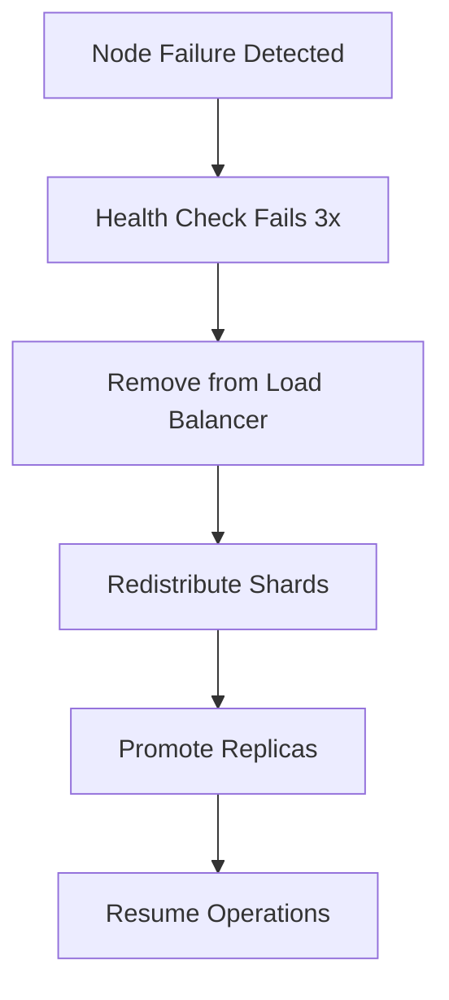

# Failover Runbook

**Version:** 1.0  
**Last Updated:** April 2026  
**Target Audience:** Operations Teams, SREs

---

## Overview

This runbook provides procedures for handling failover scenarios in ThemisDB.

### Failover Scenarios

| Scenario | Detection Time | Failover Time | Automation |
|----------|---------------|---------------|------------|
| Single node failure | < 1 min | < 5 min | Automatic |
| Availability zone failure | < 2 min | < 15 min | Semi-automatic |
| Region failure | < 5 min | < 30 min | Manual |

---

## Automatic Failover (Single Node)

### Overview
Automatic failover handles single node failures without manual intervention.

### How It Works



### Monitoring Automatic Failover

```bash
# Watch cluster status during automatic failover
watch -n 1 'themisdb-cli cluster status'

# Expected progression:
# Node-1: HEALTHY → DEGRADED → FAILED
# Node-2: HEALTHY → HEALTHY (taking load)
# Node-3: HEALTHY → HEALTHY (taking load)
# Shards: Rebalancing...
# Status: DEGRADED → HEALTHY

# Monitor failover metrics
themisdb-cli metrics watch \
  --metrics failover_events,replica_promotions,shard_movements
```

### Manual Intervention (If Needed)

```bash
# If automatic failover stuck, force promotion
themisdb-cli failover force-promote \
  --node node-2 \
  --reason "automatic failover stuck"

# Manually rebalance shards
themisdb-cli cluster rebalance --force
```

---

## Availability Zone Failover

**RTO**: 15 minutes  
**RPO**: 5 seconds

### Step 1: Detect AZ Failure

```bash
# Monitoring alert
ALERT AvailabilityZoneDown
  IF count(up{job="themisdb", az="us-east-1a"} == 0) >= 2
  FOR 2m
  LABELS { severity="critical" }

# Verify AZ failure
themisdb-cli cluster health --group-by az

# Expected output showing one AZ down:
# us-east-1a: FAILED (0/3 nodes)
# us-east-1b: HEALTHY (3/3 nodes)
# us-east-1c: HEALTHY (3/3 nodes)
```

### Step 2: Assess Impact

```bash
# Check affected shards
themisdb-cli shards list --filter status=degraded

# Check replication lag
themisdb-cli replication status --verbose

# Estimate data loss
themisdb-cli data assess-loss --failed-az us-east-1a
```

### Step 3: Execute Failover

```bash
# Promote replicas in healthy AZs
themisdb-cli failover promote-replicas \
  --source-az us-east-1a \
  --target-azs us-east-1b,us-east-1c \
  --verify-data

# Rebalance shards across remaining AZs
themisdb-cli cluster rebalance \
  --exclude-az us-east-1a \
  --even-distribution

# Update load balancer to exclude failed AZ
themisdb-cli lb update \
  --remove-az us-east-1a \
  --health-check-interval 10s
```

### Step 4: Verify Failover

```bash
# Verify cluster health
themisdb-cli cluster health
# Expected: DEGRADED but operational

# Check data consistency
themisdb-cli data verify --sample-size 10000

# Run smoke tests
themisdb-cli test smoke --suite critical

# Monitor performance
themisdb-cli monitor --duration 10m --baseline pre-failover.json
```

### Step 5: Scale Up Capacity

```bash
# Add nodes in remaining AZs to compensate
themisdb-cli cluster scale \
  --add-nodes 3 \
  --azs us-east-1b,us-east-1c

# Wait for nodes to join
themisdb-cli cluster wait-for-nodes \
  --count 9 \
  --timeout 600s

# Rebalance shards
themisdb-cli cluster rebalance
```

---

## Regional Failover

**RTO**: 30 minutes  
**RPO**: 1 minute

### Step 1: Declare Regional Disaster

```bash
# Incident commander decision
themisdb-cli incident declare \
  --type regional_failure \
  --severity critical \
  --region us-east-1 \
  --notify all
```

### Step 2: Promote Secondary Region

```bash
# Promote DR region to primary
themisdb-cli failover promote-region \
  --region us-west-2 \
  --former-primary us-east-1 \
  --verify-data-consistency \
  --force

# Expected output:
# ✓ Stopping replication from us-east-1
# ✓ Promoting us-west-2 to primary
# ✓ Enabling writes in us-west-2
# ✓ Reconfiguring shard topology
# ✓ Verifying data consistency
# ✓ Regional failover complete
```

### Step 3: Update DNS and Load Balancers

```bash
# Update DNS to point to new region
aws route53 change-resource-record-sets \
  --hosted-zone-id Z1234567890 \
  --change-batch file://failover-dns.json

# Update global load balancer
themisdb-cli lb update-global \
  --primary-region us-west-2 \
  --health-check enabled

# Verify DNS propagation
for NS in 8.8.8.8 1.1.1.1; do
  dig @$NS themisdb.example.com +short
done
```

### Step 4: Verify Regional Failover

```bash
# Test from multiple locations
for REGION in us-west eu-west ap-south; do
  curl https://themisdb.$REGION.example.com/health
done

# Run integration tests against new primary
themisdb-cli test integration \
  --endpoint https://themisdb.us-west-2.example.com \
  --suite full

# Monitor for 15 minutes
themisdb-cli monitor \
  --region us-west-2 \
  --duration 15m \
  --alert-on-anomaly
```

### Step 5: Communicate Status

```bash
# Update status page
themisdb-cli status update \
  --message "Failover to us-west-2 complete. All services operational." \
  --status operational

# Notify stakeholders
themisdb-cli notify send \
  --template regional-failover-complete \
  --recipients all-stakeholders
```

---

## Failback Procedure

**When**: After primary region is restored and stable

### Step 1: Verify Primary Region Health

```bash
# Check that primary region is fully recovered
themisdb-cli region health us-east-1 --deep-check

# Verify for 24 hours before failback
themisdb-cli monitor \
  --region us-east-1 \
  --duration 24h \
  --alert-threshold 0.1%
```

### Step 2: Enable Reverse Replication

```bash
# Replicate from us-west-2 (current primary) to us-east-1
themisdb-cli replication setup \
  --source us-west-2 \
  --target us-east-1 \
  --mode continuous

# Wait for replication to catch up
themisdb-cli replication wait-sync \
  --max-lag 5s \
  --timeout 3600s
```

### Step 3: Execute Planned Failback

```bash
# Schedule maintenance window
themisdb-cli maintenance schedule \
  --start "2026-01-25T02:00:00Z" \
  --duration 1h \
  --description "Failback to us-east-1"

# At maintenance window, execute failback
themisdb-cli failover failback \
  --to-region us-east-1 \
  --from-region us-west-2 \
  --verify-data

# Update DNS back to primary
aws route53 change-resource-record-sets \
  --hosted-zone-id Z1234567890 \
  --change-batch file://failback-dns.json
```

### Step 4: Verify Failback

```bash
# Run full validation
themisdb-cli test integration --suite full

# Monitor for 1 hour
themisdb-cli monitor --duration 1h

# Close maintenance window
themisdb-cli maintenance complete
```

---

## Split-Brain Prevention

### Detection

```bash
# Monitor for split-brain condition
ALERT SplitBrainDetected
  IF count(themisdb_cluster_primary == 1) > 1
  FOR 1m
  LABELS { severity="critical" }
```

### Resolution

```bash
# Identify the legitimate primary
themisdb-cli cluster identify-primary --quorum-check

# Fence the incorrect primary
themisdb-cli cluster fence-node \
  --node <incorrect-primary> \
  --reason "split-brain resolution"

# Verify single primary
themisdb-cli cluster status | grep PRIMARY
# Expected: Only one node showing PRIMARY
```

---

## Testing Failover

### Monthly Failover Test

```bash
#!/bin/bash
# Monthly failover drill (non-production)

echo "=== Failover Drill: $(date) ==="

# 1. Simulate node failure
themisdb-cli test simulate-failure --node node-1

# 2. Verify automatic failover
sleep 60
themisdb-cli cluster status

# 3. Verify data consistency
themisdb-cli data verify

# 4. Restore node
themisdb-cli test restore-node --node node-1

# 5. Verify cluster health
themisdb-cli cluster health

echo "✅ Failover drill complete"
```

---

## Troubleshooting

### Failover Not Triggering

```bash
# Check health check configuration
themisdb-cli lb health-check status

# Verify monitoring and alerting
themisdb-cli alerts test --alert failover_trigger

# Manually trigger failover
themisdb-cli failover trigger --reason "manual test"
```

### Data Loss After Failover

```bash
# Assess data loss
themisdb-cli data assess-loss --compare-to backup-20260124

# Identify missing transactions
themisdb-cli wal inspect --missing-sequences

# Consider restoring from backup
# See RESTORE_RUNBOOK.md
```

### Performance Degradation After Failover

```bash
# Check shard distribution
themisdb-cli shards distribution

# Rebalance if needed
themisdb-cli cluster rebalance

# Scale up if under-provisioned
themisdb-cli cluster scale --add-nodes 2
```

---

## Success Criteria

- [ ] Failed components isolated
- [ ] New primary elected/promoted
- [ ] All shards available
- [ ] Data consistency verified
- [ ] RPO/RTO targets met
- [ ] All critical tests passing
- [ ] Stakeholders notified

---

**Emergency Contacts**:  
- On-Call Engineer: [PagerDuty]
- Engineering Manager: [Phone]
- CTO: [Phone]

**Escalation Time**: 15 minutes if failover not progressing
