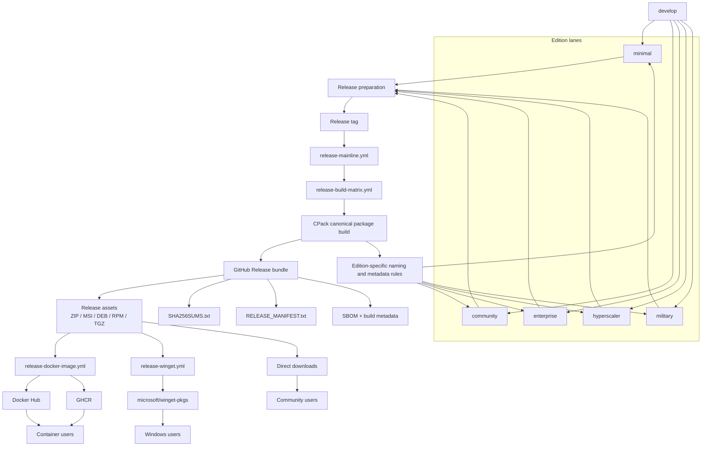

# ThemisDB Release Target Architecture

> Status: Target state
> Scope: release orchestration, package generation, container distribution, WinGet publication, and documentation governance
> Source of truth: [RELEASE_STRATEGY.md](../../RELEASE_STRATEGY.md), [BRANCHING_STRATEGY.md](../../BRANCHING_STRATEGY.md), [.github/WORKFLOW_REGISTRY.md](../../.github/WORKFLOW_REGISTRY.md)

## 1. Goal

The release system should behave like a single canonical pipeline with clearly separated responsibilities, not a set of overlapping historical paths. The target architecture is deliberately lean:

- one canonical release orchestrator
- one canonical package build layer
- one canonical container publication policy
- one canonical WinGet route for stable community releases
- one canonical documentation and governance source-of-truth

This reduces drift, keeps branch rules predictable, and makes packaging metadata auditable.

## 2. Canonical release model

### 2.1 Branch and edition model

The repository uses the permanent branch model defined in [BRANCHING_STRATEGY.md](../../BRANCHING_STRATEGY.md):

- `develop` — default development lane
- `minimal` — minimal edition
- `community` — public community release lane
- `enterprise` — enterprise release lane
- `hyperscaler` — hyperscaler edition
- `military` — military edition

Legacy names such as `main` and `millitary` are not used for new work.

### 2.2 Release orchestration

The canonical release flow is:

1. development on `develop`
2. release preparation on the target edition lane
3. final validation and artifact generation
4. tag creation on the released commit
5. GitHub release publication
6. downstream publication to registries and package managers

The canonical workflow entry point is:

- `.github/workflows/release-mainline.yml` — orchestrates release build, validation, GitHub release publication, and downstream triggers

Supporting reusable layers are:

- `.github/workflows/release-build-matrix.yml` — platform/package build matrix
- `.github/workflows/release-docker-image.yml` — Docker registry publication
- `.github/workflows/release-winget.yml` — stable public WinGet submission
- `.github/workflows/release-linux-distribution.yml` — Linux distro bundle/repository metadata preparation and optional semi-automated publish
- `.github/workflows/release-windows-distribution.yml` — Windows Scoop/Chocolatey candidate bundle preparation and optional semi-automated publish

The historical duplicate path `.github/no_workflows/release-publish.yml` remains non-canonical and is not the active release source.

### 2.3 Build-to-product flow

The diagram shows the intended split: CPack produces the canonical release artifacts once, GitHub Release publishes the bundle, and Docker/WinGet/direct downloads consume those published assets per edition and channel.

## 3. Packaging target architecture

### 3.1 Package generation

CPack remains the canonical package generator. It is the source of platform-native artifacts, while GitHub release metadata wraps these assets into a publishable release bundle.

Target layout:

- CPack produces OS-native archives and installers
- GitHub Release publication adds checksum and manifest metadata
- downstream registries reference the already-published release assets and not an alternative package invention

### 3.2 Artifact responsibilities

| Layer | Owner | Responsibility |
|---|---|---|
| CPack | build matrix | produce native packages and archives |
| GitHub Release | release-mainline | publish versioned release assets and metadata |
| Docker registry | release-docker-image | publish OCI images |
| WinGet | release-winget | publish stable package metadata for Windows |
| Documentation | root docs | define versioning, policy, and registry references |

### 3.3 Canonical artifact naming

The release naming scheme should follow a single semantic convention:

- stable version: `vX.Y.Z`
- pre-release: `vX.Y.Z-rcN`, `vX.Y.Z-betaN`, `vX.Y.Z-alphaN`
- edition-specific tags remain explicit: `minimal-vX.Y.Z`, `enterprise-vX.Y.Z`, `hyperscaler-vX.Y.Z`, `military-vX.Y.Z`

Package filenames should be consistent across CPack output, GitHub Release assets, and release documentation. The canonical rule is:

- release tag identifies the versioned source state
- package file names include edition, version, platform, and architecture when necessary
- checksums and manifests are generated once from the final release bundle

Examples:

- `ThemisDB-<version>-Windows-x64.zip`
- `ThemisDB-<version>-Windows-x64.msi`
- `themisdb_<version>_amd64.deb`
- `themisdb-<version>-1.el9.x86_64.rpm`
- `themisdb-<edition>-<version>-linux-x64.tar.gz`

### 3.4 Canonical metadata

Every release should have a consistent metadata bundle:

- `SHA256SUMS.txt`
- `RELEASE_MANIFEST.txt`
- release notes
- SBOM artifact
- build metadata JSON

This metadata is generated as part of the release pipeline and is what downstream registries and manually downloaded artifacts rely on.

### 3.5 Platform consumer matrix

| Platform | Current consumer/workflow | Distribution route | Status |
|---|---|---|---|
| Developer / source code | GitHub Release source archive | `themisdb-<version>.tar.gz` on GitHub | current |
| Windows | `release-winget.yml` + GitHub Release assets | WinGet, direct download | current |
| Windows | `release-windows-distribution.yml` (consumer lane) | Scoop/Chocolatey candidate manifests + optional semi-automated bundle publish | current |
| Linux | GitHub Release assets + package installation paths | DEB, RPM, TGZ, direct download | current |
| Linux | `release-linux-distribution.yml` (consumer lane) | DEB/RPM repo-metadata bundle + optional semi-automated distro publish | current |
| macOS | `release-build-matrix.yml` (experimental build lane) | planned Homebrew cask / DMG / PKG / tarball path | in progress |

The target architecture currently covers developer/source-code distribution, Windows, Linux, Docker, and WinGet as active delivery lanes. macOS now has an experimental opt-in build lane in the release matrix for visibility and hardening, but still has no dedicated consumer publication lane.

### 3.6 macOS lane graduation criteria

The `macos-release` lane remains opt-in until all of the following are true:

- At least three consecutive GitHub-hosted `macos-latest` runs succeed on the canonical release matrix path.
- CPack produces at least one distributable macOS artifact (`.dmg` or `.tar.gz`) in the release packaging step.
- Artifact naming and checksum/manifest generation are aligned with the canonical release bundle rules.
- A dedicated macOS consumer publication route is defined (for example Homebrew and/or direct DMG/PKG path).

Local `act` dry-runs are schema/orchestration checks only and must not be treated as proof of native macOS runtime compatibility.

Detailed gate checklist: [MACOS_LANE_GA_CHECKLIST.md](MACOS_LANE_GA_CHECKLIST.md)

### 3.7 Current delivery scope: Windows and Linux channels

For the current delivery scope, the active distribution channels are Windows and Linux only.

| Platform | Channel | Producer workflow | Consumer workflow | Status |
|---|---|---|---|---|
| Windows | GitHub Release assets (ZIP/MSI) | `release-build-matrix.yml` + `release-mainline.yml` | direct download | active |
| Windows | WinGet (stable only) | `release-mainline.yml` release bundle | `release-winget.yml` | active |
| Windows | Scoop/Chocolatey candidate bundle channels (`stable`, `testing`, `nightly`) | published GitHub Release assets | `release-windows-distribution.yml` (optional semi-automated publish) | active |
| Linux | GitHub Release assets (TGZ/DEB/RPM) | `release-build-matrix.yml` + `release-mainline.yml` | direct download / package manager install | active |
| Linux | Container registry (OCI images) | release identity from `release-mainline.yml` | `release-docker-image.yml` to Docker Hub + GHCR | active |
| Linux | Distro bundle/repo metadata channels (`stable`, `testing`, `nightly`) | published GitHub Release assets | `release-linux-distribution.yml` (optional semi-automated publish) | active |
| Linux | Signed repo metadata + distro profiles | published GitHub Release assets | `release-linux-distribution.yml` (`sign_metadata`, `metadata_profile`) | active |

Out of current scope:

- dedicated macOS consumer publication lane
- macOS GA guarantees for package/install/runtime behavior

Linux distro governance note:

- `stable`, `testing`, and `nightly` must use separated publish endpoints and channel-scoped secrets.
- Stable publish must be maintainer-gated (protected environment approval).
- Repository signing keys must be stored only in protected secrets and used only in signing-enabled runs.
- Distro-specific metadata profiles must be selected explicitly when release policy requires fixed suite/codename semantics.

Windows distro governance note:

- `stable`, `testing`, and `nightly` use separated publish endpoints and channel-scoped secrets.
- `testing` and `nightly` publish require explicit override (`allow_non_stable_publish=true`).
- Publish jobs are environment-gated per channel: `release-windows-stable`, `release-windows-testing`, `release-windows-nightly`.
- WinGet remains the canonical public Windows publication route.

## 4. Container distribution target

### 4.1 Registry policy

The target policy is simple and explicit:

- stable releases are published to both Docker Hub and GHCR
- nightly builds are published to both registries when the nightly lane is active
- no alternate private registry policy is used for community publishing
- no release-specific registry split is introduced without an explicit governance reason

Canonical registry targets:

- Docker Hub: `themisdb/themisdb`
- GHCR: `ghcr.io/makr-code/themisdb`

### 4.2 Tag policy

Canonical image tags should be derived only from the resolved release tag, not from timestamps or ad hoc fallback versions for release publication.

Target rules:

- `latest` for the latest stable community release
- semver tag for exact version, for example `2.5.0`
- floating minor tag such as `2.5`
- nightly tags for nightly automation only
- no release publication from timestamp-based fallback tags

### 4.3 Container governance

The Docker publication path must remain scoped to the intentional release pipeline. It is a downstream publication lane, not a parallel source of truth for release identity.

## 5. WinGet target path

### 5.1 Canonical WinGet policy

The canonical stable WinGet path is:

- `.github/workflows/release-winget.yml`
- community public submission to the official `microsoft/winget-pkgs` repository
- stable version only
- no nightly publication
- no ad hoc fork-based alternative as the canonical release source

### 5.2 E2E / validation role

The `build-widget.yml` flow can remain as a validation or E2E helper for manifest generation and package checks, but it is not the authoritative publication path. It should be configured with a safe default state:

- `dry_run=true` by default
- optional real submission only with explicit maintainer-controlled credentials
- manifest generation must remain aligned with the same release asset conventions used by GitHub Release and CPack

### 5.3 Public package policy

WinGet should only publish community-stable packages. Private and edition-specific distribution remains outside the community package manager channel unless an explicit editorial policy is introduced.

## 6. Documentation governance target

The target architecture requires a clear source-of-truth chain for release decisions:

1. `BRANCHING_STRATEGY.md` — canonical branch and edition model
2. `RELEASE_STRATEGY.md` — canonical release flow and release tags
3. `.github/WORKFLOW_REGISTRY.md` — canonical workflow registry and active-vs-legacy mapping
4. `docs/RELEASE_ARTIFACT_LOCATIONS.md` — artifact destinations and lookup guide
5. `docs/release/` — release-specific operational and architecture extensions

This chain prevents drift between docs, workflow registry, and actual automation.

## 7. Explicit non-goals and anti-patterns

The target architecture deliberately avoids the following patterns:

- duplicate release orchestrators with different semantics
- duplicate Docker registry publication logic in multiple workflows with conflicting naming
- parallel WinGet publication paths that create different package metadata policies
- package naming that differs between CPack output, docs, and release metadata
- historical branch names in new workflows or documentation
- community publication that includes private credentials, private artefacts, or private plugin implementations

## 8. Acceptance criteria for the target state

The release architecture is considered complete when all of the following are true:

- one canonical workflow orchestrates stable release publication
- package generation remains rooted in CPack and not a second ad hoc packaging system
- stable Docker publication uses one explicit registry policy
- WinGet submission is a single stable public path
- release artifacts share one naming and checksum model
- root docs and workflow registry remain synchronized
- duplicate or historical workflow paths are clearly marked as non-canonical or retired

## 9. Implementation follow-up

Once this target state is accepted, the next step is normalization work rather than redesign:

- align active workflows to the canonical release orchestration
- remove or quarantine duplicate publication logic
- standardize package naming and metadata generation
- update root docs and quick-reference pages to point to the same source-of-truth set

This document is the architectural target. The implementation work should then bring the repository into compliance with it, rather than inventing a new release model during each release cycle.
