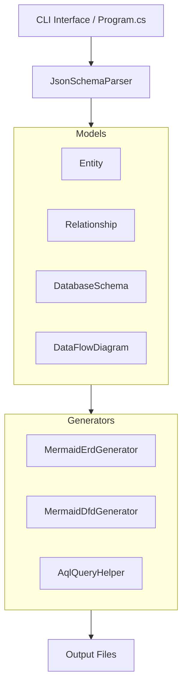
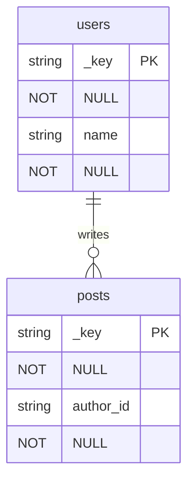
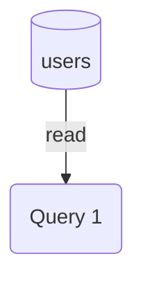

> **Architektur-Hinweis:** Klassen/Typen/Namespaces mit aktuellem Sourcecode abgleichen. Symbole, die nicht im Source gefunden werden, mit `<!-- TODO: verify symbol -->` markieren.

# Architecture: ThemisDB AQL Diagram Tool

## Übersicht

Das AQL Diagram Tool ist eine .NET 8.0-Konsolenanwendung, die Datenbankschemas in verschiedene Diagrammformate konvertiert und AQL-Query-Templates generiert.

## Architektur-Diagramm



## Komponenten

### 1. CLI Interface (`Program.cs`)

**Verantwortlichkeit:** Kommandozeilen-Interface und Orchestrierung

**Funktionen:**
- Argument-Parsing
- Kommando-Routing (erd, dfd, aql, example, help)
- Fehlerbehandlung
- Beispiel-Schema-Generierung

**Design-Entscheidungen:**
- Einfache switch-based Command-Pattern
- Keine externen CLI-Libraries für minimale Dependencies
- Direkte Konsolenausgabe für Benutzerfreundlichkeit

### 2. Models (`Models/`)

#### Entity.cs

**Klassen:**
- `Entity` - Repräsentiert eine Datenbankentität (Collection)
- `Attribute` - Repräsentiert ein Attribut/Feld einer Entity
- `EntityType` - Enum für Collection-Typen

**Design:**
```csharp
public class Entity
{
    public string Name { get; set; }
    public string Description { get; set; }
    public List<Attribute> Attributes { get; set; }
    public EntityType Type { get; set; }
}

public enum EntityType
{
    Collection,        // Standard Collection
    EdgeCollection,    // Graph Edge Collection
    View,             // View
    Index             // Index
}
```

**Zweck:** Abstraktion einer Datenbankentität mit all ihren Eigenschaften

#### Relationship.cs

**Klassen:**
- `Relationship` - Repräsentiert eine Beziehung zwischen Entities
- `RelationshipType` - Enum für Beziehungstypen

**Design:**
```csharp
public class Relationship
{
    public string Name { get; set; }
    public Entity FromEntity { get; set; }
    public Entity ToEntity { get; set; }
    public RelationshipType Type { get; set; }
    public string? ForeignKeyAttribute { get; set; }
    public string? EdgeCollection { get; set; }
}

public enum RelationshipType
{
    OneToOne,
    OneToMany,
    ManyToOne,
    ManyToMany
}
```

**Zweck:** Modellierung von Beziehungen für ERD-Generierung und Join-Queries

#### DatabaseSchema.cs

**Design:**
```csharp
public class DatabaseSchema
{
    public string Name { get; set; }
    public string Description { get; set; }
    public List<Entity> Entities { get; set; }
    public List<Relationship> Relationships { get; set; }
}
```

**Zweck:** Container für das gesamte Datenbankschema

#### DataFlowDiagram.cs

**Klassen:**
- `DataFlowDiagram` - Container für DFD-Elemente
- `Process` - Repräsentiert einen Prozess (AQL Query)
- `DataStore` - Repräsentiert einen Datenspeicher (Collection)
- `DataFlow` - Repräsentiert einen Datenfluss
- `ExternalEntity` - Externe Entität (Client, Service)

**Zweck:** Modellierung von Datenflüssen für DFD-Generierung

### 3. Parsers (`Parsers/`)

#### JsonSchemaParser.cs

**Verantwortlichkeit:** Parsing von JSON-Schema-Dateien in Modell-Objekte

**Funktionen:**
- Parse JSON-String zu DatabaseSchema
- Parse JSON-File zu DatabaseSchema
- Validierung und Fehlerbehandlung

**Design:**
```csharp
public class JsonSchemaParser
{
    public DatabaseSchema Parse(string json)
    public DatabaseSchema ParseFile(string filePath)
    private Entity ParseEntity(JsonElement element)
    private Attribute ParseAttribute(JsonElement element)
    private Relationship? ParseRelationship(JsonElement element, DatabaseSchema schema)
}
```

**JSON-Format:**
```json
{
  "name": "DatabaseName",
  "description": "Description",
  "entities": [
    {
      "name": "entity_name",
      "type": "collection",
      "attributes": [
        {
          "name": "field_name",
          "type": "data_type",
          "isKey": true,
          "required": true
        }
      ]
    }
  ],
  "relationships": [
    {
      "name": "relationship_name",
      "from": "entity1",
      "to": "entity2",
      "type": "one-to-many",
      "foreignKey": "foreign_key_field"
    }
  ]
}
```

**Fehlerbehandlung:**
- Missing required properties → Exception
- Invalid entity references → Warning + Skip
- Invalid JSON → ArgumentException

### 4. Generators (`Generators/`)

#### MermaidErdGenerator.cs

**Verantwortlichkeit:** Generierung von ERDs im Mermaid-Format

**Algorithmus:**
1. Beginne mit "erDiagram"
2. Für jede Entity:
   - Generiere Entity-Block mit Name
   - Liste alle Attributes mit Typ und Constraints
3. Für jede Relationship:
   - Generiere Beziehungs-Linie mit passendem Symbol
   - Füge Label hinzu

**Mermaid-Symbole:**
```
||--||  One-to-One
||--o{  One-to-Many
}o--||  Many-to-One
}o--o{  Many-to-Many
```

**Output-Beispiel:**


#### MermaidDfdGenerator.cs

**Verantwortlichkeit:** Generierung von DFDs im Mermaid-Format

**Algorithmus:**
1. Beginne mit "flowchart TD"
2. Generiere External Entities `[]`
3. Generiere Processes `()`
4. Generiere Data Stores `[()]`
5. Generiere Data Flows `-->`

**Funktionen:**
- `Generate(DataFlowDiagram)` - Generiert DFD aus Modell
- `GenerateFromAql(collections, queries)` - Generiert DFD aus AQL-Queries

**Output-Beispiel:**


#### AqlQueryHelper.cs

**Verantwortlichkeit:** Generierung von AQL-Query-Templates

**Funktionen:**

1. **GenerateCrudQueries(Entity)**
   - INSERT
   - SELECT (alle)
   - SELECT (gefiltert)
   - UPDATE
   - DELETE

2. **GenerateJoinQueries(DatabaseSchema)**
   - Einfache Joins für 1:n, n:1
   - Graph-basierte Joins für n:m mit Edge Collections

3. **GenerateGraphTraversalQueries(DatabaseSchema)**
   - OUTBOUND traversals
   - INBOUND traversals
   - Nur für Edge Collections

4. **GenerateAggregationQueries(Entity)**
   - COUNT
   - SUM/AVG/MIN/MAX (für numerische Felder)
   - GROUP BY (für kategorische Felder)

**Template-System:**
- Platzhalter: `<type>`, `<value>`, `<key_value>`, `<new_value>`
- Kontextabhängig: Basierend auf Schema-Eigenschaften
- Kommentare: Erklärungen in AQL-Kommentaren

**Beispiel-Output:**
```aql
// Insert new users
INSERT {
    username: <string>,
    email: <string>
} INTO users

// Join users with posts
FOR user IN users
    FOR post IN posts
        FILTER post.author_id == user._key
        RETURN { user, post }
```

## Datenfluss

### ERD-Generierung

```
JSON File → JsonSchemaParser → DatabaseSchema
          ↓
DatabaseSchema → MermaidErdGenerator → Mermaid Code
          ↓
Mermaid Code → File Writer → .md File
```

### AQL-Query-Generierung

```
JSON File → JsonSchemaParser → DatabaseSchema
          ↓
DatabaseSchema → AqlQueryHelper → AQL Templates
          ↓
AQL Templates → File Writer → .md File
```

### Beispiel-Generierung

```
Command → Example Builder → DatabaseSchema
          ↓
DatabaseSchema → JSON Serializer → JSON File
```

## Design-Entscheidungen

### 1. Mermaid als Output-Format

**Vorteile:**
- Text-basiert (einfache Versionskontrolle)
- GitHub/GitLab native Unterstützung
- VS Code Plugins verfügbar
- Lesbar auch ohne Rendering

**Alternative:** PlantUML, GraphViz (komplexer, separate Tools nötig)

### 2. JSON für Schema-Definition

**Vorteile:**
- Einfaches Format
- .NET native Unterstützung (System.Text.Json)
- Menschlich lesbar und editierbar
- Erweiterbar

**Alternative:** YAML (benötigt externe Library), XML (verbose)

### 3. CLI-basierte Architektur

**Vorteile:**
- Einfach in CI/CD integrierbar
- Scriptbar und automatisierbar
- Keine UI-Komplexität
- Cross-platform (.NET)

**Alternative:** GUI (mehr Aufwand), Web-API (Infrastruktur nötig)

### 4. Code-First vs. Database-First

**Aktuell:** Code-First (JSON-Schema → Diagramme)

**Mögliche Erweiterung:** Database-First (ThemisDB → Schema-Inferenz)

## Erweiterungsmöglichkeiten

### 1. Weitere Output-Formate

```csharp
interface IDiagramGenerator
{
    string Generate(DatabaseSchema schema);
}

class PlantUmlErdGenerator : IDiagramGenerator { }
class GraphVizErdGenerator : IDiagramGenerator { }
```

### 2. ThemisDB-Direktverbindung

```csharp
class ThemisDbSchemaInspector
{
    public DatabaseSchema InspectSchema(string connectionString)
    {
        // Connect to ThemisDB
        // Query collection metadata
        // Infer relationships
        // Build schema
    }
}
```

### 3. Interactive Mode

```csharp
class InteractiveSchemaBuilder
{
    public DatabaseSchema BuildInteractively()
    {
        // Prompt for entities
        // Prompt for attributes
        // Prompt for relationships
        // Validate and build
    }
}
```

### 4. Query-Validierung

```csharp
class AqlQueryValidator
{
    public ValidationResult Validate(string aql, DatabaseSchema schema)
    {
        // Parse AQL
        // Check collection references
        // Check attribute references
        // Return validation result
    }
}
```

## Testing-Strategie

### Unit Tests (empfohlen)

```csharp
[TestClass]
public class MermaidErdGeneratorTests
{
    [TestMethod]
    public void Generate_SimpleEntity_ProducesCorrectMermaid()
    {
        // Arrange
        var schema = CreateTestSchema();
        var generator = new MermaidErdGenerator();
        
        // Act
        var result = generator.Generate(schema);
        
        // Assert
        Assert.IsTrue(result.Contains("erDiagram"));
    }
}
```

### Integration Tests

- Parse real JSON files
- Generate outputs
- Validate Mermaid syntax

### End-to-End Tests

- Run CLI commands
- Verify output files created
- Check file contents

## Performance-Überlegungen

### Aktuelle Implementierung

- In-Memory-Verarbeitung
- Synchrone Operationen
- Geeignet für Schemas bis ~1000 Entities

### Optimierungen (falls nötig)

1. **Streaming für große Schemas**
   ```csharp
   IAsyncEnumerable<string> GenerateAsync(DatabaseSchema schema)
   ```

2. **Caching von Parsed Schemas**
   ```csharp
   Dictionary<string, DatabaseSchema> schemaCache
   ```

3. **Parallele Verarbeitung**
   ```csharp
   Parallel.ForEach(entities, entity => GenerateEntityBlock(entity))
   ```

## Sicherheit

### Eingabe-Validierung

- JSON-Schema-Validierung
- Pfad-Traversal-Prävention
- File-Size-Limits

### Output-Sanitization

- Mermaid-Code-Injection-Prävention
- Filename-Sanitization

## Lizenz und Copyright

Copyright (c) 2025 ThemisDB. Alle Rechte vorbehalten.
