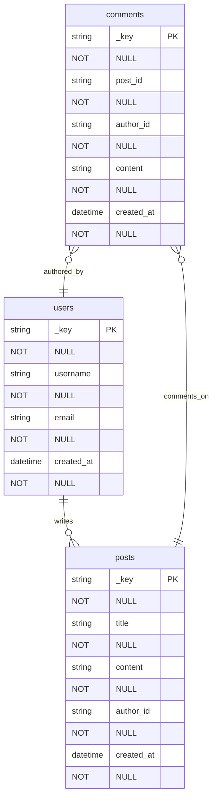

> **Aktueller Build-Flow:** `cmake --preset linux-ninja-release && cmake --build --preset linux-ninja-release`

# How To: ThemisDB AQL Diagram Tool

Diese Anleitung zeigt Ihnen Schritt für Schritt, wie Sie das AQL Diagram Tool verwenden.

## Inhaltsverzeichnis

1. [Erste Schritte](#erste-schritte)
2. [Beispiel-Schema erstellen](#beispiel-schema-erstellen)
3. [ERD generieren](#erd-generieren)
4. [DFD generieren](#dfd-generieren)
5. [AQL-Queries generieren](#aql-queries-generieren)
6. [Eigenes Schema erstellen](#eigenes-schema-erstellen)
7. [Diagramme visualisieren](#diagramme-visualisieren)

---

## Erste Schritte

### 1. Tool bauen

```bash
cd examples/22_aql_diagram_tool/ThemisDB.AqlDiagramTool
dotnet build
```

### 2. Hilfe anzeigen

```bash
dotnet run help
```

Dies zeigt alle verfügbaren Kommandos an.

---

## Beispiel-Schema erstellen

Das Tool enthält drei vordefinierte Beispiel-Schemas:

### Todo-App (Einfach)

```bash
dotnet run example todo
```

**Erstellt:** `example_todo_schema.json`

**Enthält:**
- Eine `tasks`-Collection
- Attribute: _key, title, description, status, priority, created_at, due_date
- Keine Beziehungen

**Gut für:** Einstieg, einfache CRUD-Operationen

### Blog-System (Mittel)

```bash
dotnet run example blog
```

**Erstellt:** `example_blog_schema.json`

**Enthält:**
- Collections: `users`, `posts`, `comments`
- Beziehungen:
  - users → posts (1:n)
  - posts → comments (1:n)
  - users → comments (1:n)

**Gut für:** Joins, relationale Queries

### E-Commerce (Komplex)

```bash
dotnet run example ecommerce
```

**Erstellt:** `example_ecommerce_schema.json`

**Enthält:**
- Collections: `products`, `categories`, `orders`
- Beziehungen zwischen Produkten und Kategorien
- Numerische Felder für Aggregationen

**Gut für:** Aggregationen, Kategorisierung

---

## ERD generieren

### Schritt 1: Schema bereitstellen

Entweder ein Beispiel-Schema erstellen oder ein eigenes Schema vorbereiten:

```bash
dotnet run example blog
```

### Schritt 2: ERD generieren

```bash
dotnet run erd example_blog_schema.json blog_erd.md
```

### Schritt 3: Ausgabe prüfen

Die Datei `blog_erd.md` enthält:

```markdown
# Entity-Relationship Diagram: BlogSystem

Blog with posts and comments


```

### ERD-Notation

- `PK` - Primary Key
- `NOT NULL` - Pflichtfeld
- `||--||` - One-to-One
- `||--o{` - One-to-Many
- `}o--||` - Many-to-One
- `}o--o{` - Many-to-Many

---

## DFD generieren

### Schritt 1: Schema bereitstellen

```bash
dotnet run example blog
```

### Schritt 2: DFD generieren

```bash
dotnet run dfd example_blog_schema.json blog_dfd.md
```

### Schritt 3: Ausgabe prüfen

Die Datei `blog_dfd.md` enthält ein Datenflussdiagramm mit:
- Data Stores (Collections)
- Processes (Queries)
- Data Flows (Pfeile)

### DFD-Elemente

- `[("Collection")]` - Data Store (Datenbank)
- `("Process")` - Prozess/Query
- `["External"]` - Externe Entität
- `-->` - Datenfluss

---

## AQL-Queries generieren

### Schritt 1: Schema bereitstellen

```bash
dotnet run example blog
```

### Schritt 2: Queries generieren

```bash
dotnet run aql example_blog_schema.json blog_queries.md
```

### Schritt 3: Ausgabe prüfen

Die Datei `blog_queries.md` enthält:

**Für jede Entity:**
- INSERT-Query
- SELECT-Queries (alle, gefiltert)
- UPDATE-Query
- DELETE-Query
- COUNT-Aggregation
- GROUP BY-Queries

**Für Relationships:**
- JOIN-Queries
- Graph-Traversal-Queries (bei Edge-Collections)

### Beispiel-Output

```aql
// Insert new users
INSERT {
    username: <string>,
    email: <string>,
    created_at: <datetime>
} INTO users

// Join users with posts
FOR user IN users
    FOR post IN posts
        FILTER post.author_id == user._key
        RETURN { user, post }
```

---

## Eigenes Schema erstellen

### Schritt 1: JSON-Datei erstellen

Erstelle eine Datei `my_schema.json`:

```json
{
  "name": "MyApp",
  "description": "My application schema",
  "entities": [
    {
      "name": "customers",
      "description": "Customer records",
      "type": "collection",
      "attributes": [
        {
          "name": "_key",
          "type": "string",
          "isKey": true,
          "required": true
        },
        {
          "name": "name",
          "type": "string",
          "required": true
        },
        {
          "name": "email",
          "type": "string",
          "required": true,
          "unique": true
        },
        {
          "name": "created_at",
          "type": "datetime",
          "required": true
        }
      ]
    },
    {
      "name": "orders",
      "description": "Customer orders",
      "type": "collection",
      "attributes": [
        {
          "name": "_key",
          "type": "string",
          "isKey": true,
          "required": true
        },
        {
          "name": "customer_id",
          "type": "string",
          "required": true
        },
        {
          "name": "total",
          "type": "decimal",
          "required": true
        },
        {
          "name": "status",
          "type": "string",
          "required": true
        }
      ]
    }
  ],
  "relationships": [
    {
      "name": "places",
      "from": "customers",
      "to": "orders",
      "type": "one-to-many",
      "foreignKey": "customer_id",
      "description": "Customer places orders"
    }
  ]
}
```

### Schritt 2: Diagramme generieren

```bash
# ERD
dotnet run erd my_schema.json my_erd.md

# DFD
dotnet run dfd my_schema.json my_dfd.md

# AQL Queries
dotnet run aql my_schema.json my_queries.md
```

---

## Diagramme visualisieren

### Option 1: VS Code mit Mermaid-Plugin

1. Installiere "Markdown Preview Mermaid Support" Extension
2. Öffne die generierte `.md`-Datei
3. Klicke auf "Preview" (Strg/Cmd + Shift + V)

### Option 2: GitHub

1. Pushe die `.md`-Datei zu GitHub
2. GitHub rendert Mermaid automatisch

### Option 3: Mermaid Live Editor

1. Öffne https://mermaid.live/
2. Kopiere den Mermaid-Code aus der `.md`-Datei
3. Füge ihn im Editor ein
4. Exportiere als PNG/SVG

### Option 4: Markdown-Viewer-Tools

- **Typora** - WYSIWYG Markdown-Editor mit Mermaid-Support
- **MarkText** - Open-Source Markdown-Editor
- **Obsidian** - Notiz-App mit Mermaid-Rendering

---

## Tipps & Tricks

### 1. Batch-Verarbeitung

Generiere alle Diagramme auf einmal:

```bash
SCHEMA="example_blog_schema.json"
dotnet run erd $SCHEMA blog_erd.md
dotnet run dfd $SCHEMA blog_dfd.md
dotnet run aql $SCHEMA blog_queries.md
```

### 2. Output-Pfade organisieren

```bash
mkdir -p docs/diagrams
dotnet run erd my_schema.json docs/diagrams/erd.md
dotnet run dfd my_schema.json docs/diagrams/dfd.md
dotnet run aql my_schema.json docs/diagrams/queries.md
```

### 3. Schema-Validierung

Teste dein Schema durch Generierung:

```bash
# Wenn das erfolgreich ist, ist das Schema gültig
dotnet run erd my_schema.json
```

### 4. Iteratives Design

1. Erstelle initiales Schema-JSON
2. Generiere ERD
3. Überprüfe Beziehungen
4. Passe Schema an
5. Wiederhole

---

## Fehlerbehebung

### Fehler: "Schema file not found"

**Ursache:** Datei existiert nicht oder falscher Pfad

**Lösung:**
```bash
# Prüfe Dateipfad
ls -la my_schema.json

# Verwende absoluten Pfad
dotnet run erd /absolute/path/to/schema.json
```

### Fehler: "Failed to parse JSON schema"

**Ursache:** Ungültiges JSON-Format

**Lösung:**
```bash
# Validiere JSON online: https://jsonlint.com/
# Oder mit jq:
jq . my_schema.json
```

### Fehler: "Could not find entities for relationship"

**Ursache:** Relationship verweist auf nicht-existierende Entity

**Lösung:** Prüfe, dass `from` und `to` auf existierende Entity-Namen verweisen

```json
{
  "relationships": [
    {
      "from": "users",    // Muss existieren in entities
      "to": "posts"       // Muss existieren in entities
    }
  ]
}
```

---

## Nächste Schritte

- Erkunde weitere [ThemisDB-Beispiele](../../)
- Lerne mehr über [AQL-Syntax](../../../aql/README.md)
- Lies die [Architektur-Dokumentation](ARCHITECTURE.md)
