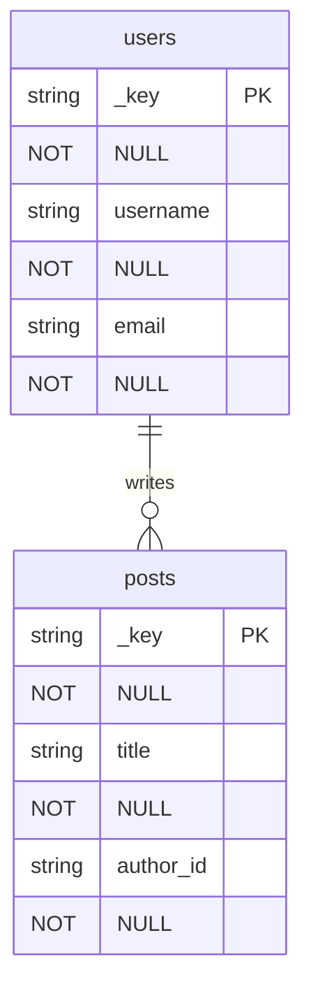
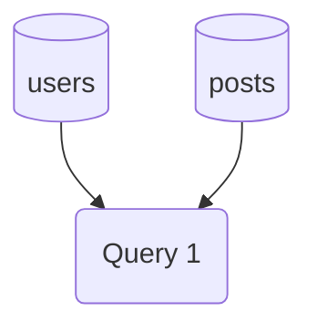

> **Build:** `cmake --preset linux-ninja-release && cmake --build --preset linux-ninja-release`

# ThemisDB AQL Diagram Tool


## 📝 Übersicht

Ein leistungsstarkes C# .NET-Tool zur Generierung von Entity-Relationship-Diagrammen (ERD), Datenflussdiagrammen (DFD) und AQL-Query-Vorlagen für ThemisDB. Dieses Tool erleichtert das Verständnis von Datenbankstrukturen und hilft bei der Erstellung komplexer AQL-Abfragen.

## ✨ Features

- ✅ **ERD-Generierung** - Entity-Relationship-Diagramme aus JSON-Schemas
- ✅ **DFD-Generierung** - Datenflussdiagramme für AQL-Queries
- ✅ **AQL-Query-Vorlagen** - Automatische Generierung von CRUD-, Join- und Aggregations-Queries
- ✅ **Mermaid-Format** - Ausgabe in Mermaid-Syntax für einfache Visualisierung
- ✅ **Beispiel-Schemas** - Vordefinierte Beispiele (Todo, Blog, E-Commerce)
- ✅ **CLI-Interface** - Einfache Kommandozeilen-Bedienung
- ✅ **JSON-Schema-Parser** - Flexible Schema-Definition über JSON

## 🚀 Schnellstart

### Voraussetzungen

- .NET 8.0 SDK oder höher
- Optional: Mermaid-Viewer (z.B. VS Code Plugin, GitHub, etc.)

### Installation

```bash
cd examples/22_aql_diagram_tool/ThemisDB.AqlDiagramTool
dotnet build
```

### Beispiel-Nutzung

#### 1. Beispiel-Schema generieren

```bash
dotnet run example todo
```

Dies erstellt `example_todo_schema.json` mit einer Todo-App-Schema.

#### 2. ERD generieren

```bash
dotnet run erd example_todo_schema.json todo_erd.md
```

#### 3. AQL-Queries generieren

```bash
dotnet run aql example_todo_schema.json todo_queries.md
```

#### 4. DFD generieren

```bash
dotnet run dfd example_todo_schema.json todo_dfd.md
```

## 📊 Ausgabeformate

### Entity-Relationship Diagram (ERD)

Generiert ein ERD in Mermaid-Syntax, das Entitäten, Attribute und Beziehungen visualisiert:



### Data Flow Diagram (DFD)

Zeigt den Datenfluss zwischen Collections und AQL-Queries:



### AQL Query Templates

Generiert vollständige, einsatzbereite AQL-Queries:

```aql
// Get all users
FOR doc IN users
    RETURN doc

// Join users with posts
FOR user IN users
    FOR post IN posts
        FILTER post.author_id == user._key
        RETURN { user, post }
```

## 📖 Kommandos

### `example [type]`

Generiert vordefinierte Beispiel-Schemas:

- `todo` - Einfache Todo-Anwendung
- `blog` - Blog-System mit Posts und Kommentaren
- `ecommerce` - E-Commerce-Produktkatalog

```bash
dotnet run example blog
```

### `erd <schema-file> [output-file]`

Generiert Entity-Relationship-Diagramm:

```bash
dotnet run erd my_schema.json my_erd.md
```

### `dfd <schema-file> [output-file]`

Generiert Data Flow Diagram:

```bash
dotnet run dfd my_schema.json my_dfd.md
```

### `aql <schema-file> [output-file]`

Generiert AQL Query Templates:

```bash
dotnet run aql my_schema.json my_queries.md
```

## 📝 JSON-Schema-Format

Das Tool verwendet ein einfaches JSON-Format für Schema-Definitionen:

```json
{
  "name": "MyDatabase",
  "description": "My database schema",
  "entities": [
    {
      "name": "users",
      "description": "User accounts",
      "type": "collection",
      "attributes": [
        {
          "name": "_key",
          "type": "string",
          "isKey": true,
          "required": true
        },
        {
          "name": "username",
          "type": "string",
          "required": true,
          "unique": true
        },
        {
          "name": "email",
          "type": "string",
          "required": true
        }
      ]
    }
  ],
  "relationships": [
    {
      "name": "writes",
      "from": "users",
      "to": "posts",
      "type": "one-to-many",
      "foreignKey": "author_id"
    }
  ]
}
```

### Entity-Typen

- `collection` - Standard-Collection
- `edgecollection` - Edge-Collection für Graphen
- `view` - View
- `index` - Index

### Relationship-Typen

- `one-to-one` oder `1:1`
- `one-to-many` oder `1:n`
- `many-to-one` oder `n:1`
- `many-to-many` oder `n:m`

## 🎯 Anwendungsfälle

### 1. Datenbankdesign

Visualisiere dein Schema vor der Implementierung:

```bash
# Erstelle Schema-JSON
dotnet run example ecommerce

# Generiere ERD
dotnet run erd example_ecommerce_schema.json

# Überprüfe Beziehungen
```

### 2. AQL-Query-Entwicklung

Generiere Basis-Queries als Ausgangspunkt:

```bash
# Generiere Query-Templates
dotnet run aql my_schema.json queries.md

# Passe generierte Queries an deine Bedürfnisse an
```

### 3. Dokumentation

Erstelle automatisch Diagramme für deine Dokumentation:

```bash
# Generiere alle Diagramme
dotnet run erd schema.json docs/erd.md
dotnet run dfd schema.json docs/dfd.md
dotnet run aql schema.json docs/queries.md
```

### 4. Code-Review

Visualisiere Schema-Änderungen für Pull Requests:

```bash
# Vor der Änderung
dotnet run erd old_schema.json old_erd.md

# Nach der Änderung
dotnet run erd new_schema.json new_erd.md

# Vergleiche die Diagramme
```

## 📚 Weitere Dokumentation

- [HOW_TO.md](HOW_TO.md) - Schritt-für-Schritt-Anleitungen
- [ARCHITECTURE.md](ARCHITECTURE.md) - Technische Architektur
- [AQL Syntax](../../../aql/README.md) - AQL-Dokumentation

## 🔗 Verwandte Beispiele

- [01 - Hello World](../../01_hello_world/) - Erste Schritte mit ThemisDB
- [02 - Todo App](../../02_todo_app/) - Einfache CRUD-Operationen
- [06 - Graph Social Network](../../06_graph_social_network/) - Graph-Queries

## 🛠️ Entwicklung

### Projektstruktur

```
ThemisDB.AqlDiagramTool/
├── Models/              # Datenmodelle (Entity, Relationship, etc.)
├── Generators/          # Diagramm-Generatoren (Mermaid)
├── Parsers/            # JSON-Schema-Parser
└── Program.cs          # CLI-Interface
```

### Erweiterungen

Das Tool ist erweiterbar für:

- Weitere Ausgabeformate (PlantUML, GraphViz)
- Direkte Verbindung zu ThemisDB
- Schema-Inferenz aus existierenden Collections
- Interaktive Schema-Editoren

## 📄 Lizenz

Copyright (c) 2025 ThemisDB. Alle Rechte vorbehalten.

## 🙋 Hilfe

Bei Problemen oder Fragen:

```bash
dotnet run help
```

Oder siehe die [vollständige Dokumentation](../../../docs/).
