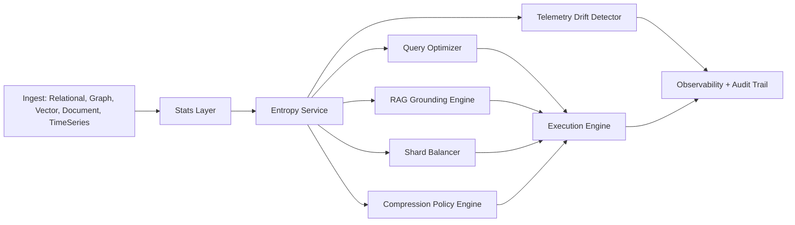
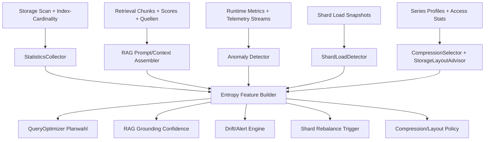
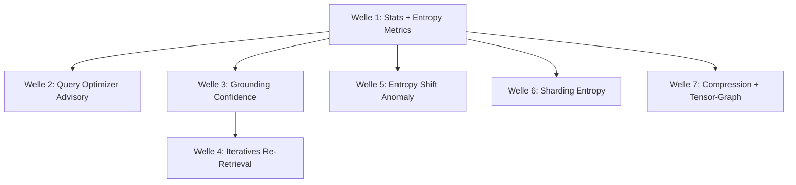

# Architektur: Shannon Information Theory in ThemisDB

## Zielbild

Dieses Dokument beschreibt, wie Shannon-Informationstheorie systematisch in ThemisDB genutzt wird, um

- Query-Optimierung robuster zu machen,
- RAG-Grounding messbar und auditierbar zu machen,
- Drift und Anomalien frueh zu erkennen,
- Sharding-Entscheidungen datengetrieben zu verbessern,
- Kompressions- und Storage-Policies adaptiv zu steuern.

Der Fokus liegt auf produktionsnaher Integration statt rein theoretischer Kennzahlen.

Wissenschaftliche Grundlage:

- Das Entropie- und Mutual-Information-Fundament folgt Shannon (1948) [S48].
- Die RAG- und Re-Retrieval-Architekturentscheidungen orientieren sich an etablierter Primärliteratur [RAG20] [FLARE23] [SELFRAG23] [CRAG24] [ADAPRAG24] [IRCOT23].

## Kernbegriffe

Shannon-Entropie:

H(X) = -sum(p_i * log2(p_i))

Interpretation:

- Hohe Entropie: hohe Unsicherheit, breite Verteilung, wenig Vorhersagbarkeit.
- Niedrige Entropie: starke Konzentration, klare Dominanz weniger Auspraegungen.

Ergaenzend wird Mutual Information genutzt:

I(X;Y) = H(X) + H(Y) - H(X,Y)

Damit koennen informative Features, Korrelationen zwischen Modellen und Signalqualitaet in Retrieval-Pipelines bewertet werden.

Evidenzanker: [S48] [SURVEYRAG24].

## Architekturueberblick



## Schichtmodell

### 1) Stats Layer

Aufgabe:

- Histogramme, Top-K-Werte, Null-Anteile, Heavy-Hitter pro Attribut/Index erfassen.
- Verteilungen fuer Vektor-Similarity-Scores und Graph-Gradverteilungen sammeln.

Output:

- standardisierte Wahrscheinlichkeitsverteilungen p(x) als Input fuer Entropie-Berechnung.

### 2) Entropy Service

Aufgabe:

- Entropie, relative Entropie und Delta-Entropie ueber Zeitfenster berechnen.
- Cross-Model-Metriken fuer Relational + Vector + Graph kombinieren.

Output:

- persistierte Kennzahlen in systeminternen Metrik-Tabellen.
- Trigger-Signale fuer Optimizer, RAG und Drift-Detektion.

### 3) Consumer-Engines

Aufgabe:

- Query Optimizer: Selektivitaet und Risiko bei Planwahl verbessern.
- RAG Engine: Unsicherheits- und Grounding-Scores robust machen.
- Shard Balancer: Hotspot- und Rebalance-Entscheidungen steuern.
- Compression Engine: adaptive Blockstrategien waehlen.
- Drift Detector: fruehe Incident-Signale liefern.

## Datenmodell fuer Entropie-Metriken

Beispieltabellen:

- system_entropy_metrics
- system_entropy_alerts
- system_distribution_snapshots

Beispielschema:

```sql
CREATE TABLE system_entropy_metrics (
    metric_id            BIGINT PRIMARY KEY,
    ts_utc               TIMESTAMP NOT NULL,
    subsystem            TEXT NOT NULL,
    scope_name           TEXT NOT NULL,
    entropy_bits         DOUBLE PRECISION NOT NULL,
    max_entropy_bits     DOUBLE PRECISION,
    normalized_entropy   DOUBLE PRECISION,
    sample_size          BIGINT NOT NULL,
    window_seconds       INT NOT NULL,
    tags_json            JSON
);
```

## Implementierungsbeispiel 1: Entropie-basierte Selektivitaet im Query Optimizer

Ziel:

- Planinstabilitaet bei schiefen Verteilungen reduzieren.

Prinzip:

- Bei niedriger Entropie ist Dominanz einzelner Werte wahrscheinlich. Der Optimizer kann gezielt Index-Zugriffe bevorzugen.
- Bei hoher Entropie koennen breit streuende Filter andere Join-Reihenfolgen sinnvoll machen.

Beispiel (C++-nah):

```cpp
struct EntropyStats {
    double entropy_bits;
    double normalized_entropy; // 0..1
    double heavy_hitter_ratio;  // Anteil haeufigster Wert
    std::uint64_t sample_size;
};

double estimate_selectivity_with_entropy(const Predicate& pred,
                                         const BaseStats& base,
                                         const EntropyStats& ent) {
    // Basis-Schaetzung aus Histogramm
    const double base_sel = estimate_selectivity_histogram(pred, base);

    // Korrektur: starke Dominanz (niedrige Entropie + hoher heavy hitter)
    const double concentration_boost =
        (1.0 - ent.normalized_entropy) * ent.heavy_hitter_ratio;

    // Clamp fuer Stabilitaet
    const double correction = std::clamp(1.0 - 0.6 * concentration_boost, 0.2, 1.2);
    return std::clamp(base_sel * correction, 1e-9, 1.0);
}
```

Integration:

- StatCollector aktualisiert EntropyStats periodisch.
- CostModel liest EntropyStats aus Cache.
- PlanExplainer schreibt verwendete Entropieparameter in Audit-Trace.

Evidenzanker:

- Entropie als Unsicherheitsmass und Entscheidungsmetrik: [S48]
- Retrieval-gestuetzte Verbesserung wissensintensiver Aufgaben: [RAG20] [RETRO21] [ATLAS22]

## Implementierungsbeispiel 2: RAG Grounding Confidence mit Entropie

Ziel:

- Unsicherheit in single-query RAG (Vector + Graph + Relational + LLM) explizit bewerten.

Signalquellen:

- Entropie der Top-K Retrieval-Score-Verteilung.
- Entropie der Quellenherkunft (wie stark streuen die Datenquellen).
- Token-Logprob-Entropie der Antwortsegmente.

Beispielscore:

```text
grounding_confidence =
  w1 * (1 - norm_entropy(retrieval_scores)) +
  w2 * (1 - norm_entropy(source_distribution)) +
  w3 * (1 - norm_entropy(token_logprobs))
```

Beispiel (Pseudocode):

```cpp
double compute_grounding_confidence(const Dist& retrieval_scores,
                                    const Dist& source_dist,
                                    const Dist& token_logprob_dist) {
    const double e1 = normalized_entropy(retrieval_scores);
    const double e2 = normalized_entropy(source_dist);
    const double e3 = normalized_entropy(token_logprob_dist);

    constexpr double w1 = 0.45;
    constexpr double w2 = 0.25;
    constexpr double w3 = 0.30;

    return std::clamp(w1 * (1.0 - e1) + w2 * (1.0 - e2) + w3 * (1.0 - e3), 0.0, 1.0);
}
```

Policy:

- confidence < 0.40: Antwort als unsicher markieren, optional mehr Kontext anfordern.
- 0.40 bis 0.70: Warnhinweis + erweiterter Evidence-Block.
- > 0.70: normaler Antwortpfad.

Audit:

- Alle Teilentropien und Gewichte pro Antwort in Audit-Tabelle speichern.

Evidenzanker:

- RAG mit expliziter Evidenz/Provenance-Idee: [RAG20]
- Aktive und adaptive Re-Retrieval-Strategien fuer long-form/faktentreue Generation: [FLARE23] [SELFRAG23] [CRAG24] [ADAPRAG24] [IRCOT23]

## Implementierungsbeispiel 3: Drift-Detektion in Observability

Ziel:

- Systemveraenderungen erkennen, bevor harte Fehler auftreten.

Vorgehen:

- Entropie pro Zeitfenster fuer Schluesselmetriken berechnen.
- Delta-Entropie gegen Baseline pruefen.

Beispielregel:

```text
if abs(H_t - H_baseline) > tau for N windows => raise entropy_drift_alert
```

Beispiel SQL:

```sql
WITH w AS (
  SELECT
    date_trunc('minute', ts_utc) AS bucket,
    error_code,
    COUNT(*)::double precision AS c
  FROM system_logs
  WHERE ts_utc >= now() - interval '60 minutes'
  GROUP BY 1,2
), p AS (
  SELECT
    bucket,
    error_code,
    c / SUM(c) OVER (PARTITION BY bucket) AS p
  FROM w
)
SELECT
  bucket,
  -SUM(p * LOG(2, p)) AS entropy_bits
FROM p
WHERE p > 0
GROUP BY bucket
ORDER BY bucket;
```

## Implementierungsbeispiel 4: Entropie-gesteuertes Rebalancing fuer Shards

Ziel:

- Hotspots reduzieren und Lastverteilung verbessern.

Metriken:

- Entropie der Request-Key-Verteilung je Shard.
- Entropie der Schreiblast je Shard.
- Entropie der Tenant-Verteilung je Shard.

Entscheidungslogik (vereinfacht):

```cpp
if (global_key_entropy < min_threshold &&
    top_shard_load_ratio > overload_ratio) {
    schedule_rebalance(candidate_partitions);
}
```

Zusatznutzen:

- Fruehindikator fuer schleichende Schieflasten, bevor SLOs reissen.

## Implementierungsbeispiel 5: Adaptive Kompression

Ziel:

- CPU-Kosten und Storage-Effizienz pro Datensegment ausbalancieren.

Strategie:

- Niedrige Entropie: starker Kompressor (hohe Ratio).
- Hohe Entropie: schneller Kompressor oder unkomprimiert.

Beispiel:

```cpp
CompressionCodec choose_codec(double normalized_entropy) {
    if (normalized_entropy < 0.30) return CompressionCodec::ZstdHigh;
    if (normalized_entropy < 0.65) return CompressionCodec::ZstdBalanced;
    return CompressionCodec::Lz4Fast;
}
```

## Deep-Dive: Konkrete Anknuepfungspunkte in ThemisDB

Dieser Abschnitt mappt die Entropie-Idee auf reale Codepfade in ThemisDB: wo Daten entstehen, wo Features berechnet werden und an welchen Entscheidungspunkten sie wirksam werden.

### End-to-End Datenfluss (Ist-Zustand + Entropie-Extension)



### 1) Query-Optimierung: Datenerhebung und Wirkungspunkt

Ist-Collector:

- `StatisticsCollector::collectStats()` scannt Tabellen per Prefix-Iterator, liest Feldwerte via `BaseEntity::deserialize` und baut `ColumnStats`/Histogramme.
- `StatisticsCollector::getStats()` liefert die gecachten TableStats fuer den Planer.
- `QueryOptimizer::chooseOrderForAndQuery()` kombiniert `SecondaryIndexManager::estimateCountEqual(...)` mit Stats-Fallback und sortiert Praedikate nach erwarteter Selektivitaet.

Ist-Wirkungspunkt:

- `QueryOptimizer::chooseOrderForAndQuery()` bestimmt `orderedPredicates` und emittiert Plan-Metriken (`query.optimizer.plan_selected`, `query.optimizer.cost_estimate`).
- `QueryOptimizer::optimizeForDistribution()` verwendet Shard-Rowcount/Latency/Selectivity fuer Pruning, Parallelismus und Join-Strategie.

Entropy-Integration (konkret):

- In `StatisticsCollector::buildColumnStats(...)` pro Spalte `entropy_bits` und `normalized_entropy` aus Histogramm-Buckets berechnen.
- In `QueryOptimizer::chooseOrderForAndQuery()` die bestehende `cnt`-Schaetzung mit Entropie-Faktor rekalibrieren.
- In `DistributedQueryCostModel::calculatePredicateSelectivity(...)` Entropie je Predicate einbeziehen, damit Partition-Pruning weniger false positives produziert.

Beispiel-Hook (direkt am Planpunkt):

```cpp
// after cnt estimation in QueryOptimizer::chooseOrderForAndQuery()
const auto ent = entropy_cache.get(q.table, p.column); // {normalized_entropy, heavy_hitter_ratio}
const double concentration = (1.0 - ent.normalized_entropy) * ent.heavy_hitter_ratio;
cnt = static_cast<size_t>(static_cast<double>(cnt) * std::clamp(1.0 - 0.6 * concentration, 0.2, 1.2));
```

### 2) RAG-Grounding: Datenerhebung und Wirkungspunkt

Ist-Collector:

- `RAGPromptBuilder::selectChunks(...)` sortiert Kandidaten nach `relevance_score` und waehlt budgetgerecht aus.
- `RAGContextAssembler::assemble(...)` sortiert ebenfalls nach Relevanz, fuellt Token-Budget und protokolliert Nutzung/Trunkierung.
- `RAGJudge::evaluateWithConfig(...)` bewertet Faithfulness/Relevance/Completeness/Coherence und fuehrt Prompt-Injection-/Bias-Signale.
- `LearningMetrics::recordEvaluation(...)` schreibt verlaufsfaehige Qualitaetsmetriken fuer RAG-Lernkurven.

Ist-Wirkungspunkt:

- `RAGJudge` setzt `overall_score`, `confidence`, `passed_quality_threshold`, `injection_blocked`.
- `RAGContextAssembler` steuert, wie viel Evidenz in den Prompt gelangt (`tokens_used`, `tokens_remaining_for_response`).

Entropy-Integration (konkret):

- Retrieval-Entropie aus Top-K-`relevance_score`-Verteilung.
- Quellen-Entropie aus `RetrievedChunk::source`-Verteilung.
- Antwort-Unsicherheitsentropie aus Token-Logprobs (ueber Inferenzpfad).

Grounding-Entscheidung:

- Bei hoher kombinierter Entropie: strengere Quality-Thresholds in `RAGJudgeConfig`, mehr Kontext erzwingen, oder Antwort explizit als low confidence markieren.
- Bei niedriger Entropie: normaler Pfad mit auditierbarer Evidenzliste.

Beispiel-Hook vor Judge-Entscheidung:

```cpp
const double e_retrieval = normalized_entropy(topk_score_distribution);
const double e_sources   = normalized_entropy(source_distribution);
const double e_tokens    = normalized_entropy(token_logprob_distribution);
const double grounding_conf = 1.0 - (0.45*e_retrieval + 0.25*e_sources + 0.30*e_tokens);

if (grounding_conf < 0.40) {
  cfg.quality_threshold = std::max(cfg.quality_threshold, 0.80);
}
```

### 3) Drift- und Anomalie-Erkennung: Datenerhebung und Wirkungspunkt

Ist-Collector:

- `timeseries::AnomalyDetector` (ZScore/IQR) arbeitet auf Zeitreihenpunkten (`TSStore::DataPoint`).
- `observability::MLAnomalyDetector::train(...)` lernt Baseline/Foresight (Forecast + Outlier-Modell).
- `MLAnomalyDetector::detectAnomalies(...)` kombiniert Outlier-Score, Forecast-Deviation, DBSCAN-Noise, Seasonality-Residual und Change-Point.

Ist-Wirkungspunkt:

- `detectAnomalies(...)` setzt `confidence_score`, `severity`, `contributing_factors` und erzeugt Alert-kandidaten bei `combined >= anomaly_threshold`.

Entropy-Integration (konkret):

- Entropie ueber Fehlercode-Verteilungen pro Fenster.
- Entropie ueber Metrik-Bins (z. B. Latenzklassen) fuer fruehe Pattern-Aenderungen.
- Delta-Entropie als zusaetzlicher Faktor in `combined` neben bestehender ML-Score-Fusion.

Beispiel-Hook im kombinierten Score:

```cpp
const double entropy_shift = std::abs(H_current - H_baseline);          // 0..inf
const double entropy_score = std::clamp(entropy_shift / tau, 0.0, 1.0); // 0..1

double combined = clamp01(
  0.30 * outlier_score +
  0.20 * deviation_score +
  0.15 * seasonal_score +
  0.15 * dbscan_score +
  0.10 * cp_score +
  0.10 * entropy_score);
```

Evidenzanker:

- Entropie-/Trunkierungssteuerung im Decoding als robustes Unsicherheitssignal: [DEGEN20] [DESMOOTH22]

### 4) Sharding-Entscheidungen: Datenerhebung und Wirkungspunkt

Ist-Collector:

- `ShardLoadDetector::updateShardLoad(...)` sammelt pro Shard Requests/s, p99-Latenz, CPU, Storage, Bytes und Historie.
- Dabei werden Gauges in `PrometheusMetrics` aktualisiert (`themis_shard_*`).
- `ShardRouter` erfasst Routing-Latenzen/Fehler/Fanout via `PrometheusMetrics::recordRouting*`.

Ist-Wirkungspunkt:

- `ShardLoadDetector::detectImbalance()` feuert Heuristiken (Storage/Request/Latency/Resource) und erstellt Rebalance-Empfehlungen.
- `QueryOptimizer::optimizeForDistribution()` steuert Shard-Pruning, Parallelismus, Join-Strategie.

Entropy-Integration (konkret):

- Entropie der Request-Key-Verteilung je Shard als Hotspot-Indikator.
- Entropie der Lastanteile ueber alle Shards als Cluster-Balance-Score.
- Entropie-Deltas in `forecastLoad(...)` als Fruehwarnsignal fuer kippen der Last.

Beispiel-Hook in der Rebalance-Entscheidung:

```cpp
if (request_key_entropy_cluster < min_entropy_threshold &&
  result.cluster_load_variance > variance_threshold) {
  result.is_imbalanced = true;
  appendReasonClause(result.reason, "Low key entropy indicates hotspot concentration");
}
```

Evidenzanker:

- Adaptive Wahl von Retrieval-Strategien nach Komplexitaet/Signalguete: [ADAPRAG24] [CRAG24]

### 5) Kompressions- und Storage-Policies: Datenerhebung und Wirkungspunkt

Ist-Collector:

- `profileSeries(...)` extrahiert `value_variance`, `timestamp_regularity`, `dod_mean_abs`, `run_length_ratio`.
- `HeuristicCompressionSelector::select(...)` entscheidet aus Profilen zwischen `RLE`, `DeltaOfDelta`, `Gorilla`.
- `CompressionMetrics::record_compression/decompression(...)` sammelt Ratio, Zeiten, Throughput je Methode.
- `StorageLayoutAdvisor::analyze(...)` nutzt Access-Statistiken (`aggregation_ratio`, `point_lookup_ratio`, `metadata_only_access_ratio`, `timestamp_series`) und Schema/GDPR-Infos fuer Layout-Empfehlungen.

Ist-Wirkungspunkt:

- Per-Series Strategie via `PerSeriesCompressionRegistry::strategyFor(...)`.
- Layout-Empfehlung (`ROW_ORIENTED`, `COLUMNAR_COMPRESSED`, `HYBRID`, `TIERED`) plus Decision Record.

Entropy-Integration (konkret):

- Zeitreihen-Entropie pro Serie als zusaetzliche Feature-Dimension fuer Kompressionswahl.
- Feldwert-Entropie pro Spalte fuer Layout-Empfehlung (niedrige Entropie -> columnar/encoding aggressiver).
- Entropie-basierte Auto-Tuning-Loops mit Rueckkopplung aus `CompressionMetrics`.

Beispiel-Hook in der Kompressionswahl:

```cpp
CompressionStrategy choose_with_entropy(const SeriesProfile& p, double norm_entropy) {
  if (norm_entropy < 0.25 && p.run_length_ratio > 0.40) return CompressionStrategy::RLE;
  if (norm_entropy < 0.60 && p.timestamp_regularity > 0.80) return CompressionStrategy::DeltaOfDelta;
  return CompressionStrategy::Gorilla;
}
```

Evidenzanker:

- Entropie als Steuerung fuer Sampling-/Desmoothing-Entscheidungen: [DESMOOTH22] [DEGEN20]

### Technischer Integrationsplan fuer Entropie ohne Architekturbruch

1. `metadata::ColumnStats` und `TableStats` um optionale Entropie-Felder erweitern.
2. Entropie-Berechnung in `StatisticsCollector` als post-processing von Histogrammen einhaengen.
3. QueryOptimizer nur lesend an Entropie anschliessen (Advisory Mode, Feature-Flag).
4. RAG-Pipeline: Grounding-Confidence aus drei Entropiequellen berechnen und in Judge-Metadaten persistieren.
5. ML-Anomaly-Score um Entropie-Shift erweitern, initial nur als zusaetzlicher contributing factor.
6. ShardLoadDetector um Keyspace-Entropie erweitern und nur warnend starten.
7. Compression/Layout: Entropie als sekundaeres Feature aktivieren und gegen echte CompressionMetrics kalibrieren.

### Minimal-invasive Datenschemata

```sql
ALTER TABLE system_entropy_metrics
  ADD COLUMN signal_name TEXT,
  ADD COLUMN baseline_entropy_bits DOUBLE PRECISION,
  ADD COLUMN entropy_delta_bits DOUBLE PRECISION,
  ADD COLUMN decision_context JSON;
```

```sql
CREATE TABLE system_grounding_entropy_audit (
  ts_utc TIMESTAMP NOT NULL,
  request_id TEXT NOT NULL,
  retrieval_entropy DOUBLE PRECISION NOT NULL,
  source_entropy DOUBLE PRECISION NOT NULL,
  token_entropy DOUBLE PRECISION NOT NULL,
  grounding_confidence DOUBLE PRECISION NOT NULL,
  judge_overall_score DOUBLE PRECISION,
  decision TEXT NOT NULL
);
```

### Entscheidend fuer Produktionsreife

- Entropie nie als alleinige Entscheidung verwenden, sondern als Zusatzsignal im bestehenden Multi-Signal-Stack.
- Alle entropiegetriebenen Entscheidungen mit Input-Verteilung, Schwellwert und Resultat auditierbar persistieren.
- Rollout immer im Advisory Mode beginnen und nur bei stabilen SLO-Messungen auf harte Policy umstellen.

## Zitierfaehige Quellen (Primaerliteratur)

### Information Theory Fundament

- [S48] Shannon, C. E. (1948). A Mathematical Theory of Communication.
  - DOI: https://doi.org/10.1002/j.1538-7305.1948.tb01338.x
  - PDF: https://math.harvard.edu/~ctm/home/text/others/shannon/entropy/entropy.pdf

### RAG Fundament und Skalierung

- [RAG20] Lewis, P. et al. (2020/2021). Retrieval-Augmented Generation for Knowledge-Intensive NLP Tasks.
  - https://arxiv.org/abs/2005.11401
- [RETRO21] Borgeaud, S. et al. (2021/2022). Improving language models by retrieving from trillions of tokens.
  - https://arxiv.org/abs/2112.04426
- [ATLAS22] Izacard, G. et al. (2022). Atlas: Few-shot Learning with Retrieval Augmented Language Models.
  - https://arxiv.org/abs/2208.03299
- [SURVEYRAG24] Gao, Y. et al. (2024). Retrieval-Augmented Generation for Large Language Models: A Survey.
  - https://arxiv.org/abs/2312.10997

### Iteratives/Adaptives Re-Retrieval

- [FLARE23] Jiang, Z. et al. (2023). Active Retrieval Augmented Generation.
  - https://arxiv.org/abs/2305.06983
- [IRCOT23] Trivedi, H. et al. (2023). Interleaving Retrieval with Chain-of-Thought Reasoning for Knowledge-Intensive Multi-Step Questions.
  - https://arxiv.org/abs/2212.10509
- [SELFRAG23] Asai, A. et al. (2023). Self-RAG: Learning to Retrieve, Generate, and Critique through Self-Reflection.
  - https://arxiv.org/abs/2310.11511
- [CRAG24] Yan, S.-Q. et al. (2024). Corrective Retrieval Augmented Generation.
  - https://arxiv.org/abs/2401.15884
- [ADAPRAG24] Jeong, S. et al. (2024). Adaptive-RAG: Learning to Adapt Retrieval-Augmented Large Language Models through Question Complexity.
  - https://arxiv.org/abs/2403.14403
- [REPLUG23] Shi, W. et al. (2023). REPLUG: Retrieval-Augmented Black-Box Language Models.
  - https://arxiv.org/abs/2301.12652

### Entropie/Unsicherheit im LLM-Decoding

- [DEGEN20] Holtzman, A. et al. (2020). The Curious Case of Neural Text Degeneration.
  - https://arxiv.org/abs/1904.09751
- [DESMOOTH22] Hewitt, J., Manning, C. D., Liang, P. (2022). Truncation Sampling as Language Model Desmoothing.
  - https://arxiv.org/abs/2210.15191
- [ADAPTEMP24] Zhu, Y. et al. (2024). Hot or Cold? Adaptive Temperature Sampling for Code Generation with Large Language Models.
  - https://arxiv.org/abs/2309.02772

### Graph-RAG Uebersicht

- [GRAPHRAG25] Han, H. et al. (2025). Retrieval-Augmented Generation with Graphs (GraphRAG).
  - https://arxiv.org/abs/2501.00309

## Quantifizierung: Performance und Wissensverbesserungspotenzial

### Annahme: Generalisierter LLM

Dieses Kapitel nimmt ein generalisiertes LLM an, das:

- keine fixe Domäne voraussetzt,
- probabilistische Token-Logprobs liefert,
- mit externer Retrieval-Pipeline (Vector/Graph/Relational) gekoppelt ist,
- sowohl one-shot als auch iterative Re-Retrieval-Modi unterstuetzt.

Die Quantifizierung erfolgt deshalb nicht als model-spezifischer Punktwert, sondern als KPI-Korridor mit kalibrierbaren Parametern.

### 1) KPI-Definitionen (messbar, auditierbar)

1. Grounded Accuracy Gain (GAG)

```text
GAG = Accuracy_grounded - Accuracy_baseline
```

2. Hallucination Rate Reduction (HRR)

```text
HRR = (HallucinationRate_baseline - HallucinationRate_new) / HallucinationRate_baseline
```

3. Retrieval Utility per Token (RUT)

```text
RUT = (QualityGain) / (AdditionalPromptTokens + AdditionalLatencyPenaltyWeight)
```

4. Entropy-Calibrated Confidence Error (ECCE)

```text
ECCE = E[ | confidence_entropy_calibrated - empirical_correctness | ]
```

5. Cost-Normalized Quality (CNQ)

```text
CNQ = QualityScore / (ComputeCost + RetrievalCost + StorageCost)
```

### 2) Literaturbasierte Erwartungsbaender

Hinweis: Die folgenden Baender sind konservative Uebertragungen aus publizierten Verbesserungsrichtungen auf eine produktive, heterogene DB-native RAG-Umgebung.

1. RAG-Basis (one-shot)
- Erwartung: bessere Faktentreue und Nachvollziehbarkeit gegenueber param-only LM [RAG20] [ATLAS22].
- Zielkorridor:
  - `GAG`: +3 bis +10 Prozentpunkte
  - `HRR`: 10 bis 30 Prozent Reduktion

2. Iteratives Re-Retrieval (FLARE/IRCoT/Self-RAG/CRAG/Adaptive-RAG)
- Erwartung: deutlicher Vorteil bei multi-step und long-form Aufgaben [FLARE23] [IRCOT23] [SELFRAG23] [CRAG24] [ADAPRAG24].
- Zielkorridor:
  - `GAG`: +6 bis +18 Prozentpunkte (gegen one-shot RAG)
  - `HRR`: 20 bis 45 Prozent Reduktion
  - `ECCE`: 10 bis 25 Prozent Verbesserung

3. Black-box-kompatibles Retrieval-Tuning
- Erwartung: auch ohne tiefen Modellumbau sind signifikante Verbesserungen erreichbar [REPLUG23].
- Zielkorridor:
  - `GAG`: +2 bis +8 Prozentpunkte
  - `CNQ`: +10 bis +25 Prozent

4. Decoding mit entropiegestuerten Grenzen
- Erwartung: robustere Textqualitaet und weniger Degeneration [DEGEN20] [DESMOOTH22] [ADAPTEMP24].
- Zielkorridor:
  - `HRR`: +8 bis +20 Prozent zusaetzliche Reduktion
  - `ECCE`: +5 bis +15 Prozent Verbesserung

### 3) Performance Expectations (SLO-orientiert)

Die Werte sind als Start-SLOs fuer Canary-Rollout gedacht:

1. Query-Optimierung mit Entropie-Feature
- p50 Latenz: 0 bis +3 Prozent Overhead im Advisory Mode
- p95 Latenz: 0 bis +5 Prozent Overhead
- Throughput: nicht schlechter als -3 Prozent
- Plan-Regressionsrate: < 2 Prozent

2. RAG one-shot mit Entropie-Confidence
- End-to-end Latenz: +5 bis +15 Prozent
- Token-Overhead: +3 bis +12 Prozent
- Mindestziel Qualität: `GAG >= +5pp`, `HRR >= 15%`

3. Iteratives Re-Retrieval (aktiv)
- End-to-end Latenz: +15 bis +45 Prozent (workload-abhaengig)
- Retrieval Calls pro Request: 1.2 bis 3.0 im Mittel
- Mindestziel Qualität: `GAG >= +10pp` bei komplexen/multi-hop Queries
- Abbruchregel: iterative Pfade nur, wenn `expected_gain > latency_budget_penalty`

4. Sharding + Entropiegetriebenes Rebalancing
- Hotspot-Inzidenz (Top-1 Shard Lastanteil) um 10 bis 25 Prozent senken
- Rebalance-Events: max. +20 Prozent gegen Baseline, aber mit netto sinkender p99
- p99 Routing-Latenz: 5 bis 15 Prozent Verbesserung nach Stabilisierung

5. Kompression/Storage-Policy mit Entropie
- CPU-Overhead fuer Policy-Entscheidung: < 2 Prozent
- Netto Storage-Effizienz: +5 bis +20 Prozent je nach Datendomäne
- Read-Pfad p95: nicht schlechter als +5 Prozent im ersten Rollout

### 4) Parametermodell fuer RAG unter Generalized LLM

Empfohlene Startparameter:

1. Retrieval-Parameter
- `k_initial`: 8 bis 20
- `k_max_iterative`: 40 bis 120
- `min_relevance`: 0.20 bis 0.35 (normalisiert)
- `rerank_top_n`: 30 bis 80

2. Entropie-/Unsicherheits-Parameter
- `entropy_low`: 0.30
- `entropy_high`: 0.65
- `grounding_conf_low`: 0.40
- `grounding_conf_high`: 0.70

3. Re-Retrieval Trigger (Policy)

```text
trigger_re_retrieval =
  (grounding_confidence < 0.40)
  OR (token_entropy > entropy_high)
  OR (source_entropy > entropy_high AND citation_coverage < threshold)
```

4. Adaptive Routing
- `simple_query`: no-retrieval oder single-step
- `medium_query`: single-step + selective rerank
- `complex_query`: iterative (FLARE/IRCoT/CRAG-style)

### 5) Tensor-Graph Parameterraum (GraphRAG + Tensor Features)

Ziel: Graphstruktur und Tensor-/Vektorraum gemeinsam fuer Retrieval-Qualitaet nutzen.

1. Strukturparameter
- `hops`: 1 bis 3
- `branching_cap_per_hop`: 8 bis 64
- `max_subgraph_nodes`: 128 bis 2048
- `max_subgraph_edges`: 256 bis 8192

2. Tensor-/Embedding-Parameter
- `embedding_dim`: 384 bis 4096
- `tensor_rank_budget` (falls TT/Low-Rank aktiv): 16 bis 128
- `ann_ef_search` oder analog: workload-spezifisch, Start 64 bis 256

3. Fusionsparameter (Graph + Vector + Relational)

```text
score_fused =
  alpha * score_vector
  + beta  * score_graph_path
  + gamma * score_relational_filter
  + delta * score_recency_or_temporal

mit: alpha+beta+gamma+delta = 1
```

Empfohlener Start:
- `alpha=0.40`, `beta=0.30`, `gamma=0.20`, `delta=0.10`

4. Entropie als Graph-Tensor-Gate

```text
if neighborhood_entropy high and path_confidence low:
    increase hops by +1 (max 3) and tighten rerank threshold
else:
    keep shallow traversal and lower compute path
```

### 6) Wissensverbesserungspotenzial (Roadmap-Quantifizierung)

Potenzial wird in drei Wellen gemessen:

1. Welle A (4-8 Wochen): Entropie-Advisory + one-shot RAG Hardening
- Ziel: `GAG +5pp`, `HRR +15%`, `ECCE +8%`

2. Welle B (8-16 Wochen): Iteratives Re-Retrieval + Adaptive Routing
- Ziel: zusaetzlich `GAG +6pp`, `HRR +12%`, `CNQ +10%`

3. Welle C (16-24 Wochen): Tensor-Graph-Fusion + policy-autotuning
- Ziel: zusaetzlich `GAG +4pp`, `HRR +8%`, Storage/Latency Pareto-Verbesserung

Gesamtziel nach Welle C (gegen Baseline param-only oder naive RAG):

- `GAG`: +12 bis +20 Prozentpunkte
- `HRR`: 30 bis 50 Prozent Reduktion
- `ECCE`: 15 bis 30 Prozent Verbesserung
- `CNQ`: 15 bis 35 Prozent Verbesserung

### 7) Metrik-Matrix fuer Produktionsabnahme

```text
Gate G1 (Advisory):
  p95_latency_overhead <= 5%
  no critical regressions in correctness

Gate G2 (Controlled Activation):
  GAG >= +7pp
  HRR >= 20%
  ECCE improves >= 10%

Gate G3 (Full Production):
  GAG >= +10pp
  HRR >= 30%
  CNQ >= +15%
  SLO breaches do not increase
```

### 8) Explizite Grenzen der Quantifizierung

- Exakte Effekte sind domänenspezifisch (Datenrauschen, Query-Mix, Aktualisierungsfrequenz).
- Literaturwerte sind nicht 1:1 uebertragbar; sie definieren Erwartungsrichtung und grobe Groessenordnung.
- Deshalb sind die angegebenen Zahlen als kalibrierbare Zielbaender zu verstehen, nicht als garantierte Fixwerte.

## Konfigurationsvorlage (Startprofil)

Die folgende Vorlage ist als erster produktionsnaher Startpunkt gedacht. Sie trennt Beobachtung, Advisory und harte Aktivierung.

```yaml
entropyArchitecture:
  mode: advisory

  stats:
    histogramBuckets: 20
    sampleSizeDefault: 1000
    refreshIntervalSeconds: 300
    topKTailApproximation: true

  queryOptimizer:
    enabled: true
    advisoryOnly: true
    entropySelectivityEnabled: true
    heavyHitterCorrectionWeight: 0.60
    minCorrectionClamp: 0.20
    maxCorrectionClamp: 1.20
    maxAcceptedP95OverheadPercent: 5

  rag:
    enabled: true
    mode: adaptive
    retrieval:
      kInitial: 12
      kMaxIterative: 64
      rerankTopN: 48
      minRelevance: 0.25
    entropy:
      entropyLow: 0.30
      entropyHigh: 0.65
      groundingConfidenceLow: 0.40
      groundingConfidenceHigh: 0.70
    triggers:
      enableReRetrievalOnLowConfidence: true
      enableReRetrievalOnHighTokenEntropy: true
      enableReRetrievalOnHighSourceEntropy: true
    policy:
      simpleQueryMode: single_step
      mediumQueryMode: rerank_plus_single_step
      complexQueryMode: iterative
      maxIterativeRounds: 3

  tensorGraph:
    enabled: true
    graph:
      maxHops: 2
      branchingCapPerHop: 24
      maxSubgraphNodes: 512
      maxSubgraphEdges: 2048
    tensor:
      embeddingDim: 1024
      tensorRankBudget: 64
      annEfSearch: 128
    fusion:
      alphaVector: 0.40
      betaGraph: 0.30
      gammaRelational: 0.20
      deltaTemporal: 0.10

  observability:
    enabled: true
    computeEntropyShift: true
    anomalyFusionEntropyWeight: 0.10
    exportPrometheus: true
    auditDecisions: true

  sharding:
    enabled: true
    advisoryOnly: true
    requestKeyEntropyEnabled: true
    minClusterEntropyThreshold: 0.45
    varianceThreshold: 0.20

  storage:
    enabled: true
    advisoryOnly: true
    entropyCompressionRouting: true
    maxCpuOverheadPercent: 2
```

## Metriken und Dashboard-Schema

### Ziel

Alle neuen Architekturentscheidungen muessen in einer einzigen Beobachtungsschicht sicht- und vergleichbar sein. Das Dashboard soll nicht nur Rohmetriken zeigen, sondern auch Architekturentscheidungen erklaeren.

### Empfohlene Prometheus-Metriken

1. Query / Optimizer

```text
themis_entropy_query_selectivity_bits{table,column}
themis_query_optimizer_entropy_correction_factor{table,column}
themis_query_optimizer_plan_regressions_total
themis_query_optimizer_cost_estimate_entropy_adjusted
```

2. RAG / Grounding

```text
themis_rag_retrieval_entropy_bits{request_class}
themis_rag_source_entropy_bits{request_class}
themis_rag_token_entropy_bits{model}
themis_rag_grounding_confidence{request_class}
themis_rag_reretrieval_rounds_total{mode}
themis_rag_hallucination_rate
```

3. Drift / Anomaly

```text
themis_entropy_shift_bits{subsystem,signal}
themis_anomaly_confidence_entropy_augmented{subsystem}
themis_anomaly_alerts_total{severity,signal}
```

4. Sharding

```text
themis_shard_request_key_entropy_bits{shard_id}
themis_cluster_request_distribution_entropy_bits
themis_shard_rebalance_entropy_trigger_total
```

5. Storage / Compression

```text
themis_storage_column_entropy_bits{collection,column}
themis_compression_entropy_routing_total{codec}
themis_compression_ratio_entropy_guided{codec}
themis_storage_layout_entropy_advice_total{layout}
```

### Grafana-Panel-Struktur

1. Executive Overview
- Grounding Confidence p50/p95
- Hallucination Rate
- Entropy Shift Top Signals
- Re-Retrieval Rate
- Cost-Normalized Quality

2. Query Optimization
- Entropie pro Spalte vs. Selektivitaetskorrektur
- Plan-Regressionsrate
- p95 Latenz mit/ohne Entropie-Feature-Flag

3. RAG Control Plane
- Retrieval Entropy, Source Entropy, Token Entropy als Triple-Panel
- Grounding Confidence Verteilung
- Re-Retrieval Rounds Histogramm
- Antwortqualitaet nach Query-Komplexitaet

4. Tensor-Graph Retrieval
- Vector/Graph/Relational Score-Anteile
- Subgraph-Groesse vs. Antwortqualitaet
- Hops vs. Latency vs. Grounding Confidence

5. Sharding and Storage
- Cluster Distribution Entropy
- Top-1 Shard Load Share
- Compression Ratio vs. Column Entropy
- Layout Advice Frequency und Akzeptanzrate

## Experiment- und Ablationsmatrix

### Ziel

Die Architektur wird nicht global aktiviert, sondern in separaten experimentellen Slices validiert. Jede Erweiterung muss ihren Mehrwert gegen eine eng passende Baseline beweisen.

### Baselines

1. B0: Param-only generalized LLM
2. B1: naive single-step RAG
3. B2: single-step RAG + rerank
4. B3: iterative RAG ohne Entropie-Steuerung
5. B4: iterative RAG + Entropie-Steuerung

### Ablationen

1. A1: ohne Retrieval-Entropie
2. A2: ohne Source-Entropie
3. A3: ohne Token-Entropie
4. A4: ohne Query-Komplexitaetsrouting
5. A5: ohne Graph-Anteil in Tensor-Graph-Fusion
6. A6: ohne Relational-Anteil in Fusion
7. A7: ohne Entropie-Shift im Anomaly-Score

### Bewertungsmatrix

```text
Dimensionen:
  correctness
  factuality
  citation_coverage
  latency_p50
  latency_p95
  compute_cost
  storage_cost
  reretrieval_count
  calibration_error
```

### Minimaler Experimentplan

1. Slice QO-1: QueryOptimizer entropy correction on/off
2. Slice RAG-1: single-step vs iterative without entropy
3. Slice RAG-2: iterative without entropy vs iterative with entropy
4. Slice TG-1: vector only vs vector+graph vs vector+graph+relational
5. Slice OBS-1: anomaly score without vs with entropy shift
6. Slice SH-1: rebalance heuristics without vs with distribution entropy

## Steuerungslogik fuer Generalized LLM

### Query-Klassen

1. Klasse S: einfache Fakten- oder Lookup-Anfrage
- bevorzugt no-retrieval oder single-step RAG

2. Klasse M: moderate Wissensanreicherung
- single-step RAG mit rerank und Entropie-Confidence

3. Klasse C: mehrstufige oder konfliktbehaftete Anfrage
- iterative Re-Retrieval-Policy mit FLARE/IRCoT/CRAG-aehnlichem Trigger

4. Klasse G: graph-/beziehungszentrierte Anfrage
- Tensor-Graph-Fusion mit Hops und Subgraph-Budget

### Routing-Funktion

```text
route(query) = argmax over policies P
  utility(P) = expected_quality_gain(P) - lambda_latency * expected_latency(P) - lambda_cost * expected_cost(P)
```

### Praktische Startwerte

```text
lambda_latency = 0.35
lambda_cost    = 0.20
lambda_quality = implicit 1.00
```

Interpretation:

- In latenzkritischen Umgebungen `lambda_latency` erhoehen.
- In qualitaetskritischen Audit-/Compliance-Umgebungen `lambda_latency` senken und iterative Policies frueher zulassen.

## Erwartete Wissensverbesserung nach Architekturkomponente

### Additive Heuristik fuer Planung

```text
knowledge_gain_total ≈
  gain_single_step_rag
  + gain_iterative_reretrieval
  + gain_tensor_graph_fusion
  + gain_entropy_calibration
  - overlap_penalty
```

Empfohlene Startannahme:

```text
gain_single_step_rag       = 0.05 bis 0.10
gain_iterative_reretrieval = 0.04 bis 0.10
gain_tensor_graph_fusion   = 0.02 bis 0.06
gain_entropy_calibration   = 0.01 bis 0.04
overlap_penalty            = 0.02 bis 0.08
```

Damit ergibt sich fuer realistische produktive Slices:

```text
knowledge_gain_total = +0.10 bis +0.22 absolute quality points
```

Das entspricht im Dokument bereits dem konservativen Zielkorridor von etwa +10 bis +20 Prozentpunkten gegen naive oder param-only Baselines.

## Architekturelle Abnahmekriterien

Eine Komponente gilt erst dann als produktionsreif, wenn alle drei Ebenen bestanden sind:

1. Wissenschaftliche Plausibilitaet
- Primärquelle vorhanden
- Architekturannahme direkt aus Literatur oder konsistenter Uebertragung ableitbar

2. Systemische Plausibilitaet
- Hook-Punkt im Code identifiziert
- Audit- und Metrikpfad definiert

3. Operative Plausibilitaet
- KPI-Zielband erreicht
- keine unvertretbare p95-/Kosten-Regression
- Rollback-Mechanismus vorhanden

## Konkrete Implementierungs-Roadmap

### Ziel

Die folgende Roadmap uebersetzt die Architektur in kleine, validierbare Implementierungsscheiben. Jede Welle ist so geschnitten, dass sie separat gebaut, getestet und bei Bedarf rueckgerollt werden kann.

### Welle 1: Entropie-Datenerhebung und persistente Basismetriken

Ziel:

- Entropie berechnen, speichern und sichtbar machen, ohne Query- oder RAG-Verhalten zu aendern.

Betroffene Dateien und Haupt-Hook-Punkte:

- `include/metadata/statistics_collector.h`
  - `ColumnStats` um `entropy_bits`, `normalized_entropy`, `heavy_hitter_ratio` erweitern.
- `src/metadata/statistics_collector.cpp`
  - Histogramm-basierte Entropie nach `buildColumnStats(...)` bzw. im Column-Stats-Postprocessing berechnen.
- `include/utils/compression_metrics.h`
  - optionale Felder fuer entropy-guided decisions.
- `src/sharding/prometheus_metrics.cpp`
  - neue Entropie-Metriken exportieren.
- optional neu:
  - `include/observability/entropy_metrics.h`
  - `src/observability/entropy_metrics.cpp`

Akzeptanzkriterien:

- neue Statistikfelder serialisieren/deserialisieren stabil,
- keine funktionale Verhaltensaenderung in Optimizer/RAG,
- CPU-Overhead im Sampling-Pfad < 2 Prozent,
- Prometheus exportiert neue Entropie-Metriken.

Tests:

- Unit: bekannte Verteilungen -> erwartete Entropie
- Unit: konstante Spalte -> `entropy_bits = 0`
- Unit: uniforme Bucket-Verteilung -> `normalized_entropy ~ 1`

Rollback:

- Feature-Flag `entropyArchitecture.stats.enabled=false`
- neue Felder duerfen von Konsumenten ignoriert werden.

### Welle 2: Query Optimizer Advisory Integration

Ziel:

- Entropie nur lesend fuer Selektivitaetskorrektur und Diagnose nutzen.

Betroffene Dateien:

- `include/query/query_optimizer.h`
- `src/query/query_optimizer.cpp`
- optional neu:
  - `include/query/entropy_selectivity_adjuster.h`
  - `src/query/entropy_selectivity_adjuster.cpp`

Implementierung:

- `chooseOrderForAndQuery()` liest Entropiefelder aus `StatisticsCollector`.
- bestehende Count-Schaetzung wird mit `heavy_hitter_ratio` und `normalized_entropy` korrigiert.
- Advisory-Mode schreibt nur Metriken und Debug-/Audit-Daten, bevor harte Sortierung produktiv umgestellt wird.

Akzeptanzkriterien:

- `query.optimizer.cost_estimate` und Korrekturfaktoren sichtbar,
- Plan-Regressionsrate < 2 Prozent,
- p95-Overhead <= 5 Prozent.

Tests:

- Focus-Tests fuer stark schiefe Verteilungen,
- Vergleich alte vs. neue Predicate-Reihenfolge,
- Build/Test-Slice fuer `query_optimizer`-nahen Pfad.

Rollback:

- Feature-Flag `queryOptimizer.entropySelectivityEnabled=false`

### Welle 3: RAG Grounding Confidence und Audit Trail

Ziel:

- Retrieval-/Source-/Token-Entropie in einen auditierbaren Grounding-Confidence-Score ueberfuehren.

Betroffene Dateien:

- `include/rag/rag_context_assembler.h`
- `src/rag/rag_context_assembler.cpp`
- `include/prompt_engineering/rag_prompt_builder.h`
- `src/prompt_engineering/rag_prompt_builder.cpp`
- `include/rag/rag_judge.h`
- `src/rag/rag_judge.cpp`
- `src/rag/learning_metrics.cpp`

Implementierung:

- Entropie der Top-K-Score-Verteilung aus `RetrievedChunk::relevance_score` berechnen.
- Quellen-Entropie ueber `RetrievedChunk::source`.
- Token-Entropie ueber den Inferenz-/Decoderpfad anbinden, initial optional/nullbar.
- `grounding_confidence` als Feld in Judge-Metadaten/Audit aufnehmen.

Akzeptanzkriterien:

- jedes RAG-Result hat nachvollziehbare Confidence-Komponenten,
- `themis_rag_grounding_confidence` und Teilentropien sichtbar,
- `ECCE` verbessert sich im Canary >= 10 Prozent.

Tests:

- Unit: uniforme Retrieval-Scores -> hohe Entropie
- Unit: ein dominanter Treffer -> niedrige Entropie
- Integration: low-confidence Requests triggern Advisory-Warnung.

Rollback:

- Feature-Flag `rag.entropy.enabled=false`
- Judge bleibt funktional identisch ohne Confidence-Gate.

### Welle 4: Iteratives Re-Retrieval Routing

Ziel:

- FLARE-/IRCoT-/CRAG-/Adaptive-RAG-artige Policy auf ThemisDB-RAG anwenden.

Betroffene Dateien:

- `src/rag/rag_context_assembler.cpp`
- `src/rag/rag_judge.cpp`
- `src/prompt_engineering/rag_context_budget_manager.cpp`
- optional neu:
  - `include/rag/rag_policy_router.h`
  - `src/rag/rag_policy_router.cpp`
  - `include/rag/rag_grounding_confidence.h`
  - `src/rag/rag_grounding_confidence.cpp`

Implementierung:

- Query-Komplexitaetsklassifikation S/M/C/G.
- Re-Retrieval bei `grounding_confidence < threshold` oder `token_entropy > threshold`.
- harte Begrenzungen: `maxIterativeRounds`, `latencyBudget`, `tokenBudget`.

Akzeptanzkriterien:

- komplexe Queries erreichen `GAG >= +10pp` gegen naive one-shot Baseline,
- durchschnittliche Re-Retrieval-Runden <= 3,
- p95-Latenz bleibt innerhalb des konfigurierten Budgets.

Tests:

- Slice `single-step` vs `iterative` vs `iterative+entropy`
- Multi-hop Regression Sets
- Negative Tests fuer Endlosschleifen und Budget-Exhaustion.

Rollback:

- Routing auf `single_step` zurücksetzen
- iterative policy per Config deaktivieren.

### Welle 5: Drift- und Anomaly-Fusion mit Entropie-Shift

Ziel:

- bestehende ML-/Timeseries-Anomaliepfade um Entropie-Shift erweitern.

Betroffene Dateien:

- `src/timeseries/anomaly_detection.cpp`
- `src/observability/ml_anomaly_detector.cpp`
- optional neu:
  - `include/observability/entropy_shift_detector.h`
  - `src/observability/entropy_shift_detector.cpp`

Implementierung:

- Fehlercode-/Latenz-/Statusverteilungen pro Fenster in Entropie ueberfuehren.
- `detectAnomalies()` kombiniert bestehenden ML-Score mit `entropy_score`.
- Alerts markieren, ob Entropie den Ausschlag gab.

Akzeptanzkriterien:

- Mean Time to Detect sinkt,
- false positive rate steigt nicht unvertretbar,
- contributing factors enthalten `entropy_shift` bei relevanten Alerts.

Tests:

- synthetische Drift-Serien,
- stabile Serien ohne Drift duerfen keine Entropie-Alerts produzieren,
- A/B mit und ohne Entropie-Shift.

Rollback:

- `observability.computeEntropyShift=false`

### Welle 6: Sharding Distribution Entropy und Rebalance Advisory

Ziel:

- Cluster-Verteilungsentropie als Fruehwarnsignal fuer Hotspots nutzen.

Betroffene Dateien:

- `include/sharding/shard_load_detector.h`
- `src/sharding/shard_load_detector.cpp`
- `include/sharding/shard_router.h`
- `src/sharding/shard_router.cpp`
- `src/sharding/prometheus_metrics.cpp`

Implementierung:

- Request-Key-Distribution je Shard sammeln,
- Cluster-Entropie und Entropie-Deltas berechnen,
- Advisory-Warnungen und spaeter Rebalance-Trigger.

Akzeptanzkriterien:

- Top-1-Shard-Load-Share sinkt im Stabilbetrieb um 10 bis 25 Prozent,
- p99 Routing-Latenz verbessert sich nach Rebalance,
- keine uebermaessigen Rebalance-Stuerme.

Tests:

- Lastverteilungs-Simulationen,
- Hotspot-Faelle,
- Cooldown-/Anti-Flap-Tests.

Rollback:

- `sharding.advisoryOnly=true` beibehalten oder Entropiepfad deaktivieren.

### Welle 7: Entropie-gesteuerte Kompression und Tensor-Graph-Fusion

Ziel:

- Kompressions-/Layout-Entscheidungen und Tensor-Graph-Routing durch Entropie verbessern.

Betroffene Dateien:

- `src/timeseries/compression_selector.cpp`
- `src/utils/compression_metrics.cpp`
- `src/storage/storage_layout_advisor.cpp`
- Graph/Tensor-seitig je nach Einfuehrungspfad neue Policy-Dateien:
  - `include/retrieval/tensor_graph_fusion_policy.h`
  - `src/retrieval/tensor_graph_fusion_policy.cpp`

Implementierung:

- Serien-/Spaltenentropie in Codec-Wahl einbeziehen,
- Fusion `alpha/beta/gamma/delta` produktiv schaltbar machen,
- Graph-Hops und ANN-Budget adaptiv anhand Unsicherheitslage steuern.

Akzeptanzkriterien:

- Storage-Effizienz +5 bis +20 Prozent je Datendomäne,
- `knowledge_gain_total` im Zielband,
- keine signifikante p95-Lese-Regressionswelle.

Tests:

- Compression benchmark matrix,
- vector-only vs vector+graph vs vector+graph+relational,
- sensitivity tests fuer `alpha/beta/gamma/delta`.

Rollback:

- Fusionsgewichte auf Baseline setzen,
- entropy-guided codec routing deaktivieren.

## Implementierungsreihenfolge und Abhaengigkeiten



Praxisregel:

- Welle 1 ist verpflichtend vor allen anderen Wellen.
- Wellen 2, 3 und 5 koennen danach parallelisiert werden.
- Welle 4 erst nach stabiler Grounding-Confidence.
- Welle 7 erst nach belastbaren Metriken aus Welle 1 und 3.

## Empfohlene Test-Targets und Validierungsslices

Da dieses Repository stark modular und fokussiert testet, sollte jede Welle mit kleinen Target-Slices validiert werden statt mit vollem Gesamtlauf.

1. Query-Slice
- fokussierte Targets rund um Query Optimizer und Statistics Collector

2. RAG-Slice
- fokussierte Targets fuer `rag_judge`, `rag_context_assembler`, `rag_prompt_builder`

3. Observability-Slice
- fokussierte Targets fuer `ml_anomaly_detector`, `anomaly_detection`

4. Sharding-Slice
- fokussierte Targets fuer `shard_load_detector`, `shard_router`, `prometheus_metrics`

5. Storage/Tensor-Graph-Slice
- fokussierte Targets fuer `compression_selector`, `storage_layout_advisor` und spaeter Retrieval-Fusion

## Rollback- und Sicherheitskonzept

### Sofort-Rollback

- jedes neue Verhalten hinter Feature-Flag,
- keine Migration darf das Lesen alter Statistikobjekte brechen,
- Audit-/Metrics-Pfad muss auch bei deaktivierter Funktion valide bleiben.

### Sicherheitsprinzipien

- Entropie ist immer Zusatzsignal, nie alleinige policy authority,
- harte Entscheidungen nur nach Advisory-Phase,
- jede Aktivierung braucht Canary, KPI-Gate und klares Rollback-Kriterium.

### Rollback-Gates

1. p95-Latenz > Zielband fuer 3 aufeinanderfolgende Fenster
2. Correctness/Factuality Regression > 3 Prozentpunkte
3. Alert-Sturm oder Rebalance-Flapping ueber definierter Schwelle
4. `ECCE` verschlechtert sich statt sich zu verbessern

## Definition of Done pro Welle

Eine Welle ist nur abgeschlossen, wenn:

1. Code-Hook implementiert ist.
2. Fokus-Tests grün sind.
3. Mindestens eine ausführbare Validierung gegen eine Baseline dokumentiert ist.
4. Dashboard-Metriken vorhanden sind.
5. Rollback-Flag getestet wurde.

## Betriebsmodell

### Sampling und Aktualisierung

- Online-Inkremental fuer Hot-Daten.
- Batch-Recompute fuer kalte Segmente.
- Konfigurierbare Fenster: 1 min, 5 min, 1 h.

### Performance-Grenzen

- Entropie-Berechnung darf den kritischen Pfad nicht blockieren.
- Budget: < 2 Prozent CPU-Overhead im Mittel.
- Nutzung von Approximationen bei grossen Kardinalitaeten (Top-K + Tail-Bucket).

### Ausfallsicherheit

- Fallback auf klassische Cost-Model-Schaetzung bei fehlenden Entropie-Daten.
- Versionierte Metrik-Schemata fuer Rolling Upgrades.

## API-Skizze

```cpp
class EntropyService {
public:
    struct Request {
        std::string subsystem;
        std::string scope;
        std::vector<double> probabilities;
        std::uint64_t sample_size;
        std::uint32_t window_seconds;
    };

    struct Response {
        double entropy_bits;
        double normalized_entropy;
        bool valid;
        std::string reason;
    };

    Response compute(const Request& req) const;
};
```

## Validierung und Teststrategie

### Unit Tests

- Normierungsgrenzen (0..1) fuer normalized_entropy.
- Numerische Stabilitaet bei p nahe 0.
- Deterministische Ergebnisse fuer bekannte Verteilungen.

### Integrationstests

- Query-Planwahl mit und ohne Entropie-Signal vergleichen.
- RAG-Antwortpfad bei hoher vs. niedriger Unsicherheit pruefen.
- Shard-Rebalance-Trigger unter Lastmustern validieren.

### Produktionsmetriken

- Plan-Regressionsrate.
- Halluzinations-/Ungrounded-Rate.
- Mean Time to Detect fuer Drift-Incidents.
- Rebalance-Ereignisse pro Woche und resultierende SLO-Verbesserung.

## Security und Governance

- Entropie-Features nicht als alleinige Sicherheitsentscheidung nutzen.
- Auditierbare Regeln mit versionierter Policy-Definition.
- Explainability: jede entropiegetriebene Entscheidung muss begruendbar sein.

## Rollout-Plan (empfohlen)

1. Phase 1: Observability only
- Entropie nur berechnen und visualisieren, keine Steuerung.

2. Phase 2: Advisory mode
- Optimizer und RAG lesen Entropie, treffen aber noch keine harten Entscheidungen.

3. Phase 3: Controlled activation
- Feature-Flags pro Subsystem aktivieren, Canary auf Teiltraffic.

4. Phase 4: Full production
- SLO-gebundene Aktivierung mit automatischem Rollback bei Regression.

## Grenzen und Risiken

- Entropie ist ein Informationsmass, kein direkter Kausalnachweis.
- Schlechte Datenqualitaet erzeugt irrefuehrende Entropieprofile.
- Bei sehr kleinen Stichproben sind Werte instabil.

## Kurzfazit

Shannon-Informationstheorie ist in ThemisDB ein praktisches Steuerinstrument, wenn sie als systemweite Basismetrik in Query-Optimierung, RAG-Grounding, Sharding und Observability integriert wird. Der groesste kurzfristige Nutzen entsteht in der Kombination aus Grounding-Confidence und Drift-Detektion, weil dort Unsicherheit unmittelbar in Betriebsentscheidungen ueberfuehrt wird.
