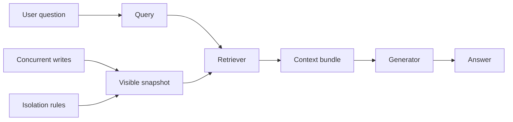
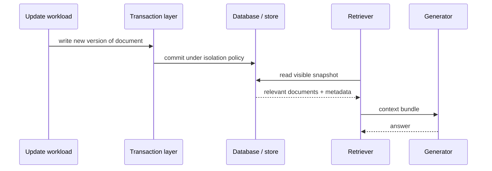
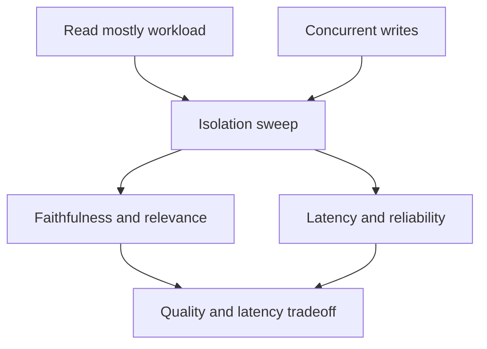

# When Retrieval Meets ACID: Why Database Visibility Changes RAG Quality

**Status**: Submission Candidate  
**Version**: 1.1  
**Last Updated**: 2026-08-21  
**Target Venue**: Towards Data Science

## Abstract

If you have built or evaluated a RAG system, you already know the familiar story: retrieve relevant context, then ask the model to answer. It sounds clean. In real systems, though, that story hides an important problem.

The data visible to the retriever can change while the answer is being composed, and that change can affect quality even when the model itself does not change. If your retrieval layer and your write path share the same database, then the answer depends not only on model quality, but also on which snapshot of the data was visible at query time.

That is the central idea of this article: in database-native RAG, answer quality is not just a retrieval or prompting problem. It is also a visibility problem.

And if you think about knowledge exchange between models and systems, the same insight becomes even more obvious. A good knowledge-sharing architecture does not just move information around. It ensures that everyone is reasoning over a consistent, well-defined, and auditable state. In that sense, the link to OKF-style knowledge exchange is natural: the real challenge is not only how knowledge is propagated, but which version of the truth is being propagated.

### Key Terms

A few technical concepts are worth defining up front:

- RAG, or Retrieval-Augmented Generation, is a pattern in which a model first retrieves relevant documents or passages and then uses them to answer a question.
- ACID is a classic database guarantee: Atomicity, Consistency, Isolation, and Durability. In plain English, it means transactional updates are reliable, recoverable, and protected from partial or conflicting writes.
- Snapshot isolation means a transaction reads a stable, point-in-time view of the database. It avoids seeing half-committed or mid-update state.
- MVCC, or Multi-Version Concurrency Control, is a concurrency strategy in which the database keeps multiple versions of data instead of overwriting everything in place. This makes reads and writes more efficient under concurrent activity.
- ReadCommitted and Serializable are different isolation policies. ReadCommitted is a weaker guarantee that only sees committed data; Serializable is much stricter and aims to prevent anomalies such as phantom reads or write skew.

These terms are not just database jargon. They describe the operational conditions under which the model is making decisions.

## Questions This Article Answers

If you keep only a few questions in mind while reading, make them these:

1. What happens to answer quality when the retriever and the database are reading from the same live, changing state?
2. Why is transaction visibility part of the RAG quality story, instead of just a backend optimization detail?
3. What does it mean in practice to combine hybrid retrieval with transactional control?
4. How should you think about the trade-off between answer consistency and latency under concurrent writes?
5. Why does this matter for knowledge exchange between models and systems, not just for a single LLM call?

If those questions matter to you, then the rest of the article is directly relevant.

## Why This Story Matters

If you are building or evaluating a RAG pipeline, you probably already know this pattern: the retrieval system looks good, the model looks good, and the output still feels a little off. That is often not a model failure. It is usually a state-visibility problem.

Most RAG articles focus on embeddings, retrieval quality, or prompt design. Those are important, but they do not explain this common failure mode: a system can look healthy at the component level and still answer from a slightly stale or inconsistent view of the world.

This happens when we treat three concerns as separate:

- the transaction layer,
- the retrieval layer, and
- the generation layer.

In practice, they are coupled. If the database is changing underneath the retriever, the context bundle sent to the model may not reflect the same snapshot that the application or user expects.

This is where database-native RAG stops being a pure ML story and becomes a systems story.

The figure is simple but important: the answer depends on the visible snapshot, not only on the model.

## A Useful Mental Model

Think of RAG as an interaction between two clocks:

- the model clock, which is concerned with what the model knows and how it reasons,
- the database clock, which is concerned with what is committed, visible, and consistent.

If these clocks are not aligned, the model may answer from stale facts, partial views, or context assembled across inconsistent updates.

This is not an abstract concern. It matters for the kinds of systems you are probably building or designing right now:

- internal document copilots,
- AI assistants over enterprise systems,
- retrieval pipelines over evolving knowledge bases,
- multi-agent or multi-model knowledge exchange systems.

In all of these, the question is not only “what should the model know?” but also “what version of the data was actually visible when the model reasoned?”

## ThemisDB as a Concrete Example

This is where ThemisDB becomes useful. It already combines a real retrieval pipeline with a real transaction engine.

On the retrieval side, the repository exposes hybrid retrieval, context assembly, quality gates, ingestion bridging, and prompt-injection protection. On the transaction side, it exposes ReadCommitted, Snapshot, Serializable, MVCC, SAGA, and distributed 2PC support.

That combination makes it possible to discuss a database-native RAG architecture without relying on a hypothetical system. The same engine that manages transactional visibility can also shape the retrieval context that reaches the LLM.

This matters because the design becomes concrete rather than conceptual:

- the RAG layer decides what to retrieve and how to assemble context,
- the transaction layer decides what is visible and consistent,
- the model layer decides how to answer.

Here, “visible and consistent” is the key phrase. In database terms, consistency means the system is operating over a coherent state that matches the chosen isolation policy. If two parts of the retrieval pipeline read from different versions of the same data, the final answer can become internally inconsistent even when each downstream component is individually correct.

They are separate responsibilities, but they are not independent in practice.

The sequence makes the core point visible. Retrieval is not a passive read from a static corpus; it is a read from a live state with semantics.

## Where Knowledge Exchange Fits In

The same idea connects naturally to knowledge exchange between models. In frameworks that emphasize collaborative or federated knowledge transfer, the problem is not only how information moves, but also whether the receiving model is reasoning over the same conceptual state as the source.

This is the link to the OKF-style perspective: shared understanding requires more than passing around messages. It needs a stable and interpretable shared substrate. If you are thinking about how models exchange knowledge, you should also be thinking about which state they are exchanging it from.

A model-to-model exchange system is more robust when it has:

- explicit visibility semantics,
- versioned state,
- clear provenance,
- consistent retrieval boundaries,
- and explicit treatment of stale or contradictory information.

In other words, knowledge exchange is stronger when it is not just “model A tells model B something,” but “model A and model B are operating over the same state, with understood constraints and traceability.”

That is exactly where a transactional database becomes useful. It turns knowledge from a fuzzy stream into a governed state.

## Why Isolation Matters for RAG Quality

The most obvious quality issue in RAG is not that the model is bad. It is that the model is answering from the wrong evidence set.

This can happen in several ways, and it is easier to see when you think of your system as a live database rather than a static corpus:

- retrieval reads partially committed updates,
- the retriever sees a different version than the user expects,
- results are assembled from inconsistent document snapshots,
- concurrent writes cause answer drift while the model is still reasoning.

In a long-lived system, these effects become operationally important. The LLM is being asked to answer a question based on a moving target.

This is where isolation policy becomes part of the quality story.

A strict visibility model may reduce inconsistency, but it may also increase latency. A weaker model may be faster, but it can answer from a less trustworthy view of the world. In database language, the trade-off is between stronger isolation guarantees and higher coordination cost. The right question is therefore not “which isolation level is best in general?” but “which operating point matches the workload?”

This figure captures the design tension. Stronger consistency can improve answer quality, but only at some cost in responsiveness and operational reliability.

## A Simple Experiment Shape

This article does not need to present a full benchmark report to be credible. It can describe an experiment that is both realistic and easy to understand:

1. Run the same query set under a mostly read-only workload.
2. Then re-run it under concurrent writes.
3. Compare answer quality and system cost across isolation levels such as ReadCommitted and Snapshot.
4. Measure quality signals such as faithfulness and relevance, alongside latency and reliability metrics.

The key outcome is not a single winner. It is a trade-off curve:

- stronger visibility can improve answer consistency,
- but higher guarantees can also increase p95 or p99 latency,
- and reliability signals like retries, aborts, and timeouts matter too.

That is a better story for a general audience than claiming that one isolation setting “solves” RAG.

## Why This Fits Towards Data Science

This topic fits Towards Data Science because it sits at the intersection of three familiar themes:

- database semantics,
- model behavior,
- and practical system design.

The narrative is simple and intuitive: a model answers questions using context retrieved from a live database, and the database can change under the model’s feet while the answer is being assembled.

That is a compelling story because it makes a real engineering lesson visible:

If retrieval and updates share the same system, then isolation is not a low-level database concern. It becomes part of the product experience.

This makes the article useful to builders who are working on document assistants, enterprise copilots, or knowledge-heavy applications. The point is not that ACID magically fixes LLM quality. The point is that the “visible state” in a database-backed RAG system is part of the answer quality contract.

## The Main Takeaway

The strongest formulation of the idea is this:

If you are building a RAG system, do not only ask which documents were retrieved. Ask which version of the database was actually visible when those documents were fetched.

That is the difference between a system that looks smart and a system that is reliably grounded.

And that is why RAG quality is not just a matter of which documents are retrieved. It is also a matter of which version of the database was visible when those documents were retrieved.

That is why database-native RAG is more than a software architecture trend. It is a way of treating knowledge as a governed, inspectable, and versioned state rather than as a loose collection of vectors and prompts.

And that is also why the connection to knowledge exchange between models is so promising: a shared knowledge ecosystem is more useful when everyone is reasoning over the same well-defined state, not merely responding to the latest floating signal.

## Conclusion

This article intentionally avoids overclaiming. It does not say that a single database design solves every RAG problem. It does not claim universal benchmark superiority. It stays grounded in what the repository already supports: hybrid retrieval, context assembly, quality gates, transaction control, and explicit isolation semantics.

The central claim is simpler and more useful:

Once retrieval and updates are part of the same transactional system, visibility becomes part of the answer quality story. And once you recognize that, you start thinking differently about how knowledge is exchanged, versioned, and trusted.

That is the right abstraction for a readable, practical, and technically grounded TDS article.
