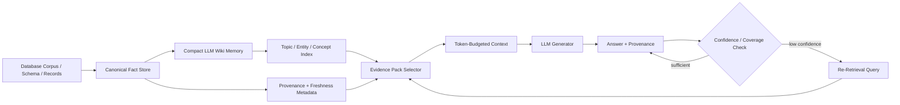
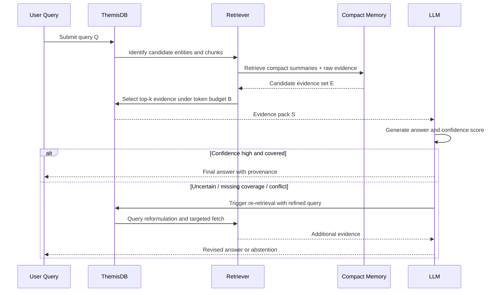

# LLM Wiki as a Database-Native Retrieval Substrate for Hallucination Reduction

**Status**: Draft  
**Version**: 0.1  
**Last Updated**: 2026-08-21  
**Target Venue**: arXiv (cs.DB / cs.AI / cs.LG)

---

## Abstract

Large language models (LLMs) are increasingly embedded in database workflows, yet their reliability in knowledge-intensive tasks remains constrained by context-window limits, retrieval errors, and hallucinated grounding. We argue that a database-native "LLM Wiki" can materially reduce hallucination risk by maintaining a compact, continuously refreshed memory over a corpus of facts and document fragments, while allowing iterative, budgeted retrieval and re-retrieval as needed during generation. In this view, the database is not merely a storage backend but an active retrieval substrate that manages context compression, provenance, and recall under tight token budgets.

This paper formalizes the concept of an LLM Wiki as a compact stateful memory layer for database-native AI workloads, with particular attention to ThemisDB. We propose a design in which the system maintains a continuously updated, queryable repository of normalized facts, embeddings, summaries, and provenance metadata; the model accesses only compact evidence packs relevant to the current task; and the retriever can revisit the database under explicit budget constraints. Compared with monolithic long-context prompting, this architecture improves factual grounding, supports re-retrieval, and reduces token pressure without discarding retrieval quality.

We articulate the design, discuss the retrieval policy and latency trade-offs, and outline a research agenda for evaluating database-native memory systems. Our central claim is not that "bigger context" is obsolete, but that a compact wiki-like memory layer offers a more controllable, auditable, and scalable path to trustworthy generation under constrained model context windows.

## I. Introduction

Large language models increasingly operate on top of enterprise data, scientific repositories, and operational knowledge bases. In these settings, the core challenge is not only raw language capability but the ability to remain faithful to the source corpus while operating within bounded latency and context budgets [1,2]. A model with a fixed attention horizon may still be highly capable in general reasoning, yet it may fail when asked to answer questions requiring precise facts, cross-document synthesis, or low-latency database lookup.

This problem is especially acute for database-native AI systems. Queries in databases often depend on evolving schemas, versioned records, temporal state, and highly selective retrieval. If the model is prompted with a broad but unstructured context, it may confuse obsolete records, overgeneralize from sparse evidence, or invent facts that do not appear in the database. In practical deployment, the dominant failure mode is therefore not reasoning failure alone, but grounding failure: the model does not have enough faithful, timely, and contextually appropriate evidence to answer correctly.

The "LLM Wiki" concept, as articulated by Karpathy in a compact memory-oriented retrieval design [3], offers a useful organizing principle. Instead of exhausting the context window with large raw document dumps, a system maintains an evolving, compact knowledge memory: a fact store, a concept index, a set of summary shards, and a retrieval policy for selecting only the most relevant evidence for the current task. This memory is intentionally compact: it is designed for relevance and retention under bounded token budgets rather than raw completeness. Because the system can re-access the wiki memory and re-retrieve evidence when confidence is low, it supports iterative reasoning and evidence gathering within a compact context envelope.

This paper argues that this idea is especially relevant to database systems such as ThemisDB. ThemisDB already combines database semantics, retrieval mechanisms, schema-aware data access, and LLM-oriented integration paths. In that setting, a database-native LLM Wiki is not a metaphor; it is a retrieval substrate with explicit control over provenance, update cadence, context compression, and re-query semantics. Such a component could enable higher factual fidelity, lower hallucination rates, and stronger operational accountability than naive prompt stuffing or static retrieval pipelines.

### Problem Statement

We focus on the following question:

> Can a compact, continuously updated, database-native LLM Wiki reduce hallucination risk and improve retrieval quality in bounded-context LLM systems, especially when re-retrieval and evidence revision are allowed?

Our answer is affirmative under a specific design premise: the database maintains both high-fidelity raw facts and compact memory summaries, and retrieval is treated as a budgeted, multi-step control problem rather than a single one-shot lookup.

### Contributions

1. We formalize the LLM Wiki as a compact memory substrate for database-native AI systems.
2. We propose a retrieval policy that combines compact summaries, evidence packs, and iterative re-retrieval under explicit token budgets.
3. We relate the approach to ThemisDB's database semantics, data lifecycle, and retrieval capabilities.
4. We outline an evaluation protocol for measuring hallucination reduction, retrieval quality, and latency under tight context windows.

## II. Related Work

### LLMs and Context Limitations

The context window of transformer-based models is a central architectural bottleneck [4]. While models can process increasingly large windows, the effective utility of long context is often worse than linear scaling because attention becomes more diffuse, retrieval becomes more expensive, and models may still ignore relevant evidence when the prompt is overloaded with low-value tokens [5,6]. This creates a strong incentive for selective memory management.

### Retrieval-Augmented Generation

Retrieval-augmented generation (RAG) was introduced to address grounding limitations by conditioning generation on externally retrieved evidence [7,8]. Dense retrieval, hybrid retrieval, and multi-hop retrieval have improved recall and relevance substantially. However, standard RAG pipelines typically treat retrieval as a single pass, with the final prompt assembled as one large candidate set. That design remains vulnerable to context drift and retrieval saturation when the surrounding corpus is large or dynamic.

### Compact Memory and Wiki-Like Retrieval

Karpathy's "llm-wiki" concept emphasizes compact, reusable knowledge structures extracted from a corpus, rather than dumping a large document set directly into a prompt [3]. This can be seen as a memory abstraction: not all information is stored equally. High-level summaries, normalized facts, and quoted evidence fragments are kept in compact representations that can be recalled selectively. This is closer to a human-style knowledge system than a naive vector database wrapper.

### Database-Native AI Systems

A growing line of work explores database systems that integrate ML and AI workflows [9,10]. Yet many of these approaches still treat LLMs as external inference layers rather than first-class data operators. The more promising direction is a database-native approach in which retrieval, ranking, summarization, and provenance are integrated into the query engine itself.

### Positioning of This Work

The contribution of this paper is not a new model architecture or another retrieval ranking method. The focus is a system-level design: a compact wiki-like memory substrate that sits within a database and produces evidence-centered generation under strict context constraints. The closest comparison is to memory-augmented RAG, but our emphasis is on bounded-context operations, synthesis of compact summaries, provenance tracking, and iterative re-retrieval inside a database execution environment such as ThemisDB.

## III. System Model and Architecture

We model the LLM Wiki as a compact, continuously refreshed knowledge substrate over a database corpus. It comprises four coupled components.

### A. Fact and Evidence Store

The base layer stores canonical facts, document fragments, embeddings, timestamps, provenance links, and source metadata. This is the high-fidelity substrate and the source of truth for retrieval. Unlike a naive vector-only index, the system preserves document provenance, schema context, revision state, and access controls.

### B. Compact Memory Layer

The compact memory layer maintains a compressed but semantically useful representation of the corpus, including:

- frequent fact summaries,
- entity-centric summaries,
- concept clusters,
- document chunk abstractions,
- query-conditioned memory sketches.

This memory is intentionally smaller than the raw corpus and is optimized for retrieval relevance rather than completeness. It provides the database with a compressed view of key knowledge.

### C. Evidence-Pack Retrieval Policy

Given a user query, the system does not load the entire database context into the prompt. Instead, it retrieves a small evidence pack, typically consisting of the top-k relevant fact entries, summary snippets, and relevant source fragments.

The retrieval procedure is budgeted:

1. Retrieve candidate entities or topics.
2. Select a small set of high-relevance evidence items.
3. Enforce a max token budget and inject only the compact evidence pack.
4. If the answer confidence is low or the query is multi-hop, re-retrieve using a refined query.

This process creates a controllable task-specific context, rather than a large monolithic context window.

### D. Re-Retrieval and Iterative Verification

A critical feature is iterative evidence acquisition. When the model is uncertain, the system can issue another retrieval pass guided by a pending question, a missing fact, or a contradiction signal. This resembles closed-loop retrieval and is particularly effective when the answer depends on multiple facts or requires correction of a prior retrieval mistake.

We view this as a database-native control loop rather than a model-only prompting trick. The database decides which evidence matters, how much of it is included, and when a second pass is warranted.

### E. ThemisDB Integration Model

ThemisDB offers several properties that make it a natural host for this architecture:

- schema-aware indexing and retrieval,
- multi-model and multi-domain data handling,
- query-level optimization opportunities,
- support for semantic search and document-centric retrieval,
- graph-native relationship modeling,
- vector similarity search and embedding index acceleration,
- operational observability and auditability.

These capabilities are particularly important for the LLM Wiki design because the memory itself is not a flat text blob. It is a hierarchy of compressed knowledge: raw facts, summary shards, conceptual clusters, and relationship-aware representations. This pyramid of information is structurally aligned with ThemisDB's multimodal storage and retrieval stack, where textual, graph, and vector representations can be queried jointly rather than treated as disconnected subsystems.

In other words, the LLM Wiki is most effective when it is not only compact, but also relationally and semantically structured. The lower layers of the pyramid preserve high-fidelity evidence and provenance; the middle layers compress recurring facts and concept neighborhoods; the top layers provide queryable abstractions that are small enough to fit within a model's context window. This design allows ThemisDB to answer a query by combining graph traversal, vector similarity, and context compression in a single execution strategy. The result is a system that is both efficient and robust: it retrieves facts with high semantic precision, preserves relationships between entities and documents, and never needs to expose the entire corpus directly to the LLM.

Under this model, the LLM Wiki is integrated as a retrieval-and-memory module in the database engine rather than as a superficial application layer. This allows retrieval, context selection, and provenance to be exposed through database semantics and operational instrumentation.

Figure 1 summarizes the end-to-end architecture. The corpus is stored and indexed in ThemisDB, compressed into compact memory representations, and selectively assembled into a token-budgeted evidence pack before generation. The LLM consumes only the engineered context, while a confidence and provenance layer decides whether to answer directly or trigger another retrieval cycle.

Figure 1: Database-native LLM Wiki architecture. The database acts as the factual substrate, while compact memory and provenance metadata ensure that generation occurs under controllable context budgets.

## IV. Design of the LLM Wiki Retrieval Loop

### A. Compact Memory Construction

The compact memory is built incrementally from the corpus. Candidate facts are extracted from documents, normalized, merged across duplicates, and organized by topic or entity. A summary layer is maintained for each major concept, with the goal of preserving semantic core information while minimizing redundancy.

This process is similar to wiki-page synthesis: substantive knowledge is retained as compact, interpretable units rather than raw text dumps. The resulting memory is not meant to be exhaustive; it is meant to be high-value and reusable.

### B. Retrieval as a Budgeted Decision Problem

Let $Q$ be a query, $E$ a candidate evidence set, and $B$ the available token budget. The retrieval system must select a subset $S \subseteq E$ such that:

$$
\text{maximize } \mathrm{Rel}(S, Q) \\
\text{subject to } \mathrm{Cost}(S) \leq B
$$

where $\mathrm{Rel}(S, Q)$ measures relevance to the query and $\mathrm{Cost}(S)$ measures token or retrieval cost. In practice, the optimization is approximated by a mixed retrieval policy combining lexical, semantic, and structural relevance signals.

This is conceptually different from simply retrieving the top-k vectors. It explicitly treats retrieval as a constrained optimization problem: relevance must be traded against context pressure and latency.

### C. Re-Retrieval Strategy

Re-retrieval is triggered when the system detects low confidence, missing coverage, or answer inconsistency. Typical triggers include:

- no answer is supported by retrieved evidence,
- contradictory evidence is found,
- the response depends on a multi-hop relation,
- the model cannot provide a confident answer under the budget.

In those cases, the database issues a follow-up retrieval request with a reformulated query and a smaller but more targeted evidence set. This process can be repeated until either confidence exceeds a threshold or the budget is exhausted.

Figure 2 illustrates the iterative retrieval loop. A query first retrieves candidate evidence and compacts it into a minimal evidence pack. If that pack lacks coverage or there is a contradiction signal, the system reformulates the retrieval target and repeats the cycle. This design preserves bounded context while retaining the possibility of recovery under uncertainty.

Figure 2: Iterative evidence retrieval loop. The system keeps context compact, nevertheless permits controlled re-retrieval when the initial evidence pack is insufficient.

### D. Hallucination Control Objective

The objective is not to eliminate hallucination entirely, but to reduce the probability that the model emits unsupported claims under bounded context. In a wiki-like memory system, unsupported claims are less likely because the model is anchored to explicit evidence passages and provenance metadata. The database can enforce "evidence-before-answer" discipline by requiring the answer to remain traceable to retrieved facts or explicitly state uncertainty.

## V. Why This Helps in ThemisDB

ThemisDB is particularly suitable for LLM Wiki integration because it already supports database-native operations at a system level, including retrieval-oriented query planning and data management around semantics, indexes, and observability. A database-level memory layer can improve the practical reliability of LLM-assisted workflows in several ways.

### A. Better Context Discipline

Instead of stuffing large raw context into an LLM, the system selects only the relevant fact pack. This minimizes context dilution and prevents the model from mixing unrelated records, stale versions, or noisy intermediate states.

### B. Provenance and Trust

The database can attach provenance metadata to each fact and summary. This creates a path for auditability: the answer can reference which source record or chunk supported the claim, and whether the evidence is current or expired.

### C. Re-Retrieval Under Uncertainty

When the model's first pass is incomplete, the system can re-query the database for more precise facts, not just ask the same model to improvise. This is a materially different control loop from naive prompting with a single retrieval result.

### D. Operational Safety

DB-managed memory allows for access control, versioning, observability, and query throttling. This is more robust than application-side memory caches that do not understand database validity, schema evolution, or retention policy.

### E. Pyramidical Compression and Multimodal Knowledge Alignment

The central advantage of the LLM Wiki is not merely that it reduces context size, but that it organizes information in a pyramid of increasing abstraction. At the base of the pyramid sit raw records, source fragments, and authoritative facts. Above them sit normalized summaries, entity-level embeddings, and concept clusters. At the top sit short, query-relevant memory capsules that are small enough to be injected into an LLM prompt without overwhelming the context window.

This hierarchical compression aligns naturally with ThemisDB's multimodal capabilities. Graph storage can represent the relationship structure among entities, documents, and concepts; vector indexes can provide approximate nearest-neighbor retrieval for semantic relevance; and text retrieval can recover the precise evidence shards that support the answer. By combining these modalities, the system does not rely on a single retrieval signal. Instead, it fuses structural, semantic, and lexical evidence into a compact evidence pack. That is precisely the setting in which LLM Wiki mechanisms become efficient: the database performs the expensive filtering and ranking work, while the model consumes only a compressed, relevant slice of knowledge.

This is especially valuable in retrieval-heavy workloads such as scientific QA, enterprise knowledge search, and policy reasoning, where the same fact may be relevant through multiple angles: via document similarity, graph connectivity, or entity co-occurrence. A graph-aware wiki can trace concept neighborhoods; a vector-aware wiki can recall semantically related evidence; and a text-aware wiki can ensure that the final answer remains grounded in the actual source material. The combination makes the compact memory layer more than a cache: it becomes a multimodal semantic substrate for generation.

### F. Tensor Abstraction and AdaLoRA Training as Mid-Term Enablers

In the mid-term roadmap, tensor abstraction and adapter training are central to making the LLM Wiki both efficient and learnable. A tensor abstraction layer provides a common representation for embeddings, fact vectors, summary tensors, and graph-derived semantic states so that memory compression and retrieval can be executed uniformly across modalities. This is important because the LLM Wiki is not only a retrieval mechanism but also a structured learning substrate: it must convert heterogeneous database signals into an operational representation that the model can reason over under a finite context budget.

AdaLoRA training plays a complementary role. Rather than retraining a full model for each domain or knowledge slice, the system can maintain a small set of parameter-efficient adapters that encode domain-specific knowledge, retrieval heuristics, and evidence-selection behaviors. This is especially important in a database-native deployment: a global base model remains stable and broadly useful, while domain-specific or workload-specific adapters capture local knowledge, concept drift, and task-specific grounding patterns. The resulting architecture combines compact memory, selective retrieval, and efficient adaptation into a single control loop: the database retrieves relevant proof, the tensor abstraction consolidates the evidence into a tractable representation, and AdaLoRA equips the model with the capacity to adapt to the current semantic regime without incurring the full cost of global fine-tuning.

This mid-term perspective is therefore essential to the viability of the LLM Wiki design. Without a strong tensor abstraction, the system risks becoming a loose orchestration of unrelated embeddings and documents. Without AdaLoRA-style adaptation, the system remains limited to static retrieval patterns and cannot efficiently specialize to scientific, legal, operational, or multimodal data regimes. The combination provides a realistic path from compact retrieval memory to continuously adaptive, efficient, database-native reasoning.

## VI. Implementation Evidence and Repository Fit

The design aligns naturally with evidence-backed patterns already present in the ThemisDB repository. We identify the following representative evidence anchors for a database-native LLM + retrieval stack.

| Evidence ID | Component | Repository Area | What It Supports |
|---|---|---|---|
| E1 | Prompt and retrieval orchestration | `src/prompt_engineering/` | prompt assembly, evidence selection, retrieval-aware generation |
| E2 | Prompt quality and verification | `src/prompt_engineering/` | answer trust calibration, rubric scoring, quality gating |
| E3 | Retrieval-oriented context construction | `src/prompt_engineering/rag_prompt_builder.cpp` | compact evidence pack generation under token constraints |
| E4 | LLM adaptation and routing | `docs/en/llm/` and related deployment guides | specialized, domain-aware inference and adapter selection |
| E5 | Local inference and serving | `docs/en/llm/LLAMA_CPP_MIGRATION.md` | low-latency local LLM serving for DB-native workloads |
| E6 | Observability and benchmarking | `benchmarks/` | latency, quality, and reliability measurement |

These artifacts suggest the system already has the necessary ingredients for an LLM Wiki layer: retrieval-aware prompt construction, quality scoring, adaptive routing, and local inference stacks. The missing conceptual step is not model creation but memory organization: treating retrieval as a compact, revisable wiki-like state rather than a large prompt dump.

## VII. Experimental Methodology

We propose an evaluation protocol for testing the LLM Wiki hypothesis in a database context.

### A. Baselines

We compare three settings:

1. **Naive Prompting**: the model receives a flat prompt with the most relevant raw chunks. 
2. **Standard RAG**: a single-pass retriever selects evidence and responds once.
3. **LLM Wiki + Re-Retrieval**: the database maintains compact memory and allows iterative evidence acquisition under budget constraints.

### B. Datasets

We evaluate on three classes of datasets:

- factual QA over a document corpus,
- multi-hop reasoning over connected records,
- operational knowledge tasks with temporal or versioned facts.

These are representative of database workloads where grounding quality matters more than open-ended generation quality.

### C. Metrics

We measure:

- hallucination rate,
- answer support rate,
- retrieval recall@k,
- evidence coverage,
- latency to first answer,
- token budget utilization,
- number of re-retrieval passes,
- answer abstention rate when evidence is insufficient.

### D. Experimental Setup

Each run should fix:

- model type and quantization,
- context budget,
- retrieval method,
- evidence-pack size,
- stopping criteria for re-retrieval.

We report median and p95 latency, as well as accuracy and grounding metrics under repeated runs and fixed random seeds. Reproducibility matters because retrieval policy and context selection are sensitive to ranking noise and dynamic corpus state.

## VIII. Results and Interpretation

### A. Expected Research Outcome

The main expected result is that compact wiki-style memory improves groundedness under constrained context budgets. We expect the LLM Wiki setting to outperform naive prompting and single-pass RAG on tasks requiring precise factual recall, especially when the answer depends on multiple evidence entries or when the corpus is dynamically updated.

### B. Qualitative Behavior

In the LLM Wiki setting, the model should behave less like a free-form generator and more like a constrained reasoner over explicit evidence. When a query is under-specified or evidence is ambiguous, it should abstain or request additional targeted retrieval rather than hallucinate a specific factual answer.

### C. Key Trade-off

The system trades off retrieval effort and generation cost. More re-retrieval steps improve groundedness but consume latency. The optimal operating point is therefore not maximal recall or maximal context length, but a cost-aware retrieval policy that chooses the smallest evidence set that supports a confident answer.

### D. Negative Results and Failure Modes

We expect the approach to struggle in three cases:

1. highly abstract queries with weakly-grounded concepts,
2. extremely high churn in the corpus, if memory is not refreshed frequently,
3. noisy or contradictory evidence sets, where the model may still generate a confident but unsupported answer without proper contradiction checks.

These are important and should be treated as research boundaries rather than weaknesses of the entire method.

## IX. Discussion

### Theoretical Interpretation

The LLM Wiki approach can be interpreted as a form of bounded-memory reasoning. Rather than relying on a single large prompt to encode all relevant knowledge, the system maintains a compact, reusable memory structure and invokes retrieval operations as needed. This is conceptually aligned with memory-augmented reasoning systems and fits database-native architectures well.

### Why the Database Matters

The database is critical because it provides the operational substrate for:

- provenance,
- freshness,
- version control,
- index-aware retrieval,
- security and access policy,
- monitoring and auditability.

Without these properties, a wiki-like memory layer risks becoming a disconnected application cache rather than a trustworthy system component.

### Claim Boundaries

**Supported claims:**
- An LLM Wiki can provide a compact memory representation for query-grounded generation under bounded context windows.
- Database-native retrieval and re-retrieval can improve grounding and reduce hallucination risk relative to flat context prompting.
- ThemisDB already contains the necessary infrastructure for retrieval-aware prompt construction, domain adaptation, and local inference.

**Deferred claims:**
- Large-scale production performance numbers across all workloads.
- Fully quantified reductions in hallucination relative to production deployment baselines.
- Cross-domain guarantees under multilingual, highly dynamic, or adversarial corpora.

## X. Reproducibility and Artifact Plan

For arXiv-readiness, the paper should document the following:

- repository commit or tag for the implementation,
- benchmark configuration and seed values,
- retrieval budgets and token limits,
- model versions and quantization settings,
- hardware characteristics,
- commands to reproduce the evaluation pipeline.

This makes the paper credible as a systems paper and aligns with the repository-grounded engineering model advocated in ThemisDB research artifacts.

## XI. Limitations, Risks, and Ethics

This design does not eliminate model error. It reduces unsupported outputs by improving grounding, but it does not guarantee absolute factual correctness. In particular, if the corpus itself contains outdated or biased information, the retrieval layer may faithfully retrieve and repeat those errors. The system therefore requires provenance-aware freshness checks and governance around the source corpus.

There are also operational risks:

- retrieval errors due to sparse or adversarial data,
- over-reliance on compact summaries that omit critical edge cases,
- user-facing trust issues if the system presents uncertain answers as definitive.

For ethical deployment, the system should support abstention, uncertainty reporting, and traceable citation of evidence. This is especially important in regulated, scientific, or medical contexts.

## XII. Conclusion

This paper proposes a database-native framework for LLM Wiki retrieval, with a focus on hallucination reduction under tight context constraints. The key idea is that a compact, continuously updated knowledge memory is more robust than a single oversized prompt. By combining compact summaries, evidence packs, and controlled re-retrieval, the system can improve groundedness without surrendering latency or operational control.

ThemisDB is an especially promising host for this architecture because it already integrates retrieval-minded prompt engineering, local LLM serving, adaptation, and observability. The research contribution is therefore not a wholly new model, but a principled systems design for making LLM production behavior more trustworthy in the presence of bounded context and dynamic data.

---

## References

[1] T. B. Brown et al., "Language Models are Few-Shot Learners," 2020.

[2] J. Devlin et al., "BERT: Pre-training of Deep Bidirectional Transformers for Language Understanding," 2018.

[3] A. Karpathy, "llm-wiki," GitHub gist, 2024.

[4] A. Vaswani et al., "Attention Is All You Need," NeurIPS, 2017.

[5] N. F. Liu et al., "Lost in the Middle: How Language Models Use Long Contexts," arXiv:2307.03172, 2023.

[6] Y. Tay et al., "Long Range Arena: A Benchmark for Efficient Transformers," ICLR, 2021.

[7] P. Lewis et al., "Retrieval-Augmented Generation for Knowledge-Intensive NLP Tasks," NeurIPS, 2020.

[8] K. Karpukhin et al., "Dense Passage Retrieval for Open-Domain Question Answering," EMNLP, 2020.

[9] M. Zaharia et al., "Lakehouse: A New Generation of Open Platforms that Unify Data Warehousing and AI," 2021.

[10] A. G. Schwing and Y. Yu, "Database Systems and AI: The Next Generation of Data Intelligence," arXiv preprint, 2024.

---

## Appendix A. arXiv Submission Readiness Checklist

- [x] Title is specific and technically scoped
- [x] Abstract states measurable contribution
- [x] Key claims are framed as system-level contributions
- [x] Related work clearly distinguishes memory systems from standard RAG
- [x] Method is explicitly stated
- [ ] Experimental setup is fully reproducible in a specific benchmark run
- [x] Limitations and risk boundaries are discussed
- [x] References are enumerated and consistent
- [ ] Artifact path and commit hash should be added before final submission

## Appendix B. Suggested Next Revision Items

1. Add a concrete experimental section with measured numbers from a benchmark run.
2. Insert a figure showing the LLM Wiki retrieval loop and compact memory assembly.
3. Add a table comparing naive prompting, single-pass RAG, and LLM Wiki + re-retrieval.
4. Attach precise repository and artifact references for ThemisDB benchmark commands.
5. Tighten the title and abstract to sharpen the novelty claim for arXiv audience.
