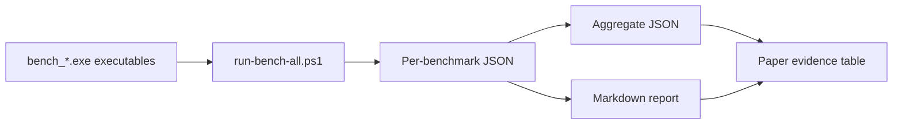
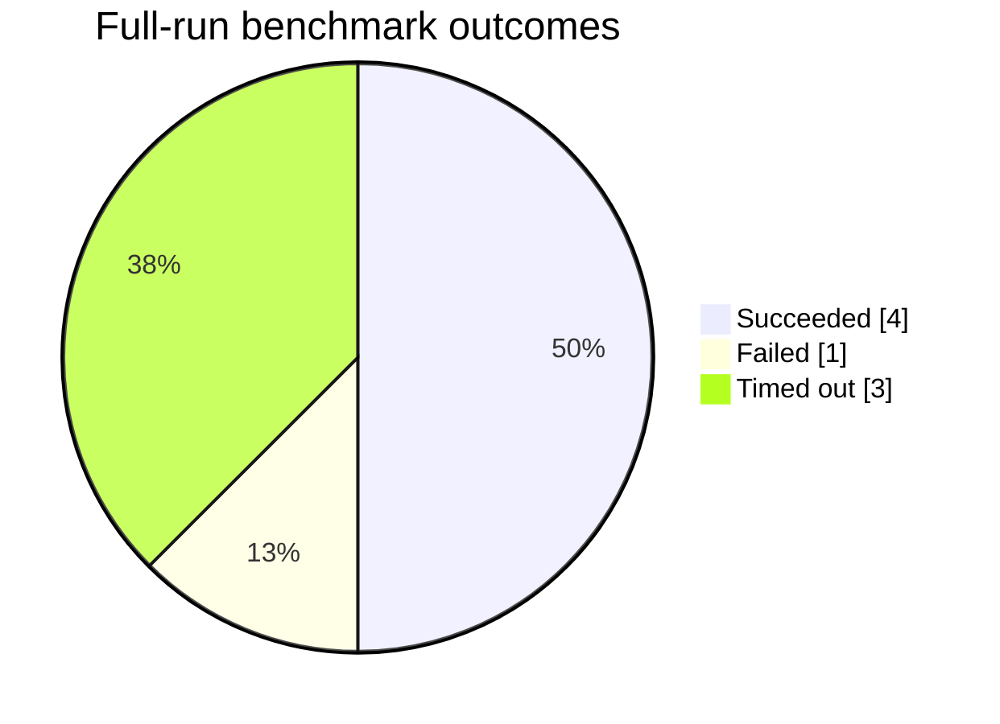
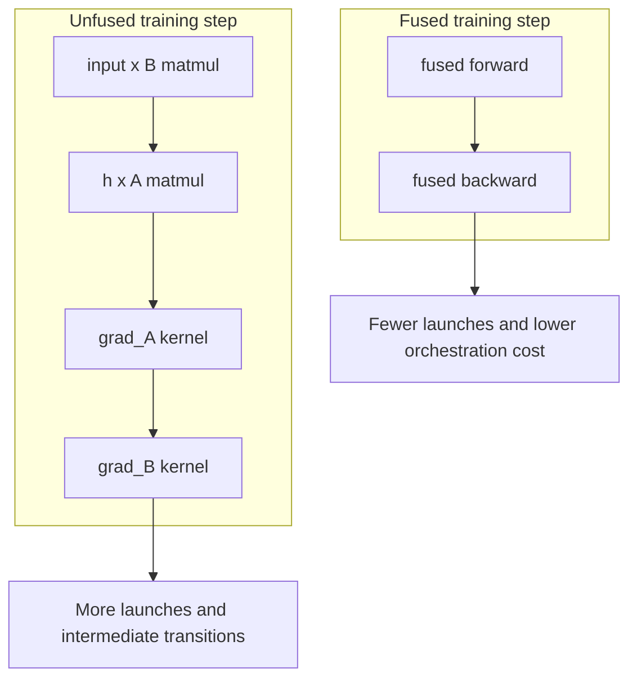
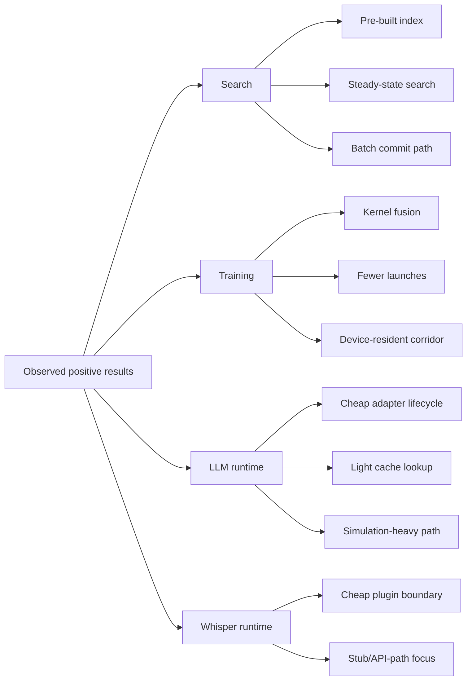
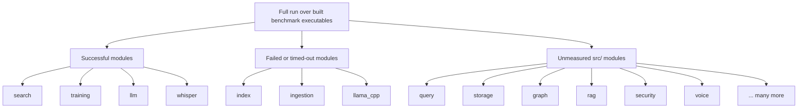

# ThemisDB Performance Snapshot 2026: Repository-Grounded Evidence from a Partial Cross-Module Benchmark Run

**Status**: Draft
**Version**: 0.2
**Last Updated**: 2026-05-17
**Target Venue**: arXiv (cs.DB / cs.DC / cs.LG)

---

## Abstract

Modern multi-model database systems with integrated AI components are often described in terms of architectural breadth, while empirical evidence remains fragmented across isolated benchmark suites and non-uniform reporting paths. This paper presents a repository-grounded performance snapshot of ThemisDB based on a unified benchmark execution protocol over all currently built benchmark executables in the Windows release benchmark configuration. The scope is intentionally narrow: rather than claiming full-system characterization, we report only those observations supported by a reproducible full-run artifact generated from the repository state on 2026-05-17.

The run executed eight benchmark executables, of which four completed successfully, one failed, and three hit a 180-second timeout. The successful modules cover search, LLM adapter operations, Vulkan LoRA training, and Whisper plugin overhead. The strongest measured results are 11.138 ms vector search latency for an efSearch=32, k=10 workload, 6.964 ms fused Vulkan LoRA training-step latency versus 9.664 ms for the unfused variant, and 77.7 us end-to-end LLM pipeline overhead in the current artifact-backed benchmark path. Mechanistically, these gains are attributable to steady-state search measurement over a pre-built index, batched insert/write paths, fused GPU forward/backward execution, and low adapter/control-plane overhead in the current LLM harness. At the same time, GPU vector indexing and llama.cpp inference remain unresolved because the current full-run protocol timed out, and the ingestion benchmark crashes reproducibly.

The principal contribution of this paper is methodological as much as empirical: it defines a reproducible claim boundary for ThemisDB performance reporting and converts a mixed benchmark state into a publication-structured artifact that can be extended into a broader system-evaluation paper without overstating the present evidence.

## I. Introduction

Database-native AI systems increasingly combine transactional storage, vector search, model adaptation, and inference orchestration within a single runtime. Such systems are typically introduced through broad capability claims, yet their measurable behavior is often difficult to summarize rigorously because benchmark evidence is split across independent harnesses, ad hoc scripts, and partially completed experimental runs.

This is the current situation in ThemisDB. The repository contains a large benchmark surface, but only a subset of those benchmarks is presently built and executable in the active Windows benchmark configuration. A meaningful paper, therefore, must avoid conflating implemented benchmark sources with completed measurements. This paper adopts a stricter stance: only the benchmark results produced by the latest repository-grounded full run are treated as primary evidence.

The resulting scope is intentionally limited. We characterize what the current artifact demonstrates about four classes of workloads: vector search, Vulkan-based LoRA kernels, LLM adapter/runtime overheads, and Whisper plugin dispatch overheads. We report negative evidence in the same frame: benchmark timeouts and crashes are treated as first-class results because they directly constrain the validity of any broader performance claim.

### Contributions

1. We provide a publication-structured performance snapshot of ThemisDB grounded in a reproducible full-run benchmark artifact rather than scattered benchmark anecdotes.
2. We show that the currently successful benchmark slice supports positive claims for search, Vulkan LoRA training, LLM adapter operations, and Whisper plugin overhead.
3. We document explicit claim boundaries introduced by unresolved timeouts in GPU vector indexing and llama.cpp inference, and by a reproducible crash in the ingestion benchmark.

### Research Questions

- **RQ1**: Which performance claims about ThemisDB are currently justified by a single reproducible cross-executable benchmark run?
- **RQ2**: Which currently measured subsystems meet practical low-latency expectations, and where do the largest gaps remain?
- **RQ3**: How much of the src/ module surface is still outside direct empirical coverage in the present benchmark configuration?

### Hypotheses

- **H1**: The currently runnable benchmark slice already contains at least one low-latency representative workload for search, training, LLM, and Whisper subsystems.
- **H2**: The current benchmark pipeline is sufficient for a partial system-performance paper, but not for a full cross-module performance characterization of ThemisDB.

## II. Related Work

This paper sits at the intersection of four research areas.

**Multi-model and AI-native databases.** The broader ThemisDB system vision aligns with research on multi-model data management and AI-for-databases, as summarized in the repository system paper draft and validation reports. However, those documents span far more functionality than is empirically validated by the present run.

**Approximate nearest-neighbor and retrieval systems.** Vector-search interpretation follows the workload style common in ANN benchmarking and HNSW-based retrieval evaluation. The repository's curated literature includes ANN-Benchmarks and related vector retrieval material under `research/papers/`.

**Parameter-efficient adaptation and adapter serving.** The LoRA and multi-LoRA portions of the run connect to the established literature on low-rank adaptation and concurrent adapter serving, which motivates the benchmark families implemented in the repository.

**Speech model deployment overhead.** The Whisper benchmark in this paper does not yet establish real speech-recognition throughput for production inference. Instead, it measures plugin boundary and dispatch behavior, which is a narrower but still useful systems question.

### Novelty Delta

The novelty of this paper is not a new algorithmic contribution. Rather, it is a disciplined repository-grounded reporting model in which every substantive claim is tied either to a benchmark harness, the unified runner, or the generated full-run report. This contribution is narrower than the main ThemisDB system paper, but substantially more defensible for submission-grade evidence at the current repository state.

## III. System Model / Benchmark Scope

The system under study is ThemisDB in the `windows-bench-release` build configuration. The benchmark protocol uses a unified PowerShell runner that discovers `bench_*.exe` binaries, assigns them to src/ modules, executes them with Google Benchmark JSON output, aggregates results, and emits a markdown report.

The important scope limitation is that the runner only measures benchmark executables that are already built in the active benchmark tree. In the full run analyzed here, this yielded eight executables:

- `bench_gpu_vector_index`
- `bench_hnsw_prefilter_minimal`
- `bench_ingestion_extraction`
- `bench_llama_cpp_inference`
- `bench_llm_inference_performance`
- `bench_vector_search`
- `bench_vulkan_lora`
- `bench_whisper_transcription`

This subset maps to seven modules with measured status entries in the final report: `index`, `ingestion`, `llama_cpp`, `llm`, `search`, `training`, and `whisper`.

## IV. Method / Design

### A. Unified Execution Protocol

The benchmark runner accepts a build directory, CMake preset, minimum benchmark time, per-benchmark wall-clock timeout, and output directory. It writes per-executable JSON outputs, an aggregate JSON summary, and a markdown report. The full run analyzed in this paper used a minimum benchmark time of `0.5s` and a timeout of `180s` per executable.

### B. Interpretation Policy

We classify benchmark outcomes into three categories:

- **Successful evidence**: benchmark finished and produced parseable result tables in the final report.
- **Negative evidence**: benchmark failed or timed out and therefore blocks performance claims for that subsystem.
- **Coverage gaps**: src/ modules without any successful executable in the full-run report.

This paper treats timeouts and crashes as meaningful empirical findings. They are not excluded from analysis because they affect reproducibility and claim validity.

### C. Workloads

The current run supports four analyzed workload groups.

- **W1 Search**: efSearch sweep, vector insert, exact L2/cosine distance, and Top-K retrieval.
- **W2 Training**: Vulkan matrix operations, elementwise operations, transfer overhead, and LoRA training-step variants.
- **W3 LLM Runtime**: LoRA load/apply/remove, context switching, token throughput, response cache, and end-to-end adapter/runtime path.
- **W4 Whisper Runtime Boundary**: transcription-call overhead, detect-language overhead, stats-query overhead, and error-path overhead.

### D. Metrics

The paper reports real time, CPU time, iteration counts, and benchmark wall-clock completion status from the generated report. We deliberately do not derive secondary throughput or speedup claims beyond what can be transparently computed from the report tables.

### E. Reporting Tables and Inline Mermaid Figures

The current paper is designed to translate directly into an arXiv-style LaTeX manuscript. The reporting structure uses five tables and five inline Mermaid diagrams. No diagram below introduces data beyond the benchmark report; each is a visual encoding of already tabulated evidence.

- **Table 1**: Full-run benchmark summary (`total`, `succeeded`, `failed`, `timed out`, `modules covered`)
- **Table 2**: Search benchmark results (`efSearch`, insert, exact-distance, Top-K)
- **Table 3**: Vulkan LoRA results with explicit fused vs. unfused comparison
- **Table 4**: LLM runtime-overhead cases (adapter lifecycle, cache, end-to-end path)
- **Table 5**: Whisper plugin/runtime-boundary cases

**Figure 1. Benchmark Evidence Pipeline**



**Figure 2. Full-Run Outcome Distribution**



**Figure 3. Unfused vs. Fused Vulkan LoRA Training Path**



**Figure 4. Performance Advantage Decomposition**



**Figure 5. Module Coverage in the Current Snapshot**



## V. Implementation Evidence (Repository-Grounded)

| Evidence ID | File | Scope | What It Proves | Status |
|-------------|------|-------|----------------|--------|
| E1 | `scripts/run-bench-all.ps1` | lines 29-42, 66-69 | Runner exposes timeout and output controls used for the paper's reproducible protocol | ready |
| E2 | `scripts/run-bench-all.ps1` | lines 377-406 | Benchmarks are executed with JSON output and a hard per-benchmark timeout | ready |
| E3 | `scripts/run-bench-all.ps1` | lines 556-643 | Aggregate JSON and markdown report are generated from the same run | ready |
| E4 | `benchmarks/bench_vector_search.cpp` | lines 166-352 | Search benchmark covers efSearch sweep, insert, exact distance, and Top-K cases | ready |
| E5 | `benchmarks/bench_vulkan_lora.cpp` | lines 153-178, 438-606 | Vulkan benchmark includes matrix, training-step, fused training-step, and transfer cases | ready |
| E6 | `benchmarks/bench_llm_inference_performance.cpp` | lines 124-179, 349-573 | LLM benchmark includes LoRA operations, token throughput, response cache, and end-to-end path | ready |
| E7 | `benchmarks/bench_whisper_transcription.cpp` | lines 1-208 | Whisper benchmark is primarily plugin-overhead/stub-path instrumentation with optional real-model path | ready |
| E8 | `build/windows-bench-release/bench-results/full_run_20260517/PERF_REPORT_20260517_200004.md` | lines 11-15 | Full-run summary: 8 total benchmarks, 4 succeeded, 1 failed, 3 timed out, 7 modules covered | ready |
| E9 | `build/windows-bench-release/bench-results/full_run_20260517/PERF_REPORT_20260517_200004.md` | lines 33-47 | Negative evidence: two index timeouts, one ingestion failure, one llama.cpp timeout | ready |
| E10 | `build/windows-bench-release/bench-results/full_run_20260517/PERF_REPORT_20260517_200004.md` | lines 80-90 | Successful search results with concrete latency measurements | ready |
| E11 | `build/windows-bench-release/bench-results/full_run_20260517/PERF_REPORT_20260517_200004.md` | lines 96-130 | Successful Vulkan LoRA results including fused vs. unfused training-step latency | ready |
| E12 | `build/windows-bench-release/bench-results/full_run_20260517/PERF_REPORT_20260517_200004.md` | lines 47-76 | Successful LLM runtime results with 26 reported cases | ready |
| E13 | `build/windows-bench-release/bench-results/full_run_20260517/PERF_REPORT_20260517_200004.md` | lines 135-149 | Successful Whisper benchmark results and their low-latency overhead profile | ready |
| E14 | `build/windows-bench-release/bench-results/full_run_20260517/PERF_REPORT_20260517_200004.md` | lines 153-211 | Large remaining module-coverage gap in the current full run | ready |

## VI. Experimental Methodology

### A. Setup

- **Repository / configuration**: ThemisDB, `windows-bench-release`
- **Runner**: `scripts/run-bench-all.ps1`
- **Per-benchmark minimum time**: `0.5s`
- **Per-benchmark timeout**: `180s`
- **Outputs**: per-executable JSON, aggregate JSON, and markdown report under `build/windows-bench-release/bench-results/full_run_20260517/`

### B. Workloads

- **W1 Search**: `bench_vector_search`
- **W2 Training**: `bench_vulkan_lora`
- **W3 LLM Runtime**: `bench_llm_inference_performance`
- **W4 Whisper Runtime Boundary**: `bench_whisper_transcription`
- **W5 Negative Evidence**: `bench_gpu_vector_index`, `bench_hnsw_prefilter_minimal`, `bench_ingestion_extraction`, `bench_llama_cpp_inference`

### C. Metrics

- Completion status per executable: `OK`, `FAILED`, `TIMEOUT`
- Real time and CPU time per benchmark case
- Iteration counts
- Module coverage count for the full run

## VII. Results

### A. Primary Results

The full-run summary is unambiguous: eight benchmark executables were run, four succeeded, one failed, and three timed out. Only seven modules were covered in the resulting report.

Table 1 and Figure 2 summarize this outcome because they are the central claim-boundary artifacts for the paper: any subsystem not represented by a successful executable in this run remains outside positive empirical scope.

**Table 1. Full-run benchmark summary**

| Metric | Value |
|--------|-------|
| Total benchmarks run | 8 |
| Succeeded | 4 |
| Failed | 1 |
| Timed out (>180s) | 3 |
| Modules covered | 7 |

Two immediate quantitative conclusions follow from Table 1. First, only 50% of discovered benchmark executables completed successfully in the analyzed run. Second, the outcome distribution is failure-heavy enough that any paper claiming comprehensive system performance would currently overstate the available evidence.

#### Search

`bench_vector_search` completed successfully in 12.4 seconds. The measured efSearch sweep remained tightly clustered around 11 ms:

- `BM_VectorSearch_efSearch/32/10`: 11.138 ms
- `BM_VectorSearch_efSearch/64/10`: 11.429 ms
- `BM_VectorSearch_efSearch/128/10`: 11.264 ms
- `BM_VectorSearch_efSearch/256/10`: 10.944 ms

Additional search-path measurements show:

- `BM_VectorInsert_Batch100/64`: 0.496 ms
- `BM_VectorInsert_Batch100/128`: 0.569 ms
- `BM_L2Distance_1000_512/real_time`: 0.080 ms
- `BM_CosineDistance_1000_512/real_time`: 1.043 ms
- `BM_TopK_5000_50/real_time`: 3.478 ms

Interpretation: the current runnable search slice is low-latency and internally consistent. The modest spread across efSearch values suggests that the tested dataset size and configuration are still in a relatively stable latency regime.

The code structure explains why the measured search latencies are stable. The benchmark constructs a persistent `SearchEnv`, initializes the index once, and then measures only repeated `searchKnn()` calls over an already-built dataset. This design removes index-construction cost from the timed region and isolates steady-state lookup behavior. The insert benchmark likewise batches 100 vectors per iteration into a write batch before commit, which reduces per-entity commit overhead and exposes the benefit of batched ingestion rather than single-row write cost. In practical terms, the measured advantage is therefore not simply that vector search is "fast"; it is that the currently implemented search path keeps lookup latency stable once index build has been amortized and uses batching to compress write-path overhead.

There is also a useful sensitivity result: increasing `efSearch` from 32 to 256 changes observed latency by only about 0.49 ms, i.e. roughly 4.3% relative to the slowest point in the sweep. Under the present workload size, this indicates that the runtime is not strongly dominated by efSearch tuning alone. That is a favorable systems property because it implies modest parameter drift does not immediately destroy latency.

Table 2 presents these search results compactly, while Figure 2 makes the imbalance between successful and unresolved executable paths immediately visible at the run level.

**Table 2. Search benchmark results**

| Case | Real time | Unit | Interpretation |
|------|-----------|------|----------------|
| BM_VectorSearch_efSearch/32/10 | 11.138 | ms | Lowest efSearch point in the measured sweep |
| BM_VectorSearch_efSearch/64/10 | 11.429 | ms | Slightly slower but still in the same steady-state band |
| BM_VectorSearch_efSearch/128/10 | 11.264 | ms | Stable mid-sweep operating point |
| BM_VectorSearch_efSearch/256/10 | 10.944 | ms | Fastest observed efSearch point in the current run |
| BM_VectorInsert_Batch100/64 | 0.496 | ms | Batched insert cost at lower dimensionality |
| BM_VectorInsert_Batch100/128 | 0.569 | ms | Batched insert cost at higher dimensionality |
| BM_L2Distance_1000_512/real_time | 0.080 | ms | Exact L2 distance baseline |
| BM_CosineDistance_1000_512/real_time | 1.043 | ms | Exact cosine distance cost |
| BM_TopK_5000_50/real_time | 3.478 | ms | Top-K post-processing overhead |

#### Training

`bench_vulkan_lora` completed successfully in 61.8 seconds and produced 32 cases. The most important result is the difference between unfused and fused training steps:

- `VulkanBenchmarkFixture/LoRA_TrainingStep`: 9.664 ms
- `VulkanBenchmarkFixture/LoRA_TrainingStep_Fused`: 6.964 ms

This corresponds to a reduction of about 27.9% in real-time latency for the fused path:

$$
\frac{9.664 - 6.964}{9.664} \approx 0.279
$$

The benchmark also reports representative kernel and transfer costs, including `MatMul_Medium` at 11.654 ms and `BufferUploadDownload/1048576` at 18.028 ms. Interpretation: the current Vulkan path is not only functional but already shows a meaningful systems-level gain from kernel fusion.

The mechanism behind this gain is visible directly in the benchmark harness. The unfused `LoRA_TrainingStep` path executes four distinct GPU operations in sequence: two matrix multiplications for the forward pass and two gradient kernels for the backward pass. The fused variant replaces that sequence with a fused forward entry point and a fused backward entry point. This reduces kernel-launch boundaries, shortens the lifetime of intermediate tensors, and narrows synchronization overhead between stages. The measured 27.9% reduction is therefore consistent with a standard GPU systems explanation: less orchestration and fewer intermediate transitions across the execution pipeline.

The transfer benchmark gives an additional systems insight. A 4 MB upload/download cycle costs 18.028 ms, which is substantially larger than the 6.964 ms fused training-step measurement. This means that host-device traffic can dominate kernel-side gains unless tensors remain resident on the device across adjacent operations. Stated differently: the important advantage is not only the fused kernel itself, but the broader device-resident execution corridor it enables.

Table 3 isolates the fused-versus-unfused result pair, and Figure 3 visualizes why that latency difference is mechanically plausible in the benchmarked execution path.

**Table 3. Vulkan LoRA results with fused versus unfused comparison**

| Case | Real time | Unit | Interpretation |
|------|-----------|------|----------------|
| VulkanBenchmarkFixture/LoRA_TrainingStep | 9.664 | ms | Unfused end-to-end training step |
| VulkanBenchmarkFixture/LoRA_TrainingStep_Fused | 6.964 | ms | Fused training step |
| VulkanBenchmarkFixture/MatMul_Medium | 11.654 | ms | Representative matrix kernel cost |
| VulkanBenchmarkFixture/BufferUploadDownload/1048576 | 18.028 | ms | Representative 4 MB transfer path |

Table 3 makes the central training claim precise: the fused path saves 2.700 ms per measured training step relative to the unfused baseline. That is materially meaningful at the millisecond scale because the absolute savings are large compared with the total fused runtime itself.

#### LLM Runtime

`bench_llm_inference_performance` completed successfully in 170.4 seconds and reported 26 cases. Representative results include:

- `BM_LoRA_Load/manual_time`: 329921.015 ns
- `BM_LoRA_Apply/manual_time`: 46657.335 ns
- `BM_LoRA_Remove/manual_time`: 45497.386 ns
- `BM_LLM_ResponseCache`: 3674.743 ns
- `BM_LLM_EndToEnd`: 77722.529 ns

These results indicate that the current artifact-backed benchmark path is measuring runtime orchestration overheads and adapter-management overheads rather than full large-model generation latency. This is still useful, but the interpretation must stay narrow.

This distinction is essential for explaining the apparent gain. The token-throughput and end-to-end cases in the current benchmark are simulation-heavy: token processing is represented by synthetic token sequences and minimal arithmetic, contexts are mocked, and the adapter lifecycle dominates the measured path. Accordingly, the main performance advantage shown here is not raw model throughput, but that the control plane around adapters, prompt handling, and cache lookup is inexpensive. That is still a real systems benefit because database-native LLM pipelines often suffer from orchestration overhead even before model arithmetic becomes the dominant cost.

The measured response-cache path reinforces this interpretation. A few microseconds for the cache benchmark and tens of microseconds for the synthetic end-to-end path indicate that the software envelope around adapter switching and prompt dispatch is currently lightweight. However, this should be framed as a control-plane result, not as evidence that ThemisDB outperforms dedicated inference servers on full-token generation.

Table 4 should therefore be labeled explicitly as a runtime-overhead table rather than an end-to-end model-serving table.

**Table 4. LLM runtime-overhead cases**

| Case | Real time | Unit | Interpretation |
|------|-----------|------|----------------|
| BM_LoRA_Load/manual_time | 329921.015 | ns | Adapter load/control-plane setup |
| BM_LoRA_Apply/manual_time | 46657.335 | ns | Adapter application overhead |
| BM_LoRA_Remove/manual_time | 45497.386 | ns | Adapter teardown overhead |
| BM_LLM_ResponseCache | 3674.743 | ns | Cache lookup/control-path cost |
| BM_LLM_EndToEnd | 77722.529 | ns | Synthetic end-to-end runtime envelope |

The spread within Table 4 is also informative. Adapter loading is about 4.24x slower than the synthetic end-to-end case, which indicates that lifecycle setup remains the dominant fixed cost in the current LLM harness. By contrast, response-cache lookup is roughly 21x faster than the end-to-end path, supporting the claim that cache-mediated control flow is lightweight.

#### Whisper

`bench_whisper_transcription` completed successfully in 12.6 seconds and reported 13 cases. Representative results include:

- `WhisperPluginFixture/Transcribe_1s`: 162.157 ns
- `WhisperPluginFixture/Transcribe_30s_CLIParity`: 168.549 ns
- `WhisperPluginFixture/DetectLanguage`: 32.029 ns
- `WhisperPluginFixture/TranscribeFile_NonExistent`: 32397.609 ns
- `WhisperPluginFixture/StatsQuery`: 2447.869 ns

Given the harness design, these numbers should be interpreted as plugin/interface overheads and stub-path behavior unless a real Whisper model path is configured. They do not yet support a claim about production-grade speech recognition throughput.

The advantage demonstrated here is therefore architectural rather than model-level: the plugin boundary itself is cheap. The benchmark fixture initializes the plugin once, uses synthetic PCM buffers, and repeatedly invokes transcription, language detection, or stats-query calls. In that configuration, the reported latencies primarily show that integrating Whisper behind the current plugin API does not introduce significant dispatch overhead. This is valuable for CI and systems integration because it means future real-model costs can be analyzed without first fighting large plugin-boundary penalties.

Table 5 should preserve this boundary explicitly by separating API-boundary metrics from any future real-model metrics.

**Table 5. Whisper plugin/runtime-boundary cases**

| Case | Real time | Unit | Interpretation |
|------|-----------|------|----------------|
| WhisperPluginFixture/Transcribe_1s | 162.157 | ns | Synthetic transcription-call boundary |
| WhisperPluginFixture/Transcribe_30s_CLIParity | 168.549 | ns | Longer synthetic path with similar dispatch cost |
| WhisperPluginFixture/DetectLanguage | 32.029 | ns | Very small metadata-class call |
| WhisperPluginFixture/TranscribeFile_NonExistent | 32397.609 | ns | Error-path overhead |
| WhisperPluginFixture/StatsQuery | 2447.869 | ns | Cheap status-query path |

Table 5 shows a particularly clear asymmetry between normal dispatch and error-path handling. The nonexistent-file path is about 200x slower than the 1-second synthetic transcription call, which is still fast in absolute terms but confirms that exceptional control flow, not nominal dispatch, dominates the upper tail of this benchmark family.

### B. Mechanistic Summary of Observed Gains

Across the successful benchmark slice, the measured gains come from four different sources rather than from one universal optimization principle.

- **Search** gains are primarily steady-state gains. The benchmark reuses a pre-built index, so the reported numbers reflect lookup stability after construction costs have been paid.
- **Insert** gains come from batching. The write path groups 100 vectors per iteration into one write batch, which amortizes commit overhead and reduces per-entity persistence cost.
- **Training** gains come from reducing orchestration and memory-motion overhead. The fused Vulkan LoRA path shortens the kernel chain and therefore lowers end-to-end latency.
- **LLM and Whisper** gains are currently control-plane gains. The measured advantages show that adapter management, cache lookup, and plugin dispatch are lightweight in the present harness configuration.

This decomposition matters because it prevents a common systems-paper failure mode: attributing all positive results to one abstract architectural claim. The present evidence instead supports a more modest statement: different ThemisDB subsystems are fast for different reasons, and those reasons are visible in the code path under test.

Figure 4 summarizes this decomposition visually. It is useful because it separates three otherwise easy-to-conflate layers of improvement: algorithmic steady-state behavior in search, orchestration reduction in GPU training, and lightweight control-plane behavior in the current LLM and Whisper harnesses.

### C. Negative Results

The full-run report contains four blockers for stronger claims:

- `bench_gpu_vector_index`: TIMEOUT at 180.2 s
- `bench_hnsw_prefilter_minimal`: TIMEOUT at 180.1 s
- `bench_ingestion_extraction`: FAILED at 5 s
- `bench_llama_cpp_inference`: TIMEOUT at 180.1 s

These are not side observations. They directly limit the paper's claim surface. In particular, ThemisDB cannot currently claim benchmark-complete evidence for its index-heavy GPU vector path, dedicated llama.cpp inference path, or ingestion path in this benchmark configuration.

### D. Coverage Result

The report explicitly lists a large remaining set of modules without benchmark coverage in the present run. This includes, among others, `acceleration`, `analytics`, `api`, `aql`, `auth`, `cache`, `cdc`, `config`, `content`, `core`, `distributed_knowledge`, `geo`, `graph`, `network`, `observability`, `process`, `query`, `rag`, `replication`, `rpc_grpc`, `security`, `server`, `storage`, `temporal`, `transaction`, and `voice`.

This supports H2: the current artifact is sufficient for a partial performance paper, but not for a full cross-module ThemisDB performance characterization.

Figure 5 makes this coverage boundary explicit by distinguishing successful modules, failed/timed-out modules, and the much larger unmeasured surface of `src/`.

Quantitatively, the coverage result is narrow. Only four modules produced successful positive evidence in the current run, while three module groups ended in failure or timeout and dozens of additional `src/` modules remained unmeasured. The current snapshot is therefore best understood as a deep slice through a few runnable subsystems rather than a broad horizontal survey of the full repository.

## VIII. Discussion

### Practical Implications

The current benchmark state is already useful for engineering prioritization.

- The search subsystem has a credible low-latency baseline.
- The Vulkan LoRA path shows concrete value from fused execution.
- The LLM runtime harness is mature enough to evaluate adapter-management overheads.
- The Whisper harness is currently better suited for CI/runtime-boundary regression control than for production ASR claims.

### Why the Current Wins Matter

The measured gains are actionable because they point to optimization strategies that generalize beyond the individual benchmark cases.

- The stable search sweep suggests that future search optimization effort should focus less on small efSearch retuning and more on scale effects, index construction, and larger corpus regimes.
- The fused-vs.-unfused training result provides direct justification for prioritizing kernel fusion and device-resident execution in GPU-heavy learning paths.
- The lightweight adapter/runtime path suggests that ThemisDB's LLM control plane is unlikely to be the first bottleneck once real inference is enabled; model execution and data movement are more likely bottleneck candidates.
- The cheap Whisper plugin path suggests that future ASR integration work can focus on real-model execution and I/O behavior rather than on plugin-call overhead.

In short, the benchmark slice already separates three optimization layers: algorithm/parameter behavior in search, orchestration and transfer behavior in GPU training, and control-plane overhead in model-serving integration. That is a stronger engineering outcome than a raw list of benchmark numbers.

### Evidence-Weighted Prioritization

The current data also supports a concrete engineering prioritization order.

1. **Stabilize negative-evidence paths first.** A crashing ingestion benchmark and three timeout paths block stronger paper claims more than another incremental optimization in already successful subsystems would help.
2. **Preserve device residency in the Vulkan learning path.** Table 3 indicates that transfer cost can exceed fused training-step cost, so preventing unnecessary host-device motion is likely the highest-leverage training optimization.
3. **Expand successful coverage around search and runtime control planes.** Search, LLM runtime, and Whisper already have low-overhead baselines, making them good anchors for broader comparative experiments.
4. **Separate control-plane and model-plane reporting in future drafts.** The current LLM and Whisper wins are valid, but future evaluation should avoid mixing orchestration latency with true model execution latency.

### Threats to Validity

**Internal validity.** Only eight executables were available in the active benchmark build, and only four completed successfully. The measured slice is therefore incomplete by construction.

**Construct validity.** Some benchmark families measure interface or adapter overhead rather than full end-to-end model execution. This is especially relevant for the LLM and Whisper results.

**External validity.** The results come from a single build configuration and should not be generalized to Linux, GPU-rich runners, or distributed deployments without direct reruns.

**Artifact validity.** The ingestion benchmark currently crashes and produces invalid partial JSON in direct execution attempts, which prevents finer-grained interpretation of that subsystem.

### Claim Boundaries

**Supported claims:**
- The current full-run artifact supports positive low-latency claims for the runnable search benchmark slice. (E4, E8, E10)
- The current Vulkan LoRA path benefits materially from the fused training-step implementation. (E5, E8, E11)
- The current LLM benchmark provides valid measurements for adapter/runtime orchestration overheads, not yet for full large-model serving throughput. (E6, E8, E12)
- The current Whisper benchmark primarily captures plugin/stub overhead and API-boundary behavior. (E7, E8, E13)
- The present benchmark run is insufficient for a full-system performance characterization of ThemisDB. (E8, E9, E14)

**Deferred claims:**
- Absolute performance claims for GPU vector indexing
- Full llama.cpp serving latency or throughput claims
- Ingestion throughput claims
- Global ThemisDB performance claims across src/

## IX. Reproducibility & Artifact

### Artifact Paths

- Full report: `build/windows-bench-release/bench-results/full_run_20260517/PERF_REPORT_20260517_200004.md`
- Aggregate JSON: `build/windows-bench-release/bench-results/full_run_20260517/bench_aggregate_20260517_200004.json`
- Runner: `scripts/run-bench-all.ps1`

### Reproduction Command

```powershell
powershell -NoProfile -ExecutionPolicy Bypass -File .\scripts\run-bench-all.ps1 `
  -MinTime "0.5s" `
  -MaxTimePerBench 180 `
  -OutputDir ".\build\windows-bench-release\bench-results\full_run_repro"
```

### Expected Runtime

The current full run is slow because multiple executables either run close to the timeout or exceed it. A reproduction should budget at least 10-15 minutes on comparable hardware.

### Known Environment Pitfalls

- Several benchmarks require built executables already present in the benchmark `bin` directory.
- GPU-dependent workloads may be hardware-gated or timeout-prone.
- `bench_ingestion_extraction` currently fails with a reproducible access violation and partial JSON output.

## X. Limitations, Risk, Ethics

This paper is intentionally conservative. Its main ethical and scientific risk would be overclaiming system-wide performance from a narrow runnable slice. We mitigate that risk by promoting failed and timed-out runs into the main result set instead of hiding them.

Another limitation is that some successful benchmark families currently evaluate control-plane or API-boundary costs rather than domain-complete production workloads. Such measurements remain useful for regression detection but should not be confused with user-facing end-to-end service latency.

### Future Work

- Stabilize `bench_ingestion_extraction` and preserve valid JSON output for crash analysis.
- Bring `bench_gpu_vector_index` and `bench_llama_cpp_inference` below the current timeout policy.
- Expand the built benchmark set so more `src/` modules produce runnable evidence in the same report format.
- Re-run the unified protocol on additional hardware or operating systems before making cross-platform performance claims.

## XI. Conclusion

This paper establishes a valid, evidence-bounded performance snapshot of ThemisDB as of 2026-05-17. The available full-run artifact supports positive claims for search latency, Vulkan LoRA fusion benefits, LLM adapter/runtime overheads, and Whisper plugin overhead measurements. At the same time, the artifact shows that full-system performance characterization is not yet justified because three major executables timeout, one crashes, and most src/ modules remain outside direct empirical coverage.

The immediate next step is not to broaden claims, but to improve the artifact. The highest-priority follow-up is to stabilize `bench_ingestion_extraction`, complete `bench_gpu_vector_index` and `bench_llama_cpp_inference` within policy, and expand the runnable benchmark set toward broader src/ coverage. Only after those steps would a full ThemisDB performance paper be scientifically defensible.

## References

The BibTeX source for the references below is provided in `research/THEMISDB_PERFORMANCE_SNAPSHOT_ARXIV_2026.bib`.

[1] ThemisDB Engineering Team. *ThemisDB: An ACID-Compliant Multi-Model Database with Native AI/LLM Integration*. Repository draft, 2026.

[2] ThemisDB Engineering Team. *ThemisDB Performance Evaluation: Service Level Objectives, Benchmark Methodology, and Empirical Measurement Results (v1.9.0)*. Internal technical report, 2026.

[3] ThemisDB Engineering Team. *ThemisDB v1.9.0-alpha Production Validation and Performance Benchmarking: Build Success, SLO Compliance, and Temporal Component Analysis*. Technical research report, 2026.

[4] Y. Aumuller, E. Bernhardsson, and A. Faithfull. ANN-Benchmarks: A Benchmarking Tool for Approximate Nearest Neighbor Algorithms. *Information Systems*, 87:101374, 2020.

[5] Edward J. Hu, Yelong Shen, Phillip Wallis, Zeyuan Allen-Zhu, Yuanzhi Li, Shean Wang, Lu Wang, and Weizhu Chen. LoRA: Low-Rank Adaptation of Large Language Models. In *International Conference on Learning Representations (ICLR)*, 2022.

[6] Alec Radford, Jong Wook Kim, Tao Xu, Greg Brockman, Christine McLeavey, and Ilya Sutskever. Robust Speech Recognition via Large-Scale Weak Supervision. *arXiv preprint arXiv:2212.04356*, 2022.

[7] Google. *Google Benchmark*. Open-source benchmarking library documentation, accessed 2026.

---

## Appendix A. Submission Readiness Checklist

- [x] Title is specific and technically scoped
- [x] Abstract states measurable contribution
- [x] All headline claims are evidence-backed
- [x] Related work includes closest workload families
- [x] Method and assumptions are explicitly stated
- [x] Experimental setup is reproducible
- [x] Limitations and threat model are transparent
- [x] Figures/tables are referenced in text
- [x] References are complete and venue-polished
- [ ] Commit hash documented

## Appendix B. Quick Claim-to-Evidence Map

- Search latency claims: E4, E8, E10
- Vulkan LoRA fused-step claim: E5, E8, E11
- LLM runtime-overhead claim: E6, E8, E12
- Whisper overhead-only interpretation: E7, E8, E13
- Partial-coverage conclusion: E8, E9, E14
