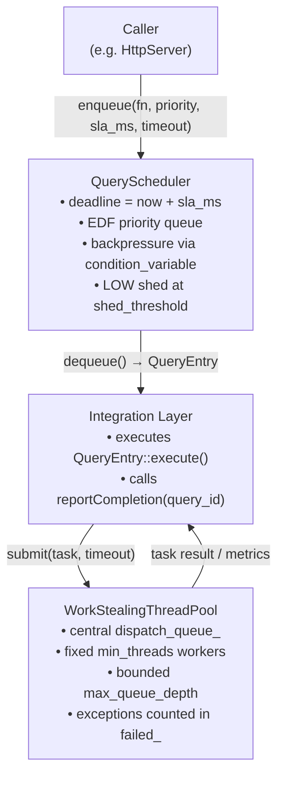
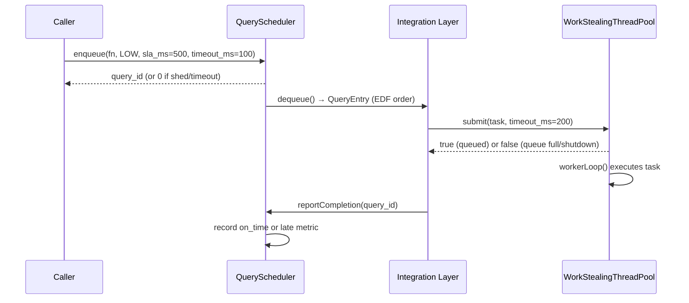

**Author:** ThemisDB Contributors  
**Created:** 2026-09-21  
**Last Updated:** 2026-09-22  
**Status:** active

# Execution Module — Architecture

## Kontext

The execution module is a small in-process runtime layer for bounded admission and bounded execution within ThemisDB. It sits between the server request path and the raw thread pool, providing deadline-ordered queueing with backpressure and low-priority shedding.

It is currently composed of:

1. `themis::execution::QueryScheduler` — admits work into a deadline-ordered queue.
2. `themis::resource::WorkStealingThreadPool` — runs submitted work on a fixed set of worker threads.

Despite the thread-pool type name, the live implementation currently operates as a **central-queue worker pool**. Per-thread queues exist only as reserved internal structure for future work-stealing work.

**Design Principles:**

1. **Bounded Admission:** callers must supply finite timeouts when waiting for queue capacity.
2. **Deterministic Ordering:** scheduler dequeue order is earliest-deadline-first with FIFO tie-breaking by query id.
3. **Fail-Closed Overload Handling:** low-priority scheduler entries are rejected once the shed threshold is reached; post-shutdown submissions are rejected.
4. **Graceful Teardown:** both execution primitives wake blocked waiters during shutdown and stop accepting new work.
5. **Minimal Shared State:** metrics are maintained in-memory behind small critical sections and atomics.

## Komponenten

### QueryScheduler

**Public surface:** `include/execution/query_scheduler.h`

**State:**
- `queue_`: `std::priority_queue<QueryEntry, ..., EarliestDeadlineFirst>`
- `pending_deadlines_`: maps query id to deadline for later SLA-completion accounting
- `count_high_`, `count_medium_`, `count_low_`: metric-only depth counters

**Behavioral contract:**
- `enqueue()` waits for `queue_.size() < max_queue_depth` until timeout.
- `enqueue()` assigns a new id, records the deadline, and returns that id on success.
- `dequeue()` waits for non-empty queue until timeout, then pops the earliest deadline entry.
- `reportCompletion()` increments completion counters and classifies whether the completion happened before the recorded deadline.
- `shutdown()` flips the shutdown flag and wakes enqueue/dequeue waiters.

**Important live-implementation notes:**
- `urgent_window_ms` and `default_sla_ms` are stored in `Config` but unused today.
- The comparator does not inspect `SLAPriority`; a LOW-priority query with a shorter SLA can still dequeue before a HIGH-priority query.
- No automatic expiry removal or cancellation exists for stale queue entries.

### WorkStealingThreadPool

**Public surface:** `include/execution/thread_pool_manager.h`

**State:**
- `dispatch_queue_`: central queue of pending `WorkItem`s
- `workers_`: worker threads created during construction
- `queued_count_`, `completed_`, `failed_`: atomically updated counters
- `latency_samples_us_`: bounded in-memory sample buffer used for p50/p99 snapshots

**Behavioral contract:**
- Construction pre-allocates per-thread queue objects up to `max_threads` and spawns exactly `min_threads` workers.
- `submit()` waits for queue capacity and then pushes into the shared dispatch queue.
- `tryGetWork()` currently reads **only** from `dispatch_queue_`; reserved per-thread queues are not yet a live data path.
- `workerLoop()` waits up to `idle_timeout_ms` for new work, executes it, and records completion/failure latency.
- `shutdown()` waits for the queue to drain, wakes all workers, joins them, and clears the worker list.

**Important live-implementation notes:**
- There is no elastic worker growth or shrinkage during steady-state execution.
- `idle_timeout_ms` is a wake-up cadence, not an idle-worker retirement threshold.
- `waitAll()` observes queue emptiness plus pending count; it does not inspect whether client code has externally observed the task side effects yet.

## Schnittstellen

| Interface / File | Role |
|---|---|
| `include/execution/query_scheduler.h` | Public API for deadline-ordered query admission, dequeue, and SLA metrics |
| `src/execution/query_scheduler.cpp` | Scheduler implementation with queue-depth backpressure and low-priority shedding |
| `include/execution/thread_pool_manager.h` | Public API for bounded task submission, drain/wait, statistics, and shutdown |
| `src/execution/thread_pool_manager.cpp` | Fixed-size worker pool implementation backed by a central dispatch queue |
| `include/server/http_server.h` | Instantiates both execution primitives under `THEMIS_EXECUTION_MODULE` |

## Datenfluss

The following diagram shows how a query moves from admission through execution:

**Kurzinterpretation:** A caller enqueues work through the `QueryScheduler`, which orders it by absolute deadline. The integration layer dequeues entries and forwards tasks to the `WorkStealingThreadPool` for execution. Metrics flow back through both layers.

## Sequenz (kritischer Ablauf)

The following sequence shows a successful bounded execution under overload:

**Kurzinterpretation:** Admission and execution are separated. Overload at the scheduler sheds LOW-priority work before it reaches the pool. Overload at the pool returns `false` to the integration layer.

## Fehlerpfade und Resilienz

| Failure case | Current behavior |
|---|---|
| scheduler full before caller timeout | `enqueue()` returns `0` after timeout |
| scheduler shut down | `enqueue()` returns `0`; `dequeue()` returns `false` once the queue is empty |
| scheduler overload beyond shed threshold | incoming LOW-priority item is rejected and `total_shed_` increments |
| thread-pool queue full before caller timeout | `submit()` returns `false` |
| task throws exception | worker catches the exception, increments `failed_`, and continues servicing later work |
| thread-pool shutdown | new submissions are rejected; workers are woken and joined |

**Concurrency model:**

- `mutex_` protects scheduler queue contents, per-priority counters, latency sums, and deadline map updates.
- `enqueue_cv_` / `dequeue_cv_` wake blocked producers and consumers respectively.
- `dispatch_mutex_` protects the thread-pool `dispatch_queue_`.
- `capacity_cv_` / `dispatch_cv_` wake blocked submitters and workers respectively.
- `latency_mutex_` protects the rolling latency sample buffer.

## Nicht-Ziele

- distributed query ownership, remote queue handoff, or sharded execution
- cooperative cancellation or deadline-based eviction of queued work
- priority inheritance, starvation prevention buckets, or learning-based reprioritization
- dynamic runtime thread-count management
- automatic SLA-expiry removal for already-queued entries
- per-worker deque population and active work stealing (reserved for future work)

## Verweise

| Module | Integration point | Current state |
|---|---|---|
| `server` | `include/server/http_server.h`, `src/server/http_server.cpp` | Instantiates `QueryScheduler` and `WorkStealingThreadPool` under `THEMIS_EXECUTION_MODULE` |
| integration tests | `tests/integration/test_load_balancing.cpp`, `tests/integration/test_resource_pooling.cpp` | Active focused regression coverage |
| stress / benchmark evidence | `tests/execution/test_execution_highcardinality_stress.cpp`, `benchmarks/execution/bench_execution_dedicated_gates.cpp` | Active Wave-D and benchmark evidence |

- [`README.md`](README.md) — module overview, quickstart, and known limitations
- [`ROADMAP.md`](ROADMAP.md) — delivery status and phased plan
- [`FUTURE_ENHANCEMENTS.md`](FUTURE_ENHANCEMENTS.md) — planned upgrades
- [`PERFORMANCE_EXPECTATIONS.md`](PERFORMANCE_EXPECTATIONS.md) — benchmark-linked targets
- [`PRODUCTION_REQUIREMENTS.md`](PRODUCTION_REQUIREMENTS.md) — deployment configuration
