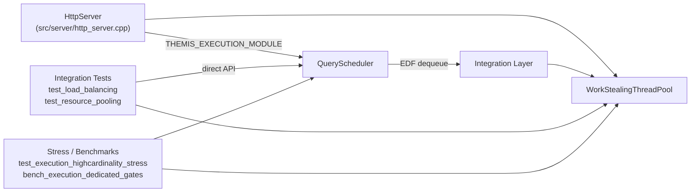

**Author:** ThemisDB Contributors  
**Created:** 2026-09-21  
**Last Updated:** 2026-09-22  
**Status:** active

# Execution Module

## Zweck

The execution module provides two bounded runtime primitives that higher-level components can compose for in-process execution control:

- `themis::execution::QueryScheduler` implements a thread-safe earliest-deadline-first queue with backpressure, low-priority shedding, and SLA-completion metrics.
- `themis::resource::WorkStealingThreadPool` executes submitted work on a fixed worker set behind a bounded central dispatch queue.

The current implementation is intentionally compact and deterministic. It does **not** yet implement elastic worker scaling or per-worker dequeue stealing, even though the thread-pool type keeps those extension points reserved in its public contract.

## Scope

In scope:
- bounded query admission with timeout-based backpressure
- deadline-ordered dequeue with FIFO tie-breaking for equal deadlines
- low-priority shedding once the configured shed threshold is reached
- fixed worker execution with bounded task queueing
- graceful shutdown and lightweight runtime metrics

Out of scope in the current implementation:
- dynamic priority promotion or fairness buckets
- cancellation of already-enqueued queries or tasks
- elastic worker creation/retirement during steady-state execution
- true per-worker deque population and active work stealing
- cross-node or distributed execution coordination

## Quickstart (Build/Run)

The execution module is built as part of the main ThemisDB library. To include it, enable the `THEMIS_EXECUTION_MODULE` CMake option:

```bash
cmake -S . -B build -DTHEMIS_EXECUTION_MODULE=ON
cmake --build build --target themisdb
```

To run the focused integration tests:

```bash
ctest --test-dir build -R "test_load_balancing|test_resource_pooling" -V
```

To run the Wave-D stress test and dedicated benchmarks:

```bash
ctest --test-dir build -R "test_execution_highcardinality_stress" -V
./build/benchmarks/execution/bench_execution_dedicated_gates
```

## API/CLI Einstieg

The module exposes two public headers:

**`include/execution/query_scheduler.h`** — `themis::execution::QueryScheduler`
```cpp
// Enqueue work with a 500 ms SLA and 100 ms admission timeout
auto id = scheduler.enqueue(my_task, SLAPriority::MEDIUM, 500, 100);
// Dequeue the next entry (earliest deadline first)
QueryEntry entry;
bool ok = scheduler.dequeue(entry, /*timeout_ms=*/200);
// Report completion for SLA metrics
scheduler.reportCompletion(id);
```

**`include/execution/thread_pool_manager.h`** — `themis::resource::WorkStealingThreadPool`
```cpp
// Submit a task with a 100 ms queue-wait timeout
bool accepted = pool.submit([]{ /* work */ }, /*timeout_ms=*/100);
// Wait for all queued tasks to complete
pool.waitAll(/*timeout_ms=*/5000);
// Retrieve runtime statistics
auto stats = pool.getStatistics();
```

## Integrationsueberblick

The following diagram shows how the execution module integrates with the server and test layers:



**Kurzinterpretation:** The `HttpServer` owns both primitives and coordinates their shutdown. Integration tests exercise each primitive directly against its public API. Stress tests and benchmarks validate Wave-D capacity and dedicated gate thresholds.

## Runtime Behavior and Limits

### QueryScheduler
- `enqueue()` returns `0` when the scheduler is shutting down, when capacity does not free up before the caller timeout, or when a LOW-priority entry is shed at/above `Config::shed_threshold`.
- Dequeue order is driven by the computed absolute deadline first and by monotonically increasing query id second; the `SLAPriority` label is tracked for metrics and shedding decisions, not for a separate priority bucket implementation.
- `Config::urgent_window_ms` and `Config::default_sla_ms` remain reserved compatibility fields in the current implementation and are not consulted by `enqueue()` or `dequeue()`.
- SLA compliance metrics are only meaningful when callers invoke `reportCompletion()` for executed query ids.

### WorkStealingThreadPool
- The pool starts `Config::min_threads` workers during construction and keeps them alive until shutdown.
- `Config::max_threads` currently bounds internal queue allocation and clamps `min_threads`; it does not trigger elastic worker growth at runtime.
- `submit()` blocks until queue capacity is available or the caller timeout expires.
- `waitAll()` polls for an empty dispatch queue and zero pending-item count; it does not guarantee that completed tasks reported their own higher-level side effects.
- Worker task exceptions are caught, counted in `Statistics::failed`, and do not terminate the pool.

## Integration Notes

- `src/server/http_server.cpp` and `include/server/http_server.h` instantiate both execution primitives when `THEMIS_EXECUTION_MODULE` is enabled.
- Scheduler and thread-pool shutdown are coordinated during `HttpServer` teardown.
- The current integration initializes the primitives and exposes them to the server, but request-level query submission/wiring remains higher-level integration work.

## Known Limitations

1. The scheduler does not remove or cancel already-enqueued entries after SLA expiry; deadlines influence ordering and completion accounting, not automatic eviction.
2. The thread pool uses a shared dispatch queue only; the reserved per-thread queue objects are not populated by `submit()` yet.
3. `idle_timeout_ms` acts as the worker wait interval before re-checking the queue, not as an idle-thread retirement mechanism.
4. Runtime metrics are in-memory snapshots only; there is no built-in exporter, tracing hook, or persistence layer in this module.

## Verweise

| Interface / File | Role |
|---|---|
| `include/execution/query_scheduler.h` | Public API for deadline-ordered query admission, dequeue, and SLA metrics |
| `src/execution/query_scheduler.cpp` | Scheduler implementation with queue-depth backpressure and low-priority shedding |
| `include/execution/thread_pool_manager.h` | Public API for bounded task submission, drain/wait, statistics, and shutdown |
| `src/execution/thread_pool_manager.cpp` | Fixed-size worker pool implementation backed by a central dispatch queue |
| `tests/integration/test_load_balancing.cpp` | Focused scheduler behavior and metrics coverage |
| `tests/integration/test_resource_pooling.cpp` | Focused thread-pool behavior, shutdown, exception, and throughput coverage |
| `tests/execution/test_execution_highcardinality_stress.cpp` | Wave-D stress evidence for queue saturation and high-cardinality dispatch |
| `benchmarks/execution/bench_execution_dedicated_gates.cpp` | Dedicated execution benchmark gates (EX-BM-01..04) |

- [`ARCHITECTURE.md`](ARCHITECTURE.md) — component boundaries, state flow, and failure paths
- [`ROADMAP.md`](ROADMAP.md) — delivery status, remaining gaps, and phased plan
- [`CHANGELOG.md`](CHANGELOG.md) — implementation and documentation history
- [`FUTURE_ENHANCEMENTS.md`](FUTURE_ENHANCEMENTS.md) — planned feature upgrades from the current bounded baseline
- [`PERFORMANCE_EXPECTATIONS.md`](PERFORMANCE_EXPECTATIONS.md) — benchmark-linked latency and throughput expectations
- [`PRODUCTION_REQUIREMENTS.md`](PRODUCTION_REQUIREMENTS.md) — deployment-time configuration and operational minimums
- [`SECURITY.md`](SECURITY.md) — fail-closed and resource-exhaustion security posture
- [`AUDIT.md`](AUDIT.md) — source-verified audit summary for the current execution module state
