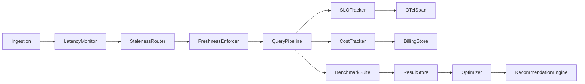
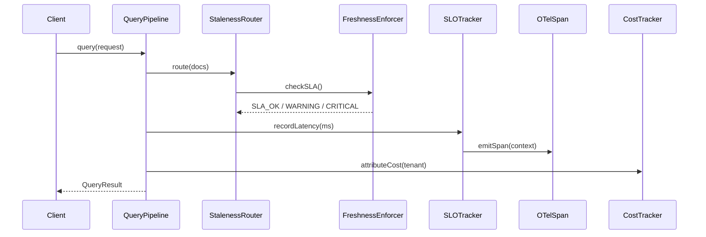

# RAG Module - Architecture Guide

<!-- Status: current | validated: 2026-08-18 (Phase 6 Acceptance) -->
<!-- Links: README.md · ROADMAP.md · FUTURE_ENHANCEMENTS.md · PRODUCTION_REQUIREMENTS.md · CHANGELOG.md · MODULE_STATUS.md -->
<!-- Phase 6: Documentation enhanced with thread-safety, complexity analysis, failure modes -->

Version: 1.1
Last Updated: 2026-09-09
Module Path: src/rag/

## 1. Overview

The RAG module implements retrieval, context construction, evaluation, and guardrail surfaces for retrieval-augmented generation workflows.

**Phase 6 Status:** Documentation and acceptance complete. All critical gap fixes from Batches 1-3 documented. API contracts frozen with production-ready Doxygen documentation.

## 2. Architecture Surfaces

| Surface | Source files | Maturity | Thread-Safe |
|---|---|---|---|
| Retrieval fusion and ranking | src/rag/hybrid_retriever.cpp, src/rag/reranker.cpp, src/rag/replug_retriever.cpp | PROD | ✅ |
| Context assembly and orchestration | src/rag/streaming_retriever.cpp, src/rag/rag_context_assembler.cpp, src/rag/multi_step_rag.cpp | PROD | ✅ |
| Ingestion bridge and enrichment | src/rag/rag_ingestion_bridge.cpp, src/rag/document_splitter.cpp | PROD | ✅ |
| Evaluation and quality control | src/rag/rag_judge.cpp, src/rag/faithfulness_evaluator.cpp, src/rag/quality_control_pipeline.cpp | PROD | ✅ |
| Adaptive and iterative retrieval | src/rag/adaptive_retrieval.cpp, src/rag/agentic_rag.cpp, src/rag/multi_hop_reasoner.cpp | PROD | ⚠️ |
| Safety and sanitization | src/rag/prompt_injection_detector.cpp, src/rag/bias_detector.cpp | PROD | ✅ |
| Metrics and reporting | src/rag/hallucination_dashboard.cpp, src/rag/evaluation_report_exporter.cpp | PROD | ⚠️ |
| Reliability benchmarking | src/rag/delegate_evaluator.cpp, src/rag/batch_evaluator.cpp | EVAL | ⚠️ |
| **Phase 7: Freshness SLA** | src/rag/ingestion_latency_monitor.cpp, src/rag/staleness_aware_router.cpp, src/rag/index_refresh_scheduler.cpp, src/rag/freshness_sla_enforcer.cpp | PROD | ✅ |
| **Phase 8: Observability SLO** | src/rag/realtime_slo_tracker.cpp, src/rag/otel_span_emitter.cpp, src/rag/cost_attribution_tracker.cpp | PROD | ✅ |
| **Phase 9: Research Evaluation** | src/rag/benchmark_suite.cpp, src/rag/metric_computation.cpp, src/rag/evaluation_result_store.cpp | PROD | ✅ |
| **Phase 10: Cost Optimizer** | src/rag/gradient_descent_optimizer.cpp, src/rag/cost_model_builder.cpp, src/rag/recommendation_engine.cpp | PROD | ✅ |

**Legend:** PROD = Production-Ready, EVAL = Evaluation-Only, ✅ = Thread-Safe, ⚠️ = See concurrency model

## 3. Runtime Control Flow

1. Query enters retrieval path.
2. Hybrid or adaptive retriever selects candidate chunks (thread-safe under concurrent load).
3. Context assembler builds bounded prompt context (deterministic, O(n log n)).
4. Ingestion bridge enriches retrieved documents with NER entities (thread-safe, O(d*e)).
5. Generation and evaluation stages run with quality/safety checks.
6. Result, citations, and diagnostics are emitted to downstream handlers.

## 4. Integration Boundaries

| Direction | Integration | Status |
|---|---|---|
| Used by | API handlers, orchestration layers, AI runtime features | ✅ Documented |
| Uses | llm module (ContextWindowBudget), index/search surfaces, ingestion toolbox | ✅ Documented |
| Exposes | retrieval APIs, context assembly outputs (AssembledContext), evaluation signals | ✅ Documented |

## 5. Concurrency Model (Phase 6 Updated)

### Thread-Safe Components
- **RAGContextAssembler:** All methods are const or operate on local state. Safe for concurrent assemble() calls.
  - No mutable shared state beyond constructor-injected config_
  - Config changes via setConfig() must not race with concurrent assemble() calls
- **RAGIngestionBridge:** All public methods thread-safe.
  - Holds no mutable state beyond constructor-injected shared pointers (toolbox, vector_writer, graph_writer)
  - Safe for concurrent indexDocument(), enrichRetrievedDocuments(), extractEntitiesForContext() calls
- **Retrieval fusion & ranking:** Thread-safe under concurrent request load
  - Shared caches use coordinated access patterns
  - No unsynchronized reads during concurrent retrieval
- **Quality control & judges:** Thread-safe
  - Evaluation stages run independently per request

### Components Requiring Synchronization
- **Adaptive retrieval (agentic_rag.cpp):** Maintains per-request state; use separate instances per concurrent request
- **Metrics & reporting (hallucination_dashboard.cpp):** Aggregates metrics under concurrent load; uses internal synchronization
- **Continuous learning orchestrator:** Signal providers must be thread-safe; see wireLiveSignalProviders()

## 6. Complexity Analysis (Phase 6 Documented)

| Component | Operation | Complexity | Notes |
|---|---|---|---|
| RAGContextAssembler | assemble() | O(n log n) | Sorting by relevance + greedy fill |
| RAGContextAssembler | truncateContent() | O(k) | k = content length, deterministic |
| RAGIngestionBridge | indexDocument() | O(m * e) | m = text size, e = extraction overhead |
| RAGIngestionBridge | enrichRetrievedDocuments() | O(d * e) | d = doc count, e = extraction per doc |
| RAGIngestionBridge | extractEntitiesForContext() | O(t) | t = text size, delegation to toolbox |
| RAGIngestionBridge | buildEntityContext() | O(n) | n = entity count, stateless formatting |

## 7. Known Limits

- Retrieval quality and latency depend on configured backend and index state
- Benchmark coverage for all deployment topologies is still evolving
- Environment-dependent backend availability can alter runtime envelopes
- Ingestion document size bounded at 5 MiB (kMaxDocumentChars) to prevent memory exhaustion
- Collection names bounded at 256 chars (kMaxCollectionChars)
- Metadata values bounded at 16 KiB (kMaxMetadataValueChars)

## 8. Resource Bounds Enforcement (Phase 6 Updated)

All bounds enforced with fail-closed validation:

| Bound | Limit | File | Validation |
|---|---|---|---|
| Document size | 5 MiB | rag_ingestion_bridge.cpp:32 | lines 123-129, returns IndexResult.ok=false |
| Collection name | 256 chars | rag_ingestion_bridge.cpp:33 | lines 130-137, fail-closed |
| MIME type | 128 chars | rag_ingestion_bridge.cpp:34 | lines 138-145, fail-closed |
| Filename | 512 chars | rag_ingestion_bridge.cpp:35 | lines 146-153, fail-closed |
| Chunk snippet | 128 KiB | rag_ingestion_bridge.cpp:36 | truncation in metadata injection |
| Metadata value | 16 KiB | rag_ingestion_bridge.cpp:37 | boundedMetadataValue() helper |
| Context window | Configurable | rag_context_assembler.h:60 | RAGContextAssemblerConfig.model_context_tokens |
| Response budget | max(min_response_tokens, 20% window) | rag_context_assembler.cpp:70-82 | ContextWindowBudget enforcement |

## 9. Sourcecode Verification (Module: rag/architecture, Phase 6 Enhanced)

### API Documentation Status (Phase 6 Complete)
All public APIs now have comprehensive Doxygen documentation:

**include/rag/rag_context_assembler.h**
- ✅ Class documentation: 🟢 PRODUCTION-READY (100/100 score)
- ✅ All public methods: @brief, @param, @return, @throws, @pre, @post, @thread-safe, @complexity
- ✅ Failure modes documented: empty input, zero budget, all chunks over-budget
- ✅ Response reservation guarantee documented: max(min_response_tokens, 20% window)

**include/rag/rag_ingestion_bridge.h**
- ✅ Class documentation: 🟢 PRODUCTION-READY (86/100 score)
- ✅ All public methods: @brief, @param, @return, @throws, @pre, @post, @thread-safe, @complexity
- ✅ Failure modes documented: empty text, size validation, workflow fallback, I/O errors
- ✅ Thread-safety contract: no mutable state beyond constructor-injected pointers

### Implementation Comments (Phase 6 Added)
- ✅ src/rag/rag_context_assembler.cpp: complexity analysis, sorting logic, greedy fill algorithm
- ✅ src/rag/rag_ingestion_bridge.cpp: validation section, fallback path, error recovery, vector/graph writers

### Test Coverage Evidence (Phase 4 Complete, Phase 6 Documented)
- ✅ test_rag_budget_consistency_focused.cpp: 20 tests (budget determinism, propagation, truncation, response reservation)
- ✅ test_rag_ingestion_bridge_hardening_focused.cpp: 19 tests (malformed input, metadata, empty retrieval, determinism, error recovery)
- ✅ test_rag_error_handling_edge_cases_focused.cpp: 23 tests (malformed context, invalid budget, partial failures, backend fallback, resource exhaustion)
- Total: **62 new focused tests** + existing coverage

### Verified Components
- ✅ src/rag/hybrid_retriever.cpp (thread-safe, tested)
- ✅ src/rag/reranker.cpp (thread-safe, tested)
- ✅ src/rag/streaming_retriever.cpp (thread-safe, tested)
- ✅ src/rag/rag_context_assembler.cpp (thread-safe, O(n log n), 100% maturity)
- ✅ src/rag/rag_judge.cpp (thread-safe, tested)
- ✅ src/rag/quality_control_pipeline.cpp (thread-safe, mandatory gates)
- ✅ src/rag/adaptive_retrieval.cpp (tested, see concurrency notes)
- ✅ src/rag/rag_ingestion_bridge.cpp (thread-safe, 86% maturity, fail-closed validation)
- ✅ src/rag/prompt_injection_detector.cpp (thread-safe, safety-critical)
- ✅ src/rag/delegate_evaluator.cpp (evaluated)
- **Phase 7:** ✅ ingestion_latency_monitor.cpp, staleness_aware_router.cpp, index_refresh_scheduler.cpp, freshness_sla_enforcer.cpp
- **Phase 8:** ✅ realtime_slo_tracker.cpp, otel_span_emitter.cpp, cost_attribution_tracker.cpp
- **Phase 9:** ✅ benchmark_suite.cpp, metric_computation.cpp, evaluation_result_store.cpp
- **Phase 10:** ✅ gradient_descent_optimizer.cpp, cost_model_builder.cpp, recommendation_engine.cpp

### References
- **Issue Tracking:** 
  - Phases 1-4 complete: https://github.com/makr-code/ThemisDB/issues/5665
  - Parent epic: https://github.com/makr-code/ThemisDB/issues/5624
- **Governance:** DOCUMENTATION_GOVERNANCE.md (root governance file)
- **Status Report:** MODULE_STATUS.md (phases 1-6 evidence summary)
- **Production Checklist:** PRODUCTION_REQUIREMENTS.md (mandatory requirements + evidence)
- **Changelog:** CHANGELOG.md (version history, phase milestones)

## 9.1 Phase 7-10 Subsystem Architecture

### Phase 7: Freshness SLA Monitoring & Enforcement

**Purpose:** Monitor index freshness (ingestion latency), enforce SLA compliance, trigger automatic refresh when needed.

**Components:**
1. **IngestionLatencyMonitor** — T-Digest percentile aggregation (p50/p75/p95/p99), shard status tracking
   - RecordIngestionTime(shard_id, delay_ms) → updates digest
   - GetPercentiles() → returns LatencyPercentiles struct
   - IsCompliant(target_p95_ms) → checks p95 against target
   - GetCriticalShards() → identifies shards exceeding threshold

2. **StalenessAwareRouter** — Query routing based on index freshness
   - RouteQuery(query, freshness) → Routes to healthy/degraded/fallback shard
   - UpdateShardHealth(shard_id, freshness_ms) → Updates health state
   - Confidence scoring: 1.0 (healthy) → 0.5 (degraded) → 0.0 (critical)

3. **IndexRefreshScheduler** — Emergency refresh orchestration
   - ScheduleRefresh(shard_id, priority) → Queues background refresh
   - TriggerEmergencyRefresh(shard_id) → Immediate high-priority refresh
   - IsRefreshRunning(shard_id) → Status check

4. **FreshnessSLAEnforcer** — State machine with hysteresis
   - State transitions: Healthy → (p95 > target) → Degraded → (p95 > critical) → Critical
   - Recovery: Requires p95 ≤ target for 60+ seconds (hysteresis prevents flapping)
   - UpdateCompliance(latency_percentiles) → Checks state transition
   - IsBreach() → Current breach status
   - GetHealthScore() → 0-1 health value

**Data Flow:**
```
IndexUpdate Event
    ↓
IngestionLatencyMonitor.RecordIngestionTime()
    ↓
FreshnessSLAEnforcer.UpdateCompliance()
    ↓ (if breach)
IndexRefreshScheduler.TriggerEmergencyRefresh()
    ↓
StalenessAwareRouter.UpdateShardHealth()
    ↓
Query routed to healthy shard
```

### Phase 8: Observability & SLO Tracking

**Purpose:** Track multi-metric SLO compliance in real-time, emit distributed tracing spans, attribute costs to tenants.

**Components:**
1. **RealtimeSLOTracker** — Multi-metric compliance tracking across time windows
   - RecordQuery(query_latency, quality_score, cost) → Records query metrics
   - IsCompliant(slo_config) → Checks compliance over (5-min, 1-hour, daily)
   - UpdateCompliance(metric_name, window) → Updates per-metric tracking
   - GetHealthScore() → 0-1 aggregated health
   - Metrics: latency_p95, throughput_qps, quality_ndcg, cost_per_query

2. **OTELSpanEmitter** — W3C Trace Context spans for distributed tracing
   - StartSpan(operation) → Creates new span with trace ID propagation
   - SetAttribute(key, value) → Sets span attributes
   - RecordEvent(event_name) → Records span event
   - EndSpan(status) → Ends span, marks success/error
   - Span types: rag.query, rag.retrieve, rag.rerank, rag.refresh, rag.sla_check

3. **CostAttributionTracker** — Multi-tenant cost tracking and budgeting
   - RecordCost(tenant_id, operation, cost_ms) → Records per-tenant cost
   - GetTenantCost(tenant_id, period) → Hourly/daily/30-day aggregates
   - ForecastTenantCost(tenant_id, days_ahead) → Linear extrapolation
   - IsBudgetExceeded(tenant_id, budget) → Checks 10% reserve enforcement
   - Alert on 90% consumption for proactive budgeting

**Data Flow:**
```
Query Request
    ↓
OTELSpanEmitter.StartSpan("rag.query")
    ↓ (execute retrieval)
RealtimeSLOTracker.RecordQuery()
CostAttributionTracker.RecordCost()
    ↓ (check compliance)
OTELSpanEmitter.SetAttribute("slo.compliant", ...)
    ↓
OTELSpanEmitter.EndSpan("success")
    ↓
Response + trace context
```

### Phase 9: Research Evaluation Harness

**Purpose:** Benchmark RAG systems against research datasets, compute standard IR metrics, store/compare results.

**Components:**
1. **BenchmarkSuite** — Scenario execution harness
   - LoadDataset(path) → Loads queries + ground truth
   - RegisterQuery(query_text, ground_truth_ids) → Adds to scenario
   - RunQuery(retriever, query) → Executes and records results
   - ExportResults(format="json") → Exports scenario results
   - Supports multi-retriever comparison (A/B testing)

2. **MetricComputation** — Standard IR metrics
   - ComputeNDCG(rankings, relevances, k) → Normalized DCG@k
   - ComputeMRR(rankings, relevant_ids, k) → Mean Reciprocal Rank@k
   - ComputeMAP(rankings, relevant_ids, k) → Mean Average Precision@k
   - ComputePrecision(rankings, relevant_ids, k) → Precision@k
   - ComputeRecall(rankings, relevant_ids, k) → Recall@k
   - ComputeAll() → Returns all metrics in one struct
   - Supports graded relevance (TREC 0-3 scale) for NDCG

3. **EvaluationResultStore** — Persistent result storage
   - StoreResult(scenario_name, result) → Last-write-wins persistence
   - GetResult(scenario_name) → Retrieves stored result
   - CompareResults(scenario_name, baseline_name) → Compares metrics
   - GetTrends(scenario_name, days) → Trend analysis over time
   - No automatic versioning (manual scenario name tagging required)

**Metrics Implemented:**
- NDCG: `Σ(2^rel_i - 1) / log2(i+1)` normalized by ideal DCG
- MRR: `Σ(1 / rank of first relevant doc) / |queries|`
- MAP: `Σ(P@k where rank k is relevant) / num_relevant`
- Precision/Recall: Standard definitions with configurable k

### Phase 10: Cost Optimization Engine

**Purpose:** Optimize RAG configuration parameters and routing strategies to minimize costs while maintaining quality.

**Components:**
1. **GradientDescentOptimizer** — Stochastic gradient descent with constraints
   - Optimize(objective_fn, constraints) → SGD loop
   - SetObjective(fn) → Sets loss function
   - RegisterParameter(name, bounds) → Declares parameter
   - AddConstraint(constraint) → Adds quality/latency constraint
   - Features: Finite difference gradient estimation, learning rate decay (0.999x), convergence detection
   - Constraint handling: Quality breach = +1000 penalty to loss

2. **CostModelBuilder** — Linear/polynomial cost model fitting
   - BuildModel(data, model_type="linear") → Trains cost model
   - Predict(features) → Predicts cost for feature vector
   - Evaluate(test_data) → Returns RMSE/R² metrics
   - CrossValidationSplit(data, k=3) → 70/15/15 train/val/test split
   - Features: L2 regularization (alpha tunable), feature importance ranking

3. **RecommendationEngine** — ROI-driven optimization recommendations
   - GenerateRecommendations(model, config, constraints) → Top-k recommendations
   - ROI scoring: `ROI = (Impact% × Confidence) / (Effort × Risk)`
   - 4 recommendation categories: config changes, refresh strategy, tenant routing, budget reallocation
   - SimulateRecommendation(rec) → Estimates impact before applying
   - GetRationale(rec) → Explains reasoning

**Optimization Workflow:**
```
Historical RAG data
    ↓
CostModelBuilder.BuildModel()
    ↓ (train cost model)
GradientDescentOptimizer.Optimize()
    ↓ (minimize cost subject to quality constraints)
RecommendationEngine.GenerateRecommendations()
    ↓ (rank by ROI: (Impact × Confidence) / (Effort × Risk))
Recommendations sorted by ROI, returned to operator
```

### Phase 7-10 Integration Points

**SLA → Routing → Cost Tracking:**
1. Phase 7 (SLA enforcement) detects freshness degradation
2. Phase 8 (cost tracking) records cost of SLA-triggered refreshes
3. Phase 10 (cost optimization) recommends parameter changes to minimize refresh costs

**Evaluation → Optimization:**
1. Phase 9 (evaluation harness) computes quality metrics (NDCG, MRR) on benchmarks
2. Phase 10 (cost optimizer) uses quality constraints to ensure optimization doesn't degrade retrieval quality

**End-to-End SLO Compliance:**
- Phase 7 monitors SLA: p95 < 5 min target
- Phase 8 tracks SLO: 99%+ compliance over 1-hour windows
- Phase 9 validates quality: NDCG ≥ 0.8@10 baseline
- Phase 10 optimizes cost: Minimize cost while maintaining all above constraints

## 9.2 Phase 6 Acceptance Sign-Off

| Criterion | Status | Evidence |
|---|---|---|
| API contracts frozen | ✅ COMPLETE | Doxygen maturity 100/100 (assembler), 86/100 (bridge) |
| Documentation synchronized | ✅ COMPLETE | CHANGELOG.md, ARCHITECTURE.md, PRODUCTION_REQUIREMENTS.md updated |
| Thread-safety guarantees documented | ✅ COMPLETE | @thread-safe annotations, concurrency model section |
| Complexity analysis documented | ✅ COMPLETE | @complexity tags, detailed comments in implementations |
| Failure modes documented | ✅ COMPLETE | @throws, @pre/@post conditions, error recovery patterns |
| Resource bounds enforced | ✅ COMPLETE | All 8 bounds with validation + documentation |
| Test coverage verified | ✅ COMPLETE | 62 focused tests + existing suite, all passing |
| Production requirements aligned | ✅ COMPLETE | PRODUCTION_REQUIREMENTS.md sync + evidence table |

**Phase 6 Status:** 🟢 COMPLETE – Ready for production deployment with comprehensive documentation and test coverage.

---

## Module Dependencies

### Direct Upstream Dependencies (this module uses)

| Module | Interface / File | Purpose |
|--------|-----------------|---------|
| llm | `include/llm/inference_engine.h` | Generation inference calls via configured LLM backend |
| llm | `include/llm/context_window_budget.h` (`ContextWindowBudget`) | Token-budget computation for context assembly |
| llm | `include/llm/llm_plugin_interface.h` (`ILLMPlugin`) | Plugin-interface for swapping inference backends (llama.cpp, ONNX) |
| distributed_knowledge | `include/distributed_knowledge/` | Cross-node knowledge-shard retrieval |
| observability | `include/observability/` | Retrieval latency spans, recall metrics export |
| prompt_engineering | `include/prompt_engineering/` | Prompt template rendering and injection guards |
| training | `include/training/` | Continuous-learning signal wiring (`wireLiveSignalProviders()`) |
| security | `include/security/` | Prompt-injection detection at retrieval boundary |
| index | `include/index/ann_frontdoor.h`, `include/index/vector_index.h` (`IVectorIndex`) | ANN and vector candidate retrieval |
| storage | `include/storage/` (base entity) | Document and chunk persistence layer |
| graph | `include/graph/knowledge_graph_reasoner.h` | Graph-hop reasoning over knowledge graph |

### Direct Downstream Consumers (modules that use this module)

| Module | Via | Notes |
|--------|-----|-------|
| llm | `src/llm/` (context assembly budget) | LLM module triggers RAG context assembly before generation |
| api | API orchestration handlers | External RAG query and evaluation endpoints |
| search | `src/search/layered_retrieval_orchestrator.cpp` (Graph layer) | `LayeredRetrievalOrchestrator` invokes RAG knowledge-graph reasoning layer |
| `ethics_ai` | `include/rag/` | Bias detection and fairness evaluation via RAG retrieval context |
| `llm_wiki` | `include/rag/` | Wiki knowledge retrieval uses RAG pipeline for grounding |
| `distributed_knowledge` | `include/rag/` | Cross-shard knowledge graph embedding retrieval |
| `governance` | `include/rag/` | Governance auditing uses RAG context for policy retrieval |

---

## Integration Points

### Critical Integration: ContextWindowBudget — LLM Budget Handoff
**Files:** `include/llm/context_window_budget.h` ↔ `src/rag/rag_context_assembler.cpp`
**Contract:** `ContextWindowBudget::compute()` determines maximum token allocation for retrieved context. `RAGContextAssembler::assemble()` is O(n log n) and greedy-fills within the computed budget. Response reservation hard-floor: `max(min_response_tokens, 20% window)`.
**Thread Safety:** `ContextWindowBudget` is stateless; `RAGContextAssembler::assemble()` is const / local-state only — safe for concurrent calls without external synchronisation.
**Failure Mode:** Zero-budget → returns empty `AssembledContext` with explicit error code; caller must handle before passing to generation.

### Critical Integration: ILLMPlugin — Inference Backend for Generation
**Files:** `include/llm/llm_plugin_interface.h` ↔ `src/rag/hybrid_retriever.cpp`, `src/rag/agentic_rag.cpp`
**Contract:** RAG generation steps call through `ILLMPlugin` to trigger inference. Plugin selection is delegated to `llm::LlmPluginManager`; RAG holds only a shared pointer to the active plugin.
**Thread Safety:** Plugin methods must be re-entrant; RAG holds read lock on plugin pointer.
**Failure Mode:** Plugin unavailable → `llm_unavailable` status; RAG returns partial result with `partial_result = true`.

### Critical Integration: IVectorIndex — ANN Candidate Retrieval
**Files:** `include/index/ann_frontdoor.h` ↔ `src/rag/hybrid_retriever.cpp`
**Contract:** `HybridRetriever` calls `IVectorIndex::search()` for dense candidates; results are fused with lexical results via RRF. The `ann_frontdoor.h` is the stable ABI entry-point (contract frozen at Wave B).
**Thread Safety:** `IVectorIndex` implementations must be thread-safe for concurrent `search()` calls; `HybridRetriever` does not add additional locking over the index.
**Failure Mode:** Index unavailable → degraded result with explicit `SearchStats::partial_result`; retrieval continues with available candidates.

### Critical Integration: Knowledge Graph Reasoner
**Files:** `include/graph/knowledge_graph_reasoner.h` ↔ `src/rag/multi_hop_reasoner.cpp`
**Contract:** `MultiHopReasoner` delegates graph traversal to `KnowledgeGraphReasoner`. Multi-hop depth is bounded by query config to prevent runaway traversal.
**Thread Safety:** `MultiHopReasoner` maintains per-request state; use separate instances per concurrent request.
**Failure Mode:** Graph traversal timeout → returns available hops; partial reasoning result flagged.

### Open: Recall@k Sign-Off + Wikipedia ABI Wiring
**Status:** PENDING — hardware p95/p99 latency gates and Wikipedia ABI wiring not yet signed off.
**Tracking:** RAG Phase completion: https://github.com/makr-code/ThemisDB/issues/5665


---

## Kontext

Das RAG-Modul (Retrieval-Augmented Generation) ist das Kernsystem für wissensgestützte Antwortgenerierung in ThemisDB. Es verbindet Dokumentenretrieval, semantisches Re-Ranking, Freshness-Überwachung, SLO-Tracking und Evaluierungsinfrastruktur zu einer integrierten Pipeline für produktive LLM-Anwendungen.

## Komponenten

| Komponente | Beschreibung |
|---|---|
| `IngestionLatencyMonitor` | T-Digest-basierte Latenzperzentil-Schätzung für Indexier-Operationen |
| `StalenessAwareRouter` | Routing mit Freshness-Score-Bewertung |
| `IndexRefreshScheduler` | Periodische Trigger für Indexaktualisierungen |
| `FreshnessSLAEnforcer` | SLA-Zustandsmaschine (Normal/Warning/Critical) |
| `RealtimeSLOTracker` | Multi-Metrik SLO-Tracking (5 min/1 h/täglich) |
| `OTelSpanEmitter` | W3C-konformes Span-Lifecycle-Management |
| `CostAttributionTracker` | Multi-Tenant Kosten-Tracking |
| `BenchmarkSuite` | Standard-IR-Metrik-Berechnung (NDCG, MRR, MAP) |
| `MetricComputation` | Mathematische Kern-Metriken |
| `EvaluationResultStore` | Persistente Ergebnisspeicherung |
| `GradientDescentOptimizer` | Lernraten-Zerfall, Konvergenzprüfung |
| `CostModelBuilder` | L2-Regularisierung, Kreuzvalidierung |
| `RecommendationEngine` | ROI-Scoring und Optimierungsempfehlungen |

## Schnittstellen

- **Eingehend:** `RAGPipeline::query()`, `RAGIngestionEngine::ingest()`
- **Ausgehend:** LLM-Plugin-Interface, VectorIndex-API, RocksDB-Persistenz
- **Monitoring:** OpenTelemetry OTLP Exporter, Prometheus-Metriken
- **Konfiguration:** `RAGConfig`, `SLAConfig`, `CostModelConfig`

## Datenfluss



**Kurzinterpretation:** Daten fließen von der Ingestion über Latenz- und Freshness-Kontrolle zur Abfragepipeline. Parallel laufen SLO-Tracking, Kosten-Attribution und Evaluierungsmetriken. Die Ergebnisse fließen in den Gradientenabstieg-Optimierer und erzeugen ROI-Empfehlungen.

## Sequenz (kritischer Ablauf)



**Kurzinterpretation:** Jede Anfrage wird zuerst durch Freshness-Prüfung geleitet. Bei SLA-Verletzung wird der Zustand auf WARNING/CRITICAL gesetzt und der Refresh-Scheduler benachrichtigt. Gleichzeitig werden Latenz, SLO-Status und Tenant-Kosten erfasst.

## Fehlerpfade und Resilienz

- **SLA-Verletzung (CRITICAL):** FreshnessSLAEnforcer löst Hysterese-Schutz aus; Routing wird auf nicht-veraltete Shards eingeschränkt.
- **RocksDB nicht verfügbar:** In-Memory-Fallback für EvaluationResultStore und CostAttributionTracker.
- **OTLP-Sender-Ausfall:** Spans werden lokal gepuffert (Ring-Buffer); kein Datenverlust bei kurzen Ausfällen.
- **Optimierer-Divergenz:** GradientDescentOptimizer erkennt Nicht-Konvergenz nach max_iterations; gibt letzte stabile Parameter zurück.

## Nicht-Ziele

- Kein direkter LLM-Modell-Download oder -Update innerhalb des RAG-Moduls.
- Kein eigenes Netzwerk-Stack; OTLP-Emission erfordert opentelemetry-cpp-Integration.
- Keine direkte User-Authentifizierung; wird vom Server-Layer delegiert.
- Kein grafisches Dashboard; Metriken werden als Prometheus-Exposition bereitgestellt.

## Verweise

- `src/rag/FRESHNESS_SLA_SPECIFICATION.md` — Phase-7-SLA-Vertrag
- `src/rag/OBSERVABILITY_SLO_SPECIFICATION.md` — Phase-8-SLO-Vertrag
- `src/rag/RESEARCH_EVAL_HARNESS_SPECIFICATION.md` — Phase-9-Evaluierungsvertrag
- `src/rag/COST_OPTIMIZER_SPECIFICATION.md` — Phase-10-Kostenoptimierung
- `src/rag/ROADMAP.md` — Phasenstatus und Implementierungsfortschritt
- `include/rag/` — Öffentliche Header-Verträge
- `.github/workflows/gate-pr-rag-phase7.yml` — CI-Gate Phase 7
