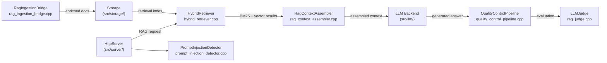

# ThemisDB RAG Module

<!-- Status: PRODUCTION_CANDIDATE | Phase 1-3 complete | validated: 2026-08-10 -->
<!-- Links: ARCHITECTURE.md · ROADMAP.md · FUTURE_ENHANCEMENTS.md -->

## Zweck

The RAG module provides retrieval-augmented generation runtime surfaces for ThemisDB:
document retrieval, context assembly, quality evaluation, and safety checks.
It combines hybrid BM25+vector retrieval, token-budget-aware streaming, multi-dimensional
evaluation gates, and prompt-injection safety controls into a single composable runtime layer.

## Scope

In scope:
- retrieval fusion (BM25 + vector), reranking, and context assembly
- RAG evaluation, quality gates, and judge integration
- ingestion bridge and retrieval enrichment
- prompt and retrieval safety controls (injection detection, sanitization)
- RAG-specific performance and reliability controls (adaptive depth, streaming)

Out of scope:
- core LLM backend lifecycle and model loading (see `src/llm/`)
- storage engine internals outside RAG ingestion integration
- non-RAG HTTP transport and server bootstrap details

## Quickstart (Build/Run)

The RAG module is built as part of the main ThemisDB library. Enable the RAG build
target with:

```bash
cmake -S . -B build -DTHEMIS_RAG_MODULE=ON
cmake --build build --target themisdb
```

To run the focused RAG integration tests:

```bash
ctest --test-dir build -R "test_rag|test_hybrid_retriever|test_self_rag" -V
```

To run the Wave B quality-gate tests:

```bash
ctest --test-dir build -R "test_rag_quality|test_llm_judge_integration" -V
```

## API/CLI Einstieg

The module exposes the following core public headers:

**`include/rag/hybrid_retriever.h`** — `themisdb::rag::HybridRetriever`
```cpp
// Fuse BM25 + vector results for a query
auto results = retriever.retrieve(query, RetrievalConfig{
    .top_k = 10,
    .bm25_weight = 0.4f,
    .vector_weight = 0.6f
});
```

**`include/rag/rag_context_assembler.h`** — `themisdb::rag::RagContextAssembler`
```cpp
// Assemble context under a token budget
auto ctx = assembler.assemble(results, AssemblyConfig{
    .max_tokens = 2048,
    .strategy = AssemblyStrategy::DENSE_FIRST
});
```

**`include/rag/quality_control_pipeline.h`** — `themisdb::rag::QualityControlPipeline`
```cpp
// Run retrieval + generation quality gate
auto verdict = pipeline.evaluate(query, ctx, generated_answer);
if (verdict.score < threshold) { /* handle low-quality result */ }
```

**`include/rag/prompt_injection_detector.h`** — `themisdb::rag::PromptInjectionDetector`
```cpp
// Detect and sanitize prompt injection
auto result = detector.inspect(user_input);
if (result.injection_detected) { /* block or sanitize */ }
```

## Integrationsueberblick

The following diagram shows how the RAG module integrates with the server, LLM, and storage layers:



**Kurzinterpretation:** The `HttpServer` routes RAG requests through injection detection, then hybrid retrieval, context assembly, and LLM generation. The quality-control pipeline and judge evaluate the final answer. The ingestion bridge keeps the retrieval index populated from storage.

## Known Limitations

- Runtime behavior varies with the configured retriever, evaluator, and LLM backend combination.
- Some cross-node production mixes still require broader benchmark evidence.
- WikiIndexStore Phase B (RocksDB, BM25+, HNSW, RRF fusion) is not yet production-ready — Wave B target Q4 2026.
- Release-grade benchmark evidence for persistent embedding cache and per-query retrieval guardrails is pending.
- Multi-step RAG (iterative, map-reduce) and adaptive retrieval depth are production-ready with limits.

**Production Readiness Status (Batch 3 verified 2026-08-14):**
- **Ready for production:** Hybrid retrieval (BM25 + vector), streaming context assembly, retrieval quality gates, ingestion bridge, Self-RAG (Wave B B1 with ALCE acceptance gates)
- **Production-ready with limits:** Multi-step RAG, adaptive retrieval depth control, prompt-injection detection
- **Not yet production-ready:** WikiIndexStore Phase B — Wave B target Q4 2026

## Verweise

| Interface / File | Role |
|---|---|
| `include/rag/hybrid_retriever.h` | Public API for BM25+vector fusion retrieval |
| `src/rag/hybrid_retriever.cpp` | Hybrid retrieval implementation |
| `include/rag/rag_context_assembler.h` | Public API for token-budget-aware context assembly |
| `src/rag/rag_context_assembler.cpp` | Deterministic context assembly under token limits |
| `include/rag/quality_control_pipeline.h` | Public API for retrieval and generation quality gates |
| `src/rag/quality_control_pipeline.cpp` | Quality gate pipeline implementation |
| `include/rag/prompt_injection_detector.h` | Public API for injection detection and sanitization |
| `src/rag/prompt_injection_detector.cpp` | Prompt-injection detection implementation |
| `src/rag/rag_judge.cpp` | Multi-dimensional evaluation orchestration |
| `src/rag/streaming_retriever.cpp` | Token-budget-aware context streaming |
| `src/rag/rag_ingestion_bridge.cpp` | Ingestion-to-retrieval bridge and enrichment |
| `src/rag/multi_step_rag.cpp` | Iterative and map-reduce style multi-step retrieval |
| `src/rag/adaptive_retrieval.cpp` | Complexity-aware retrieval depth control |
| `src/rag/delegate_evaluator.cpp` | Round-trip corruption benchmark support |
| `src/rag/self_rag.cpp` | Self-RAG retrieval controller with critic-based document refinement (Wave B B1) |

- [`ARCHITECTURE.md`](ARCHITECTURE.md) — component boundaries, data flow, and failure paths
- [`ROADMAP.md`](ROADMAP.md) — delivery status, remaining gaps, and phased plan
- [`FUTURE_ENHANCEMENTS.md`](FUTURE_ENHANCEMENTS.md) — planned feature upgrades
- Wave B tracking issue: https://github.com/makr-code/ThemisDB/issues/5039
- Dependent Wave A issue: https://github.com/makr-code/ThemisDB/issues/5038
- Follow-on Wave C issue: https://github.com/makr-code/ThemisDB/issues/5040
