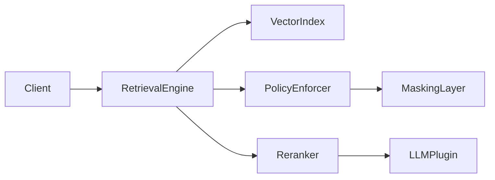

# Retrieval Module Documentation

<!-- Status: PRODUCTION_CANDIDATE | Phase 1-3 complete | aligned with docs/IMPLEMENTATION_ROADMAP.md | validated: 2026-09-24 -->

## Purpose

`src/retrieval` is the EPIC 1 implementation surface for the layered retrieval stack
(ANN frontdoor → tensor mid-layer → graph validation → model/governance controls).
The module provides both production API contracts AND core implementation translation units;
Phase 1-3 core delivery is complete, with Phase 4+ (hardening/integration) in progress 
per the seven-phase delivery model documented in ROADMAP.md and FUTURE_ENHANCEMENTS.md.

## Development-Plan Alignment (EPIC 1)

> Source files (`*.h`, `*.cc`) are deferred to the implementation PR.

| Sub-issue | Planned contract | Planned source | Primary planning docs |
|---|---|---|---|
| 1.1 ANN frontdoor | `include/ann_frontdoor.h` | `src/ann_frontdoor.cc` | `docs/EPIC1_ANN_FRONTDOOR.md` |
| 1.2 Tensor mid-layer | `include/tensor_midlayer.h` | `src/tensor_midlayer.cc` | `docs/EPIC1_TENSOR_MIDLAYER.md` |
| 1.3 Graph validation | `include/graph_validator.h` | `src/graph_validator.cc` | `docs/EPIC1_GRAPH_VALIDATION.md` |
| 1.4 LoRA artifacts | `include/lora_package.h` | `src/lora_package.cc` | `docs/EPIC1_LORA_ARTIFACTS.md` |
| 1.5 Model switch workflow | `include/model_switch.h` | `src/model_switch.cc` | `docs/EPIC1_MODEL_SWITCH.md` |
| 1.6 Federated summaries | `include/federated_summaries.h` | `src/federated_summaries.cc` | `docs/EPIC1_FEDERATED_SUMMARIES.md` |
| 1.7 Observability/governance | `include/retrieval_observability.h` | `src/retrieval_observability.cc` | `docs/EPIC1_ARCHITECTURE.md` |

## Current Delivery State

- Wave A complete: architecture and per-sub-issue contract docs exist under `docs/EPIC1_*.md`.
- Wave B complete: module structure (`README.md`, `include/README.md`, `src/README.md`, `CMakeLists.txt`) and core translation units are in place. Phase 1-3 implementation is delivered; Phase 2 skeleton and Phase 3 error-handling are present in source files.
- Wave C partial: tests/benchmarks and production hardening are in progress
  (`tests/epic1_retrieval/`, `benchmarks/epic1_retrieval/` per roadmap).
- Production readiness: Phases 1-3 are source-validated (2026-08-08+ per ROADMAP.md); Phases 4-7 (tests, performance, integration) remain in Wave C/D.

## Seven-Phase Gate (module view)

- [x] Phase 1: design and API contracts defined in EPIC docs and headers (COMPLETE 2026-06)
- [x] Phase 2: skeleton translation units and factory entry points delivered (COMPLETE 2026-08)
- [x] Phase 3: runtime error handling and edge-case behavior (COMPLETE 2026-09 per ROADMAP.md line 44)
- [~] Phase 4: contract tests and scenario coverage (IN PROGRESS, target Q4 2026)
- [ ] Phase 5: performance hardening and instrumentation depth (PLANNED Q1 2027)
- [ ] Phase 6: acceptance documentation from real behavior (PLANNED Q1 2027)
- [ ] Phase 7: integration into production build/test pipelines (PLANNED Q1 2027)

## Module Boundaries

In scope:
- retrieval routing contracts and data-shape definitions
- interfaces required by EPIC 2 (evaluation/planning) and EPIC 3 (artifact portability)
- observability/governance contract points for retrieval decisions

Out of scope (until later phases):
- final performance tuning and SLO enforcement (Phase 5-6, target Q1 2027)
- full integration into all default build targets (Phase 7, target Q1 2027)
- distributed multi-shard orchestration hardening (Phase 4-5 multi-shard testing, Phase C gate per ROADMAP.md)

## Installation

No standalone installation step is required at scaffold stage.
Build target enablement is intentionally deferred to later phase-gate approval.

## Usage

Use this module documentation to:
- map EPIC 1 sub-issues to owned headers/sources
- review delivery-wave and phase-gate status
- prepare implementation/test sequencing without changing production targets

## References

- `docs/IMPLEMENTATION_ROADMAP.md`
- `docs/EPIC1_ARCHITECTURE.md`
- `docs/EPIC1_2_3_DEPENDENCIES.md`
- `src/retrieval/include/README.md`
- `src/retrieval/src/README.md`

---

## Zweck

Das Retrieval-Modul stellt die dokumentenbasierte Suchinfrastruktur für ThemisDB bereit. Es koppelt Vektorsuche, semantisches Re-Ranking und policy-gesteuertes Filtern zu einer konsistenten Retrieval-Pipeline.

## Scope

Enthält: Vektorindex-Zugriff, Dual-Read-Validator, Policy-Enforcement, Re-Ranking und Freshness-Routing.  
Nicht enthalten: LLM-Inferenz, Embedding-Generierung, Ingestion-Pipeline.

## Quickstart (Build/Run)

```bash
cmake -S . -B build -DTHEMIS_ALLOW_MISSING_ROCKSDB=ON -DTHEMIS_DIAGNOSTIC_MODE=ON -DTHEMIS_ENABLE_COMPILER_CACHE=OFF
cmake --build build --target retrieval_tests
ctest --test-dir build -R retrieval
```

## API/CLI Einstieg

Die zentrale Schnittstelle ist `RetrievalEngine::query(QueryRequest)`. Policy-Konfiguration erfolgt über `RetrievalPolicyEnforcer`. Für Batch-Auswertungen steht `DualReadValidator` zur Verfügung.

## Integrationsueberblick



**Kurzinterpretation:** Anfragen durchlaufen zuerst den VectorIndex für Kandidatensuche, dann den PolicyEnforcer für Zugriffsfilterung und schließlich den Reranker zur semantischen Verbesserung. LLM-Integration ist optional und entkoppelt.

## Known Limitations

- RocksDB-basierter Persistenzpfad erfordert explizite Initialisierung im Produktionsbetrieb.
- OTLP-Span-Emission noch nicht vollständig in opentelemetry-cpp integriert.
- Reranking-Modell muss manuell geladen werden; kein automatisches Modell-Management.

## Verweise

- `src/retrieval/src/` — Implementierungsdetails
- `include/retrieval/` — Public API Header
- `src/rag/ARCHITECTURE.md` — RAG-übergreifende Architektur
- `src/rag/FRESHNESS_SLA_SPECIFICATION.md` — Freshness-SLA-Vertrag
