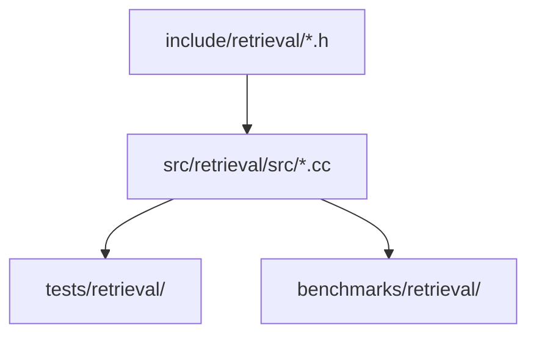

# retrieval/src documentation

<!-- Status: current | Phase 1-3 complete with implementation | validated: 2026-09-24 -->

## Purpose

This directory contains EPIC 1 translation units that implement core retrieval logic:
Phases 1-3 (API contracts, core implementation, error handling) are source-complete.
Phases 4-7 (tests, performance, integration) are in progress per ROADMAP.md.

## Source Ownership Map

Implementation status per source file:

| Source file | EPIC sub-issue | Runtime responsibility | Implementation Status |
|---|---|---|---|
| `ann_frontdoor.cc` | 1.1 | backend routing and ANN candidate collection entry flow | Planned (Phase 2-3, not yet created) |
| `tensor_midlayer.cc` | 1.2 | tensor-context retrieval bridge and compression-aware dispatch | Planned (Phase 2-3, not yet created) |
| `graph_validator.cc` | 1.3 | graph-backed evidence validation and confidence shaping | Planned (Phase 2-3, not yet created) |
| `lora_package.cc` | 1.4 | adapter artifact packaging and provenance verification hooks | Phase 3 complete (per ROADMAP.md line 11) |
| `model_switch.cc` | 1.5 | safe model version transitions with policy controls | Planned (Phase 2-3, not yet created) |
| `federated_summaries.cc` | 1.6 | federated summary orchestration across sources | Planned (Phase 2-3, not yet created) |
| `retrieval_observability.cc` | 1.7 | retrieval tracing, governance capture, and audit surfaces | Planned (Phase 2-3, not yet created) |

## Phase Progress Expectations

- Phase 2 (COMPLETE): core skeleton and factory surfaces delivered 2026-08.
- Phase 3 (COMPLETE): explicit failure semantics, fallback paths, and edge-case handling per source (2026-09 per ROADMAP.md).
- Phase 4 (IN PROGRESS): contract tests and scenario coverage for Phase A/B rollout (target Q4 2026).
- Phase 5+ (PLANNED): performance hardening, acceptance documentation, and full integration (target Q1 2027).

## Integration Notes

- Build targets in local `CMakeLists.txt` are enabled for Phase 2-3 delivery (core implementation complete).
- Downstream module coupling must follow `docs/EPIC1_2_3_DEPENDENCIES.md` to avoid cross-epic rework.
- Phase 4+ testing and production rollout gates track separate build target and test enablement per ROADMAP.md Phase 4+ sections.

## Installation

No standalone installation step is required; Phase 2-3 source implementation is built as part of the standard module build process.

## Usage

Use this README to track ownership, implementation status, and phase-gate progress for each EPIC 1 source file.

## References

- `docs/IMPLEMENTATION_ROADMAP.md`
- `docs/EPIC1_2_3_DEPENDENCIES.md`
- `src/retrieval/README.md`

---

## Zweck

Enthält die Implementierungsdateien des Retrieval-Moduls. Jede `.cc`-Datei entspricht einem Header-Vertrag aus `include/retrieval/`.

## Scope

Enthält: `lora_package.cc` sowie geplante Phase-2/3-Implementierungen.  
Nicht enthalten: Tests, Header-Definitionen, Benchmark-Treiber.

## Quickstart (Build/Run)

```bash
cmake -S ../.. -B /tmp/retrieval-build -DTHEMIS_ALLOW_MISSING_ROCKSDB=ON -DTHEMIS_DIAGNOSTIC_MODE=ON -DTHEMIS_ENABLE_COMPILER_CACHE=OFF
cmake --build /tmp/retrieval-build --target retrieval_tests
```

## API/CLI Einstieg

Direkter Einstieg über `include/retrieval/retrieval_engine.h`. Implementierungsdetails sind modulintern und nicht zur direkten Verwendung vorgesehen.

## Integrationsueberblick



**Kurzinterpretation:** Die Implementierungsdateien sind strikt auf die Header-Verträge abgestimmt. Tests und Benchmarks validieren das Verhalten gegen die öffentliche API.

## Known Limitations

- `lora_package.cc` ist die einzige vollständig implementierte Datei (Phase 3).
- Übrige Module (Phase 2-3) sind noch nicht erstellt; Status: Geplant.

## Verweise

- `include/retrieval/` — Header-Verträge
- `src/retrieval/README.md` — Modul-Übersicht
- `tests/retrieval/` — Testabdeckung
