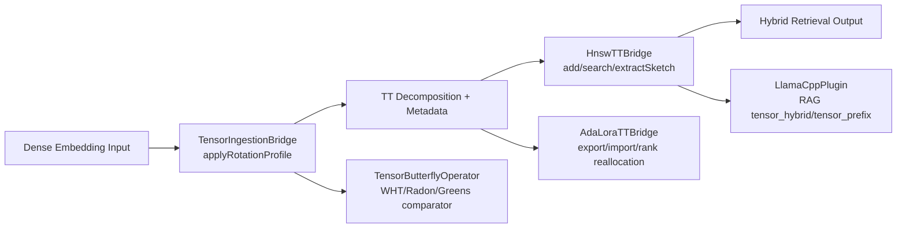
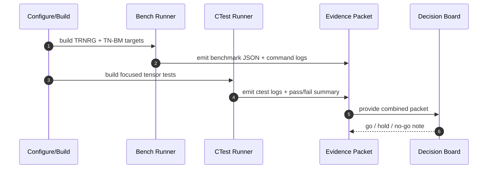

<!-- Status: draft | validated: 2026-10-05 -->
<!-- Links: README.md · ROADMAP.md · FUTURE_ENHANCEMENTS.md · TENSOR_ML_TRAINING_BRIDGE.md · TENSOR_ML_TRAINING_BRIDGE_SPRINT_PLAN.md · ../llama_cpp/README.md · ../training/README.md -->

# Tensor Module - Future Tensor RoPE Enhancements

**Author:** ThemisDB Contributors  
**Created:** 2026-10-05  
**Last Updated:** 2026-10-05  
**Status:** draft

Companion bridge map: [TENSOR_ML_TRAINING_BRIDGE.md](./TENSOR_ML_TRAINING_BRIDGE.md)  
Execution plan: [TENSOR_ML_TRAINING_BRIDGE_SPRINT_PLAN.md](./TENSOR_ML_TRAINING_BRIDGE_SPRINT_PLAN.md)

## Scope

- transfer rotation-aware embedding behavior from ANN frontdoor paths to tensor indexing paths.
- evaluate whether rotation-aware preprocessing improves TT compression and hybrid retrieval quality.
- run explicit benefit analysis for:
  - llama.cpp retrieval and inference-adjacent embedding usage.
  - AdaLoRA-to-TT export and adapter-serving pathways.

## Design Constraints

- backward compatibility of existing tensor index contracts must be preserved within the current major line.
- rotation behavior must be deterministic, versioned, and reproducible across write/query paths.
- no silent fallback from rotated artifacts to non-rotated query behavior.
- migration of existing tensor artifacts must be explicit (metadata marker + gated rollout).

## Required Interfaces

| Interface | Requirement |
|---|---|
| `tensor::TensorIngestionBridge` | optional pre-TT rotation stage before `TensorTrainDecomposer::decompose()` |
| `tensor::HnswTTBridge` | query-side rotation parity and rotation-version-aware sketch extraction |
| `tensor::TensorIndexManager` and tensor route config | route-level switch for `none`, `fixed`, `relational`, `learned` rotation profiles |
| `training::AdaLoraTTBridge` | measurable impact checks on rank allocation, export shape stability, and retrieval parity |
| `llama_cpp` plugin boundaries | retrieval quality/latency validation when tensor retrieval uses rotated artifacts |

## Implementation Notes

- [ ] TN-ROPE-01 baseline instrumentation and schema extension (Target: Q4 2026)
  - Add rotation metadata keys to tensor artifacts (`rotation_profile`, `rotation_version`, `rotation_params_hash`).
  - Capture per-query rotation counters and timing in tensor stats.
  - Add fail-closed validation for profile mismatch between indexed artifacts and query transform.

- [ ] TN-ROPE-02 pre-decomposition tensor rotation in ingestion path (Target: Q4 2026)
  - Add optional rotation hook in [tensor_ingestion_bridge.cpp](C:/Projects/ThemisDB/src/tensor/tensor_ingestion_bridge.cpp) before `decompose`.
  - Support deterministic fixed-angle pair rotation and relation-hash rotation modes.
  - Persist transform provenance in metadata for replay and audit.

- [ ] TN-ROPE-03 query/index parity in hybrid tensor retrieval (Target: Q1 2027)
  - Apply matching query rotation path in [hnsw_tt_bridge.cpp](C:/Projects/ThemisDB/src/tensor/hnsw_tt_bridge.cpp).
  - Re-evaluate first-core sketch extraction behavior under rotated inputs.
  - Gate rollout by index-level rotation-version compatibility.

- [ ] TN-ROPE-04 tensor-native orthogonal transform comparison (Target: Q1 2027)
  - Compare pair-rotation approach against orthogonal fiber transforms already exposed via [tensor_butterfly_operator.cpp](C:/Projects/ThemisDB/src/tensor/tensor_butterfly_operator.cpp).
  - Benchmark WHT/Radon/Greens (where available) as alternatives or complements to RoPE-style rotation.
  - Keep one canonical transform contract per profile to avoid mixed semantics.

- [ ] TN-ROPE-05 llama.cpp benefit study (Target: Q1 2027)
  - Evaluate retrieval quality and latency deltas for llama.cpp-serving flows using tensor-backed candidate generation.
  - Candidate integration points: [llama_cpp_plugin.cpp](C:/Projects/ThemisDB/src/llama_cpp/llama_cpp_plugin.cpp), [llama_cpp_registrar.cpp](C:/Projects/ThemisDB/src/llama_cpp/llama_cpp_registrar.cpp).
  - Acceptance decision based on quality/latency gates (see Performance Targets).

- [ ] TN-ROPE-06 AdaLoRA benefit study (Target: Q1 2027)
  - Evaluate whether rotated tensor artifacts improve rank efficiency and downstream similarity quality in [adalora_tt_bridge.cpp](C:/Projects/ThemisDB/src/training/adalora_tt_bridge.cpp).
  - Validate adapter export/import stability and no regression in bridge fingerprint behavior.
  - Compare rotation modes (`none`, `fixed`, `relational`) with identical training/eval seeds.

## Concrete Integration Points (Code-Level)



### A) Tensor ingestion (write path)

1. Hookpoint in `TensorIngestionBridge::decompose(...)` and `TensorIngestionBridge::shouldDecompose(...)`
   - Files:
     - [tensor_ingestion_bridge.h](../../include/tensor/tensor_ingestion_bridge.h)
     - [tensor_ingestion_bridge.cpp](./tensor_ingestion_bridge.cpp)
   - Existing behavior:
     - κ-gate via pilot decomposition.
     - mode-shape inference + TT decomposition.
   - Planned RoPE extension:
     - optional `applyRotationProfile(embedding, relation_or_context)` before κ-gate and before full `decompose`.
     - emit metadata keys:
       - `rotation_profile`
       - `rotation_version`
       - `rotation_params_hash`
       - `rotation_seed`
     - enforce fail-closed if profile requires relation/context but context is missing.

2. Configuration surface
   - add profile fields to tensor ingestion/runtime config (`none|fixed|relational|learned`).
   - keep default `none` for backward compatibility and controlled rollout.

### B) Hybrid HNSW+TT retrieval (read path)

1. Hookpoints in `HnswTTBridge`
   - Files:
     - [hnsw_tt_bridge.h](../../include/tensor/hnsw_tt_bridge.h)
     - [hnsw_tt_bridge.cpp](./hnsw_tt_bridge.cpp)
   - Methods to extend:
     - `add(...)` / `addFlat(...)`: ensure indexed artifacts carry rotation profile/version.
     - `search(...)` / `searchFlat(...)`: apply query-side rotation parity before candidate search.
     - `extractSketch(...)`: evaluate whether sketch quality improves under rotated first-core projection.
   - Incompatibility behavior:
     - reject query when index metadata profile/version mismatches configured query profile.

2. Persistence and compatibility
   - extend `save(...)` / `load(...)` payload with profile/version fields.
   - dual-read migration mode allowed only behind explicit rollout flag.

### C) Tensor transform alternatives (ablation path)

1. Hookpoint in `TensorButterflyOperator::apply(...)`
   - Files:
     - [tensor_butterfly_operator.h](../../include/tensor/tensor_butterfly_operator.h)
     - [tensor_butterfly_operator.cpp](./tensor_butterfly_operator.cpp)
   - Use as comparator to RoPE-style pair rotation:
     - FOURIER/WHT profile
     - RADON profile
     - GREENS profile
   - Goal:
     - quantify whether structured orthogonal fiber transforms beat or complement pair-rotation for TT compression and retrieval.

### D) llama.cpp integration study path

1. Candidate integration points
   - [llama_cpp_plugin.h](../../include/llama_cpp/llama_cpp_plugin.h)
   - [llama_cpp_plugin.cpp](../llama_cpp/llama_cpp_plugin.cpp)
   - focus methods:
     - `generateRAG(...)`
     - `embed(...)`
2. Study design:
   - compare `rag_mode=tensor_hybrid/tensor_prefix` with tensor rotation profiles on/off.
   - keep generation model and prompt template fixed while rotating only retrieval-side tensor path.
3. Acceptance signal:
   - improved retrieval-assisted answer quality without violating latency budget.

### E) AdaLoRA integration study path

1. Candidate integration points
   - [adalora_tt_bridge.h](../../include/training/adalora_tt_bridge.h)
   - [adalora_tt_bridge.cpp](../training/adalora_tt_bridge.cpp)
   - focus methods:
     - `exportToTT(...)`
     - `importFromTT(...)`
     - `roundAndReallocate(...)`
     - `findSimilarAdapters(...)`
2. Study design:
   - rotate before export and compare rank allocation / reconstruction behavior.
   - check whether fingerprint-neighbour quality changes in `findSimilarAdapters(...)`.
3. Repro protocol alignment:
   - use [ADALORA_TT_BRIDGE_BENCHMARK_PROTOCOL.md](../../research/ADALORA_TT_BRIDGE_BENCHMARK_PROTOCOL.md) artifact structure for reproducible result capture.

## Evidence in Papers and Testable Hypotheses

### Evidence mapping

| Paper | Core evidence | Why relevant here | ThemisDB hypothesis |
|---|---|---|---|
| Su et al., 2021 (RoFormer, RoPE), arXiv:2104.09864 | Rotary transforms preserve relative positional structure in attention space. | Motivates deterministic rotational encoding as structured transform, not random perturbation. | Profiled rotation on tensor write/query path improves neighbourhood consistency for relation-sensitive retrieval. |
| Sun et al., 2019 (RotatE), arXiv:1902.10197 | Relation-as-rotation improves multi-relational embedding modelling. | Direct evidence for `relational` rotation profile design. | Relation-hash rotation profile improves Recall@10 on relation-heavy corpora vs `none`/`fixed`. |
| Ge et al., 2013 (Optimized Product Quantization), CVPR 2013 | Learned/optimized orthogonal rotation before quantization improves ANN distortion-recall tradeoff. | Strong ANN precedent that pre-rotation can make compressed representations more retrieval-friendly. | Pre-TT rotation reduces effective distortion at equal compression budget (kappa/rank) and improves HNSW+TT candidate quality. |
| Oseledets, 2011 (Tensor-Train Decomposition), DOI:10.1137/090752142 | TT rank controls compression/approximation tradeoff. | Defines primary optimization axis for tensor path. | Rotation profiles that lower effective TT rank at fixed quality produce better storage+latency efficiency. |
| Zhang et al., 2023 (AdaLoRA), arXiv:2303.10512 | Adaptive rank allocation improves parameter-efficient fine-tuning under budget constraints. | Connects rotation impact to rank-budget efficiency in AdaLoRA↔TT bridge. | Rotated export can improve rank utility (quality per active-rank unit) in `roundAndReallocate(...)` scenarios. |
| Hu et al., 2022 (LoRA), arXiv:2106.09685 | Low-rank adaptation captures task deltas efficiently. | Baseline theoretical frame for bridge export/import correctness. | Rotation must not break LoRA delta semantics; adapter quality should remain non-inferior at equal budget. |
| Lewis et al., 2020 (RAG), arXiv:2005.11401 | Retrieval quality directly influences generation quality in retrieval-augmented generation. | Grounds llama.cpp study objective on retrieval-gain to answer-gain linkage. | If tensor rotation increases retrieval relevance, `generateRAG(...)` output quality should improve with bounded latency overhead. |

### Evidence quality notes

- RoPE and RotatE evidence is strong for representation geometry, but transfer to TT-compressed ANN retrieval must be validated empirically in this repository.
- OPQ evidence is the closest ANN compression precedent for a "rotation-before-compression" effect and is treated as primary transfer evidence.
- llama.cpp does not inherently benefit from rotation; expected gain is indirect via retrieval quality in RAG flows.
- AdaLoRA benefit is conditional and must be measured with fixed seeds and equal rank budgets.

## Experiment Matrix (Evidence-Linked)

```mermaid
flowchart TD
    P0[Profile none] --> M[Metrics]
    P1[Profile fixed] --> M
    P2[Profile relational] --> M
    P3[Profile learned] --> M
    T0[Pair rotation] --> M
    T1[WHT/Radon/Greens] --> M
    M --> R1[Recall@10]
    M --> R2[nDCG@10]
    M --> R3[p95/p99 latency]
    M --> R4[TT rank + kappa]
    M --> R5[Fail-closed mismatch diagnostics]
```

| Experiment ID | Variant | Primary paper evidence | Success criterion |
|---|---|---|---|
| E-ROPE-TT-01 | `none` vs `fixed` rotation pre-TT | RoFormer + OPQ | Recall@10 +2% on >=1 dataset, no nDCG collapse |
| E-ROPE-TT-02 | `none` vs `relational` profile | RotatE | relation-heavy benchmark improvement vs fixed |
| E-ROPE-TT-03 | pair-rotation vs WHT/Radon/Greens | OPQ + structured transform literature | best profile chosen by quality/latency Pareto |
| E-ROPE-LLAMA-01 | llama.cpp RAG (`tensor_hybrid`) profile on/off | RAG paper | answer-quality proxy improves, p95 latency within budget |
| E-ROPE-ADALORA-01 | AdaLoRA export/import with profile variants | AdaLoRA + LoRA + TT | equal/better quality at same active-rank budget |

## Benchmarking and CTest Execution Contract



### Benchmarking (mandatory for rollout decision)

- Gate benchmark suites:
  - [bench_tensor_release_gates.cpp](../../benchmarks/tensor/bench_tensor_release_gates.cpp) (TRNRG gates)
  - [bench_tensor_dedicated_gates.cpp](../../benchmarks/tensor/bench_tensor_dedicated_gates.cpp) (TN-BM gates)
- RoPE ablation matrix:
  - `none`, `fixed`, `relational`, `learned`
- Required per-profile metrics:
  - Recall@10, nDCG@10
  - p50/p95/p99 latency
  - average TT rank and compression ratio (kappa)

### CTest (mandatory for rollout decision)

- Tensor focused suites (existing):
  - `test_tensor_ingestion_bridge_tensor_FocusedTests`
  - `test_tensor_index_manager_tensor_FocusedTests`
  - `test_tensor_contract_hardening_focused_tensor_FocusedTests`
  - `test_tensor_bridge_edge_cases_focused_tensor_FocusedTests`
- RoPE-specific suites (to be introduced under TN-ROPE):
  - `test_tensor_rope_profile_determinism_tensor_FocusedTests`
  - `test_tensor_rope_profile_mismatch_failclosed_tensor_FocusedTests`
  - `test_tensor_rope_hybrid_parity_tensor_FocusedTests`
  - `test_tensor_rope_llama_cpp_rag_profile_tensor_FocusedTests`
  - `test_tensor_rope_adalora_bridge_profile_tensor_FocusedTests`

### Evidence packet requirement

- Benchmark command log + JSON outputs
- CTest command log + pass/fail summary
- profile configuration manifest (`rotation_profile`, `rotation_version`, `rotation_params_hash`)
- go/no-go recommendation with rollback note

Detailed performance/command contract is maintained in
[PERFORMANCE_EXPECTATIONS.md](./PERFORMANCE_EXPECTATIONS.md).

## Reference List (for implementation review packets)

1. Su, J. et al. (2021). *RoFormer: Enhanced Transformer with Rotary Position Embedding*. arXiv:2104.09864  
   https://arxiv.org/abs/2104.09864
2. Sun, Z. et al. (2019). *RotatE: Knowledge Graph Embedding by Relational Rotation in Complex Space*. arXiv:1902.10197  
   https://arxiv.org/abs/1902.10197
3. Ge, T., He, K., Ke, Q., Sun, J. (2013). *Optimized Product Quantization for Approximate Nearest Neighbor Search*. CVPR 2013  
   https://ieeexplore.ieee.org/document/6607086
4. Oseledets, I. V. (2011). *Tensor-Train Decomposition*. SIAM J. Sci. Comput. 33(5)  
   https://doi.org/10.1137/090752142
5. Hu, E. J. et al. (2022). *LoRA: Low-Rank Adaptation of Large Language Models*. arXiv:2106.09685  
   https://arxiv.org/abs/2106.09685
6. Zhang, Q. et al. (2023). *AdaLoRA: Adaptive Budget Allocation for Parameter-Efficient Fine-Tuning*. arXiv:2303.10512  
   https://arxiv.org/abs/2303.10512
7. Lewis, P. et al. (2020). *Retrieval-Augmented Generation for Knowledge-Intensive NLP Tasks*. arXiv:2005.11401  
   https://arxiv.org/abs/2005.11401

## Test Strategy

- unit tests
  - deterministic rotation equivalence checks for identical input + profile + seed.
  - metadata round-trip tests for rotation provenance fields.
  - mismatch/fail-closed tests for profile-version incompatibility.

- integration tests
  - tensor ingestion -> persistence -> retrieval parity with and without rotation.
  - hybrid HNSW+TT query parity under mixed workload pressure.
  - llama.cpp plugin integration tests for tensor-backed retrieval mode.
  - AdaLoRA bridge integration tests for export/import and retrieval quality.

- benchmark and ablation
  - datasets: at least two semantic retrieval datasets and one domain-specific adapter dataset.
  - ablations: `none` vs `fixed` vs `relational` vs `learned`.
  - warm/cold cache and concurrent query profiles.

## Performance Targets

- tensor retrieval quality:
  - Recall@10: >= +2.0% absolute vs non-rotated baseline on at least one production-like dataset.
  - nDCG@10: no regression worse than -0.5% on any required dataset.

- tensor compression and compute:
  - average TT rank: non-inferior (<= +5%) vs baseline at equal quality target.
  - compression ratio (kappa): non-inferior overall; preferred target >= +5% improvement on at least one dataset.
  - p95 query latency: <= +8% overhead in CPU-only mode, <= +5% in accelerated mode.

- llama.cpp path:
  - end-to-end request latency p95: <= +7% overhead.
  - retrieval-assisted answer quality proxy (task-specific metric): >= baseline, with target +1-3% improvement.

- AdaLoRA path:
  - adapter export consistency: 100% deterministic shape/signature checks under fixed seeds.
  - rank-efficiency proxy: equal or better quality at same active-rank budget.

## Security / Reliability

- explicit configuration and observability for all rotation profiles; no hidden auto-enable behavior.
- reject serving/query operations when artifact rotation metadata is incomplete or incompatible.
- preserve auditability: rotation profile and version are always emitted in operation diagnostics.
- keep rollback path explicit: profile disable + index rebuild/dual-read migration plan.
