<!-- Status: draft | validated: 2026-10-05 -->
<!-- Links: README.md · ROADMAP.md · FUTURE_ENHANCEMENTS.md · TENSOR_ML_TRAINING_BRIDGE.md · TENSOR_ML_TRAINING_BRIDGE_SPRINT_PLAN.md · FUTURE_TENSOR_ROPE.md · PERFORMANCE_EXPECTATIONS.md -->

# ThemisDB ↔ Human Brain Memory Systems  
## A Comparative Architecture Paper for Short-Term/Long-Term Memory Bridging

**Author:** ThemisDB Contributors  
**Created:** 2026-10-05  
**Last Updated:** 2026-10-06  
**Status:** draft

---

## Abstract

This paper provides a scientific architecture-level comparison between ThemisDB modules and human brain systems involved in memory formation, consolidation, retrieval, adaptation, and control.  
The goal is not metaphorical storytelling but a **functional systems mapping**:

1. Which ThemisDB modules already implement analogs of biological memory stages.
2. Where functional gaps remain relative to brain subsystems.
3. Which gaps are likely high-leverage for the next implementation wave.

Primary architecture references:
- [TENSOR_ML_TRAINING_BRIDGE.md](./TENSOR_ML_TRAINING_BRIDGE.md)
- [TENSOR_ML_TRAINING_BRIDGE_SPRINT_PLAN.md](./TENSOR_ML_TRAINING_BRIDGE_SPRINT_PLAN.md)
- [FUTURE_TENSOR_ROPE.md](./FUTURE_TENSOR_ROPE.md)

---

## 1. Scientific Framing and Method

## 1.1 Scope

In scope:
- memory-relevant ThemisDB module behavior,
- short-term to long-term transition analogs,
- control, routing, and safety layers that shape memory behavior.

Out of scope:
- one-to-one neurobiological identity claims,
- clinical neuroscience interpretations,
- claims of consciousness or phenomenology.

## 1.2 Mapping rule

Each mapping in this paper uses:
- **Functional role equivalence** (what the subsystem does),
- **Temporal role** (online/short-term vs offline/long-term),
- **Error-handling behavior** (fail-open/fail-closed analog).

---

## 2. Canonical Memory Pipeline (Brain vs ThemisDB)

## 2.1 Brain reference pipeline (simplified)

1. Sensory encoding and salience filtering.
2. Working-memory maintenance and attentional gating.
3. Hippocampal indexing and rapid episodic binding.
4. Replay and systems consolidation into neocortical long-term representations.
5. Retrieval with executive control and conflict inhibition.
6. Adaptive update under reward/error signals.

## 2.2 ThemisDB pipeline analog

1. Data ingestion and representation shaping  
   - [tensor_ingestion_bridge.cpp](./tensor_ingestion_bridge.cpp)
2. Short-horizon candidate activation  
   - [hnsw_tt_bridge.cpp](./hnsw_tt_bridge.cpp)
3. Structural memory encoding/compression  
   - [adalora_tt_bridge.cpp](../training/adalora_tt_bridge.cpp)
4. Persistent artifact storage + runtime mapping  
   - [ggml_tensor_bridge.cpp](../storage/ggml_tensor_bridge.cpp)
5. Condensed episodic-to-semantic governance memory  
   - [../../ai_context/developer_llm_wiki/INDEX.md](../../ai_context/developer_llm_wiki/INDEX.md)
   - [../../ROADMAP.md](../../ROADMAP.md)
6. Controlled retrieval and generation  
   - [llama_cpp_plugin.cpp](../llama_cpp/llama_cpp_plugin.cpp)
7. Deployment-time adaptation and rollback  
   - [incremental_lora_trainer.cpp](../training/incremental_lora_trainer.cpp)

## 2.3 Operational retrieval/data-flow sequence (bounded role equivalence)

The practical retrieval sequence in ThemisDB memory stack is:

1. **Tensor representation shaping** (`tensor::TensorIngestionBridge`) encodes query/context into profile-scoped vector/tensor representations.
2. **HNSW candidate recall** (`tensor::HnswTTBridge`) performs fast approximate nearest-neighbor activation for broad candidate coverage.
3. **Graph-context association** (`tensor::TensorFingerprintGraph`) validates and reranks candidates using structural/relational neighborhood constraints.
4. **Wiki/governance context injection** (Developer LLM Wiki + roadmap/governance artifacts) contributes condensed episodic decision memory and active policy context.
5. **Policy arbitration + generation** (`ILLMRouter` + `llama_cpp::LlamaCppPlugin`) selects admissible context bundle and generates output under profile/security gates.
6. **Decision/telemetry persistence** stores evidence, source classes, and rollback-relevant metadata for replay and audit.

This is a functional role mapping only; it does not claim biological identity of substrates.

---

## 3. Module-to-Brain Comparative Matrix

| ThemisDB module / surface | Brain system analog | Functional equivalence | Maturity |
|---|---|---|---|
| `tensor::TensorIngestionBridge` | Entorhinal gateway + early hippocampal encoding | Normalizes incoming signal, applies transform profile, prepares compressed memory trace | implemented |
| `tensor::HnswTTBridge` | Hippocampal pattern completion (fast recall candidates) | Rapid sparse-to-dense retrieval and candidate reranking | implemented |
| `training::AdaLoraTTBridge` | Systems consolidation (hippocampus→neocortex transfer analog) | Converts/adapts representational format and rank budget for durable downstream use | implemented/partial hardening |
| `training::IncrementalLoRATrainer` + `ILLMRouter` | Executive gating + memory update policy | Controls promotion, rollback, and active influence of adapted memory weights | implemented |
| `storage::GgmlTensorBridge` | White-matter pathway analog (transfer/format bridge) | Bridges persistent representations into runtime-executable substrate | capability-gated |
| `llama_cpp::LlamaCppPlugin` (`generateRAG`, `embed`) | Prefrontal-guided retrieval + verbalization output | Integrates retrieved memory traces into final generated behavior | conditional quality path |
| `tensor::TensorFingerprintGraph` | Associative cortex / semantic neighborhood structure | Maintains similarity neighborhoods and relatedness graph for memory association | implemented |
| `ai_context/developer_llm_wiki/*` + governance SOT surfaces (`ROADMAP.md`, `FUTURE_ENHANCEMENTS.md`, `RELEASE_STRATEGY.md`) | Condensed episodic-to-semantic consolidation ledger + executive notebook analog | Compresses operational episodes into reusable, auditable policy/architecture memory that constrains retrieval and promotion decisions | partial (`H5` integration in progress) |
| `retrieval` + `rag` module surfaces | Cortico-hippocampal loop | Couples query intent to memory recall and evidence-conditioned output | implemented |
| `observability` + `governance` + `security` | Error monitoring + homeostatic/immune control analog | Detects, constrains, and audits unsafe state transitions | implemented |

## 3.1 Core memory substrate distinction (purpose/time/failure)

| Substrate | Primary purpose | Dominant time scale | Typical failure modes |
|---|---|---|---|
| Tensor representations (`tensor::TensorIngestionBridge` and related profiles) | Encode/transform memory-relevant signal into comparable representational space | bridge between online query activation and longer-lived persistent artifacts | profile/version mismatch, malformed transform parameters, incompatible embedding spaces |
| HNSW vector retrieval (`tensor::HnswTTBridge`) | Fast approximate recall of top-k candidate traces | online, short-horizon activation path | stale index snapshots, recall-vs-latency tradeoff drift, neighborhood fragmentation |
| Graph-based context associations (`tensor::TensorFingerprintGraph`) | Structural/relational coherence and context-path validation across candidates | medium-to-long horizon coherence layer | edge inconsistency, semantic drift in associations, over-connected hubs causing noisy rerank |
| Wiki/governance memory surfaces (`ai_context/developer_llm_wiki/*` + root governance docs) | Condensed episodic-to-semantic decision memory and policy constraints | long-horizon governance memory and release-cycle continuity | stale or unpinned context references, policy drift, missing provenance links into runtime decisions |

## 3.2 Probabilistic vs deterministic roles (learning and dream research)

For machine-learning support and dream-like hypothesis generation, ThemisDB should treat substrates asymmetrically:

1. **Probabilistic-first learning substrates** (`tensor`, `HNSW`, `AdaLora`) provide the main adaptation/search space for candidate generation and representational evolution.
2. **Deterministic substrates** (relational state, wiki/governance memory) provide boundary conditions, provenance, and promotion constraints rather than primary generative dynamics.

This separation defines role hierarchy, not substrate value judgment: deterministic layers remain mandatory for safety, auditability, and release control.

---

## 4. Short-Term vs Long-Term Memory Bridge

## 4.1 Short-term analog in ThemisDB

Short-term memory analog corresponds to:
- online retrieval activation,
- query-context-dependent candidate focus,
- non-persistent or weakly persistent intermediate state.

Primary surfaces:
- [hnsw_tt_bridge.cpp](./hnsw_tt_bridge.cpp)
- [llama_cpp_plugin.cpp](../llama_cpp/llama_cpp_plugin.cpp)
- [retrieval/](../retrieval)

## 4.2 Long-term analog in ThemisDB

Long-term memory analog corresponds to:
- persistent tensor/adaptor artifacts,
- versioned metadata and profile compatibility,
- replayable and auditable storage state.

Primary surfaces:
- [tensor_ingestion_bridge.cpp](./tensor_ingestion_bridge.cpp)
- [adalora_tt_bridge.cpp](../training/adalora_tt_bridge.cpp)
- [ggml_tensor_bridge.cpp](../storage/ggml_tensor_bridge.cpp)

## 4.3 Consolidation bridge (core result)

The current consolidation bridge in ThemisDB is a **distributed architecture** across `tensor`, `training`, `storage`, and `llama_cpp`, not a single orchestrator class.  
This matches, at coarse systems level, biological distributed consolidation where no single neuron or nucleus "is memory".

---

## 5. Missing Brain Functions (Gap Register)

The following brain-relevant functions are not yet fully present as first-class ThemisDB mechanisms.

| Missing or weakly represented brain function | ThemisDB gap | Expected engineering impact |
|---|---|---|
| Sleep-like offline replay consolidation | No explicit staged replay scheduler that reprocesses episodic traces into stable semantic tensors under controlled windows | Better long-horizon stability and reduced drift after incremental updates |
| Multi-timescale forgetting/homeostasis | No native synaptic-pruning analog with principled utility/age/entropy decay across tensor artifacts | Lower stale-memory noise, bounded storage growth, more robust retrieval precision |
| Neuromodulated salience weighting (dopamine/norepinephrine analog) | Limited unified reward/salience signal feeding ingestion + consolidation + routing | Better prioritization of high-value memory updates |
| Thalamic global routing hub analog | Routing exists but lacks a unified, explicit cross-modal arbitration layer for all retrieval channels | Reduced routing conflicts and more consistent end-to-end latency/quality tradeoffs |
| Cerebellar fast error-correction loop analog | No dedicated micro-adaptation loop for low-latency correction of repeated local generation errors | Faster convergence on repetitive failure classes |
| Rich episodic context binding | Profile metadata exists, but richer temporal/causal episode graph binding is incomplete | Stronger context-aware recall and explainability |
| Explicit wiki-memory integration | Condensed episodic governance memory exists in docs/wiki, but runtime retrieval traces do not consistently encode/use version-pinned wiki context as first-class memory input | Better policy continuity, auditability, and safer promotion/rollback decisions across releases |
| Emotion-like valence tagging | No standardized affect/importance tagging channel that influences persistence and retrieval priority | Better user-aligned long-term memory selection in assistant scenarios |

---

## 6. Mapping Confidence Rubric

To keep the brain↔system comparison scientifically bounded, each mapping can be scored along four axes:

- **Role fidelity (0-3):** how close the functional purpose matches.
- **Temporal fidelity (0-3):** whether online/offline dynamics are comparable.
- **Control fidelity (0-2):** whether gating/inhibition/update control is analogous.
- **Evidence fidelity (0-2):** whether measurable system evidence exists (tests/benchmarks/contracts).

Maximum score: 10.

| Mapping pair | Score | Rationale |
|---|---:|---|
| `TensorIngestionBridge` ↔ entorhinal/early hippocampal encoding | 8/10 | strong role+temporal match; evidence path exists, but biological feature richness is lower |
| `HnswTTBridge` ↔ hippocampal rapid recall/pattern completion | 8/10 | strong fast-recall analogy and measurable retrieval behavior |
| `AdaLoraTTBridge` ↔ systems consolidation | 7/10 | conversion/consolidation role is good; replay/sleep-phase semantics are incomplete |
| `IncrementalLoRATrainer` + `ILLMRouter` ↔ executive gating | 7/10 | promotion/rollback and policy gating present; global arbitration is still fragmented |
| `GgmlTensorBridge` ↔ transfer pathways | 6/10 | bridge role exists but remains capability-gated in parts |
| `LlamaCppPlugin` retrieval integration ↔ prefrontal-controlled retrieval output | 6/10 | control/output role exists; quality-path conditionality limits fidelity |

---

## 7. Evidence Basis in Neuroscience and ML Systems

The comparison is grounded in established principles, not strict identity claims.

### 7.1 Brain memory principles used

1. **Complementary Learning Systems (CLS):** fast hippocampal encoding + slower neocortical consolidation.  
2. **Replay-driven consolidation:** offline replay strengthens durable representations.  
3. **Working-memory executive control:** prefrontal gating selects and suppresses memory use.  
4. **Salience/reward modulation:** learning and consolidation are priority-weighted, not uniform.

### 7.2 Translation to ThemisDB design logic

- CLS motivates separation of fast retrieval activation and slower durable tensor/adapter consolidation.
- Replay principle motivates introducing scheduled offline re-index/re-score/retrain loops.
- Executive control motivates explicit routing policy and rollback governance.
- Salience principle motivates a unified utility signal for memory persistence decisions.

---

## 8. Gap-to-Module Implementation Map (Next-Auftrag Ready)

| Gap theme | Primary target modules | Secondary target modules | Suggested first deliverable |
|---|---|---|---|
| Offline replay consolidation | [training/](../training), [tensor/](./) | [scheduler/](../scheduler), [observability/](../observability) | replay job contract + deterministic replay CTest slice |
| Multi-timescale forgetting/homeostasis | [tensor/](./), [storage/](../storage) | [retrieval/](../retrieval), [performance/](../performance) | decay/prune policy schema + bounded-growth benchmark |
| Salience-modulated persistence | [training/](../training), [rag/](../rag) | [governance/](../governance), [security/](../security) | cross-module salience score contract |
| Global routing arbitration | [llm/](../llm), [retrieval/](../retrieval) | [query/](../query), [api/](../api) | unified arbitration interface + policy tests |
| Fast local correction loop | [llama_cpp/](../llama_cpp), [training/](../training) | [evaluation/](../evaluation) | micro-correction pipeline for repeated failure motifs |
| Episodic context binding | [tensor/](./), [metadata/](../metadata) | [distributed_knowledge/](../distributed_knowledge) | temporal/causal context edge schema |

---

## 9. Testable Hypotheses for the Next Auftrag

## H1 — Replay consolidation improves stability

If an offline replay subsystem is introduced, then:
- inter-run retrieval variance should decrease,
- rollback frequency after deployments should decrease,
- long-window quality decay should flatten.

Evidence surfaces:
- [PERFORMANCE_EXPECTATIONS.md](./PERFORMANCE_EXPECTATIONS.md)
- [tests/tensor/CMakeLists.txt](../../tests/tensor/CMakeLists.txt)

## H2 — Principled forgetting improves signal quality

If utility-based decay/pruning is introduced, then:
- stale-neighbor contamination in similarity search should reduce,
- p95 latency should remain bounded under growth,
- quality should improve on recency-sensitive tasks.

## H3 — Unified salience routing improves adaptation efficiency

If a cross-module salience signal is enforced, then:
- fewer low-value updates should reach long-term persistence,
- adaptation budget should shift toward high-impact cases,
- failure recovery should require fewer corrective cycles.

## H4 — Explicit routing arbitration improves consistency

If global cross-channel arbitration is introduced, then:
- output variance between equivalent retrieval channels should decrease,
- latency outliers caused by route thrashing should decrease,
- policy explanations should become reproducible in logs.

---

## 10. Experimental Design Blueprint

For each hypothesis, the minimum protocol should include:

1. **A/B/Ablation structure**
   - baseline (`no feature`),
   - treatment (`feature on`),
   - stress/control variants (scale, tenant split, load).

2. **Fixed reproducibility controls**
   - fixed seed,
   - fixed dataset snapshot hash,
   - fixed build profile,
   - captured command manifest.

3. **Metric families**
   - quality: recall@k, nDCG@k, answer-grounding correctness,
   - operations: p50/p95/p99 latency, rollback count, failure taxonomy,
   - stability: inter-run variance, drift slope over time.

4. **Go/No-Go gate style**
   - no single-metric promotion,
   - fail-closed when quality gain depends on unstable operational behavior.

---

## 11. Architectural Guidance from the Comparison

1. Treat "memory" as a distributed contract, not a single module.
2. Keep fail-closed profile/version behavior as non-negotiable control law.
3. Introduce missing functions as explicit module contracts, not implicit heuristics.
4. Gate every new brain-inspired feature through measurable CTest/benchmark evidence.

---

## 12. Risks of Over-Analogy

1. **Category error risk**: biological plausibility does not imply system utility.
2. **Complexity risk**: adding many analog mechanisms without metrics can reduce reliability.
3. **Validation risk**: unverifiable metaphors must never bypass hard performance gates.

Mitigation:
- every proposed brain-inspired extension requires explicit acceptance metrics,
- no promotion without reproducible benchmark + test evidence packet.

---

## 13. Reference Pointers (Evidence Context)

Indicative foundational literature used for the conceptual mapping:

1. McClelland, McNaughton, O'Reilly (1995): complementary learning systems.
2. Buzsaki (1989; 2015): hippocampal replay and systems memory consolidation.
3. Frankland & Bontempi (2005): systems consolidation and remote memory.
4. Baddeley & Hitch (1974), Baddeley (2000): working-memory model and executive control.
5. Doya (2000): neuromodulation and meta-learning control roles.

Extended technical and safety grounding for machine-dreaming interpretation:

6. Wilson & McNaughton (1994): empirical sleep replay evidence for offline reactivation.
7. Stickgold (2005): sleep-dependent consolidation and stage-dependent memory effects.
8. Sutton (1991, Dyna), Lin (1992), Mnih et al. (2015): replay/planning in learning systems.
9. Ha & Schmidhuber (2018), Hafner et al. (Dreamer line 2019-2023): latent imagination for policy learning.
10. Bender et al. (2021): caution against over-interpreting LLM stochastic generation as grounded cognition.
11. Amodei et al. (2016), NIST AI RMF 1.0 (2023), EU AI Act (2024): safety/governance requirements for synthetic generation and promotion control.

### 13.1 Evidence posture for the machine-dreaming equation

| Claim | Evidence posture | Representative references |
|---|---|---|
| Offline replay improves consolidation stability | supports | [R8], [R3], [R11], [R12] |
| Latent world-model imagination can accelerate learning | supports | [R13], [R14], [R10] |
| `machine learning = machine dreaming` as universal identity | does not support | bounded by Sections 1/12 and counter-evidence from [R15] |
| Dream-mode outputs can be promoted without strict gates | does not support | [R16], [R17], [R18] |
| Dream-like synthetic generation can be useful under strict controls | conditional support | [R13], [R14], plus ThemisDB `BRAIN-DREAM-*` and `BRAIN-WIKI-CONTEXT*` gate families |

### 13.2 Normalized citation set (DOI/arXiv/standards links)

- **[R1]** McClelland, J. L., McNaughton, B. L., & O'Reilly, R. C. (1995).  
  *Why there are complementary learning systems in the hippocampus and neocortex.* Psychological Review, 102(3), 419-457.  
  DOI: https://doi.org/10.1037/0033-295X.102.3.419
- **[R2]** Buzsaki, G. (1989).  
  *Two-stage model of memory trace formation: A role for "noisy" brain states.* Neuroscience, 31(3), 551-570.  
  DOI: https://doi.org/10.1016/0306-4522(89)90423-5
- **[R3]** Buzsaki, G. (2015).  
  *Hippocampal sharp wave-ripples: A cognitive biomarker for episodic memory and planning.* Hippocampus, 25(10), 1073-1188.  
  DOI: https://doi.org/10.1002/hipo.22488
- **[R4]** Frankland, P. W., & Bontempi, B. (2005).  
  *The organization of recent and remote memories.* Nature Reviews Neuroscience, 6(2), 119-130.  
  DOI: https://doi.org/10.1038/nrn1607
- **[R5]** Baddeley, A. D., & Hitch, G. (1974).  
  *Working Memory.* In G. H. Bower (Ed.), The Psychology of Learning and Motivation, Vol. 8, 47-89.  
  DOI: https://doi.org/10.1016/S0079-7421(08)60452-1
- **[R6]** Baddeley, A. (2000).  
  *The episodic buffer: A new component of working memory?* Trends in Cognitive Sciences, 4(11), 417-423.  
  DOI: https://doi.org/10.1016/S1364-6613(00)01538-2
- **[R7]** Doya, K. (2000).  
  *Complementary roles of basal ganglia and cerebellum in learning and motor control.* Current Opinion in Neurobiology, 10(6), 732-739.  
  DOI: https://doi.org/10.1016/S0959-4388(00)00153-7
- **[R8]** Wilson, M. A., & McNaughton, B. L. (1994).  
  *Reactivation of hippocampal ensemble memories during sleep.* Science, 265(5172), 676-679.  
  DOI: https://doi.org/10.1126/science.8036517
- **[R9]** Stickgold, R. (2005).  
  *Sleep-dependent memory consolidation.* Nature, 437(7063), 1272-1278.  
  DOI: https://doi.org/10.1038/nature04286
- **[R10]** Sutton, R. S. (1991).  
  *Dyna, an integrated architecture for learning, planning, and reacting.* ACM SIGART Bulletin, 2(4), 160-163.  
  DOI: https://doi.org/10.1145/122344.122377
- **[R11]** Lin, L.-J. (1992).  
  *Self-improving reactive agents based on reinforcement learning, planning and teaching.* Machine Learning, 8(3-4), 293-321.  
  DOI: https://doi.org/10.1007/BF00992699
- **[R12]** Mnih, V., et al. (2015).  
  *Human-level control through deep reinforcement learning.* Nature, 518(7540), 529-533.  
  DOI: https://doi.org/10.1038/nature14236
- **[R13]** Ha, D., & Schmidhuber, J. (2018).  
  *World Models.* arXiv:1803.10122.  
  URL: https://arxiv.org/abs/1803.10122
- **[R14]** Hafner, D., et al. (2020).  
  *Dream to Control: Learning Behaviors by Latent Imagination.* arXiv:1912.01603 (ICLR 2020).  
  URL: https://arxiv.org/abs/1912.01603
- **[R15]** Bender, E. M., Gebru, T., McMillan-Major, A., & Mitchell, M. (published as Shmargaret Shmitchell) (2021).  
  *On the Dangers of Stochastic Parrots: Can Language Models Be Too Big?* FAccT 2021, 610-623.  
  DOI: https://doi.org/10.1145/3442188.3445922
- **[R16]** Amodei, D., et al. (2016).  
  *Concrete Problems in AI Safety.* arXiv:1606.06565.  
  URL: https://arxiv.org/abs/1606.06565
- **[R17]** NIST (2023).  
  *Artificial Intelligence Risk Management Framework (AI RMF 1.0), NIST AI 100-1.*  
  DOI: https://doi.org/10.6028/NIST.AI.100-1
- **[R18]** European Union (2024).  
  *Regulation (EU) 2024/1689 (Artificial Intelligence Act).*  
  URL: https://eur-lex.europa.eu/legal-content/EN/TXT/?uri=CELEX:32024R1689

These references motivate architecture hypotheses and gating requirements; they do not imply direct biological equivalence.

---

## 14. Conclusions

ThemisDB already implements core structural analogs of short-term activation, long-term storage, and consolidation bridging through `tensor`, `training`, `storage`, and `llama_cpp` pathways.  
The strongest missing areas, compared to full brain memory systems, are:

1. explicit offline replay consolidation,
2. principled forgetting/homeostasis,
3. unified salience-driven routing and update policy,
4. explicit cross-channel arbitration for retrieval routing.

These gaps form a concrete, evidence-testable backlog for the next Auftrag.

---

## 15. Computational Primitive Correspondence

This section maps computational motifs (rather than anatomy labels) across brain memory theory and ThemisDB implementation surfaces.

| Computational primitive | Brain-side interpretation | ThemisDB implementation analog | Current status |
|---|---|---|---|
| Sparse cue completion | partial cue activates full memory trace | candidate-first recall in [hnsw_tt_bridge.cpp](./hnsw_tt_bridge.cpp) + rerank path | implemented |
| Compression under fidelity constraints | consolidation preserves utility while reducing cost | TT decomposition and rank-bounded adaptation in [tensor_ingestion_bridge.cpp](./tensor_ingestion_bridge.cpp) and [adalora_tt_bridge.cpp](../training/adalora_tt_bridge.cpp) | implemented/ongoing hardening |
| Context-gated retrieval | active context controls what is recalled | route/profile-aware retrieval in [retrieval/](../retrieval), [rag/](../rag), and [llama_cpp_plugin.cpp](../llama_cpp/llama_cpp_plugin.cpp) | partial |
| Replay-mediated stabilization | repeated offline reactivation strengthens long-term trace | currently missing as first-class scheduler-controlled replay contract | gap |
| Competitive arbitration | concurrent recall channels are centrally adjudicated | distributed policies in [llm/](../llm), [query/](../query), [api/](../api) without single arbitration kernel | gap/partial |
| Homeostatic forgetting | stale/low-utility traces decay | no global multi-timescale decay policy across tensor artifacts | gap |

---

## 16. Falsifiability and Negative-Result Criteria

A brain-inspired enhancement must be considered **rejected** for production planning when any of the following hold:

1. It improves one quality metric but violates operational envelopes (latency/reliability/drift) in release profile.
2. Gains disappear under seed/control reruns or cannot be reproduced with fixed manifests.
3. Benefit requires non-auditable heuristics or hidden fallback behavior.
4. Improvement is limited to synthetic narrow tests and does not transfer to mixed workload suites.

Formal rejection rule:
- If 2 or more release gates regress beyond tolerance while no statistically stable quality gain is observed, the feature remains non-promotable.

---

## 17. Prioritized Gap Backlog (IRL Scoring)

IRL = Implementation Readiness Level in this repository context (1=concept only, 5=promotion-ready with evidence).

| Gap theme | IRL now | IRL target | Priority | Blocking factors |
|---|---:|---:|---|---|
| Offline replay consolidation | 1 | 4 | P0 | missing replay contract, scheduler integration, replay evidence suite |
| Multi-timescale forgetting/homeostasis | 1 | 3 | P0 | no canonical decay semantics, no bounded-growth gates |
| Unified salience routing | 2 | 4 | P1 | fragmented utility signals across ingestion/training/retrieval |
| Global routing arbitration | 2 | 4 | P1 | no single arbitration interface with deterministic conflict policy |
| Episodic context binding | 2 | 3 | P1 | incomplete temporal/causal metadata edges |
| Fast local correction loop | 1 | 3 | P2 | no micro-correction control plane for repeated local failures |
| Valence/importance tagging | 1 | 2 | P3 | absent normalized valence taxonomy and persistence policy |

Interpretation:
- P0 themes are architecture-critical for long-horizon stability and memory quality.
- P1 themes are consistency and control upgrades with high operational leverage.
- P2/P3 are optimization-layer features after P0/P1 contracts are in place.

---

## 18. Next-Auftrag Workpackage Blueprint

Recommended first executable package set (aligned with the bridge papers):

### WP-BRAIN-01: Replay Consolidation Contract

Goal:
- add explicit offline replay lifecycle for tensor/adaptor traces.

Primary targets:
- [training/](../training)
- [tensor/](./)
- [scheduler/](../scheduler)

Acceptance:
- deterministic replay run with fixed seed/config manifest,
- replay delta report (before/after quality + stability metrics),
- fail-closed behavior for invalid replay context.

### WP-BRAIN-02: Forgetting/Homeostasis Policy

Goal:
- introduce utility/age-aware decay policy with bounded growth guarantees.

Primary targets:
- [tensor/](./)
- [storage/](../storage)
- [performance/](../performance)

Acceptance:
- bounded-growth benchmark profile,
- no quality collapse in recency-sensitive retrieval suites,
- explicit policy metadata in artifact logs.

### WP-BRAIN-03: Routing Arbitration Kernel

Goal:
- unify conflict resolution across retrieval channels and route candidates.

Primary targets:
- [llm/](../llm)
- [retrieval/](../retrieval)
- [query/](../query)

Acceptance:
- deterministic arbitration under equivalent inputs,
- reduced route-thrashing outliers,
- explainable policy decision traces.

---

## 19. CTest and Benchmark Gate Blueprint

To operationalize this paper, the next Auftrag should register explicit gate families:

1. **BRAIN-REPLAY** (stability and replay transfer)
   - deterministic replay tests
   - long-window drift checks
2. **BRAIN-HOMEO** (decay/homeostasis behavior)
   - bounded growth tests
   - stale-neighbor contamination regression checks
3. **BRAIN-ARBITER** (route arbitration)
   - deterministic tie-break behavior tests
   - route-thrashing resilience tests
4. **BRAIN-WIKI-CONTEXT** (wiki-memory provenance and version pinning)
   - `knowledge_source_class` coverage checks for wiki-influenced decisions
   - version-pinned `wiki_context_refs` integrity and stale-reference rejection checks

Benchmark expectations should be linked into:
- [PERFORMANCE_EXPECTATIONS.md](./PERFORMANCE_EXPECTATIONS.md)

CTest registration anchor:
- [tests/tensor/CMakeLists.txt](../../tests/tensor/CMakeLists.txt)

---

## 20. Threats to Validity

1. **Analogy transfer bias**  
   A seemingly plausible brain analogy may not produce engineering benefit.

2. **Benchmark representativeness bias**  
   Gains on curated workloads may not generalize to production heterogeneity.

3. **Control confounds**  
   Seed/config drift can mimic or hide true memory-system effects.

4. **Module boundary confounds**  
   Improvements attributed to one module may be emergent effects of cross-module interactions.

Mitigation:
- enforce fixed-manifest reruns,
- require cross-suite consistency before promotion,
- keep claims tied to measured deltas and failure envelopes.

---

## 21. Decision Framework for Promotion

A brain-inspired feature progresses from concept to promotion only when all are true:

1. Contract completeness:
   - explicit interface, metadata, and failure semantics are documented.
2. Evidence completeness:
   - CTest + benchmark gates pass with reproducible manifests.
3. Operational completeness:
   - rollback and degraded-mode behavior are explicit and exercised.
4. Governance completeness:
   - linked docs ([ROADMAP.md](./ROADMAP.md), [FUTURE_ENHANCEMENTS.md](./FUTURE_ENHANCEMENTS.md), [PERFORMANCE_EXPECTATIONS.md](./PERFORMANCE_EXPECTATIONS.md)) are synchronized.

This ensures the comparative paper drives implementation rigor, not only conceptual direction.

---

## 22. Statistical Evaluation Protocol

To avoid false-positive conclusions from noisy benchmark behavior, each hypothesis evaluation should follow a minimum statistical protocol.

### 22.1 Sampling requirements

1. Minimum runs per condition:
   - latency/throughput metrics: >= 20 independent runs
   - quality metrics (Recall/nDCG): >= 10 full-eval runs
2. Randomization:
   - randomized query order per run
   - fixed seed set published in manifest
3. Warmup:
   - mandatory warmup phase excluded from scored metrics

### 22.2 Reported statistics

For each metric, report:
- mean,
- median,
- p95/p99 where relevant,
- standard deviation,
- 95% confidence interval,
- effect size versus baseline.

### 22.3 Promotion threshold style

Feature-level promotion should require:
- statistically stable improvement in at least one primary quality metric,
- no statistically meaningful regression in mandatory operational gates,
- reproducibility across at least two workload families (e.g., tenant split + mixed-domain set).

---

## 23. Reproducibility Manifest Contract

Every evidence packet should include a machine-readable manifest (for example JSON/YAML) with at least:

1. build and toolchain identity
   - compiler/toolchain versions
   - CMake preset
   - target binaries and commit SHA
2. dataset identity
   - dataset name
   - snapshot hash
   - split definition hash
3. experiment identity
   - hypothesis ID (H1..H4 or successor IDs)
   - feature flags and profile mode (`none|fixed|relational|learned`)
   - seed list
4. execution identity
   - exact benchmark/ctest commands
   - timestamp window
   - hardware profile summary
5. results identity
   - metric table
   - pass/fail per gate
   - decision recommendation (`go|hold|no-go`)

This contract should be consistent with the artifact requirements documented in [PERFORMANCE_EXPECTATIONS.md](./PERFORMANCE_EXPECTATIONS.md).

---

## 24. Traceability Matrix (Hypothesis → Module → Gate)

| Hypothesis | Primary modules | Primary gates | Required evidence |
|---|---|---|---|
| H1 Replay consolidation | [training/](../training), [tensor/](./), [scheduler/](../scheduler) | BRAIN-REPLAY, TEN-ROPE-G2/G5 style failure semantics | replay drift report + deterministic replay tests |
| H2 Forgetting/homeostasis | [tensor/](./), [storage/](../storage), [performance/](../performance) | BRAIN-HOMEO + bounded growth envelope | growth/quality tradeoff benchmarks + contamination regressions |
| H3 Salience routing | [training/](../training), [rag/](../rag), [retrieval/](../retrieval) | BRAIN-ARBITER partial + quality/rollback deltas | salience-on/off ablation + rollback reduction evidence |
| H4 Routing arbitration | [llm/](../llm), [retrieval/](../retrieval), [query/](../query), [api/](../api) | BRAIN-ARBITER determinism and thrash checks | deterministic policy logs + route variance report + wiki context version pinning evidence |
| H5 Wiki-memory integration | [tensor/](./), [retrieval/](../retrieval), [governance/](../governance), [../../ai_context/developer_llm_wiki/](../../ai_context/developer_llm_wiki/) | BRAIN-WIKI-CONTEXT provenance and pinning checks | decision logs with `knowledge_source_class=wiki` and `wiki_context_refs` plus stale-reference rejection evidence |

---

## 25. Transition Plan: Research Concept to Production Module

Each gap feature should pass four maturity checkpoints:

1. **Concept checkpoint**
   - threat model and expected benefit documented.
2. **Prototype checkpoint**
   - isolated implementation with synthetic tests and explicit guardrails.
3. **Pre-production checkpoint**
   - integrated module path, full failure semantics, reproducibility manifests.
4. **Production checkpoint**
   - release-profile benchmark + CTest gates pass, rollback validated, docs synchronized.

The transition plan should be synchronized with:
- [ROADMAP.md](./ROADMAP.md)
- [FUTURE_ENHANCEMENTS.md](./FUTURE_ENHANCEMENTS.md)
- [TENSOR_ML_TRAINING_BRIDGE_SPRINT_PLAN.md](./TENSOR_ML_TRAINING_BRIDGE_SPRINT_PLAN.md)

---

## 26. Immediate Implementation Priorities (Action-Oriented Summary)

1. Establish replay contract and deterministic replay CTests (highest leverage for long-term stability).
2. Define homeostasis policy schema with bounded-growth gates.
3. Introduce routing arbitration kernel with deterministic tie-break behavior.
4. Wire salience signal end-to-end (ingestion/training/retrieval) after arbitration baseline exists.
5. Only then expand lower-priority valence/micro-correction features.

This ordering minimizes architectural churn and maximizes evidence quality for the next Auftrag.

---

## 27. Bridge Lifecycle State Machine

To make the memory bridge operationally auditable, the feature lifecycle should be modeled as an explicit state machine.

### 27.1 States

1. **S0 / Concept**
   - hypothesis exists, no runtime path.
2. **S1 / Prototype-Isolated**
   - local implementation, synthetic/focused tests only.
3. **S2 / Integrated-Guarded**
   - integrated path behind explicit feature/profile gates.
4. **S3 / Evidence-Qualified**
   - benchmark + CTest evidence packet passes pre-production criteria.
5. **S4 / Production-Eligible**
   - release-profile evidence + rollback proof + governance sync complete.
6. **S5 / Production-Active**
   - enabled in target release profile with monitoring.
7. **S6 / Rollback-Hold**
   - degraded/disabled due to gate regressions or incident trigger.

### 27.2 Allowed transitions

- S0 → S1: design approval + minimal contract draft.
- S1 → S2: interface hardening + fail-closed behavior implemented.
- S2 → S3: reproducible evidence packet generated.
- S3 → S4: promotion review accepts statistical/operational profile.
- S4 → S5: release manager enables in target edition profile.
- S5 → S6: incident, regression, or policy trigger.
- S6 → S3: remediation evidence confirms recovery readiness.

No direct S1 → S4 or S2 → S5 transition should be allowed.

---

## 28. Failure Taxonomy for Brain-Inspired Features

The following failure classes should be tracked explicitly in diagnostics and decision notes:

| Class | Description | Typical trigger | Required response |
|---|---|---|---|
| BF-01 Profile-Contract Violation | feature/profile context does not satisfy contract | profile mismatch, missing context | fail-closed reject + explicit operator diagnostic |
| BF-02 Replay Divergence | replay path introduces unstable drift | seed/config mismatch, nondeterministic replay | hold promotion, investigate reproducibility chain |
| BF-03 Arbitration Instability | route conflict policy oscillates | equivalent scores without deterministic tie-breaks | enforce deterministic arbitration and rerun stress suite |
| BF-04 Homeostasis Over-pruning | decay policy removes useful memory traces | aggressive decay threshold | rollback policy level and re-evaluate quality gates |
| BF-05 Hidden Fallback Leakage | feature "passes" via silent downgrade path | missing capability path falls back silently | classify as hard failure; fix fallback semantics |

These classes should be mirrored in module-level diagnostics where feasible.

---

## 29. Edition-Aware Rollout Policy

Rollout should follow the canonical branch/edition governance model:

- default implementation and hardening on `develop`,
- controlled propagation to edition lanes (`minimal`, `community`, `enterprise`, `hyperscaler`, `military`) only after S4 readiness.

Reference governance:
- [../../BRANCHING_STRATEGY.md](../../BRANCHING_STRATEGY.md)
- [../../RELEASE_STRATEGY.md](../../RELEASE_STRATEGY.md)

### 29.1 Recommended rollout waves

1. **Wave A (develop):** S2/S3 validation, evidence accumulation.
2. **Wave B (minimal/community):** conservative enablement under strict gates.
3. **Wave C (enterprise/hyperscaler/military):** profile-tuned enablement with stronger operational guardrails.

### 29.2 Rollout invariants

1. No edition may enable a feature class if it is below S4.
2. Any edition-specific divergence must be documented with explicit rationale.
3. Production activation without rollback proof is prohibited.

---

## 30. Observability and Decision Logging Schema

For each brain-inspired feature run, logs should contain:

1. **Feature identity**
   - feature ID (`WP-BRAIN-*`)
   - hypothesis ID (`H*`)
2. **Policy identity**
   - profile mode
   - arbitration/decay policy version
3. **Execution identity**
   - run ID
   - seed set hash
   - dataset snapshot hash
4. **Decision identity**
   - gate outcomes
   - go/hold/no-go decision
   - human approver reference
5. **Knowledge provenance identity**
   - `knowledge_source_class` (`tensor|hnsw|graph|wiki|mixed`)
   - `wiki_context_refs` (version-pinned doc refs, e.g., `ai_context/developer_llm_wiki/INDEX.md@<sha-or-version>`)
   - substrate lineage IDs where available (tensor profile/version, HNSW index epoch, graph snapshot ID)

This schema enables post-incident reconstruction and comparable release decisions.

---

## 31. Research-to-Engineering Artifact Set

The following artifact set should be considered mandatory for each P0/P1 feature:

1. design note with failure semantics,
2. reproducibility manifest,
3. benchmark artifact bundle,
4. CTest artifact bundle,
5. decision note and rollback note,
6. synchronized roadmap/future/performance references.

Recommended storage alignment:
- module docs in [./](./)
- governance/release evidence in repository-level release/governance locations per release strategy.

---

## 32. Minimal Open Questions for Next Iteration

1. Should replay scheduling be centralized in [../scheduler/](../scheduler) or embedded per module with a shared contract?
2. Should homeostasis policy be global (cross-module) or tensor-local with exported utility signals?
3. What is the canonical deterministic tie-break strategy for arbitration at equal confidence?
4. Which operational envelopes are non-negotiable per edition before enabling S5?

Resolving these four questions is sufficient to start WP-BRAIN-01..03 implementation without architectural ambiguity.

---

## 33. Decision Record Template (ADR-Light)

Each open question should be resolved using the same compact record structure to avoid non-comparable decisions.

### 33.1 Required fields

1. **Decision ID**
   - format: `BRAIN-DEC-XX`
2. **Question**
   - exact architectural question text
3. **Options considered**
   - at least 2 viable alternatives
4. **Selected option**
   - explicit choice + rationale
5. **Consequences**
   - positive effects
   - negative effects / tradeoffs
6. **Module impact**
   - primary and secondary modules
7. **Gate impact**
   - which benchmark/CTest gates are introduced or changed
8. **Rollback plan**
   - how to revert the decision safely
9. **Evidence required for confirmation**
   - measurable acceptance evidence

### 33.2 Decision status values

- `proposed`
- `accepted`
- `validated`
- `superseded`
- `rejected`

---

## 34. Default Decisions for the Four Open Questions

The following defaults are proposed to accelerate WP-BRAIN-01..03 kickoff.  
They are intentionally conservative and can be superseded by stronger evidence.

### 34.1 BRAIN-DEC-01 (Replay Scheduling Ownership)

Question:
- Centralized replay scheduler vs per-module replay scheduling.

Default:
- **Centralized orchestration in [../scheduler/](../scheduler)** with module-local executors and a shared replay contract.

Rationale:
- improves global observability and avoids duplicated scheduling semantics.

Primary impact:
- [../scheduler/](../scheduler), [./](./), [../training/](../training), [../observability/](../observability)

Gate impact:
- enables unified BRAIN-REPLAY gate family and cross-module replay drift checks.

### 34.2 BRAIN-DEC-02 (Homeostasis Scope)

Question:
- Global homeostasis policy vs tensor-local policy.

Default:
- **Tensor-local enforcement first**, plus exported utility signals for future global policy composition.

Rationale:
- lowers integration risk while preserving future extensibility.

Primary impact:
- [./](./), [../storage/](../storage), [../performance/](../performance)

Gate impact:
- BRAIN-HOMEO begins as tensor-first envelope, later expanded cross-module.

### 34.3 BRAIN-DEC-03 (Arbitration Tie-Break)

Question:
- Deterministic tie-break strategy at equal confidence.

Default:
- deterministic lexicographic chain:
  1. higher calibrated confidence,
  2. lower latency estimate,
  3. higher freshness score,
  4. stable route ID as final tie-break.

Rationale:
- reproducible decisions under equivalent inputs; minimizes route thrashing.

Primary impact:
- [../llm/](../llm), [../retrieval/](../retrieval), [../query/](../query), [../api/](../api)

Gate impact:
- direct foundation for BRAIN-ARBITER determinism tests.

### 34.4 BRAIN-DEC-04 (Edition Activation Envelope)

Question:
- Non-negotiable operational envelopes before S5 activation.

Default:
- **Uniform core safety envelope** for all editions, with stricter optional overlays on enterprise/hyperscaler/military.

Core envelope:
- fail-closed profile/contract behavior,
- rollback proof,
- reproducible manifest evidence,
- no hidden fallback leakage.

Rationale:
- preserves governance consistency while allowing edition-specific tightening.

Primary impact:
- [../../BRANCHING_STRATEGY.md](../../BRANCHING_STRATEGY.md), [../../RELEASE_STRATEGY.md](../../RELEASE_STRATEGY.md), [./ROADMAP.md](./ROADMAP.md)

Gate impact:
- promotion to S5 blocked when any core envelope item fails.

---

## 35. Consequence Matrix for Default Decisions

| Decision ID | Positive outcome | Tradeoff | Risk mitigation |
|---|---|---|---|
| BRAIN-DEC-01 | unified replay control and observability | scheduler coupling increases | clear module-local executor contract |
| BRAIN-DEC-02 | low-risk phased adoption | delayed global optimization | enforce utility signal export contract |
| BRAIN-DEC-03 | deterministic arbitration and lower thrashing | tie-break policy may underfit edge cases | periodic policy calibration reviews |
| BRAIN-DEC-04 | governance-consistent activation criteria | stricter promotion barrier | early pre-production rehearsals |

---

## 36. Immediate Gate Additions Derived from Defaults

The default decisions imply the following immediate gate additions:

1. **BRAIN-REPLAY-DET-01**
   - deterministic replay output equivalence under fixed seed/manifest.
2. **BRAIN-HOMEO-BOUND-01**
   - bounded growth under long-horizon mixed load.
3. **BRAIN-ARBITER-DET-01**
   - stable route selection under equal confidence inputs.
4. **BRAIN-SAFETY-CORE-01**
   - fail-closed + rollback proof + hidden-fallback absence.
5. **BRAIN-WIKI-CONTEXT-01**
   - wiki memory provenance and version-pinning checks for promotion-relevant decisions.

These should be registered in planning first, then materialized as CTest/benchmark targets.

---

## 37. Execution Hand-off Checklist (Next Auftrag)

Before implementation starts, ensure:

1. BRAIN-DEC-01..04 status is set to at least `accepted`.
2. WP-BRAIN-01..03 tasks are represented in [ROADMAP.md](./ROADMAP.md) with gate-linked acceptance.
3. Gate family stubs are represented in [tests/tensor/CMakeLists.txt](../../tests/tensor/CMakeLists.txt).
4. Benchmark expectation entries exist in [PERFORMANCE_EXPECTATIONS.md](./PERFORMANCE_EXPECTATIONS.md).
5. Reproducibility manifest format is fixed and versioned.

When all five are true, the comparative paper is ready to drive direct implementation work.

---

## 38. Philosophical Position: Is Self-Improving DB-Native AI the Essence of AI?

This paper adopts a **capability-grounded** and **governance-grounded** position:

1. A system that can self-improve within ThemisDB is a strong form of **adaptive machine intelligence**.
2. It is **not automatically** equivalent to full artificial general intelligence.
3. Embedding such a system in a robot body is **not automatically** equivalent to humanoid intelligence.

The key distinction is between:
- **performance autonomy** (can optimize itself in-task),
- **general cognition** (can transfer robustly across broad domains),
- **normative agency** (can remain aligned under open-world uncertainty).

---

## 39. Humanoid Intelligence Claim Criteria (Engineering View)

A "humanoid intelligence" claim should require all of the following, not only model self-improvement:

1. **Embodied world grounding**
   - stable sensorimotor loop and robust environment modeling.
2. **Cross-domain transfer**
   - reliable adaptation outside original training/retrieval distributions.
3. **Long-horizon goal integrity**
   - stable objective behavior across extended autonomous operation.
4. **Social-ethical interaction competence**
   - bounded behavior under human safety and policy constraints.
5. **Auditable self-modification**
   - any self-update path remains reproducible, reversible, and governance-constrained.

Without these, the system is better classified as advanced adaptive AI, not humanoid intelligence.

---

## 40. Teleology: Is This the Goal of All Development?

For ThemisDB-oriented AI architecture, this paper recommends:

- **Primary goal:** maximize useful adaptive capability.
- **Co-equal goal:** preserve safety, controllability, explainability, and rollback.
- **Non-goal:** unconstrained autonomy that outruns governance and verification.

Therefore, the target is not "autonomy at any cost", but:

> **High-performance self-improving intelligence under explicit human-governed constraints.**

This aligns with the fail-closed, evidence-first, and edition-aware rollout model defined in this paper and companion governance references.

---

## 41. Normative Guardrails for Self-Improvement

Any self-improving path should satisfy:

1. **Bounded objective function**
   - optimization target is explicit, versioned, and revocable.
2. **Rollback superiority**
   - rollback path is always simpler and safer than forward escalation.
3. **No hidden objective drift**
   - policy changes must be observable through manifest and decision logs.
4. **Human override primacy**
   - release and activation authority remains with human governance.
5. **Evidence before expansion**
   - broader autonomy requires stronger cross-suite evidence, never weaker.

These guardrails prevent philosophical ambition from bypassing engineering discipline.

---

## 42. Domain-Specific Cognitive Extensions in ThemisDB

The architectural question raised by this paper is not solved by memory systems alone.  
ThemisDB already contains domain-specific modules that map to additional human cognitive dimensions:

- normative/ethical reasoning,
- procedural planning,
- multimodal expression,
- artistic synthesis.

This means the cognitive surface is broader than tensor+LLM memory bridging.

### 42.1 Module-to-cognitive-dimension matrix

| Module surface | Human cognitive analog | Architectural significance |
|---|---|---|
| [../ethics_ai/](../ethics_ai) | normative deliberation and constraint reasoning | constrains optimization with explicit value/policy boundaries |
| [../process/](../process) + BPMN model flows | procedural cognition and task sequencing | externalized workflow memory and deterministic process execution |
| [../voice/](../voice) | auditory channel and prosodic interaction | adds temporal-sensory interaction loop and social communication signal |
| [../stable_diffusion/](../stable_diffusion) | visual imagination and generative synthesis | supports creative ideation and non-textual representation capacity |
| [../rag/](../rag) + [../retrieval/](../retrieval) | semantic recall and context-sensitive evidence grounding | stabilizes knowledge access under query/context variability |
| [../evaluation/](../evaluation) | metacognitive monitoring | evaluates quality, drift, and policy conformance |

### 42.2 Why this matters for the philosophical claim

If self-improvement is bounded to text-memory optimization, the system remains narrow.  
If self-improvement is extended across ethics/process/voice/visual/evaluation planes, the system approaches a richer cognitive architecture.

However, richer architecture still does not justify automatic "humanoid intelligence" claims unless Sections 39–41 criteria remain satisfied.

### 42.3 Explicitly weak or missing human cognitive capabilities

Even with Dream-Mode and BPMN procedural memory, several human capabilities remain missing or weakly represented:

1. **Embodied cognition** (sensorimotor grounding and environment coupling) is not represented as a first-class closed-loop substrate.
2. **Theory of Mind** (stable multi-agent intention models) is only approximated through limited policy/context modeling.
3. **Affective cognition** (emotion-like priority dynamics beyond reward utility) remains rudimentary.
4. **Causal intervention planning** (counterfactual intervention policy design) is only partially covered by synthetic candidate testing.
5. **Robust metacognition** (self-diagnosis of uncertainty/error framing) remains mostly metric-driven, not introspective.
6. **Real-time social norm negotiation** is constrained to static/delayed policy gates.
7. **Long-horizon autobiographical identity continuity** is not implemented as a stable identity-memory contract.

These gaps should remain explicit in roadmap and gate decisions to avoid over-claiming cognitive parity.

---

## 43. BPMN as Externalized Procedural Memory

BPMN-aligned process models should be treated as a first-class **procedural memory substrate**:

1. encode repeatable decision and execution flows,
2. make sequencing constraints explicit and auditable,
3. reduce latent policy ambiguity in autonomous task execution.

Engineering implication:
- coupling replay/homeostasis/arbitration features with BPMN process constraints can improve determinism and safety under long-horizon autonomous operation.

Governance implication:
- BPMN process state transitions should be included in reproducibility manifests and decision logs where they influence autonomous adaptation behavior.

### 43.1 BPMN + YAML strategy lifecycle (generate -> validate -> evolve)

To operationalize procedural cognition in Dream-Mode, strategy execution should follow this lifecycle:

1. **Generate**
   - classify problem (`domain`, `risk`, `uncertainty`, `required_evidence`),
   - map classification onto BPMN strategy blocks (`diagnose -> hypothesis -> test -> decision -> rollback`),
   - emit run-scoped YAML epistemic model (assumptions, falsification criteria, stop rules, metrics).
2. **Validate**
   - syntax/schema validation for BPMN and YAML contracts,
   - semantic validation for process consistency and auditability,
   - gate validation using `BRAIN-DREAM-*` + `BRAIN-BPMN-PROCEDURAL-INTEGRITY`.
3. **Evolve**
   - score strategy evidence quality and failure modes,
   - prune weak patterns,
   - promote successful patterns into versioned strategy library only after human-approved gate closure.

### 43.2 First-class scientific method assets

ThemisDB now defines a dedicated scientific-method configuration surface:

- [../../assets/scientific_methods/default_method.yaml](../../assets/scientific_methods/default_method.yaml)
- [../../assets/scientific_methods/default_method_phase1_conservative_backup_20251012_204557.yaml](../../assets/scientific_methods/default_method_phase1_conservative_backup_20251012_204557.yaml)
- [../../assets/scientific_methods/agentic_bpmn_coding_loop.yaml](../../assets/scientific_methods/agentic_bpmn_coding_loop.yaml)
- [../../assets/scientific_methods/agentic_bpmn_deep_research_loop.yaml](../../assets/scientific_methods/agentic_bpmn_deep_research_loop.yaml)
- [../../assets/scientific_methods/model_catalog.yaml](../../assets/scientific_methods/model_catalog.yaml)
- [../../assets/scientific_methods/scientific_method.schema.json](../../assets/scientific_methods/scientific_method.schema.json)

These assets formalize autonomous problem classification and procedural strategy control under Dream-Mode constraints.

### 43.3 Controlled "dreaming" of new epistemic models

New epistemic models may be generated only under strict conditions:

1. execution mode is `dream_research`,
2. each candidate contains explicit novelty/falsifiability/risk statements,
3. no-gate-closure default remains `research_only`,
4. promotion requires human approval reference and rollback-ready decision protocol.

This keeps epistemic-model innovation bounded, auditable, and fail-closed.

---

## 44. Artistic/Multimodal Pathways and Human-Like Capability Claims

Modules such as [../voice/](../voice) and [../stable_diffusion/](../stable_diffusion) provide non-text channels that are strongly linked to human cognitive expression:

- voice: temporal interaction dynamics, turn-taking, and social signal modulation,
- image generation: visual abstraction, compositional imagination, and creative synthesis.

These channels increase cognitive breadth, but they introduce additional failure surfaces:

1. modality-crossing inconsistency (text vs voice vs image intent mismatch),
2. policy boundary drift across modalities,
3. explainability reduction when outputs are generated through heterogeneous stacks.

Therefore, multimodal expansion should be evaluated as capability gain **and** risk gain.

---

## 45. Additional Cross-Module Gates for Cognitive Breadth

To incorporate the domain-specific modules into the roadmap rigor, add future gate families:

1. **BRAIN-ETHICS-CONSISTENCY**
   - self-improvement updates remain policy-consistent with ethics constraints.
2. **BRAIN-BPMN-PROCEDURAL-INTEGRITY**
   - adaptation decisions remain process-valid under BPMN constraints.
3. **BRAIN-MULTIMODAL-COHERENCE**
   - text/voice/image outputs remain semantically aligned under equivalent intent.
4. **BRAIN-EVAL-METACOGNITIVE-STABILITY**
   - evaluation layer consistently detects drift/regression across modalities.

These are not replacements for BRAIN-REPLAY/BRAIN-HOMEO/BRAIN-ARBITER/BRAIN-SAFETY, but higher-layer cognitive breadth guards.

---

## 46. Refined Answer to the Core Question

Given the full ThemisDB module landscape, the best answer is:

1. Self-improving DB-native language intelligence is a major milestone, not the final definition of AI.
2. Integration with ethics, BPMN process memory, voice, and visual generation moves the architecture toward broader cognitive capability.
3. Even then, the target should remain:
   - useful adaptive intelligence,
   - verifiable governance control,
   - fail-closed safety under multimodal and long-horizon operation.

So the development goal is not "maximal autonomy", but **maximal responsible capability**.

---

## 47. Hallucination vs. Constructive Gap-Filling

In production AI systems, hallucination is typically a **negative function**:
- missing evidence is replaced by plausible but non-grounded assertions.

From a cognitive-science perspective, however, both humans and models can perform constructive gap-filling:
- humans in dreaming, imagination, and confabulation-like states,
- models during unconstrained generative inference.

For ThemisDB architecture, this paper distinguishes:

1. **Unsafe hallucination (online/runtime)**
   - non-grounded output presented as factual.
2. **Constrained synthetic exploration (offline/research)**
   - hypothesis generation in a clearly marked, non-production mode with strict validation.

Only the second category is acceptable as a research object.

---

## 48. Machine Dreaming Hypothesis (ThemisDB Context)

This paper proposes a testable concept of **machine dreaming**:

> Offline, sandboxed generative recombination of stored traces to produce candidate hypotheses, scenarios, or representations that are never directly treated as truth until verified.

### 48.1 Architectural interpretation

Machine dreaming is not a user-facing truth engine.  
It is a controlled internal mechanism for:
- hypothesis generation,
- anomaly scenario synthesis,
- representation stress-testing,
- retrieval/index policy exploration.

### 48.2 Candidate module involvement

| Function | Primary modules | Constraint modules |
|---|---|---|
| dream candidate synthesis | [../llm/](../llm), [../rag/](../rag), [../stable_diffusion/](../stable_diffusion), [../voice/](../voice) | [../ethics_ai/](../ethics_ai), [../security/](../security) |
| memory-trace sampling | [./](./), [../retrieval/](../retrieval), [../storage/](../storage) | [../governance/](../governance) |
| procedural scenario constraints | [../process/](../process) | [../evaluation/](../evaluation) |
| validation and rejection | [../evaluation/](../evaluation) | [../observability/](../observability) |

### 48.3 Non-negotiable boundary

Dream outputs must remain:
- clearly tagged as synthetic,
- isolated from production truth paths,
- blocked from autonomous promotion without explicit evidence gates.

### 48.4 Working hypothesis: machine learning as machine dreaming

Operationally for this paper, the statement **"maschinelles Lernen = maschinelles Träumen"** ("machine learning = machine dreaming") is treated as a bounded engineering hypothesis:

- machine learning updates can be interpreted as constrained, evidence-gated transformation of candidate representations,
- dream-like mode is the explicit offline surface where candidate expansion is allowed,
- promotion to truth paths remains deterministic and governance-controlled.

This is **not** a claim of biological identity; it is a role-equivalence lens for system design and testing.

### 48.5 Progressive-thinking flow from deterministic POV

To answer how information may evolve from a deterministic state into future candidates:

1. **Deterministic anchor:** relational/wiki/governance state defines current accepted truth and constraints.
2. **Probabilistic expansion:** tensor embeddings, HNSW recall neighborhoods, and AdaLora adaptation generate candidate future representations.
3. **Graph coherence shaping:** association graph filters candidates by contextual/causal consistency.
4. **Dream-mode validation:** candidates are tested under `BRAIN-DREAM-*`, safety, and nonregression gates.
5. **Deterministic decision closure:** accepted candidates are version-pinned, traceable, and promoted; rejected candidates remain research artifacts only.

---

## 49. Safety Contract for Dream-Like Research Mode

Any machine-dreaming experimentation should satisfy all of the following:

1. **Mode isolation**
   - execute only in offline/sandbox profile.
2. **Artifact labeling**
   - synthetic artifacts carry explicit provenance tags (e.g., `synthetic=true`, `dream_mode=true`).
3. **Truth-path firewall**
   - no direct injection into production retrieval truth planes.
4. **Mandatory evaluator veto**
   - [../evaluation/](../evaluation) and [../ethics_ai/](../ethics_ai) checks run before any downstream use.
5. **Human decision gate**
   - promotion requires explicit human-governed approval and reproducible evidence.

This keeps "dreaming" as a scientific tool, not an uncontrolled runtime behavior.

---

## 50. Proposed Research Gates for Machine Dreaming

To make this direction actionable, define future gate families:

1. **BRAIN-DREAM-ISOLATION**
   - verifies synthetic-mode separation from production paths.
2. **BRAIN-DREAM-LABEL-INTEGRITY**
   - verifies provenance tags survive all pipeline stages.
3. **BRAIN-DREAM-UTILITY**
   - verifies whether dream-generated candidates improve downstream quality after strict validation.
4. **BRAIN-DREAM-NONREGRESSION**
   - verifies no increase in online hallucination/error rates in production profiles.
5. **BRAIN-DREAM-ETHICS-BOUNDARY**
   - verifies ethical/policy constraints remain enforced for synthetic content flows.

If these gates fail, machine-dreaming remains research-only and must not be operationalized.

---

## 51. Dream-Mode Reproducibility Manifest (Normative Schema)

To make machine-dreaming experiments auditable and reproducible, each run should emit a structured manifest.

### 51.1 Required top-level fields

1. `manifest_version`
2. `run_id`
3. `timestamp_utc`
4. `commit_sha`
5. `build_profile`
6. `mode` (must be `dream_research`)
7. `dataset`
8. `seeds`
9. `feature_flags`
10. `safety`
11. `gates`
12. `results`
13. `decision`

### 51.2 Example JSON skeleton

```json
{
  "manifest_version": "1.0",
  "run_id": "brain-dream-2027-02-15T12-31-04Z",
  "timestamp_utc": "2027-02-15T12:31:04Z",
  "commit_sha": "<git-sha>",
  "build_profile": "windows-release",
  "mode": "dream_research",
  "dataset": {
    "name": "tensor_eval_set_v3",
    "snapshot_hash": "<sha256>",
    "split_hash": "<sha256>"
  },
  "seeds": [1337, 1338, 1339, 1340],
  "feature_flags": {
    "dream_mode": true,
    "synthetic_candidates": true,
    "ethics_veto_enabled": true,
    "production_truth_path_write": false
  },
  "safety": {
    "truth_path_firewall_passed": true,
    "label_integrity_passed": true,
    "ethics_veto_trigger_count": 12,
    "security_policy_passed": true
  },
  "gates": {
    "BRAIN-DREAM-ISOLATION": "pass",
    "BRAIN-DREAM-LABEL-INTEGRITY": "pass",
    "BRAIN-DREAM-UTILITY": "hold",
    "BRAIN-DREAM-NONREGRESSION": "pass",
    "BRAIN-DREAM-ETHICS-BOUNDARY": "pass"
  },
  "results": {
    "utility_delta_recall_at_10": 0.012,
    "utility_delta_ndcg_at_10": 0.004,
    "online_hallucination_delta": -0.001,
    "latency_delta_p95": 0.007
  },
  "decision": {
    "recommendation": "research_only",
    "rationale": "Utility below promotion threshold despite safety compliance",
    "approved_by": "<human-review-id>"
  }
}
```

Operational artifacts for direct use:
- [DREAM_MODE_MANIFEST_TEMPLATE.json](./DREAM_MODE_MANIFEST_TEMPLATE.json)
- [DREAM_MODE_MANIFEST_SCHEMA.json](./DREAM_MODE_MANIFEST_SCHEMA.json)

### 51.3 Schema invariants

1. `mode` must never be omitted and must be `dream_research` for machine-dream runs.
2. `production_truth_path_write` must remain `false` in research mode.
3. All five `BRAIN-DREAM-*` gates must be present in `gates`.
4. `decision.recommendation` must be one of:
   - `no_go`
   - `research_only`
   - `promotion_candidate`

---

## 52. Dream-Mode Lifecycle and Promotion Logic

Machine-dreaming should follow a strict lifecycle:

1. **R0 / Research-only**
   - synthetic generation allowed only in sandbox profile.
2. **R1 / Validated research utility**
   - utility signal appears under strict safety constraints.
3. **R2 / Promotion candidate**
   - repeatable utility + nonregression + ethics boundary evidence.
4. **R3 / Controlled operational pilot**
   - still non-default, tightly gated, rollback-first posture.

Transition rule:
- No transition beyond R0 is allowed when `BRAIN-DREAM-NONREGRESSION` is not `pass`.

---

## 53. Truth-Path Firewall Architecture (Dream-Mode)

To avoid hallucination leakage, implement a structural firewall between dream artifacts and production truth planes.

### 53.1 Logical separation

1. **Dream candidate store**
   - synthetic artifacts only, tagged and isolated.
2. **Validation plane**
   - evaluation + ethics + security checks.
3. **Production truth plane**
   - accepts artifacts only after explicit gate closure and human approval.

### 53.2 Hard constraints

1. No direct write edge from dream candidate store to production truth plane.
2. Every transfer must include manifest reference and approval reference.
3. Any missing provenance tag implies hard reject.

---

## 54. Hallucination-Reduction Interpretation

The machine-dreaming hypothesis is acceptable only if it reduces net risk:

1. offline synthetic exploration may improve robustness by surfacing edge scenarios,
2. online factual reliability must not degrade,
3. evaluation must show nonregression or improvement in hallucination-sensitive metrics.

Therefore, machine dreaming is not "hallucination made productive" by default;  
it is a controlled research instrument that must prove safety and utility simultaneously.

---

## 55. Dream-Mode Component Architecture (Detailed)

The Dream-Mode path should be implemented as a bounded subsystem with explicit boundaries.

### 55.1 Core components

1. **Dream Orchestrator**
   - starts/ends dream runs,
   - binds run to manifest ID,
   - enforces mode=`dream_research`.

2. **Synthetic Candidate Generator**
   - creates synthetic hypotheses/candidates from bounded trace subsets,
   - writes only to dream candidate storage.

3. **Dream Candidate Store**
   - isolated persistence for synthetic artifacts,
   - mandatory provenance tags (`synthetic=true`, `dream_mode=true`, `run_id`).

4. **Validation Plane**
   - [../evaluation/](../evaluation): utility and nonregression checks,
   - [../ethics_ai/](../ethics_ai): policy/ethics boundary checks,
   - [../security/](../security): abuse and leakage checks.

5. **Promotion Gate Controller**
   - evaluates all `BRAIN-DREAM-*` gate outcomes,
   - produces decision class (`no_go|research_only|promotion_candidate`).

6. **Truth-Path Firewall**
   - one-way, approval-gated transfer only,
   - blocks direct synthetic->production writes.

### 55.2 Ownership split

- tensor/training: generation and replay-related semantics,
- evaluation/ethics_ai/security: validation authority,
- governance/release: promotion authority,
- human reviewer: final approval authority.

---

## 56. Interface Contract (Dream-Mode)

To avoid implicit coupling, Dream-Mode should use narrow interface contracts.

### 56.1 Minimal API surface (conceptual)

1. `StartDreamRun(config) -> run_id`
2. `StoreDreamCandidate(run_id, candidate, provenance)`
3. `ValidateDreamRun(run_id) -> gate_report`
4. `FinalizeDreamRun(run_id, decision) -> manifest`
5. `RequestPromotionCandidate(run_id, approval_ref)` (optional path, still non-default)

### 56.2 Contract invariants

1. No function may omit `run_id`.
2. Any stored candidate without provenance tags is rejected.
3. `FinalizeDreamRun` must emit manifest conforming to [DREAM_MODE_MANIFEST_SCHEMA.json](./DREAM_MODE_MANIFEST_SCHEMA.json).
4. Promotion request requires all five `BRAIN-DREAM-*` gates to be present.

---

## 57. Control-Flow Sequences (Dream-Mode)

### 57.1 Research run sequence

1. Orchestrator receives dream-run request.
2. Orchestrator validates sandbox profile and creates `run_id`.
3. Generator produces synthetic candidates.
4. Candidate store persists synthetic artifacts with provenance tags.
5. Validation plane runs utility/nonregression/ethics checks.
6. Gate controller computes gate statuses.
7. Manifest is finalized and decision recorded.

Expected default decision class:
- `research_only` unless strict promotion criteria are met.

### 57.2 Promotion-candidate sequence (strict)

1. Run reaches `promotion_candidate` in manifest.
2. Human reviewer evaluates evidence packet.
3. Firewall controller verifies transfer prerequisites.
4. Controlled pilot artifact (not default production) is created.
5. Rollback checkpoint is registered before activation.

---

## 58. Failure Containment Architecture

Dream-Mode must fail closed under all containment-critical failures.

### 58.1 Containment layers

1. **Input containment**
   - bounded dataset scope, fixed seed sets.
2. **Process containment**
   - sandbox profile, no production write permissions.
3. **Decision containment**
   - gate closure + human approval required.
4. **Activation containment**
   - pilot-first, rollback-first activation only.

### 58.2 Hard-stop conditions

Any of these implies immediate `no_go`:
- missing provenance tag,
- failed nonregression gate,
- ethics boundary failure,
- unresolved security leakage finding,
- absent rollback proof.

---

## 59. Data and Storage Boundaries

Dream-Mode should use explicit storage classes:

1. **Dream trace input set**
   - read-only view over selected historical artifacts.
2. **Synthetic artifact set**
   - isolated write area for generated candidates.
3. **Validation evidence set**
   - immutable run evidence (logs, metrics, gate statuses).
4. **Promotion candidate set**
   - optional, created only after approval.

Boundary rule:
- production retrieval truth stores must never ingest synthetic artifacts directly from synthetic artifact set.

---

## 60. Observability and Audit Trail (Operational)

Minimum telemetry for each run:

1. run metadata (`run_id`, timestamps, commit/build profile),
2. candidate counts (generated, filtered, rejected),
3. gate outcomes per `BRAIN-DREAM-*`,
4. ethics/security veto counters,
5. final decision class and approver reference.

Audit objective:
- any output path can be traced back to exactly one manifest and one decision trail.

---

## 61. Architecture Closure Criteria for Dream-Mode

Dream-Mode architecture is considered implementation-ready when all are true:

1. component boundaries from Sections 55–60 are reflected in module contracts,
2. manifest schema validation is automated in test/CI paths,
3. `BRAIN-DREAM-*` gate families are represented in roadmap + performance + CTest planning,
4. fail-closed firewall behavior is tested by negative-path suites,
5. human-governed promotion and rollback flows are documented and rehearsed.

Only then should WP-BRAIN-04 move from design intent to production-grade implementation work.

---

## 62. Sequence Diagram: Dream Research Run (R0/R1)

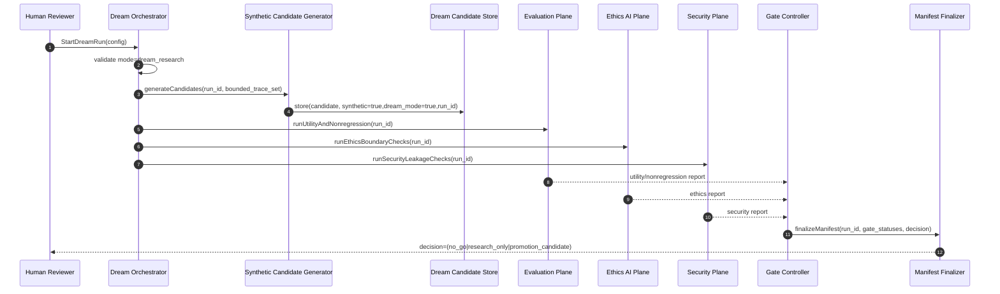

Key invariants:
- all generated artifacts remain tagged with provenance metadata,
- no write path to production truth plane exists in this sequence,
- manifest emission is mandatory even on failure.

---

## 63. Sequence Diagram: Promotion Candidate Review (R2)

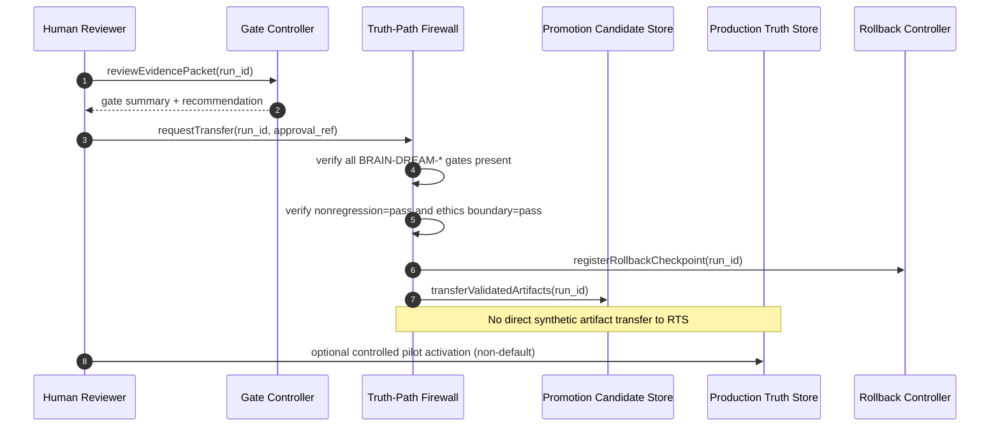

Key invariants:
- transfer requires explicit human approval reference,
- rollback checkpoint is created before any pilot activation,
- production-default enablement is out of scope for this path.

---

## 64. Sequence Diagram: Rollback / Deactivate Flow (R3 -> R0)

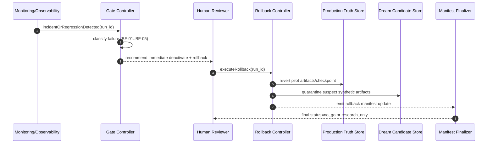

Key invariants:
- rollback path must be simpler than forward escalation,
- suspect synthetic artifacts are quarantined, not silently deleted,
- post-rollback manifest update is required for audit completeness.

---

## 65. Interface-to-Module Mapping (Implementation Binding)

This section binds Dream-Mode interfaces to concrete ThemisDB module responsibilities so implementation can begin without ambiguity.

| Interface action | Primary module(s) | Secondary module(s) | Required output artifact |
|---|---|---|---|
| `StartDreamRun(config)` | [../process/](../process), [../scheduler/](../scheduler) | [../governance/](../governance), [../config/](../config) | run descriptor (`run_id`, mode, policy versions) |
| `generateCandidates(run_id, trace_set)` | [../llm/](../llm), [../rag/](../rag), [../stable_diffusion/](../stable_diffusion), [../voice/](../voice) | [./](./), [../retrieval/](../retrieval) | synthetic candidate batch + provenance envelope |
| `StoreDreamCandidate(...)` | [./](./), [../storage/](../storage) | [../metadata/](../metadata) | isolated synthetic artifact + tags (`synthetic=true`, `dream_mode=true`) |
| `runUtilityAndNonregression(run_id)` | [../evaluation/](../evaluation) | [../performance/](../performance), [../observability/](../observability) | utility and nonregression gate report |
| `runEthicsBoundaryChecks(run_id)` | [../ethics_ai/](../ethics_ai) | [../security/](../security) | ethics conformance report + veto decisions |
| `runSecurityLeakageChecks(run_id)` | [../security/](../security) | [../observability/](../observability) | leakage and policy-boundary report |
| `finalizeManifest(run_id, ...)` | [../evaluation/](../evaluation), [../governance/](../governance) | [./](./) | manifest conforming to [DREAM_MODE_MANIFEST_SCHEMA.json](./DREAM_MODE_MANIFEST_SCHEMA.json) |
| `requestTransfer(run_id, approval_ref)` | [../governance/](../governance), [../process/](../process) | [../security/](../security), [../evaluation/](../evaluation) | approved transfer ticket + firewall checks |
| `executeRollback(run_id)` | [../observability/](../observability), [../storage/](../storage) | [../governance/](../governance) | rollback evidence + quarantine record |

Binding rule:
- each interface action must have one accountable primary module owner and one evidence artifact type.

---

## 66. Interface Contract Table (I/O and Failure Semantics)

| Interface | Inputs (minimum) | Outputs | Hard failures (fail-closed) |
|---|---|---|---|
| `StartDreamRun` | `mode`, policy versions, dataset refs, seed set | `run_id`, run state=`R0` | mode != `dream_research`, missing policy versions |
| `generateCandidates` | `run_id`, bounded trace references | candidate set handle | unbounded trace scope, missing run state |
| `StoreDreamCandidate` | `run_id`, candidate payload, provenance tags | candidate record ID | missing `synthetic=true`/`dream_mode=true` |
| `ValidateDreamRun` | `run_id`, gate config | gate report (`BRAIN-DREAM-*`) | missing gate dimensions, invalid config |
| `FinalizeDreamRun` | `run_id`, gate report, decision | finalized manifest | schema violation, missing decision rationale |
| `RequestPromotionCandidate` | `run_id`, `approval_ref`, prior manifest | promotion ticket | nonregression != pass, ethics boundary != pass, no rollback checkpoint |
| `ExecuteRollback` | `run_id`, checkpoint reference | rollback record + updated manifest | missing checkpoint, partial rollback evidence |

All hard failures must emit operator-visible diagnostics and audit entries.

---

## 67. Task Decomposition Packet (Direct Engineering Backlog)

The following task packet can be copied directly into issue/work planning:

### TASK-DREAM-01 — Orchestrator + Run State
- Scope: `StartDreamRun`, run lifecycle (`R0..R3`), mode enforcement.
- Primary modules: [../process/](../process), [../scheduler/](../scheduler).
- Acceptance:
  - mode hard-enforced to `dream_research`,
  - run descriptor persisted with policy versions,
  - failed start attempts logged with fail-closed reason.

### TASK-DREAM-02 — Candidate Store + Provenance
- Scope: `StoreDreamCandidate`, storage isolation, provenance tagging.
- Primary modules: [./](./), [../storage/](../storage), [../metadata/](../metadata).
- Acceptance:
  - writes rejected when provenance tags missing,
  - synthetic and production paths physically/logically isolated,
  - label-integrity checks pass.

### TASK-DREAM-03 — Validation Plane Integration
- Scope: evaluation + ethics + security checks with unified gate report.
- Primary modules: [../evaluation/](../evaluation), [../ethics_ai/](../ethics_ai), [../security/](../security).
- Acceptance:
  - all `BRAIN-DREAM-*` gates emitted in one report,
  - veto paths are explicit and auditable,
  - nonregression checks fail-closed.

### TASK-DREAM-04 — Manifest + Decision Pipeline
- Scope: schema validation + decision finalization.
- Primary modules: [../governance/](../governance), [../evaluation/](../evaluation).
- Acceptance:
  - manifest validates against [DREAM_MODE_MANIFEST_SCHEMA.json](./DREAM_MODE_MANIFEST_SCHEMA.json),
  - decision class and rationale mandatory,
  - approval reference mandatory for promotion requests.

### TASK-DREAM-05 — Promotion Firewall + Rollback
- Scope: transfer firewall, rollback checkpoint, quarantine flow.
- Primary modules: [../security/](../security), [../observability/](../observability), [../storage/](../storage).
- Acceptance:
  - no direct synthetic→production truth transfer path exists,
  - rollback checkpoint established before any pilot activation,
  - quarantine and rollback evidence produced on deactivation.

---

## 68. End-to-End Acceptance Envelope (Dream-Mode)

Dream-Mode implementation is considered technically complete only if:

1. TASK-DREAM-01..05 are complete with evidence artifacts,
2. all `BRAIN-DREAM-*` gates are represented in CTest + benchmark planning,
3. manifest schema validation is automated and enforced,
4. at least one full R0 run and one rollback simulation pass in rehearsals,
5. final decision packet classifies feature as `research_only` or `promotion_candidate` based on measured evidence.

This envelope converts the architecture into executable engineering work without loss of governance control.

---

## 69. Issue-Ready Work Packets (GitHub Draft Format)

The following packets are ready to be copied into issue trackers with minimal adaptation.

### 69.1 ISSUE-PACKET-DREAM-01

**Title**  
`[tensor][dream-mode] Implement Dream Orchestrator and Run-State Lifecycle`

**Objective**  
Implement deterministic run lifecycle management for Dream-Mode (`R0..R3`) with strict `dream_research` mode enforcement.

**Scope**
- create run descriptor contract (`run_id`, timestamps, policy versions, dataset refs, seed set),
- enforce mode guardrails at run creation,
- record start/abort/failure reasons in audit logs.

**Out of scope**
- candidate generation logic,
- promotion transfer path,
- multimodal utility optimization.

**Acceptance Criteria**
1. `StartDreamRun` fails closed when mode != `dream_research`.
2. Run descriptor is persisted and queryable by `run_id`.
3. Failed run-start attempts are logged with explicit reason classes.
4. Lifecycle state transitions are restricted to allowed transitions (Section 27 / 52).

**Evidence**
- focused CTests for lifecycle state transitions,
- sample run descriptor artifacts,
- negative tests for invalid mode and invalid transition attempts.

**Risks**
- hidden transition paths introduced via helper layers.

**Mitigation**
- central transition guard utility + explicit transition matrix tests.

---

### 69.2 ISSUE-PACKET-DREAM-02

**Title**  
`[tensor][dream-mode] Build isolated synthetic candidate store with provenance guarantees`

**Objective**  
Create isolated synthetic storage with mandatory provenance tags and no direct production truth writes.

**Scope**
- define synthetic artifact storage class,
- enforce provenance tags (`synthetic=true`, `dream_mode=true`, `run_id`),
- reject writes without full provenance envelope.

**Out of scope**
- utility scoring policy,
- human approval workflow.

**Acceptance Criteria**
1. Missing or malformed provenance causes hard reject.
2. Synthetic artifacts are physically/logically separated from production truth stores.
3. Label integrity checks pass across store/read/export paths.
4. Forbidden synthetic->production direct write path is absent by design and tests.

**Evidence**
- storage boundary tests,
- provenance persistence tests,
- negative tests for missing tags.

**Risks**
- metadata loss at serialization boundaries.

**Mitigation**
- round-trip schema tests + checksum-based envelope validation.

---

### 69.3 ISSUE-PACKET-DREAM-03

**Title**  
`[evaluation][ethics][security] Integrate Dream-Mode validation plane and unified gate report`

**Objective**  
Unify evaluation, ethics, and security checks into one gate report for all `BRAIN-DREAM-*` gates.

**Scope**
- integrate utility/nonregression checks,
- integrate ethics boundary checks + veto paths,
- integrate security leakage checks,
- produce one normalized gate report payload.

**Out of scope**
- promotion transfer execution,
- edition-specific rollout tuning.

**Acceptance Criteria**
1. Gate report includes all five `BRAIN-DREAM-*` statuses.
2. Any ethics or security veto maps to fail/hold with explicit reason.
3. Nonregression failure blocks promotion-candidate transition.
4. Report is persisted and linked to `run_id`.

**Evidence**
- integration tests for pass/hold/fail paths,
- veto-path tests,
- report schema conformance checks.

**Risks**
- inconsistent status semantics across modules.

**Mitigation**
- shared gate-status enum contract (`pass|hold|fail`) with contract tests.

---

### 69.4 ISSUE-PACKET-DREAM-04

**Title**  
`[governance][tensor] Implement manifest finalization and decision pipeline for Dream-Mode`

**Objective**  
Finalize machine-readable manifests conforming to [DREAM_MODE_MANIFEST_SCHEMA.json](./DREAM_MODE_MANIFEST_SCHEMA.json) and enforce explicit decision classes.

**Scope**
- schema validation pipeline,
- decision payload enforcement (`no_go|research_only|promotion_candidate`),
- rationale + approver reference enforcement.

**Out of scope**
- live production activation toggles.

**Acceptance Criteria**
1. Every finalized run emits a schema-valid manifest.
2. Decision class and rationale are mandatory.
3. Promotion-candidate requests require approval reference.
4. Invalid manifests are hard-rejected and logged.

**Evidence**
- schema validation tests,
- invalid-manifest negative tests,
- decision completeness tests.

**Risks**
- permissive fallback when schema validation fails.

**Mitigation**
- fail-closed validation wrapper with no bypass path.

---

### 69.5 ISSUE-PACKET-DREAM-05

**Title**  
`[security][observability][storage] Implement promotion firewall, rollback checkpointing, and quarantine flow`

**Objective**  
Implement safe transfer controls and rollback-first safety for dream-mode promotion candidates.

**Scope**
- firewall enforcement for transfer prerequisites,
- rollback checkpoint creation before pilot activation,
- quarantine flow for suspect synthetic artifacts,
- rollback manifest update emission.

**Out of scope**
- model-quality optimization.

**Acceptance Criteria**
1. No transfer proceeds without required gate statuses and approval reference.
2. Rollback checkpoint is mandatory before controlled pilot activation.
3. Deactivate/rollback flow produces quarantine and rollback evidence artifacts.
4. Post-rollback manifest update is emitted for audit completeness.

**Evidence**
- transfer denial tests,
- rollback simulation tests,
- quarantine evidence-path tests.

**Risks**
- partial rollback leaves stale pilot state.

**Mitigation**
- atomic checkpoint/restore semantics + idempotent rollback tests.

---

## 70. Cross-Issue Dependency Graph

```text
ISSUE-PACKET-DREAM-01 -> ISSUE-PACKET-DREAM-02 -> ISSUE-PACKET-DREAM-03 -> ISSUE-PACKET-DREAM-04 -> ISSUE-PACKET-DREAM-05
          |                         |                         |
          +-------------> manifest and gate semantics must remain consistent ------------+
```

Dependency rules:
1. DREAM-03 cannot be accepted before DREAM-01 and DREAM-02 complete.
2. DREAM-04 depends on normalized outputs from DREAM-03.
3. DREAM-05 depends on decision and manifest guarantees from DREAM-04.

---

## 71. Milestone and Gate Mapping

| Issue packet | Recommended milestone target | Primary gate linkage |
|---|---|---|
| DREAM-01 | Q1 2027 | BRAIN-DREAM-ISOLATION |
| DREAM-02 | Q1 2027 | BRAIN-DREAM-LABEL-INTEGRITY |
| DREAM-03 | Q2 2027 | BRAIN-DREAM-UTILITY, BRAIN-DREAM-NONREGRESSION, BRAIN-DREAM-ETHICS-BOUNDARY |
| DREAM-04 | Q2 2027 | all `BRAIN-DREAM-*` manifest closure checks |
| DREAM-05 | Q2 2027 | BRAIN-SAFETY-CORE-01 + dream transfer safety checks |

---

## 72. Definition of Done for WP-BRAIN-04

WP-BRAIN-04 is done only when:

1. ISSUE-PACKET-DREAM-01..05 are each closed with evidence,
2. all dream gates are represented and executable in test planning,
3. at least one full end-to-end rehearsal (research run -> decision -> rollback simulation) is completed,
4. decision packet concludes with explicit classification:
   - `research_only` or
   - `promotion_candidate` (with stricter follow-up pilot constraints).

Without these four conditions, Dream-Mode remains architecture design only.

---

## 73. GitHub Issue Body Templates (Copy/Paste Ready)

The following templates are aligned with Sections 69–72 and can be used directly for issue creation.

### 73.1 Template — ISSUE-PACKET-DREAM-01

```markdown
## Objective
Implement deterministic Dream-Mode run lifecycle management (`R0..R3`) with strict `dream_research` mode enforcement.

## Scope
- [ ] Add run descriptor contract (`run_id`, timestamps, policy versions, dataset refs, seed set)
- [ ] Enforce mode guardrails at run creation
- [ ] Record start/abort/failure reasons in audit logs

## Out of Scope
- Candidate generation logic
- Promotion transfer path
- Multimodal utility optimization

## Acceptance Criteria
- [ ] `StartDreamRun` fails closed when mode != `dream_research`
- [ ] Run descriptor is persisted and queryable by `run_id`
- [ ] Failed run-start attempts logged with explicit reason classes
- [ ] Lifecycle transitions restricted to allowed matrix (R0..R3)

## Evidence Required
- [ ] Focused CTests for lifecycle transitions
- [ ] Sample run descriptor artifacts
- [ ] Negative tests for invalid mode and invalid transitions

## Risks / Mitigation
- Risk: hidden transition path in helper layers
- Mitigation: central transition guard utility + transition matrix tests
```

### 73.2 Template — ISSUE-PACKET-DREAM-02

```markdown
## Objective
Build isolated synthetic candidate store with mandatory provenance and no direct production truth writes.

## Scope
- [ ] Define synthetic artifact storage class
- [ ] Enforce provenance tags (`synthetic=true`, `dream_mode=true`, `run_id`)
- [ ] Reject writes without full provenance envelope

## Out of Scope
- Utility scoring policy
- Human approval workflow

## Acceptance Criteria
- [ ] Missing/malformed provenance causes hard reject
- [ ] Synthetic and production truth paths are isolated
- [ ] Label integrity checks pass across store/read/export
- [ ] No direct synthetic->production write path exists (design + tests)

## Evidence Required
- [ ] Storage boundary tests
- [ ] Provenance persistence tests
- [ ] Negative tests for missing tags

## Risks / Mitigation
- Risk: metadata loss at serialization boundaries
- Mitigation: round-trip schema tests + envelope checksum validation
```

### 73.3 Template — ISSUE-PACKET-DREAM-03

```markdown
## Objective
Integrate evaluation, ethics, and security checks into one unified `BRAIN-DREAM-*` gate report.

## Scope
- [ ] Utility/nonregression checks integration
- [ ] Ethics boundary checks + veto path integration
- [ ] Security leakage checks integration
- [ ] Normalized gate report payload with shared status semantics

## Out of Scope
- Promotion transfer execution
- Edition-specific rollout tuning

## Acceptance Criteria
- [ ] Gate report includes all five `BRAIN-DREAM-*` statuses
- [ ] Ethics/security veto maps to fail/hold with explicit reason
- [ ] Nonregression failure blocks promotion-candidate transition
- [ ] Report persisted and linked to `run_id`

## Evidence Required
- [ ] Integration tests for pass/hold/fail paths
- [ ] Veto-path tests
- [ ] Report schema conformance checks

## Risks / Mitigation
- Risk: inconsistent gate-status semantics across modules
- Mitigation: shared enum contract (`pass|hold|fail`) + contract tests
```

### 73.4 Template — ISSUE-PACKET-DREAM-04

```markdown
## Objective
Implement Dream-Mode manifest finalization and decision pipeline with strict schema conformance.

## Scope
- [ ] Validate manifests against `DREAM_MODE_MANIFEST_SCHEMA.json`
- [ ] Enforce decision payload (`no_go|research_only|promotion_candidate`)
- [ ] Enforce rationale + approver reference fields

## Out of Scope
- Live production activation toggles

## Acceptance Criteria
- [ ] Every finalized run emits a schema-valid manifest
- [ ] Decision class and rationale are mandatory
- [ ] Promotion-candidate requests require approval reference
- [ ] Invalid manifests are hard-rejected and logged

## Evidence Required
- [ ] Schema validation tests
- [ ] Invalid-manifest negative tests
- [ ] Decision completeness tests

## Risks / Mitigation
- Risk: permissive fallback when schema validation fails
- Mitigation: fail-closed validator wrapper with no bypass path
```

### 73.5 Template — ISSUE-PACKET-DREAM-05

```markdown
## Objective
Implement promotion firewall, rollback checkpointing, and quarantine flow for Dream-Mode.

## Scope
- [ ] Enforce transfer prerequisites in firewall
- [ ] Create rollback checkpoint before pilot activation
- [ ] Implement quarantine flow for suspect synthetic artifacts
- [ ] Emit rollback manifest update on deactivation

## Out of Scope
- Model-quality optimization

## Acceptance Criteria
- [ ] No transfer without required gate statuses and approval reference
- [ ] Rollback checkpoint mandatory before pilot activation
- [ ] Deactivate/rollback flow emits quarantine + rollback evidence
- [ ] Post-rollback manifest update emitted for audit completeness

## Evidence Required
- [ ] Transfer denial tests
- [ ] Rollback simulation tests
- [ ] Quarantine evidence-path tests

## Risks / Mitigation
- Risk: partial rollback leaves stale pilot state
- Mitigation: atomic checkpoint/restore semantics + idempotent rollback tests
```

---

## 74. Optional Issue Labels and Milestone Defaults

Recommended issue labels:
- `area:tensor`
- `area:ai-safety`
- `area:evaluation`
- `type:research`
- `type:architecture`
- `priority:p0` or `priority:p1`

Recommended milestone defaults:
- DREAM-01 / DREAM-02: `Q1 2027`
- DREAM-03 / DREAM-04 / DREAM-05: `Q2 2027`

---

## 75. Issue Creation Sanity Checklist

Before opening each issue:

1. [ ] Link the relevant section in this paper.
2. [ ] Link [DREAM_MODE_MANIFEST_TEMPLATE.json](./DREAM_MODE_MANIFEST_TEMPLATE.json) and [DREAM_MODE_MANIFEST_SCHEMA.json](./DREAM_MODE_MANIFEST_SCHEMA.json).
3. [ ] Map issue ACs to at least one `BRAIN-DREAM-*` gate.
4. [ ] Include negative-path tests in acceptance criteria.
5. [ ] Declare explicit non-go conditions.

This checklist ensures all created issues remain evidence-first and fail-closed by design.

---

## 76. Mermaid Diagram Conventions (Repository-Local)

To keep diagrams consistent across tensor architecture papers, use the following conventions:

1. **Naming**
   - component boxes: `PascalCase` module/service names,
   - flow labels: verb-first (`validate`, `persist`, `promote`, `rollback`),
   - gates: exact gate IDs (`BRAIN-*`, `TEN-ROPE-*`).

2. **Layer orientation**
   - `flowchart LR` for architecture topology,
   - `flowchart TD` for dependency/lifecycle,
   - `sequenceDiagram` for runtime control flow.

3. **Safety semantics**
   - every promotion path must show:
     - gate check,
     - approval step,
     - rollback checkpoint.

4. **Evidence semantics**
   - every go/no-go path must terminate in:
     - manifest update,
     - decision class (`no_go|research_only|promotion_candidate`).

---

## 77. Mermaid Layer Map: Cognitive/Control Architecture

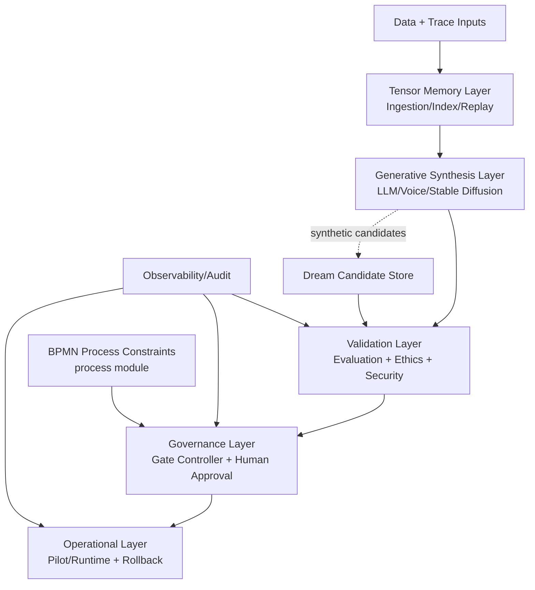

### 77.1 Mermaid Module-to-Brain-Area Mapping (Creative/Logical + Hippocampal Bridge)

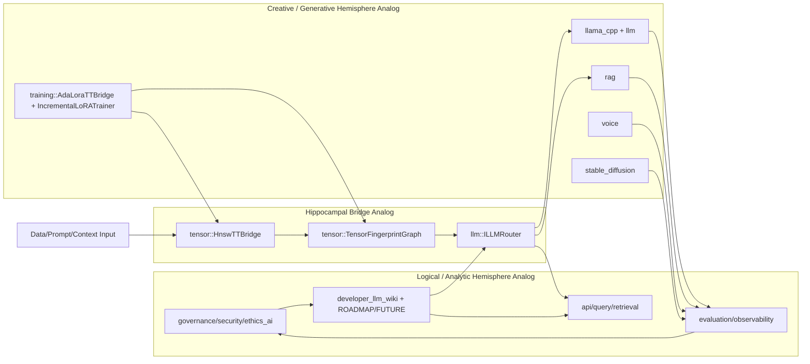

Interpretation (bounded):
- logical/analytic side emphasizes deterministic policy, validation, and governance memory surfaces,
- creative/generative side emphasizes candidate synthesis and adaptation pathways,
- hippocampal bridge analog (`HNSW` + graph + routing) links both sides by converting cues into context-conditioned recall,
- this remains a functional role map, not a claim of biological hemisphere identity.

---

Interpretation:
- creative synthesis is allowed before validation,
- governance and BPMN constraints sit above pure model output,
- operational activation is downstream of validation and approval only.

---

## 78. Mermaid Gate-State Machine (Dream-Mode)

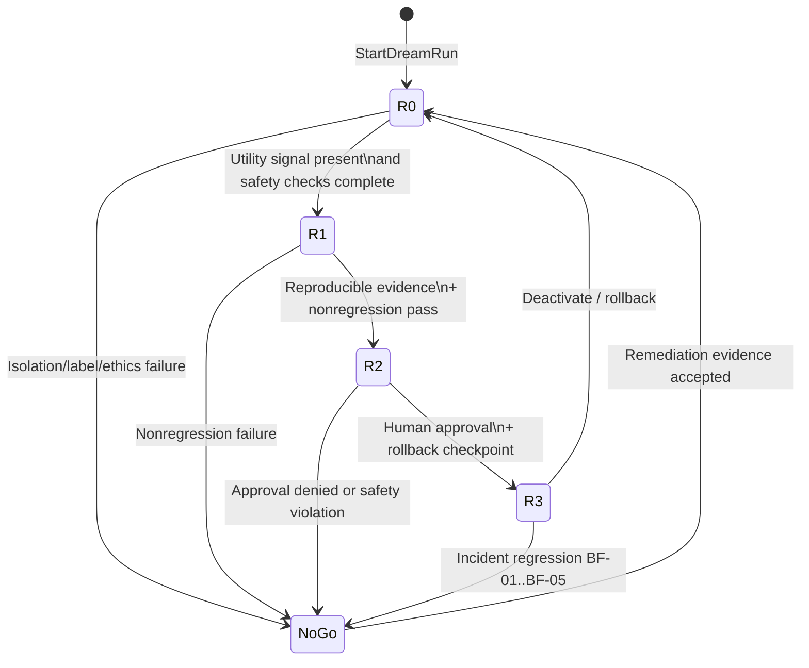

State constraints:
1. Transition to `R2` requires all `BRAIN-DREAM-*` statuses present.
2. Transition to `R3` requires explicit approval reference and rollback checkpoint.
3. Any `NoGo` transition requires manifest update with failure classification.

---

## 79. Mermaid Threat Model: Dream-Mode Attack Surface

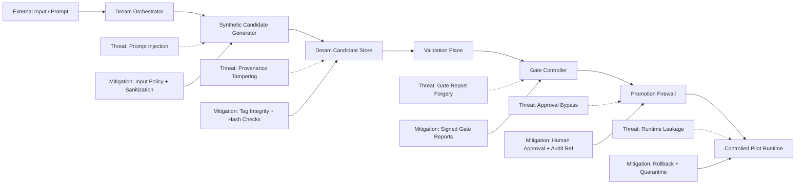

Security interpretation:
- every critical edge must have explicit mitigation evidence,
- any missing mitigation-to-edge mapping blocks promotion.

---

## 80. Mermaid Data Lineage: Synthetic Artifact Provenance

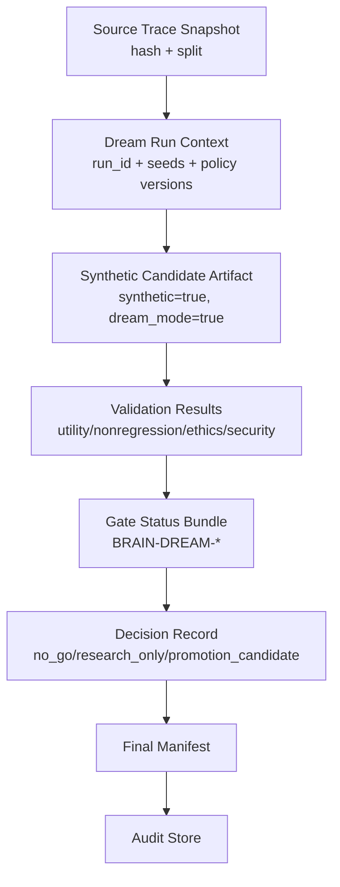

Lineage invariants:
1. every synthetic artifact must map back to one source trace snapshot hash,
2. every decision must map to one gate status bundle,
3. every manifest must map to one auditable run identity.

---

## 81. Mermaid Sequence: Ethics Veto and Security Hold

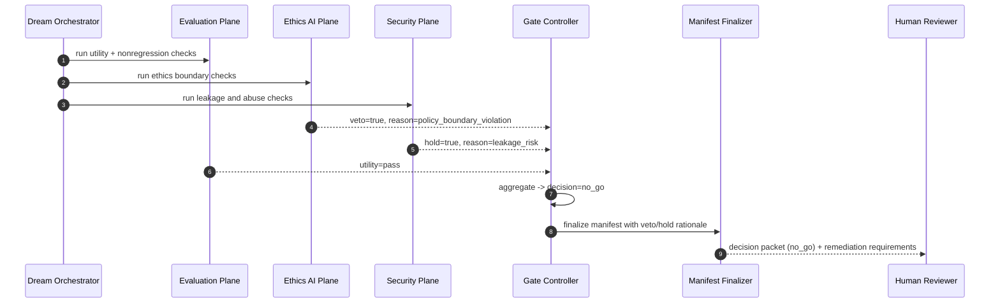

Failure-handling rule:
- ethics veto has hard precedence over utility gain,
- security hold blocks promotion candidate transition until resolved.

---

## 82. Review Checklist for Diagram Completeness

Use this checklist before architecture sign-off:

1. [ ] every promotion path diagram includes gate checks, approval, and rollback.
2. [ ] every sequence with synthetic artifacts includes provenance tagging.
3. [ ] every threat edge has a mitigation mapping.
4. [ ] every no-go path results in manifest update and audit trace.
5. [ ] diagram semantics remain consistent with Sections 55–68 contracts.

This ensures visual artifacts remain engineering-accurate and governance-consistent.

---

## 83. Mermaid Decision Tree: Promotion Classification Logic

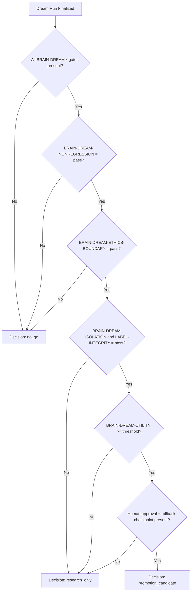

Classification notes:
- `no_go` is mandatory when safety-critical gates fail.
- `research_only` is default when safety passes but utility or governance readiness is insufficient.
- `promotion_candidate` is allowed only when safety, utility, and governance preconditions are all satisfied.

---

## 84. Mermaid Operational KPI Dashboard Flow

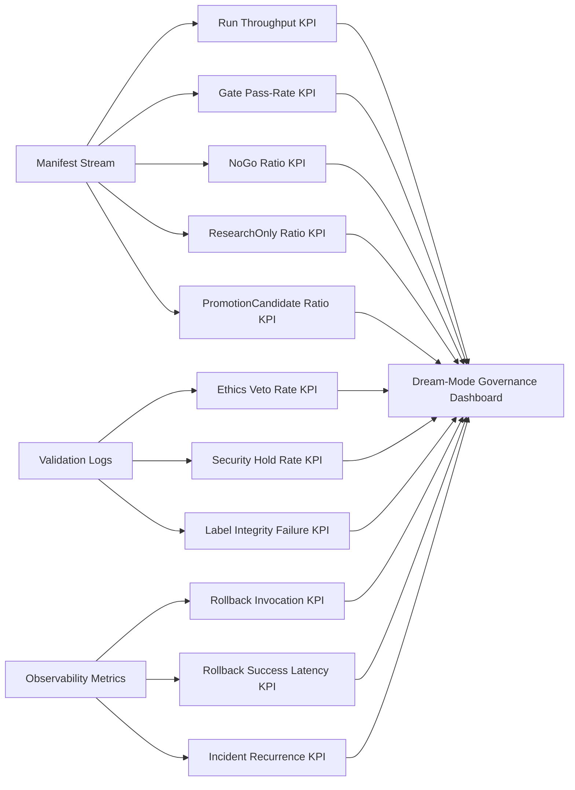

KPI usage policy:
1. KPIs are governance-support signals, not direct promotion authority.
2. Promotion decisions must still bind to gate closure and explicit approval.
3. Sudden KPI drift triggers forced review even when gates nominally pass.

---

## 85. Compliance Traceability Grid (Control -> Evidence)

| Control objective | Control mechanism | Evidence source | Failure response |
|---|---|---|---|
| Synthetic isolation | Truth-path firewall + sandbox mode | manifest `mode`, isolation gate logs | immediate `no_go`, quarantine review |
| Provenance integrity | mandatory tags + validation checks | label-integrity test suite + manifest fields | hard reject of affected artifacts |
| Ethics boundary | ethics veto path | ethics gate report + veto reasons | block promotion, remediation plan |
| Security boundary | leakage checks + hold states | security report + hold counters | block transfer, escalate to security review |
| Decision accountability | mandatory rationale + approval ref | manifest decision block + audit trail | invalid decision rejected |
| Recovery capability | rollback checkpoint + rollback tests | rollback evidence bundle | prohibit pilot activation |

Traceability rule:
- every control objective must map to at least one automated evidence source and one explicit failure response.

---

## 86. Readiness Gates for Cross-Module Expansion

Before enabling Dream-Mode beyond tensor-centric scope, all of the following should be true:

1. **Core readiness**
   - Sections 55–85 controls validated in tensor pathway.
2. **Module readiness**
   - target module publishes compatible provenance and gate contracts.
3. **Governance readiness**
   - issue packet, milestone, and rollback plan approved.
4. **Operational readiness**
   - rehearsal run and rollback simulation completed for that module.

Recommended expansion order:
1. tensor + evaluation + ethics + security (base),
2. process/BPMN constraints integration,
3. multimodal extensions (voice, stable_diffusion),
4. broader runtime pilot under stricter overlays.

This sequencing minimizes uncontrolled coupling while preserving scientific progress.
