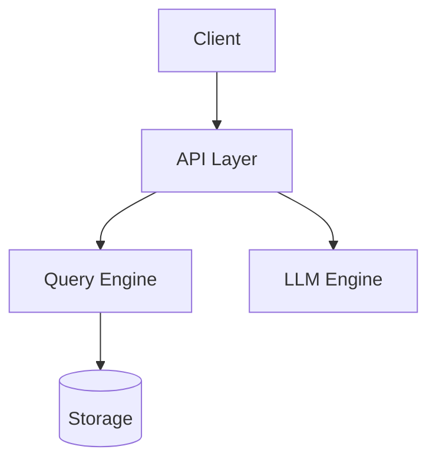

# ThemisDB Architecture Diagrams - WordPress Plugin

A WordPress plugin for interactive visualization of ThemisDB system architecture. Display multi-model architecture, storage layer, LLM integration, and sharding/RAID configurations with Mermaid.js.

## 📋 Overview

This plugin follows the established **TCO Calculator** template pattern and provides comprehensive architecture visualization for ThemisDB with interactive Mermaid.js diagrams.

- **Shortcode-based Integration**: `[themisdb_architecture]`
- **Admin Settings Page**: Customize default values
- **Multiple Views**: High-level, Storage, LLM, Sharding/RAID
- **Interactive Components**: Clickable elements with details
- **Export Capabilities**: SVG and PNG export

## ✨ Features

### Architecture Views
- 🏗️ **High-Level Architecture**: Complete system overview
- �� **Storage Layer**: Multi-model storage details
- 🤖 **LLM Integration**: AI/ML architecture
- 🔄 **Sharding & RAID**: Distributed system configuration

### Interactive Features
- 🎨 **Mermaid.js Diagrams**: Professional flowcharts
- 🖱️ **Clickable Components**: Show component details
- 🔍 **Zoom Controls**: In, out, and reset
- 📺 **Fullscreen Mode**: Immersive viewing
- 📊 **Multiple Themes**: Neutral, default, dark, forest

### WordPress Integration
- 📝 **Shortcode**: Easy embedding via `[themisdb_architecture]`
- ⚙️ **Admin Panel**: Settings → Architecture Diagrams
- 🎨 **Theme-compatible**: Works with any WordPress theme
- �� **Responsive**: Optimized for all screen sizes

### Export & Sharing
- 📥 **Export Functions**: SVG and PNG download
- 🖨️ **Print Support**: Optimized print layout

## 🚀 Installation

### Manual Installation

1. **Download the Plugin**
   ```bash
   cd /path/to/wordpress/wp-content/plugins/
   cp -r /path/to/ThemisDB/tools/architecture-diagrams-wordpress ./themisdb-architecture-diagrams
   ```

2. **Activate the Plugin**
   - Go to WordPress Admin → Plugins
   - Find "ThemisDB Architecture Diagrams"
   - Click "Activate"

3. **Configure Settings**
   - Go to Settings → Architecture Diagrams
   - Choose default view and theme

## 📖 Usage

### Basic Shortcode

```php
[themisdb_architecture]
```

### Shortcode with Parameters

#### Specific View
```php
[themisdb_architecture view="high_level"]
[themisdb_architecture view="storage_layer"]
[themisdb_architecture view="llm_integration"]
[themisdb_architecture view="sharding_raid"]
```

#### Custom Theme
```php
[themisdb_architecture theme="neutral"]
[themisdb_architecture theme="dark"]
[themisdb_architecture theme="forest"]
```

#### Without Controls
```php
[themisdb_architecture show_controls="false"]
```

#### Combined Parameters
```php
[themisdb_architecture 
    view="llm_integration" 
    theme="neutral" 
    interactive="true"]
```

## 🛠️ Technical Details

### File Structure

```
themisdb-architecture-diagrams/
├── themisdb-architecture-diagrams.php  # Main plugin file
├── assets/
│   ├── css/
│   │   └── architecture-diagrams.css   # Styling
│   └── js/
│       └── architecture-diagrams.js    # JavaScript with Mermaid.js
├── templates/
│   ├── diagram.php                     # Main template
│   └── admin-settings.php              # Admin settings
├── diagrams/                           # (optional) Diagram definitions
├── README.md
└── LICENSE
```

### Technologies

- **PHP**: WordPress plugin development (7.4+)
- **JavaScript**: ES5+ with jQuery
- **Mermaid.js**: Version 10 for diagrams
- **CSS3**: Modern, responsive styling
- **WordPress API**: Settings API, Shortcode API, AJAX

### Architecture Views

1. **High-Level**: Shows client layer, API layer, query engine, storage, and LLM integration
2. **Storage Layer**: Displays RocksDB-based multi-model storage with indexes
3. **LLM Integration**: Illustrates llama.cpp integration and model management
4. **Sharding & RAID**: Demonstrates distributed architecture with replication

## 🎨 Mermaid.js Integration

The plugin uses Mermaid.js to create interactive, text-based diagrams:

### Example Diagram Code


## 🔒 Security

- **Nonce Verification**: All AJAX requests verified
- **Capability Checks**: Admin functions require proper permissions
- **Input Sanitization**: All inputs sanitized
- **Output Escaping**: All outputs properly escaped

## 🎮 Controls

- **View Selector**: Switch between different architecture views
- **Zoom In/Out**: Adjust diagram size
- **Fullscreen**: Toggle fullscreen mode
- **Export**: Download as SVG or PNG
- **Print**: Print-optimized layout

## 📄 License

MIT License - See LICENSE file

## 🔗 Links

- **GitHub**: [makr-code/ThemisDB](https://github.com/makr-code/ThemisDB)
- **Plugin Path**: `/tools/architecture-diagrams-wordpress/`

## 🗺️ Roadmap

- [ ] Custom diagram uploads
- [ ] More architecture views
- [ ] Animation support
- [ ] Diagram version history
- [ ] Collaborative editing

## 📊 Version History

### Version 1.0.0 (Initial Release)
- Interactive architecture diagrams
- Four distinct views
- Mermaid.js integration
- Zoom and fullscreen controls
- SVG/PNG export
- WordPress admin integration
- Responsive design

---

**Powered by [ThemisDB](https://github.com/makr-code/ThemisDB)** - Part of Phase 2 Implementation
