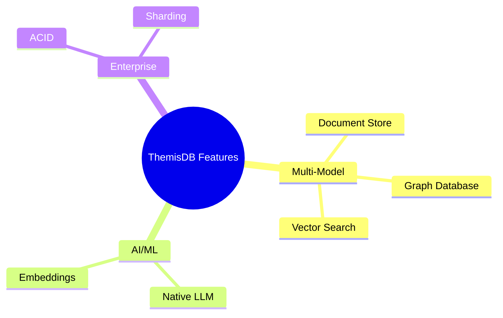

# ThemisDB Feature Matrix - WordPress Plugin

A WordPress plugin for interactive feature comparison between ThemisDB and competing databases. Visualize features, capabilities, and differences with dynamic tables and Mermaid.js diagrams.

## 📋 Overview

This plugin follows the **TCO Calculator** and **Benchmark Visualizer** template pattern, providing comprehensive feature comparison capabilities with Mermaid.js diagram integration.

- **Shortcode-based Integration**: `[themisdb_feature_matrix]`
- **Admin Settings Page**: Customize default values
- **Mermaid.js Diagrams**: Visual feature hierarchy
- **WordPress-optimized**: Uses WordPress best practices

## ✨ Features

### Comprehensive Feature Comparison
- 📊 **Interactive Matrix**: Dynamic feature comparison table
- 🎨 **Visual Diagrams**: Mermaid.js feature hierarchy visualization
- 🔍 **Category Filters**: Architecture, AI/ML, Scalability, Security, Reliability, Usability
- 📋 **Multiple Views**: Detailed or compact table views
- 🏷️ **Status Indicators**: Clear visual indicators for feature availability
- 💡 **Tooltips**: Hover descriptions for feature status

### WordPress Integration
- 📝 **Shortcode**: Easy embedding via `[themisdb_feature_matrix]`
- ⚙️ **Admin Panel**: Settings page under Settings → Feature Matrix
- 🔗 **Plugin Action Links**: Direct settings access
- �� **Theme-compatible**: Works with any WordPress theme
- 📱 **Responsive**: Optimized for all screen sizes

### Visual Features
- 🎭 **Mermaid.js Integration**: Mind maps and diagrams
- 🎨 **Status Badges**: Color-coded feature availability
- 📊 **Clean Design**: Based on TCO Calculator styling
- 🌓 **Theme Support**: Light theme with consistent branding

### Export & Sharing
- 📥 **Export Functions**: CSV export
- 🖨️ **Print Support**: Optimized print layout

## 🚀 Installation

### Manual Installation

1. **Download the Plugin**
   ```bash
   cd /path/to/wordpress/wp-content/plugins/
   cp -r /path/to/ThemisDB/tools/feature-matrix-wordpress ./themisdb-feature-matrix
   ```

2. **Activate the Plugin**
   - Go to WordPress Admin → Plugins
   - Find "ThemisDB Feature Matrix"
   - Click "Activate"

3. **Configure Settings**
   - Go to Settings → Feature Matrix
   - Configure your preferences

## 📖 Usage

### Basic Shortcode

```php
[themisdb_feature_matrix]
```

### Shortcode with Parameters

#### Filter by Category
```php
[themisdb_feature_matrix category="ai_ml"]
[themisdb_feature_matrix category="architecture"]
[themisdb_feature_matrix category="security"]
```

#### Choose View Type
```php
[themisdb_feature_matrix view="detailed"]
[themisdb_feature_matrix view="compact"]
```

#### Control Diagram Display
```php
[themisdb_feature_matrix show_diagram="true"]
[themisdb_feature_matrix show_diagram="false"]
```

#### Compare Specific Databases
```php
[themisdb_feature_matrix compare="postgresql,mongodb"]
```

#### Combined Parameters
```php
[themisdb_feature_matrix 
    category="ai_ml" 
    view="compact" 
    show_diagram="true"]
```

## 🛠️ Technical Details

### File Structure

```
themisdb-feature-matrix/
├── themisdb-feature-matrix.php      # Main plugin file
├── assets/
│   ├── css/
│   │   └── feature-matrix.css       # Styling
│   └── js/
│       └── feature-matrix.js        # JavaScript with Mermaid.js
├── templates/
│   ├── matrix.php                   # Main template
│   └── admin-settings.php           # Admin settings
├── data/
│   └── (feature data files)         # Feature definitions
├── README.md
└── LICENSE
```

### Technologies

- **PHP**: WordPress plugin development (7.4+)
- **JavaScript**: ES5+ with jQuery
- **Mermaid.js**: Version 10 for diagrams
- **CSS3**: Modern, responsive styling
- **WordPress API**: Settings API, Shortcode API, AJAX

### Feature Status Types

- ✅ **Available**: Fully supported natively
- ⚠️ **Partial**: Available with limitations or via extensions
- 🔧 **Limited**: Basic support or external integration required
- ❌ **Not Available**: Feature not supported

## 🎨 Mermaid.js Integration

The plugin uses Mermaid.js to create interactive diagrams:

### Mind Map Example


## 🔒 Security

- **Nonce Verification**: All AJAX requests verified
- **Capability Checks**: Admin functions require proper permissions
- **Input Sanitization**: All inputs sanitized
- **Output Escaping**: All outputs properly escaped

## 📄 License

MIT License - See LICENSE file

## 🔗 Links

- **GitHub**: [makr-code/ThemisDB](https://github.com/makr-code/ThemisDB)
- **Plugin Path**: `/tools/feature-matrix-wordpress/`

## 🗺️ Roadmap

- [ ] Gutenberg block support
- [ ] More diagram types
- [ ] Custom feature definitions
- [ ] Feature comparison export
- [ ] Multi-language support

## 📊 Version History

### Version 1.0.0 (Initial Release)
- Interactive feature comparison matrix
- Mermaid.js diagram integration
- Category filtering
- Multiple view modes
- CSV export
- WordPress admin integration
- Responsive design

---

**Powered by [ThemisDB](https://github.com/makr-code/ThemisDB)**
